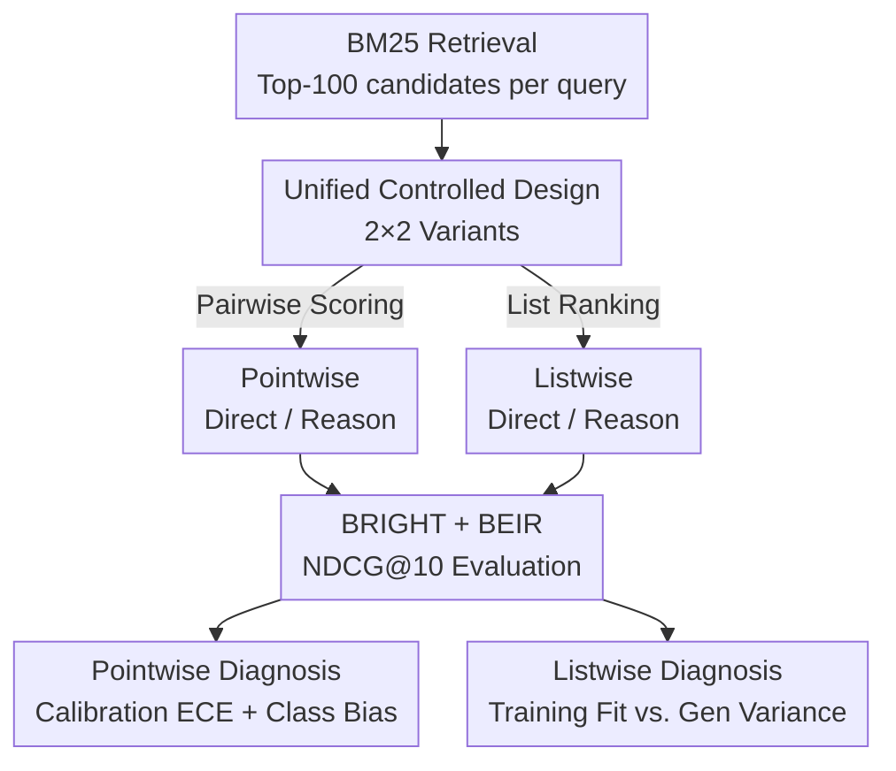

# Rethinking Reasoning in Document Ranking: Why Chain-of-Thought Falls Short

**Conference**: ICLR 2026  
**OpenReview**: [https://openreview.net/forum?id=txmqENuRcc](https://openreview.net/forum?id=txmqENuRcc)  
**Code**: https://github.com/EIT-NLP/Direct-Rank  
**Area**: Information Retrieval / LLM Reasoning  
**Keywords**: Document Reranking, Chain-of-Thought, Calibration, Pointwise/Listwise, Reinforcement Learning

## TL;DR
This paper presents the first systematic and fair controlled experiment proving that explicit Chain-of-Thought (CoT) reasoning **does not yield benefits** in LLM document reranking tasks. Regardless of pointwise or listwise approaches, SFT or RL training, direct rerankers consistently outperform reasoning-based rerankers while requiring significantly less inference computation.

## Background & Motivation
**Background**: Document reranking is a critical component of the two-stage Information Retrieval (IR) architecture. A retriever like BM25 first performs coarse filtering to get a candidate set, followed by a stronger reranker that performs fine-grained ranking. This process determines the quality of downstream applications like RAG and recommendation systems. Two main paradigms exist: pointwise (independently scoring query–document pairs, efficient and parallelizable) and listwise (processing the entire candidate set together to output a ranking, typically more accurate through cross-document comparison but more expensive).

**Limitations of Prior Work**: With the popularity of large reasoning models (LRMs) like DeepSeek-R1 and OpenAI o1, several works have directly applied the "generate CoT reasoning then rank" paradigm to reranking, assuming reasoning improves quality. However, these works rarely conduct fair comparisons against **strong non-reasoning baselines**, making the conclusion that "reasoning is useful" largely unsupported.

**Key Challenge**: While CoT is effective for tasks like mathematics and coding by bridging the gap between input and output, the essence of reranking is to output either a **well-calibrated scalar score** (pointwise) or a **permutation order** (listwise). This mechanism does not necessarily align with the benefits of "step-by-step reasoning." Existing anecdotal evidence suggests that reasoning may introduce "overthinking" or noise via lengthy reasoning chains, but these analyses were limited to pointwise SFT settings and lacked a systematic conclusion.

**Goal**: To answer a fundamental question under a unified and comparable experimental design: **Does explicit reasoning actually improve reranking?** Furthermore, the paper aims to analyze why it fails if no benefits are found.

**Key Insight**: The authors train all rerankers on MS MARCO, using DeepSeek-R1 to generate CoT for all reasoning versions. They establish a controlled comparison matrix covering "pointwise vs listwise × direct vs reasoning × SFT vs RL" and evaluate them on the reasoning-intensive BRIGHT benchmark and the standard IR benchmark BEIR to perform a true apples-to-apples comparison.

**Core Idea**: Instead of building another "reasoning-capable reranker," the authors use rigorous controlled experiments to **falsify the hypothesis that "reasoning is generally beneficial"** and locate the root causes of failure—specifically, broken score calibration in pointwise models and poor generalization due to overfitting in listwise models.

## Method

### Overall Architecture
The paper does not propose a new model but constructs a **controlled evaluation framework** to examine the utility of reasoning in reranking. The pipeline is as follows: fix a BM25 retriever to get the top-100 candidates for each query → train four reranker variants (Direct-Point, Reason-Point, Direct-List, Reason-List) on unified MS MARCO-derived data, covering SFT and SFT+GRPO mechanisms across Qwen3-4B/8B scales → evaluate using NDCG@10 on BRIGHT and BEIR → apply three diagnostic analyses (calibration curves/ECE, class-conditional TPR/TNR, and training fit vs. generalization variance) to dissect why reasoning fails. The only difference between variants is whether they generate a CoT before the final output.

### Key Designs

**1. 2×2 Unified Controlled Design: Isolating the Net Effect of Reasoning**

Previous conclusions that "reasoning is useful" are often unreliable because the reasoning models and baselines differ in backbones, training data, and prompts. The core methodological contribution here is eliminating these inconsistencies: all models use Qwen3-4B/8B backbones and are trained on unified MS MARCO-derived corpora (pointwise using ~386k pairs from RANK1, listwise using ~13k sets from ReasonRank). CoTs for reasoning versions are generated by DeepSeek-R1. The four variants differ only in whether they generate a rationale $z_i$ / $Z$ before the answer. For pointwise models, the relevance score is derived from the softmax of answer tokens: $s_i = \frac{\exp(\ell_i[\tau_{\text{TRUE}}])}{\exp(\ell_i[\tau_{\text{TRUE}}]) + \exp(\ell_i[\tau_{\text{FALSE}}])}$. This ensures "reasoning" is the sole independent variable.

**2. Pointwise Calibration Diagnosis: ECE Reveals Reasoning Breaks Score Alignment**

Pointwise reranking scores are treated as the "confidence" of relevance. Therefore, whether a model is **well-calibrated** (e.g., a prediction of 0.9 should reflect ~90% actual relevance) determines ranking quality. The authors use Expected Calibration Error (ECE) to quantify deviation: $\text{ECE} = \sum_{m=1}^{M} \frac{|B_m|}{N}\,\bigl|\text{acc}(B_m) - \text{conf}(B_m)\bigr|$, which weights the gap between empirical accuracy and average confidence across bins. Results show that while direct pointwise models are not perfect, they maintain a monotonic relationship between confidence and accuracy (ECE = 0.105), whereas reasoning versions show systematic overconfidence (ECE = 0.151). Reasoning fails to improve prediction and instead breaks calibration, directly leading to lower NDCG.

**3. Class-conditional TPR/TNR Analysis: Reasoning Creates False Positive Bias**

Why does poor calibration hurt ranking? A class-conditional analysis on a pool with a 1:2 positive-to-negative ratio reveals the error structure using TPR (Recall) and TNR (Specificity). Reason models often achieve higher macro-binary accuracy, but the gains come **entirely from increased TPR at the cost of decreased TNR**—meaning the model is more biased toward predicting "relevant." In reranking, where negative samples dominate, this is disastrous: increased FPR pushes irrelevant documents to the top, preventing binary accuracy gains from translating into ranking metric improvements.

**4. Listwise Fit-Generalization Analysis: Reasoning Overfits Training Data**

For listwise models that optimize permutations directly, the authors compare variants on 100 training samples. Reason-List achieves higher training NDCG@10 but with significantly higher variance (Reason-List SFT $82.57 \pm 3.2$ vs. Direct-List SFT $80.41 \pm 2.1$). While CoT helps fit seen permutations, it introduces instance-level instability. In in-domain (MS MARCO DL19/20) and out-of-domain (BRIGHT/BEIR) evaluations, Direct-List consistently takes the lead, indicating that Reason-List "memorizes" samples rather than generalizing. Using GRPO reinforcement learning to refine the reasoning chain from 397.7 tokens to 172.3 tokens improves performance and reduces cost, proving that long CoTs are not necessary for good ranking. However, even with shortened CoTs, Direct-List remains superior.

## Key Experimental Results

### Main Results
On BRIGHT (reasoning-intensive IR) and BEIR (standard IR), direct rerankers consistently outperform reasoning variants across all scales (NDCG@10):

| Benchmark | Variant Comparison | Direct | Reason | Gap |
|-----------|--------------------|--------|--------|------|
| BRIGHT    | Point-4B (SFT)     | 25.5   | 16.5   | +9.0 |
| BRIGHT    | Point-8B (SFT)     | 26.8   | 20.7   | +6.1 |
| BRIGHT    | List-8B (SFT+GRPO) | 27.1   | 25.9   | +1.2 |
| BEIR      | Point-4B (SFT)     | 45.4   | 40.1   | +5.3 |
| BEIR      | List-8B (SFT+GRPO) | 41.8   | 39.9   | +1.9 |

Direct variants even outperform existing reasoning-enhanced SOTAs: On BRIGHT, Direct-List-8B (27.1) exceeds ReasonRank-7B (26.4) and Rank-R1-14B (20.5); on BEIR, Direct-Point-4B (45.4) exceeds the larger Rank-R1-14B (43.8).

### Ablation Study

| Diagnostic | Key Metric | Conclusion |
|------------|------------|------------|
| Pointwise Calibration | ECE: Direct 0.105 vs. Reason 0.151 | Reasoning breaks calibration; systematic overconfidence |
| Pointwise Class-conditional | Reason: High TPR, Low TNR | Biased toward positive class; high FPR pushes negatives up |
| Listwise Train Fit | Reason: High training NDCG but high variance | Overfits training set; instance-level instability |
| Listwise In-domain Gen | Direct-List-4B DL19: 73.77 vs. Reason: 70.76 | Training advantages do not transfer in/out of domain |
| GRPO Effect | Reasoning chain 397.7 → 172.3 tokens | Long CoT is unnecessary; shorter CoT helps but still lags |

### Key Findings
- The harm of reasoning in pointwise models is **not due to a lack of reasoning ability, but broken score calibration**. Future solutions should focus on calibration-aware training rather than complex reasoning.
- The higher training scores for Reason-List are an **overfitting illusion**: they show higher variance and fall behind Direct models in all generalization tests.
- GRPO achieves two goals: improving performance while reducing excessive reasoning length, demonstrating that "overthinking" can be suppressed by reward design.
- The pointwise gap (up to +9.0) is much larger than the listwise gap (+0.3~+1.9), suggesting scalar scoring is more sensitive to periodic noise/calibration shifts introduced by reasoning.

## Highlights & Insights
- **Falsifying common assumptions via controlled experiments**: Establishing the "CoT requirement" as the sole independent variable provides the most convincing evidence against recent trends.
- **Specific root cause identification**: The paper moves beyond merely saying "reasoning doesn't work" by pinpointing calibration/positive-bias in pointwise and overfitting/high-variance in listwise models.
- **GRPO Insight**: The finding that "shortening reasoning chains via GRPO improves performance" is highly transferable. For tasks with clear metrics like ranking, reward design can simultaneously solve "overthinking" and efficacy issues.

## Limitations & Future Work
- Conclusions are limited to current logits-based pointwise and generative listwise settings; reasoning might still be useful in other reranking paradigms (e.g., token-based scoring).
- The study covers Qwen3-4B/8B backbones; whether larger or non-Qwen models follow this trend remains unverified.
- Listwise variance analysis used only 100 samples; the causal link between reasoning length and variance could be further dissected.
- The proposed solutions—calibration-aware scoring for pointwise and objective-aligned reasoning for listwise—are currently directions without specific implementation.

## Related Work & Insights
- **vs. Rank1 / TF-Rank (reasoning pointwise)**: These assume CoT improves pointwise reranking; this paper falsifies that by showing Direct-Point is consistently stronger when using aligned data.
- **vs. ReasonRank / Rank-R1 / REARank (reasoning listwise)**: These are reasoning-enhanced listwise SOTAs; this paper's Direct-List matches or exceeds them without any reasoning, showing CoT is not necessary for SOTA.
- **vs. Overthinking Research**: Prior observations were limited to pointwise SFT; this paper extends analysis to listwise and RL settings, providing a more complete case for why long CoTs can act as noise.

## Rating
- Novelty: ⭐⭐⭐⭐ High-quality "counter-consensus" research; very valuable perspective.
- Experimental Thoroughness: ⭐⭐⭐⭐⭐ Comprehensive coverage across variants, training mechanisms, and benchmarks.
- Writing Quality: ⭐⭐⭐⭐ Clear logic; failure mechanisms are well-explained.
- Value: ⭐⭐⭐⭐⭐ Corrects the "reasoning is always beneficial" assumption and identifies true bottlenecks (calibration/alignment).

## Related Papers

- [\[ICLR 2026\] Long-Document QA with Chain-of-Structured-Thought and Fine-Tuned SLMs](long-document_qa_with_chain-of-structured-thought_and_fine-tuned_slms.md)
- [\[ICLR 2026\] Retro*: Optimizing LLMs for Reasoning-Intensive Document Retrieval](retro_optimizing_llms_for_reasoning-intensive_document_retrieval.md)
- [\[ICLR 2026\] Tools Are Under-Documented: Simple Document Expansion Boosts Tool Retrieval](tools_are_under-documented_simple_document_expansion_boosts_tool_retrieval.md)
- [\[ICLR 2026\] G-reasoner: Foundation Models for Unified Reasoning over Graph-structured Knowledge](g-reasoner_foundation_models_for_unified_reasoning_over_graph-structured_knowled.md)
- [\[ICLR 2026\] RefTool: Reference-Guided Tool Creation for Knowledge-Intensive Reasoning](reftool_reference-guided_tool_creation_for_knowledge-intensive_reasoning.md)

<!-- RELATED:END -->

<!-- RELATED:START -->

## Related Papers

- [\[ICLR 2026\] Long-Document QA with Chain-of-Structured-Thought and Fine-Tuned SLMs](long-document_qa_with_chain-of-structured-thought_and_fine-tuned_slms.md)
- [\[ICLR 2026\] Retro*: Optimizing LLMs for Reasoning-Intensive Document Retrieval](retro_optimizing_llms_for_reasoning-intensive_document_retrieval.md)
- [\[ICLR 2026\] Tools Are Under-Documented: Simple Document Expansion Boosts Tool Retrieval](tools_are_under-documented_simple_document_expansion_boosts_tool_retrieval.md)
- [\[ICLR 2026\] SmartChunk Retrieval: Query-Aware Chunk Compression with Planning for Efficient Document RAG](smartchunk_retrieval_query-aware_chunk_compression_with_planning_for_efficient_d.md)
- [\[ICLR 2026\] G-reasoner: Foundation Models for Unified Reasoning over Graph-structured Knowledge](g-reasoner_foundation_models_for_unified_reasoning_over_graph-structured_knowled.md)

<!-- RELATED:END -->
