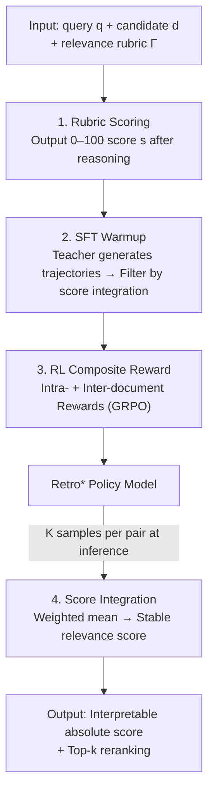

# Retro*: Optimizing LLMs for Reasoning-Intensive Document Retrieval

**Conference**: ICLR 2026  
**OpenReview**: [https://openreview.net/forum?id=0WGl8PNMSA](https://openreview.net/forum?id=0WGl8PNMSA)  
**Code**: https://github.com/VectorSpaceLab/agentic-search/tree/main/Retro-star  
**Area**: Information Retrieval / Reasoning-Enhanced IR / LLM Reranking  
**Keywords**: Reasoning-Intensive Retrieval, Scoring Rubric, Test-time Scaling, Reinforcement Learning, Composite Reward

## TL;DR
Retro* reformulates the task of "determining relevance between query and document" into a **pointwise reasoning task based on an explicit 0–100 rubric**. It utilizes score integration across multiple samples during test-time and a customized SFT + RL training strategy designed for the scoring mechanism. It achieves SOTA on the reasoning-intensive retrieval benchmark BRIGHT while being significantly faster than listwise/setwise methods due to its native pointwise parallelism.

## Background & Motivation

**Background**: In LLM agent and RAG scenarios, retrieval increasingly requires finding documents "useful for completing the task"—even when the association is indirect or implicit. Examples include finding programs with similar design patterns in software engineering or finding proofs based on the same theorem in mathematics. This "reasoning-intensive retrieval" requires models to perform fine-grained reasoning on the query–document relationship rather than simple semantic matching.

**Limitations of Prior Work**: While several reasoning-enhanced IR methods exist (zero-shot prompting, distilling trajectories from strong LLMs, RL with reranking rewards), the authors identify three structural shortfalls. First, **lack of relevance measurability**: most methods only provide relative rankings without an absolute score of "how relevant" a document is, whereas many downstream RAG tasks require an interpretable absolute relevance that can be thresholded. Second, **rigid test-time scaling**: existing methods often generate a single long reasoning chain for an answer, failing to improve reliability by exploring and merging multiple reasoning paths. Third, **limited parallelism**: listwise/setwise methods must process the entire candidate set sequentially, causing latency to explode as candidate counts increase.

**Key Challenge**: Reasoning-intensive retrieval simultaneously demands "fine-grained reasoning," and "measurability, scalability, and parallelism." However, current listwise/setwise ranking paradigms couple these—sequential processing is required for relative ranking, which precludes absolute scores, parallel execution, and the aggregation of multiple trajectories.

**Goal**: Design a reasoning retrieval model that outputs interpretable absolute relevance scores, supports flexible test-time scaling, and is inherently highly parallelizable.

**Key Insight**: The authors shift the problem from "ranking a candidate set" to "independently assigning a meaningful relevance score to each query–document pair." Once relevance becomes a pointwise scoring task, absolute measurement, parallelism, and "multi-sample fusion" naturally follow.

**Core Idea**: Introduce **rubric-based relevance scoring**—using explicitly defined scoring criteria to guide LLM reasoning before outputting an integer score from 0–100, combined with score integration for test-time scaling, and optimized via a composite reward RL specifically tailored for the scoring mechanism.

## Method

### Overall Architecture

The operational unit of Retro* is a triplet input: query $q$, candidate document $d$, and relevance rubric $\Gamma$. The model $\text{Retro}^*(\Gamma, q, d) \to (y, s)$ outputs a reasoning trajectory $y$ and a relevance score $s \in [0, 100]$. The methodology is divided into two inference-side designs (Scoring Mechanism + Test-time Scaling) and two training-side designs (SFT Warmup + RL Optimization). Rubric scoring serves as the foundation across training and inference; during training, a strong teacher model generates data for SFT warmup, followed by GRPO reinforcement using composite rewards (intra-document and inter-document). During inference, multiple samples are taken for each query–document pair, and score integration provides a stable final score for reranking.

### Key Designs

**1. Rubric Scoring: Turning relevance judgment into meaningful 0–100 scores**

Existing methods only provide relative rankings and cannot quantify relevance. Retro* fills this gap with a relevance rubric $\Gamma$. $\Gamma$ consists of two parts: **Relevance Definition**, where a `[Relevance Placeholder]` allows users to declare specific retrieval intents (e.g., "a document is relevant if and only if its theorems provide useful inspiration for solving the query's math problem"); and **Scoring Criteria**, which divides 0–100 into five interpretable intervals (80–100 highly relevant / 60–80 relevant / 40–60 moderate / 20–40 slightly relevant / 0–20 irrelevant). The model follows a fixed reasoning flow—performing Query Analysis, then Document Analysis, and finally providing a Relevance Annotation with the integer score enclosed in `<score>...</score>`. This grants each pair an **absolute, interpretable, and threshold-filterable** score rather than just a rank; since scoring is pointwise, candidates remain independent, facilitating high parallelism and multi-trajectory fusion.

**2. Score Integration: Test-time scaling via weighted means of multiple trajectories**

Scores from a single reasoning chain can fluctuate. Retro* samples $K$ times for each query–document pair to obtain a set of trajectories and scores $\{(y_1, s_1), \dots, (y_K, s_K)\}$, then performs score integration rather than majority voting. The authors note that majority voting is only suitable for highly discrete outputs, and for 0–100 continuous scores, it would require an impractical number of samples to be stable. Instead, a simple weighted mean is used:

$$\bar{s} \leftarrow \frac{\sum_K w_i \cdot s_i}{\sum_K w_i}$$

The weight $w_i$ can be the generation likelihood; if unavailable, uniform weights $w_i = 1/K$ (denoted as mean-score@k) are used. Fusing multiple trajectories yields a more reliable and stable relevance estimate—this is the natural form of "test-time scaling" under a scoring mechanism: relying on the average of multiple independent reasonings rather than a single trajectory.

**3. SFT Warmup: Teacher + score integration filtering for high-quality cold start**

Direct RL is unstable, and the model may lack basic reasoning abilities initially. SFT warmup is performed with two key steps in Training Data Curation. **Data Sourcing**: Given $(q,d)$ pairs, a strong teacher $T$ (Qwen3-235B-A22B) follows the rubric to reason $T(\Gamma, q, d) \to (y, s)$, with a constraint to keep thoughts within 512 tokens to force concise structured reasoning. **Data Filtering**: $K$ samples are taken from the teacher for each pair, a reference score $\bar{s}$ is calculated via score integration, and **only the trajectory with a score closest to $\bar{s}$ is kept** as the training sample, resulting in $\{(q,d,\hat{y},\hat{s})\}$. This uses the integrated score as a "self-consistent reference" to select the most representative trajectory, enabling SFT to learn basic scoring while shaping the model's style to output concise reasoning before scoring.

**4. RL Composite Reward: Intra-document accuracy and Inter-document ordering**

Retro* must excel at two tasks: accurately scoring individual documents and correctly ranking candidates. RL optimizes both using a composite reward that exploits all trajectories from a rollout. **Intra-Document Reward** targets scoring accuracy: $N$ trajectories are rolled out for the same $(q,d)$. Using the integrated score $\bar{s}$ as a reference, the trajectory closest to $\bar{s}$ receives $+1$, the furthest receives $-1$, and others receive $0$. A threshold $\tau$ is added to ensure a minimum gap between $\bar{s}$ and the furthest score, pruning trivial samples where all trajectories are already consistent:

$$R_{\text{intra}}(y, s) = \begin{cases} +1 & s\ \text{is closest to}\ \bar{s}\ \text{and}\ \tau\ \text{constraint holds} \\ -1 & s\ \text{is furthest from}\ \bar{s}\ \text{and}\ \tau\ \text{constraint holds} \\ 0 & \text{otherwise} \end{cases}$$

**Inter-Document Reward** targets ranking correctness: One positive document $d^+$ and one negative document $d^-$ are taken for each query, with $N$ trajectories rolled out for each. The reward for a positive sample's trajectory is the proportion of negative scores it exceeds, and vice versa for negative samples:

$$R_{\text{inter}}(y_i^+, s_i^+) = \frac{1}{N}\sum_{j=1}^{N} \mathbb{I}(s_i^+ > s_j^-), \quad R_{\text{inter}}(y_j^-, s_j^-) = \frac{1}{N}\sum_{i=1}^{N} \mathbb{I}(s_j^- < s_i^+)$$

The rewards are linearly combined via $\alpha \in (0,1)$ into $R(y, s) = \alpha \cdot R_{\text{intra}}(y, s) + (1-\alpha)\cdot R_{\text{inter}}(y, s)$ and optimized via GRPO. This reward scheme is ingenious: it requires no external "gold scores," using the model's own integrated scores as anchors (intra) and relative dominance between positive/negative samples as signals (inter).

### Loss & Training
Two phases: ① SFT Warmup, taking 500 queries per BRIGHT dataset (12,000 samples total), filtering teacher trajectories via score integration; ② RL via composite rewards and GRPO, taking 1,000 queries per dataset (24,000 samples total), with each query paired with one positive and one negative document. Qwen2.5-7B/32B-Instruct serve as backbones.

## Key Experimental Results

### Main Results
On the BRIGHT benchmark (12 datasets across science/math/coding), reranking top-100 results from BGE-Reasoner-Embed, nDCG@10 metrics:

| Method | Type | Avg. nDCG@10 |
|------|------|------|
| BGE-Reasoner-Embed (First-stage) | Retriever | 32.5 |
| ReasonRank (7B) | Listwise | 33.5 |
| ReasonRank (32B) | Listwise | 36.6 |
| **Retro* (7B)** | Pointwise | **36.6** |
| **Retro* (32B)** | Pointwise | **38.5** |
| **Retro* (7B), mean-score@16** | Pointwise | **38.7** |
| **Retro* (32B), mean-score@16** | Pointwise | **40.6** |

Retro* (7B) outperforms ReasonRank (7B) by 3.1 points; the 32B version reaches 38.5, exceeding ReasonRank (32B) by 1.9 points. Notably, **Retro* (7B) with test-time scaling (38.7) outperforms its own unscaled 32B model (38.5)**, demonstrating that score integration effectively trades computation for performance. Results are robust across different first-stage retrievers (BM25 / ReasonIR).

### Ablation Study
Table 3, contribution of training components to Retro* (7B) Avg. nDCG@10:

| Configuration | Avg. nDCG@10 | Description |
|------|------|------|
| Qwen2.5-7B-Instruct (Backbone Only) | 22.9 | Baseline |
| **SFT + RL (Composite Reward)** | **36.6** | Full Method |
| only-SFT | 30.1 | SFT only, -6.5 |
| only-RL (Composite Reward) | 35.1 | RL without warmup, -1.5 |
| SFT + RL (Intra Reward Only) | 33.2 | No inter-document reward, -3.4 |
| SFT + RL (Inter Reward Only) | 30.8 | No intra-document reward, -5.8 |

### Key Findings
- **Composite Rewards are Essential**: Using only Intra (33.2) or only Inter (30.8) is significantly worse than the composite (36.6). Inter-only performs worse than Intra-only, suggesting that accurate absolute scoring is the more foundational signal.
- **SFT and RL Complementarity**: While RL provides the largest gain (35.1), SFT warmup provides a stable additional gain of approximately 1.5 points.
- **Dual Scalability**: Performance scales both with model size (3B $\to$ 7B $\to$ 32B: 32.4 $\to$ 36.6 $\to$ 38.5) and test-time sampling (1 $\to$ 16 samples for 7B: 36.6 $\to$ 38.7).
- **Parallel Efficiency**: The pointwise nature allows Retro* inference time to scale significantly better with candidate count compared to setwise (Rank-R1) or listwise (ReasonRank) methods.
- **Score Separability**: Unlike RankLLaMA (significant score overlap) or Rank1 (many negative documents receiving high scores), Retro* produces a clear separable gap between positive and negative document scores, facilitating threshold-based filtering.

## Highlights & Insights
- **Paradigm Shift Value**: Reframing "ranking a candidate set" as "pointwise absolute scoring with rubrics" simultaneously unlocks interpretability, parallelism, and multi-trajectory scaling.
- **Self-Consistent Multi-Trajectory Rewards**: Intra-document rewards use the model's own integrated scores as anchors rather than human gold scores, offering a self-supervised approach applicable to other numerical scoring tasks.
- **Trading Computation for Scale**: The ability of the 7B model at 16 samples to exceed the 32B model at 1 sample offers a practical path for using smaller models with higher sampling to replace larger models.

## Limitations & Future Work
- Rubrics require users to explicitly define Relevance Definitions for each intent, which may limit automation during cross-task migration.
- Test-time scaling via multiple samples increases inference cost; while parallelism mitigates latency, the total compute cost scales linearly with $K$.
- Training data is synthetic (from BGE-Reasoner-Data). While out-of-domain generalization (e.g., R2MED, BEIR) is explored in the appendix, more extensive testing across diverse scenarios is needed.
- Hyperparameters such as the threshold $\tau$ and combination coefficient $\alpha$ require tuning for stable training.

## Related Work & Insights
- **vs. Listwise/Setwise (RankZephyr / Rank-R1 / ReasonRank)**: These focus on relative ranking and must process candidates sequentially. They lack absolute scores and exhibit poor parallelism. Retro* provides pointwise rubric scoring, ensuring interpretability and efficiency.
- **vs. Pointwise Baselines (RankLLaMA / Rank1 / JudgeRank)**: RankLLaMA/Rank1 scores are based on logits/probabilities, lacking interpretable meaning and suffering from overlap. Retro* uses explicit rubrics and reasoning to output 0–100 scores with clear separability.
- **vs. Single-Trajectory IR Reasoning**: Most existing methods rely on a single long reasoning chain. Retro* utilizes score integration to explore and fuse multiple reasoning paths, enhancing stability and providing a "knob" for test-time scaling.

## Rating
- Novelty: ⭐⭐⭐⭐⭐ Reconstructing reasoning retrieval as pointwise rubric scoring solves measurement, scaling, and parallelism in one design.
- Experimental Thoroughness: ⭐⭐⭐⭐⭐ SOTA on BRIGHT across 12 datasets, with extensive ablations on backbones, scaling, and score distributions.
- Writing Quality: ⭐⭐⭐⭐ Motivation clearly maps to design; formulas are precise; some generalization findings are relegated to the appendix.
- Value: ⭐⭐⭐⭐⭐ Provides a practical paradigm for RAG/agent retrieval with interpretable scores and a scale-for-performance tradeoff.

<!-- RELATED:START -->

## Related Papers

- [\[ACL 2026\] ReasonEmbed: Enhanced Text Embeddings for Reasoning-Intensive Document Retrieval](../../ACL2026/information_retrieval/reasonembed_enhanced_text_embeddings_for_reasoning-intensive_document_retrieval.md)
- [\[ICLR 2026\] MRMR: A Realistic and Expert-Level Multidisciplinary Benchmark for Reasoning-Intensive Multimodal Retrieval](mrmr_a_realistic_and_expert-level_multidisciplinary_benchmark_for_reasoning-inte.md)
- [\[ICLR 2026\] Rethinking Reasoning in Document Ranking: Why Chain-of-Thought Falls Short](rethinking_reasoning_in_document_ranking_why_chain-of-thought_falls_short.md)
- [\[ICLR 2026\] Frustratingly Simple Retrieval Improves Challenging, Reasoning-Intensive Benchmarks](frustratingly_simple_retrieval_improves_challenging_reasoning-intensive_benchmar.md)
- [\[ICLR 2026\] RefTool: Reference-Guided Tool Creation for Knowledge-Intensive Reasoning](reftool_reference-guided_tool_creation_for_knowledge-intensive_reasoning.md)

<!-- RELATED:END -->
