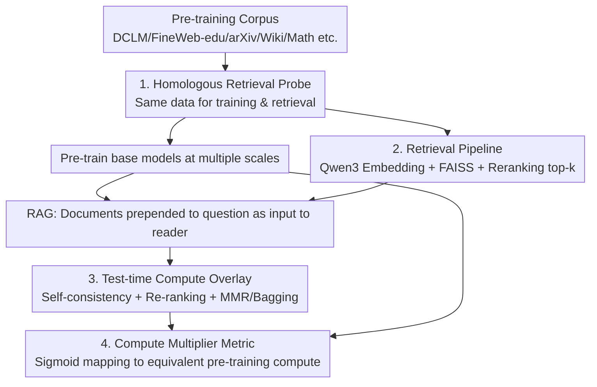

# Reusing Pre-training Data at Test Time is a Compute Multiplier

**Conference**: ICLR 2026  
**OpenReview**: [https://openreview.net/forum?id=xUS8SBL5iM](https://openreview.net/forum?id=xUS8SBL5iM)  
**Code**: None  
**Area**: Information Retrieval / Retrieval Augmentation / Test-time Compute  
**Keywords**: Retrieval-Augmented Generation, Pre-training Data Reuse, Test-time Compute, Compute Multiplier, Self-consistency

## TL;DR
The authors reuse the "exact same corpus used for pre-training" for retrieval augmentation at test time. They find this acts as a compute multiplier that yields performance equivalent to ~5x pre-training compute on MMLU, indicating that current pre-training does not fully extract knowledge from the data. By layering test-time compute techniques like self-consistency, re-ranking, and variance reduction, LLaMA 3.1 8B achieves an additional 10-point gain on MMLU.

## Background & Motivation
**Background**: LLM capabilities primarily scale with pre-training compute (scaling laws), alongside improvements in architecture and data quality. However, an overlooked question remains: how much knowledge does the pre-training "engine" actually extract from the data?

**Limitations of Prior Work**: Models consistently struggle with long-tail knowledge and the "reversal curse" (failing to infer "B is A" from "A is B"). Furthermore, performance grows log-linearly with compute—meaning subsequent gains require exponentially more compute. It remains unquantified whether these bottlenecks stem from the data itself or the inefficiency of the pre-training "learning style."

**Key Challenge**: Compressing a corpus into parameters via pre-training is lossy—models fail to truly internalize much of the knowledge existing in the data. There is a lack of tools to measure "how much data value is discarded during pre-training."

**Goal**: ① Quantify the value of data missed during pre-training; ② Observe how this missed value changes with model scale; ③ Identify which test-time compute techniques most effectively reclaim this value.

**Key Insight**: The authors observe that if the **exact same corpus** is used first for pre-training and then for retrieval at test time, any additional gain from retrieval represents knowledge that was present in the data but not mastered by pre-training. This turns "retrieval gain" into a yardstick for measuring pre-training efficiency.

**Core Idea**: Use "retrieval augmentation on homologous corpora + test-time compute" as a probe to convert retrieval gains into an "equivalent pre-training compute multiplier," thereby quantifying the degree of data wastage in pre-training.

## Method

### Overall Architecture
This paper does not propose a new model but rather designs a **measurement experimental framework**: a single pre-training corpus is used both to train base models and to build retrieval indexes. At test time, retrieved documents are prepended to the context (RAG), and test-time compute techniques are incrementally layered. Finally, a fitted sigmoid curve is used to map the accuracy gain from retrieval back to the "fold-increase in pre-training compute required for a base model to achieve the same accuracy."

The pipeline consists of three stages: **Training side** (pre-training base models at different compute scales), **Retrieval side** (Qwen3 embedding + FAISS index + Qwen3 reranker), and **Test-time compute side** (layering self-consistency, re-ranking, and MMR/bagging variance reduction over RAG). The outputs from these stages are unified via the "compute multiplier" analysis framework.

### Key Designs

**1. Homologous Retrieval Probe: Quantifying Missed Knowledge using Identical Corpora**

This step addresses the unmeasured question of data wastage. The approach is strictly controlled: the **exact same corpus** (DCLM-baseline, FineWeb-edu, plus arXiv, peS2o, PubMed, Stack Exchange, Wikipedia, and math sources) is used for both training and retrieval. The logic is that since the model has already "seen" this data during pre-training, any score increase from retrieving it at test time must indicate that pre-training failed to internalize that knowledge into parameters.

To rule out "retrieval as test-set leakage," the authors performed two checks. First, **De-contamination**: docs overlapping with MMLU and Math-500 questions (using n-gram overlap) were removed. Results showed that the de-contaminated retrieval curve (red line in Fig 1) remains close to the full retrieval curve (dark blue), proving gains do not come from contamination—while also revealing that 14.1% of MMLU and 32.0% of Math-500 questions can be found in public corpora. Second, **Data Volume control**: retrieval from a subset roughly equal to the non-repeated pre-training data volume performed nearly as well as full retrieval, proving gains aren't just from "seeing more data." 

**2. Retrieval Pipeline: Simple Retrieval via Embedding + FAISS + Reranking**

To keep the "probe" simple and avoid contaminating conclusions with complex retrieval tricks, the pipeline is standard. Qwen3 Embedding 0.6B is used for vectorization, FAISS FlatIP for indexing, taking the top-100 per shard and merging into a global top-100. A Qwen3 Reranker 0.6B re-ranks these 100 docs to get the final order, which are then prepended to the question.

Re-ranking is an independent knob: experiments show that adding a reranker consistently improves performance across tasks (e.g., MMLU All from 76.6 → 77.7), as it puts the most relevant docs at top-1, allowing the reader to access more pertinent material within limited context.

**3. Test-time Compute Overlay: Upgrading the Tool via Compute**

The authors investigate how much more knowledge can be extracted from the same data if extra compute is allowed at test time. The key insight is that retrieval is naturally suited for parallel test-time compute—running **multiple trials across different retrieved documents** and aggregating answers via self-consistency (majority voting). Beyond this, two **Variance Reduction (VR)** techniques are applied: MMR (Maximum Marginal Relevance for diversity) and bagging (randomizing over document subsets).

This overlay is hierarchical and largely additive. For MMLU All (LLaMA 3.1 8B reader): baseline 71.6 → self-consistency 75.3 → retrieval 76.6 → re-ranking 77.7 → re-ranking + consistency 81.0 → re-ranking + consistency + VR 82.1, totaling a 10.5-point Gain. The authors distinguish their work from "Deep Research": self-consistency replicates models without enhancing tools; Deep Research uses compute to let models "use tools longer"; this work uses compute to **upgrade the tool itself** (improving retrieved documents), representing a data-driven approach to compute investment.

**4. Compute Multiplier Metric: Translating Gains to Equivalent Pre-training Compute**

To provide a unified scale, the authors fit a bounded sigmoid to the base model's MMLU accuracy relative to FLOPs:

$$y = 0.25 + \frac{0.6907}{1 + \exp\left(-0.7968 \cdot (\log_{10}(x) - \log_{10}(2.48 \times 10^{22}))\right)}$$

where $0.25$ is the random baseline and $0.9407$ is the attainable upper bound. Given a RAG-enhanced model's accuracy, this curve calculates the "pre-training compute a pure base model would need to match it." The ratio is the compute multiplier. Conclusion: retrieval acts as an average **4.86x** compute multiplier (geometric mean 4.66, median 4.74). However, this multiplier **diminishes** with scale—dropping to 2.88x at the largest tier, suggesting stronger base models experience compressed marginal returns from retrieval. Interestingly, the multiplier initially rises before falling, hinting that retrieval also "benefits" from a better base model. With full test-time compute, the method provides at least an 11x compute multiplier over the baseline.

## Key Experimental Results

### Main Results
Using LLaMA 3.1 8B instruct as the reader with CoT reasoning, layering test-time compute:

| Method | MMLU All | Math-500 | GPQA All | SimpleQA |
|------|----------|----------|----------|----------|
| Baseline | 71.6 | 48.7 | 30.6 | 1.5 |
| + Self-consistency | 75.3 | 55.9 | 31.4 | N/A |
| + Retrieval | 76.6 | 56.7 | 33.2 | 65.7 |
| + Re-ranking | 77.7 | 56.8 | 34.8 | 74.0 |
| + Re-ranking + Consistency | 81.0 | 64.3 | 36.1 | N/A |
| + Re-ranking + Consistency + VR | **82.1** | **64.4** | **36.8** | — |

Gains from retrieval and self-consistency are additive across tasks. SimpleQA is purely fact-based (self-consistency N/A), but retrieval+re-ranking pulls it from 1.5 to 74.0.

### Ablation Study
Compute multiplier decreases with scale (MMLU, Retrieval vs. Pure Pre-training):

| Pre-training Compute (FLOPs) | Base MMLU | Retrieval MMLU | Compute Multiplier |
|------|------|------|------|
| $5.64\times10^{21}$ | 0.487 | 0.606 | 5.28x |
| $1.90\times10^{22}$ | 0.602 | 0.694 | 7.17x |
| $7.04\times10^{22}$ | 0.662 | 0.741 | 4.74x |
| $1.74\times10^{23}$ | 0.711 | 0.778 | 4.23x |
| $7.34\times10^{23}$ | 0.763 | 0.819 | 2.88x |

Equivalent compute multiplier relative to baseline (MMLU All): Consistency 2.10x → Retrieval 2.78x → Re-ranking 3.56x → Re-ranking+Consistency 8.14x → Re-ranking+Consistency+VR **11.10x**.

### Key Findings
- **Retrieval is more cost-effective for STEM than Humanities**: In MMLU categories, STEM averaged 6.16x, others 9.27x, while Humanities was only 2.52x. This is counter-intuitive as retrieval was thought to help "memorization" tasks, but STEM (e.g., Physics) saw massive Gains (+16.9 in HS Physics), suggesting expanded context may act as "extra processing" rather than just storage.
- **Retrieval changes behavior less than scaling models**: Scaling the model changed 39.7% of MMLU answers, while adding retrieval changed only 28.1%. This suggests that where retrieval fails, the issue is that the model "ignored context" rather than "context misled it"—prompt engineering or attention weighting could improve this.
- **Better pre-training datasets $ \neq $ better retrieval datasets**: FineWeb-edu is far worse for pre-training MMLU (42.9) than DCLM (53.4), but performed slightly better for retrieval (75.2 vs 74.5), indicating different quality standards for pre-training vs. retrieval data.
- **Extraction and crawling stages are severely undervalued**: On SimpleQA, simply changing to a better-extracted version of Wikipedia (retaining tables/infoboxes) resulted in a 13.6-point gap (55.4 → 69.0). Adding non-Wiki golden links further increased this to 85.2, highlighting room for improvement in open-source crawling.
- **Inter-document consistency is a stronger reranker**: Using self-consistency to score each document individually (inter-doc consistency) yields top-1 quality superior to standard rerankers (77.6 vs 73.7 on MMLU), though costing more reader calls—a potential target for distillation into efficient rerankers.

## Highlights & Insights
- **Redefining "Retrieval Gain" as a "Pre-training Efficiency Yardstick"**: The brilliance lies not in using RAG, but in using homologous corpora to interpret retrieval gains as "discarded data value" and converting this into a compute multiplier using a sigmoid fit.
- **De-contamination + Data Volume controls block mundane explanations**: By proving gains aren't from leakage or "more data," the authors solidly conclude that pre-training simply hasn't "learned the data well enough."
- **Layered test-time compute and additive knobs**: Self-consistency, re-ranking, and VR are treated as modular blocks that are largely additive, providing a performance tuning checklist for any RAG system.
- **"Upgrading the tool vs. using the tool longer"**: Investing compute in "getting better retrieved documents" rather than just sampling or iterative calls is a data-driven, high-ROI direction for test-time compute.

## Limitations & Future Work
- The authors acknowledge exploring only **limited simple test-time techniques** and **limited evaluation sets**; advanced techniques like query rewriting, test-time training, or RL for retrieval could further improve performance.
- The sigmoid fit for the compute multiplier comes from the authors' specific pre-training setup; applying it to LLaMA 3.1 8B (which is heavily overtrained) is an approximation. The authors suggest this remains a lower bound.
- The multiplier depends on specific fits and benchmarks; figures like 4.86x or 11x should be interpreted in the context of specific task difficulties and budgets.
- SimpleQA’s robustness (limited interference from useless data) was only verified on factual tasks; scaling behavior for reasoning tasks might differ.
- Future work: Encouraging models to better utilize retrieval context via attention weighting, distilling inter-doc consistency into efficient rerankers, and comparing RAG compute multipliers with MoE data utilization.

## Related Work & Insights
- **vs. Traditional Scaling Laws (Kaplan / Hoffmann)**: While those focus on loss relative to compute/data/parameters, this work fixes the data and examines the joint scaling of "pre-training + simple retrieval," shifting focus from "how to train better" to "how much of the existing data is actually utilized."
- **vs. Shao et al. (2024) / Lyu et al. (2025)**: These focus on expanding or refining retrieval datastores for knowledge-intensive tasks; this work uses "homologous corpora" specifically to quantify pre-training oversight.
- **vs. Test-time Compute (Brown / Snell / Self-consistency)**: While others focus on parallel sampling or sequential iterations, this work specifically directs test-time compute towards "upgrading the retrieval tool itself" and defines it as a distinct path from "using the tool longer" (Deep Research).

## Rating
- Novelty: ⭐⭐⭐⭐⭐ Reframing RAG as a probe for pre-training efficiency with the "compute multiplier" metric is highly original.
- Experimental Thoroughness: ⭐⭐⭐⭐⭐ Covers multiple compute scales, tasks, de-contamination, data volume controls, and extraction case studies.
- Writing Quality: ⭐⭐⭐⭐ Clear argumentation and rigorous controls, though some conclusions rely on specific sigmoid fittings.
- Value: ⭐⭐⭐⭐⭐ Provides quantitative evidence that pre-training underutilizes data, offering actionable insights for dataset construction and test-time compute.

<!-- RELATED:START -->

## Related Papers

- [\[ACL 2026\] Test-Time Training for Zero-Resource Dense Retrieval Reranking](../../ACL2026/information_retrieval/test-time_training_for_zero-resource_dense_retrieval_reranking.md)
- [\[ICLR 2026\] MetaEmbed: Scaling Multimodal Retrieval at Test-Time with Flexible Late Interaction](metaembed_scaling_multimodal_retrieval_at_test-time_with_flexible_late_interacti.md)
- [\[ICLR 2026\] Robust Test-Time Video-Text Retrieval: Benchmarking and Adapting for Query Shifts](robust_test-time_video-text_retrieval_benchmarking_and_adapting_for_query_shifts.md)
- [\[CVPR 2025\] Advancing Myopia To Holism: Fully Contrastive Language-Image Pre-training](../../CVPR2025/information_retrieval/advancing_myopia_to_holism_fully_contrastive_language-image_pre-training.md)
- [\[ICLR 2026\] Leveraging Data to Say No: Memory Augmented Plug-and-Play Selective Prediction](leveraging_data_to_say_no_memory_augmented_plug-and-play_selective_prediction.md)

<!-- RELATED:END -->
