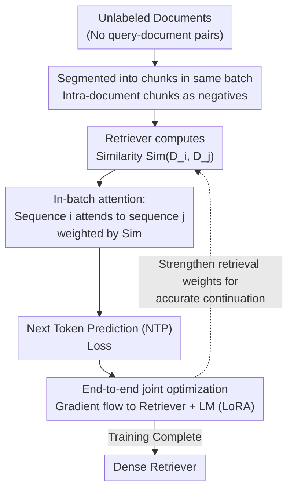

# Revela: Dense Retriever Learning via Language Modeling

**Conference**: ICLR2026 Oral  
**arXiv**: [2506.16552](https://arxiv.org/abs/2506.16552)  
**Code**: To be confirmed  
**Area**: Information Retrieval  
**Keywords**: dense retrieval, self-supervised learning, language modeling, in-batch attention, retriever

## TL;DR
The authors propose Revela, which integrates retriever learning into language modeling via an in-batch attention mechanism. In this framework, Next Token Prediction (NTP) depends not only on the intra-sequence context but also on other sequences within the batch (weighted by retriever similarity), enabling the training of powerful dense retrievers without labeled query-document pairs.

## Background & Motivation

**Background**: Dense retrievers typically require labeled query-document pairs for training, but labeling costs are prohibitive in specialized domains and complex scenarios.

**Limitations of Prior Work**: Self-supervised retrieval methods (e.g., Contriever) are prone to overfitting data structural biases, while auto-encoding methods lack paired supervision.

**Key Challenge**: Language Models (LMs) learn dependencies between tokens via NTP (a success in self-supervision); how can this concept be extended to learn dependencies between chunks?

**Key Insight**: Retrieval is analogous to "sequence-level NTP"—where NTP seeks the most relevant preceding tokens, retrieval seeks the most relevant documents.

**Core Idea**: An in-batch attention mechanism is introduced into Transformer blocks, causing NTP to depend on both intra-sequence context and other sequences in the batch, with the retriever providing cross-sequence weights.

## Method

### Overall Architecture

Revela reformulates "retriever training" as "language modeling." Initially, a batch of documents is segmented into chunks and placed into the same batch. An in-batch attention layer is then inserted into the LM's Transformer blocks. When performing Next Token Prediction (NTP), each sequence attends not only to its internal context but also to representations of other sequences in the batch. The "attention weight" is determined by the inter-document similarity calculated by the retriever. Consequently, minimizing the NTP loss propagates gradients back to both the retriever and the LM: the retriever learns "which documents are most helpful for the current continuation" without any labeled query-document pairs. The following flowchart illustrates the entire data flow—from a batch of unlabeled documents to a trained dense retriever.

### Key Designs

**1. Same-document chunks as negative samples: A free source of hard negatives**  
Contrastive retrieval learning requires "hard-to-distinguish" negative samples, which are traditionally mined manually—a process that is both expensive and fragile. Revela segments different chunks from the same document into the same batch; these chunks are semantically similar but do not necessarily continue one another, naturally forming "hard" contrastive signals. Combined with a very low temperature $\tau=10^{-4}$ to sharpen the similarity distribution, the model is forced to learn fine-grained distinctions between documents. The entire set of negative samples is generated solely by the batch construction method, requiring no additional labeling.

**2. In-batch attention: Embedding "cross-document retrieval" into attention layers**  
Standard NTP only utilizes intra-sequence context and cannot express the need to reference another document to continue the current one. Revela introduces a cross-sequence attention layer into the Transformer: the token representations of sequence $i$ attend not only to their own context but also to the representations of other sequences $j$ in the batch. These cross-sequence weights are modulated by the retriever's similarity score $\text{Sim}(D_i, D_j)$—the higher the similarity, the greater the contribution of sequence $j$ to the continuation of sequence $i$. Thus, the retriever is no longer an external module but directly determines where the LM "borrows information" for NTP, making NTP gradients the direct training signal for the retriever.

**3. End-to-end joint optimization: Updating retriever and LM under a single NTP objective**  
This is the primary distinction between Revela and methods like REPLUG. REPLUG freezes the LM and uses its perplexity to distill the retriever; however, poorly calibrated LM perplexity can provide erroneous signals. Revela allows the retriever and the LM to share the same NTP loss for end-to-end joint training—once a retrieval weight improves continuation accuracy, the corresponding similarity is reinforced. This binds "retrieval quality" and "language modeling quality" into a single differentiable objective, fundamentally avoiding signal bias from a frozen LM.

### Loss & Training

General retrieval is trained on Wikipedia, while code retrieval is trained on StackOverflow and documentation corpora; a mixture of both is also possible. Both the retriever and the LM are fine-tuned using LoRA (rank=256) with a learning rate of $10^{-4}$ and a temperature of $\tau=10^{-4}$. Training is performed for only 1 epoch (approx. 10K steps/~44 hours for Wiki, 11K steps/~48 hours for code on 4×A100). During inference, the query/document length is up to 2048 tokens, using the `<eos>` token embedding as the document representation with "Query:" / "Passage:" prefixes to distinguish queries from passages.

## Key Experimental Results

### Main Results

| Method | CoIR (nDCG@10) | BRIGHT | BEIR |
|------|------|--------|------|
| E5-Mistral-7B (Supervised) | Baseline | Baseline | Baseline |
| **Revela-3B** (Unsupervised) | **+2.8** | **Outperforms commercial APIs** | **Unsupervised SOTA** |

### Key Findings
- Outperforms 7B parameter supervised models without any labeled data.
- Achieves BEIR unsupervised SOTA using approximately 1000× less data and 10× less computation.
- Demonstrates stronger cross-domain generalization than traditional contrastive learning methods.
- Performance scales consistently with batch size and model scale.

## Ablation Study

| Ablation/Analysis | Finding |
|-----------|------|
| Batch size scaling | Performance increases monotonically with batch size; larger batches provide more negative samples. |
| Retriever scaling | Continuous improvement from 135M to 3B, following scaling laws. |
| LM size | Larger LMs (1B→3B) provide superior retrieval learning signals. |
| Mixed-domain training | Wiki+Code joint training does not harm single-domain performance and enhances cross-domain generalization. |
| vs REPLUG | Revela > REPLUG at all scales; joint optimization is superior to freezing the LM. |
| Cross-domain generalization | Revela trained on Wiki outperforms commercial APIs on unseen BRIGHT reasoning-intensive tasks. |

### Detailed CoIR Results (nDCG@10)

| Method | Scale | Average nDCG@10 |
|------|------|-------------|
| UniXCoder (Supervised) | 0.1B | Baseline |
| Revela | 0.1B | +11.1 |
| E5-PT (Weakly supervised, 270M pairs) | 0.3B | Baseline |
| Revela | 0.5B | **+9.7** |
| BGE-M3 (Supervised) | 0.6B | Baseline |
| Revela | 0.5B | **Outperformed** |
| E5-Mistral-7B (Supervised) | 7B | Baseline |
| **Revela** | **3B** | **+2.8** |

## Highlights & Insights
- The **NTP-to-Retrieval analogy** is remarkably natural and effective: token dependencies $\leftrightarrow$ document dependencies.
- **Power of joint optimization**: REPLUG's reliance on frozen LM perplexity (often poorly calibrated) is resolved by Revela’s joint updates.
- **Incredible data efficiency**: Achieving BEIR unsupervised SOTA with ~1000× less data and 10× less compute suggests that architectural design is more critical than data volume.
- **Cross-domain generalization**: Stronger than traditional contrastive learning because the NTP objective captures more universal "semantic dependencies" rather than superficial co-occurrences.

## Limitations & Future Work
- Performance is highly sensitive to batch size, requiring sufficiently large batches (16+), which may be a bottleneck in resource-constrained settings.
- In-batch attention increases computational overhead during training, as every sequence must attend to all others in the batch.
- Verified only on text and code retrieval; multimodal retrieval (image, audio) remains unexplored.
- The impact of chunking strategies (sentence boundaries vs. fixed length) on performance has not been analyzed in depth.
- For extremely long documents (>2048 tokens), current chunking may lose long-range dependencies.

## Related Work & Insights
- **vs Contriever (Izacard et al.)**: Contriever uses contrastive learning (same document = positive), while Revela models cross-document conditional probability via NTP, capturing finer-grained relevance.
- **vs Atlas (Izacard et al.)**: Atlas uses cross-attention signals from an encoder-decoder architecture requiring periodic re-indexing; Revela utilizes decoder-only in-batch attention, which is more efficient.
- **vs REPLUG (Shi et al.)**: REPLUG distills from a frozen LM using perplexity; Revela's joint training proved significantly superior across all scales.
- **vs E5-PT (Wang et al.)**: E5-PT trains on 270M weakly supervised pairs; Revela uses only raw text self-supervision, proving that a superior objective can replace vast amounts of labeled data.
- **Insight**: The in-batch attention concept can be generalized to any scenario requiring the modeling of "intra-set relationships," such as multi-document summarization or cross-modal retrieval.

## Rating
- Novelty: ⭐⭐⭐⭐⭐ The paradigm of learning retrieval via NTP is highly innovative.
- Experimental Thoroughness: ⭐⭐⭐⭐⭐ Evaluated on three benchmarks with multi-scale and scaling analyses.
- Writing Quality: ⭐⭐⭐⭐ Clear motivation and rigorous formulations.
- Value: ⭐⭐⭐⭐⭐ Provides a powerful new paradigm for self-supervised retrieval.

<!-- RELATED:START -->

## Related Papers

- [\[ICLR 2026\] MLP Memory: A Retriever-Pretrained Memory for Large Language Models](mlp_memory_a_retriever-pretrained_memory_for_large_language_models.md)
- [\[ACL 2025\] FlashBack: Efficient Retrieval-Augmented Language Modeling for Fast Inference](../../ACL2025/information_retrieval/flashbackefficient_retrieval-augmented_language_modeling_for_long_context_infere.md)
- [\[ACL 2026\] Language-Coupled Reinforcement Learning for Multilingual Retrieval-Augmented Generation](../../ACL2026/information_retrieval/language-coupled_reinforcement_learning_for_multilingual_retrieval-augmented_gen.md)
- [\[ICLR 2026\] ChronoPlay: A Framework for Modeling Dual Dynamics and Authenticity in Game RAG Benchmarks](chronoplay_a_framework_for_modeling_dual_dynamics_and_authenticity_in_game_rag_b.md)
- [\[ICLR 2026\] A Dense Subset Index for Collective Query Coverage](a_dense_subset_index_for_collective_query_coverage.md)

<!-- RELATED:END -->
