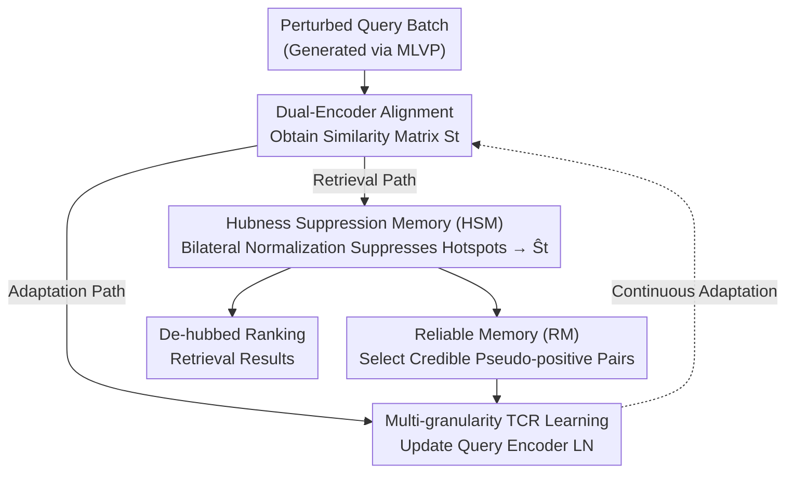

# Robust Test-Time Video-Text Retrieval: Benchmarking and Adapting for Query Shifts

**Conference**: ICLR 2026  
**OpenReview**: [https://openreview.net/forum?id=FRkJ3ehpNN](https://openreview.net/forum?id=FRkJ3ehpNN)  
**Code**: https://github.com/bingqingzhang/vtr_tta.git  
**Area**: Video Understanding / Information Retrieval / Test-Time Adaptation  
**Keywords**: Video-Text Retrieval, Query Shift, Hubness, Test-Time Adaptation, Robustness Benchmark

## TL;DR
To address the sharp performance collapse of Video-Text Retrieval (VTR) models under real-world query perturbations, this paper establishes the MLVP benchmark containing 12 types of spatio-temporal perturbations across 5 intensity levels. It diagnoses that perturbations amplify "hubness" (where a few gallery videos dominate retrieval rankings) as the root cause. Subsequently, the authors propose HAT-VTR, a test-time adaptation framework that suppresses hotspots at the similarity level using Hubness Suppression Memory (HSM) and adapts to video temporal dynamics using multi-granularity losses. It significantly outperforms existing TTA methods in Recall@1 across various query shift scenarios.

## Background & Motivation
**Background**: Modern video-text retrieval is dominated by dual-encoder architectures (e.g., CLIP4Clip, X-Pool) that map videos and text into a shared embedding space, performing alignment via cosine similarity or cross-attention. These models achieve impressive performance on in-distribution benchmarks.

**Limitations of Prior Work**: This paradigm rests on the fragile assumption that inference data follows the same distribution as training data. In reality, this is frequently violated by "query shifts" such as driving in heavy fog, partial object occlusion, or frame reordering due to network packet loss, leading to a precipitous drop in retrieval accuracy. Existing robustness research is largely confined to the image-text domain (e.g., TCR introduced TTA for image-text query shifts), but these only handle static, frame-level artifacts and fail to address the unique spatio-temporal dynamic perturbations of video.

**Key Challenge**: Video perturbations damage not only single-frame appearances but also cross-frame temporal consistency, which is a blind spot for image-based methods. Crucially, the authors discover that perturbed queries **amplify the hubness phenomenon**, where a minority of gallery videos become "hubs" that are identified as nearest neighbors by an abnormally large number of queries, monopolizing the rankings. Existing TTA methods (like TCR) only partially alleviate this amplification rather than treating the root cause.

**Goal**: The problem is decomposed into two sub-problems: (1) the lack of a robustness evaluation benchmark specific to video spatio-temporal characteristics; (2) the lack of a video TTA method that directly counteracts amplified hubness.

**Key Insight**: The authors quantify hubness through the $k$-occurrence distribution (how many times a gallery item is retrieved in the top-15). While the distribution is relatively balanced on clean data, it becomes heavy-tailed under perturbation; TCR only partially flattens it. Since hubness is the root cause of failure, the authors propose to **directly suppress hotspots at the similarity score level** rather than performing generic representation homogenization.

**Core Idea**: A dual approach is employed during test-time—"Hubness Suppression Memory + Multi-granularity Temporal Loss." This suppresses over-hit gallery items in the similarity space in real-time while upgrading TCR supervisory signals to the video temporal hierarchy to restore a balanced neighbor distribution.

## Method

### Overall Architecture
HAT-VTR is a strictly online TTA framework: the model is trained only on clean data. During testing, when faced with an unknown perturbed query stream, it adapts using unlabeled test data during inference without revisiting source training data. For each incoming query batch, the dual-encoder computes query embeddings $Z^{Q_b}$ and pre-stored offline gallery embeddings $Z^G$ to obtain a similarity matrix $S_t = g_\theta(Z^{Q_b}_t, Z^G)$. This matrix is then processed via two parallel paths:

- **Adaptation Path**: Updates only the Layer Norm parameters of the query encoder using total loss $\mathcal{L}_{total}$ (Eq. 12) to adapt representations to the target domain.
- **Retrieval Path**: Refines $S_t$ into a "de-hubbed" matrix $\hat{S}_t$ via HSM in real-time, then outputs the final ranking.

The two paths are connected by a Reliable Memory (RM): scores refined by HSM are used to select credible query-gallery pseudo-positive pairs for storage in RM, providing stable historical targets for adaptation losses and preventing error accumulation or catastrophic forgetting. The evaluation is conducted on the newly proposed MLVP benchmark.

### Key Designs

**1. MLVP Benchmark and Hubness Diagnosis: Quantifying what perturbations destroy**

To study video TTA, a benchmark that exposes video spatio-temporal vulnerabilities is needed. Existing image robustness benchmarks (e.g., ImageNet-C) and early VTR-C merely apply image artifacts frame-by-frame, missing inter-frame dynamics. MLVP (Multi-Level Video Perturbations) organizes 12 types of perturbations into three levels, each with 5 intensities, across five datasets: MSRVTT, ActivityNet, LSMDC, MSVD, and DiDeMo, resulting in 60 controlled scenarios and 8,500+ perturbed videos. The levels address different failure modes: **Low-level (Pixel)**: Gaussian/Impulse noise, fog, snow, elastic transform, H.264 compression, using consistent noise across frames to maintain temporal coherence; **Mid-level (Object/Motion)**: Motion blur and defocus using inter-frame motion vectors for spatially-variant blur, and primary object occlusion using Qwen2.5-VL-7B for captioning and OWLv2 for tracking key nouns—more realistic and challenging than random masking; **High-level (Semantic/Temporal)**: Style transfer (AdaIN with fixed style images to ensure temporal consistency), event insertion (splicing semantically similar clips), and temporal shuffling (cropping and reordering video blocks, simulating packet loss).

Based on this, the authors diagnose using $k$-occurrence distributions: distributions are balanced on clean data but shift to heavy-tailed under noise, confirming that query shift **amplifies hubness**. This identifies the root cause of performance collapse and specifies the targets for the subsequent components.

**2. Hubness Suppression Memory (HSM): Dismantling hotspots at the similarity score level**

Since hubness manifests as specific gallery columns in the similarity matrix being hit by abnormally many queries, the authors apply adaptive bilateral normalization on scores. HSM maintains a FIFO memory $M_{t-1}$ storing the $K-1$ most recent similarity matrices, concatenated with $S_t$ to form an aggregated matrix $\bar{S} = \text{Concat}(S_t, S_{t-1}, \dots, S_{t-K+1})$. Two weights are calculated: a gallery-centric weight $W_{gallery} = \text{softmax}_{col}(\alpha\bar{S})$ describing the "popularity" of each gallery item, and a query-centric weight $W_{query} = \text{softmax}_{row}(\beta\bar{S})$ describing the query's tendency to cluster. The final de-hubbed matrix is fused via a balance coefficient $m$:

$$\hat{S} = m(\bar{S} \odot W_{gallery}) + (1-m)(\bar{S} \odot W_{query})$$

where $\odot$ denotes element-wise multiplication. The current batch refined score $\hat{S}_t$ is taken from the first $B$ rows of $\hat{S}$. The HSM is used in two places: **Hubness-aware target selection** (using $\hat{S}_t$ to select pseudo-positives for RM) and **Posterior similarity reranking** (applying HSM to adapted scores for final ranking).

**3. Multi-granularity TCR Learning: Upgrading image-text supervision to video temporal levels**

TCR was designed for image-text and only performs representation homogenization at the global frame level, losing temporal structure. This paper decomposes supervision into three multi-granularity losses. **Multi-granularity Uniformity Loss** $\mathcal{L}_{MGUNI} = \mathcal{L}_{inter} + \mathcal{L}_{intra}$: the inter-term pushes queries away from the batch mean ($\mathcal{L}_{inter} = \frac{1}{B}\sum_i \exp(-\|Z^{Q_b}_i - \bar{Z}^{Q_b}\|^2 / t)$), while the intra-term pushes frame-level features away from the global representation to preserve temporal diversity. **Multi-granularity Cross-modal Loss** $\mathcal{L}_{MGCM} = \mathcal{L}_{global} + \mathcal{L}_{frame}$: the global term aligns the current modal gap to the stable RM target, while the frame term aligns the cross-covariance of frame-level queries and gallery pseudo-positives. **Noise-robust Adaptation** $\mathcal{L}_{NA}$ adopts TCR's weighted entropy minimization, zeroing weights for unreliable queries via a threshold derived from RM. The total objective is $\mathcal{L}_{total} = \mathcal{L}_{MGUNI} + \mathcal{L}_{MGCM} + \mathcal{L}_{NA}$.

### Loss & Training
The final adaptation objective is $\mathcal{L}_{total} = \mathcal{L}_{MGUNI} + \mathcal{L}_{MGCM} + \mathcal{L}_{NA}$ (Eq. 12). AdamW optimizes only the Layer Norm parameters of the query encoder with a batch size of 16. Key hyperparameters $\tau = 0.02$ and $t = 10$ follow TCR for fairness, while HSM parameters $(\alpha, \beta, m)$ are set to $(100, 10, 0.5)$.

## Key Experimental Results

### Main Results
Evaluations were conducted on CLIP4Clip (coarse-grained) and X-Pool (fine-grained), comparing against TENT, READ, SAR, EATA, and TCR. Average v2t Recall@1 across 12 perturbations at intensity level 5 on MSRVTT-1kA:

| Dataset / Backbone | Metric | HAT-VTR (Ours) | TCR (Runner-up) | Original |
|--------|------|------|----------|------|
| MSRVTT-1kA / CLIP4Clip | Avg v2t R@1 | **26.2** | 21.4 | 17.0 |
| MSRVTT-1kA / X-Pool | Avg v2t R@1 | **30.3** | 24.0 | 20.0 |
| ActivityNet / CLIP4Clip | Avg v2t R@1 | **22.28** | 12.86 | 12.41 |
| MSRVTT-1kA / X-Pool | Avg t2v R@1 | **36.5** | 35.0 | 35.2 |

In the more challenging QGS (Query and Gallery Shift) scenario, cross-dataset adaptation (MSRVTT→ActivityNet, CLIP4Clip) achieved a v2t R@1 of **36.10** (TCR was 19.28, lower than the original 32.64). Zero-shot adaptation (CLIP directly on ActivityNet) reached **28.92**, significantly higher than TCR's 18.65.

### Ablation Study

| Configuration | v2t / t2v / Avg | Description |
|------|---------|------|
| Baseline (w/o HSM) | 23.3 / 32.6 / 28.0 | No HSM |
| + Target Selection only | 23.6 / 32.8 / 28.2 | HSM used only for pseudo-positives |
| + Posterior Reranking only | 25.5 / 34.3 / 29.9 | HSM used only for ranking |
| + Both | **25.8 / 34.5 / 30.1** | Complementary mechanisms |

| Loss Combination | v2t / t2v / Avg | Description |
|------|---------|------|
| $\mathcal{L}_{inter}$ only | 22.6 / 34.1 / 28.3 | Global uniformity only |
| + $\mathcal{L}_{intra}$ | 23.9 / 34.1 / 29.0 | Add temporal diversity |
| + $\mathcal{L}_{global}+\mathcal{L}_{frame}$ | 25.3 / 34.4 / 29.8 | Add multi-granularity alignment |
| Full (incl. $\mathcal{L}_{NA}$) | **25.8 / 34.5 / 30.1** | Complete loss |

### Key Findings
- **Posterior reranking in HSM contributes more than target selection** (+1.9 vs +0.2 in Avg score), but they are complementary. Suppressing hubs directly in the output scores provides the fastest accuracy gain.
- **Multi-granularity losses are cumulatively effective**: moving from frame-level uniformity to temporal diversity and multi-granularity alignment consistently improves scores, validating the need for video-specific supervision.
- **Efficiency overhead is acceptable**: HAT-VTR takes 32.27 ms per query, comparable to TCR (26.37 ms). Backpropagation accounts for 65.7%, while the core HSM innovation adds only 4.2 ms (13.0%), making the robustness gains extremely cost-effective.

## Highlights & Insights
- **Attributing "collapse" to a quantifiable phenomenon**: Using the $k$-occurrence distribution to ground "poor robustness" as "amplified hubness" creates a clean research narrative.
- **Similarity-space intervention**: HSM performs bilateral normalization on the similarity matrix to suppress hotspots with nearly zero additional training, allowing for plug-and-play use with any dual-encoder VTR.
- **Benchmark Engineering**: Primary object occlusion using VLM-guided tracking and consistent noise across frames ensures the benchmark focuses on "video" rather than "frame-by-frame" properties.

## Limitations & Future Work
- The advantage narrows on perturbations where hubness is not the primary issue (e.g., temporal shuffling), suggesting performance gains depend on the "hubness tax" incurred by the shift.
- HSM introduces three hyperparameters ($\alpha, \beta, m$). While shown to be stable across several datasets, their sensitivity in drastically different domains remains an open question.
- The framework assumes a precomputed gallery. For edge deployments where the gallery changes in real-time or resources are extremely limited, the HSM memory overhead requires further validation.

## Related Work & Insights
- **vs. TCR**: TCR pioneered TTA for image-text query shifts via representation uniformity. This work upgrades it with multi-granularity temporal losses and HSM for score-level hub suppression; notably, TCR degraded performance in QGS scenarios while HAT-VTR remained stable.
- **vs. General TTA (TENT, SAR, EATA)**: These methods rely on entropy minimization for classification. They show limited or negative gains for VTR as they do not address retrieval-specific hubness.
- **vs. Style-Robust Training (Data-driven)**: Those methods require pre-collecting styles. HAT-VTR is a pure online TTA method requiring only clean data training and adapting to unknown shifts on the fly.

## Rating
- Novelty: ⭐⭐⭐⭐⭐ First spatio-temporal robustness benchmark for VTR + Hubness-based diagnosis and treatment.
- Experimental Thoroughness: ⭐⭐⭐⭐⭐ Extensive evaluation across two backbones, five datasets, and multiple shift scenarios.
- Writing Quality: ⭐⭐⭐⭐ Clear narrative; motivation and method are tightly coupled, though notation is dense.
- Value: ⭐⭐⭐⭐ Provides a reusable benchmark and a plug-and-play module directly applicable to real-world VTR deployment.

<!-- RELATED:START -->

## Related Papers

- [\[ICLR 2026\] MetaEmbed: Scaling Multimodal Retrieval at Test-Time with Flexible Late Interaction](metaembed_scaling_multimodal_retrieval_at_test-time_with_flexible_late_interacti.md)
- [\[ICLR 2026\] Reusing Pre-training Data at Test Time is a Compute Multiplier](reusing_pre-training_data_at_test_time_is_a_compute_multiplier.md)
- [\[ACL 2026\] Test-Time Training for Zero-Resource Dense Retrieval Reranking](../../ACL2026/information_retrieval/test-time_training_for_zero-resource_dense_retrieval_reranking.md)
- [\[ICLR 2026\] LightRetriever: A LLM-based Text Retrieval Architecture with Extremely Faster Query Inference](lightretriever_a_llm-based_text_retrieval_architecture_with_extremely_faster_que.md)
- [\[ICLR 2026\] RAEE: A Robust Retrieval-Augmented Early Exit Framework for Efficient Inference](raee_a_robust_retrieval-augmented_early_exit_framework_for_efficient_inference.md)

<!-- RELATED:END -->
