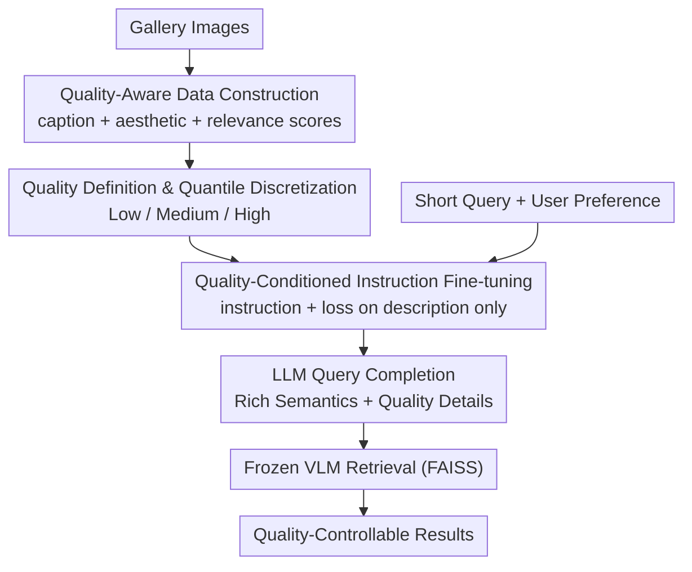

# Seeing Through Words: Controlling Visual Retrieval Quality with Language Models

**Conference**: ICLR 2026  
**OpenReview**: [https://openreview.net/forum?id=yOEmEXmbV8](https://openreview.net/forum?id=yOEmEXmbV8)  
**Code**: https://github.com/Jianglin954/QCQC  
**Area**: Information Retrieval / Multimodal VLM  
**Keywords**: Text-to-Image Retrieval, Query Completion, Quality-Controllable Retrieval, Language Models, Aesthetic Scoring

## TL;DR
Addressing the issues of semantic ambiguity and the inability to control image quality in text-to-image retrieval for short queries (e.g., "a dog"), this paper proposes **QCQC**: it utilizes a generative language model to complete short queries into detailed descriptions. By conditioning on discretized "relevance + aesthetics" quality levels, users can guide retrieval results toward specific quality tiers (low/medium/high). The method is plug-and-play for any frozen VLM.

## Background & Motivation
**Background**: Mainstream Text-to-Image Retrieval (T2IR) currently relies on VLMs (CLIP, CoCa, BLIP, etc.) to encode text and images into a joint space, followed by top-k retrieval based on cosine similarity. Large-scale image-text pre-training has significantly strengthened cross-modal alignment, leading to impressive benchmark performance.

**Limitations of Prior Work**: Real-world user queries often consist of only one or two words, making them extremely short and underspecified. This leads to three specific issues: ① **Semantic Ambiguity**: A few words can correspond to a vast range of images, making the search subspace large and scattered; ② **Semantic Collision**: Short queries cause visually distinct images to receive similar similarity scores, disrupting the ranking—a problem that worsens as the gallery size grows; ③ **Lack of Quality Control**: Systems rank results solely by similarity, ignoring dimensions users genuinely care about, such as aesthetics and relevance. At most, filtering is performed post-hoc.

**Key Challenge**: While modern VLMs possess strong representational capabilities, the information provided by short queries is insufficient to utilize them fully—a gap exists between the "fine-grained level VLMs can express" and the "coarseness of user input." Furthermore, retrieval quality is context-dependent (artists may want aesthetic results, designers may want creative ones, buyers may want popular ones), yet traditional systems lack a "knob" to guide the search toward specific quality dimensions.

**Goal**: ① Complete short queries into long descriptions that distinguish fine-grained image attributes (pose, scene, action, aesthetics); ② Make the completion "quality-controllable," allowing users to specify low/medium/high-quality results.

**Key Insight**: The authors found that short queries occupy a broad region in the embedding space, which contains images of varying qualities. By providing appropriate conditions, this region can be partitioned into "perceptually distinct" subsets, enabling fine-grained quality-aware retrieval. A key observation is that "extending" a short query is equivalent to applying a structured perturbation to the similarity matrix, which theoretically increases the rank of the score matrix and enhances discriminative ranking capability.

**Core Idea**: Use a generative LLM as a "query completion function" and use discretized quality levels (derived from relevance/aesthetic scoring models) as generation conditions. In short: "Let the LLM write short queries into long descriptions with quality preferences based on user-specified levels, then perform retrieval using a frozen VLM."

## Method

### Overall Architecture
QCQC (Quality-Conditioned Query Completion) decomposes "quality-controllable retrieval" into an offline library construction and an online completion retrieval pipeline. The core problem it solves is the lack of information in short queries and the absence of a quality control entry point. The mechanism works by first offline-annotating every image in the gallery with a "description + aesthetic score + relevance score" triplet, discretizing continuous scores into "Low/Medium/High" levels via quantiles to form quality-conditioned instruction data. These data are used to fine-tune a small LLM to learn the mapping from "quality condition → corresponding quality query completion." Online, the user's short query and preferred quality level are fed into this LLM to generate a rich description, which is then retrieved using a **fully frozen** VLM via FAISS. In this pipeline, only the LLM is trained; the captioning model, aesthetic scorer, and retrieval VLM all use pre-trained weights, making it plug-and-play for any VLM.

### Key Designs

**1. Quality-Aware Data Construction: Annotating images with the "description + aesthetics + relevance" triplet**

To help the completion function "understand the gallery," simply feeding image descriptions is insufficient—it must know which descriptions correspond to high/low-quality images. The authors offline construct three complementary labels for each image $I_i$ in gallery $I$: a short description $T_i = \mathrm{CAP}(I_i)$ generated by a caption model; an aesthetic score $s^a_i = \mathrm{EVA}(I_i)$ from a pre-trained scorer; and a relevance score $s^r_i = \cos(f(I_i), g(T_i))$, which is the cosine similarity between the image and its own description, measuring "semantic consistency." This triplet explicitly captures what the image looks like, how good it looks, and how well it matches the description.

**2. Quantile Discretization: Partitioning continuous quality scores into user-friendly Tiers**

Continuous scores are non-intuitive for users and cannot serve as direct generation conditions. This paper discretizes each dimension into three levels based on quantiles:

$$l(r_i) = \begin{cases} \text{Low}, & r_i \le \mathrm{perc}(r, p_1) \\ \text{High}, & r_i > \mathrm{perc}(r, p_2) \\ \text{Medium}, & \text{otherwise} \end{cases}$$

where $\mathrm{perc}(r, p)$ is the $p$-th percentile of the score distribution, with $p_1=33, p_2=66$. This step is key to "controllability." By partitioning continuous scores into non-overlapping intervals, each description is tied to a clear quality condition, allowing the LLM to learn the mapping from quality tiers to specific phrasing.

**3. Quality-Conditioned Instruction Fine-tuning: Injecting quality preferences via instructions**

Using the discrete labels, a lightweight instruction is designed for each image:

`"Relevance: l(s^r_i), Aesthetic: l(s^a_i), Query: "`

This instruction $P_i$ is concatenated with image description $T_i$ for standard auto-regressive training. **Loss is computed only on the tokens of the description (and the EOS token), not the instruction tokens**. This forces the model to learn what kind of description to write given a certain tier. During inference, the user's preferred quality (e.g., "high relevance, high aesthetic") is plugged into the template to generate the completion. Unlike general LLMs (GPT-4o), QCQC learns the specific quality distribution of the gallery, ensuring completions are both relevant and controllable.

### Loss & Training
The query completion LLM (GPT2-1.5B or Qwen2.5-0.5B) is trained using auto-regressive next-token cross-entropy. All other components (CoCa/BLIP2, aesthetic scorer, OpenCLIP retrieval VLM) are frozen. Theoretically, query completion is modeled as a structured perturbation $\Delta = B - A$ to the text embedding matrix. The authors prove that under certain conditions, the rank of the score matrix strictly increases $\mathrm{rank}(S_B) > \mathrm{rank}(S_A)$ (Proposition 1), meaning completion allows for more independent scoring patterns and finer discrimination.

## Key Experimental Results

### Main Results
Testing on **Flickr2.4M** and **MS-COCO** (using 80 MS-COCO class names as queries), reporting **Average Aesthetic Score (Ave Aes)** and **Average Relevance Score (Ave Rel)**. Data from Flickr2.4M with "Aesthetic Condition = High":

| Method | Ctrl? | Aes (Cond=H, Rel L/M/H) | Rel (Rel L/M/H) |
|------|:----:|------|------|
| Prefix (Short Query) | ✗ | 4.735 / 4.735 / 4.735 | 0.350 |
| GPT-4o Completion | ✗ | 4.791 / 4.816 / 5.056 | 0.361 / 0.357 / 0.361 |
| FT (Random Label FT, CoCa) | ✗ | 4.821 / 4.905 / 4.770 | 0.365 / 0.364 / 0.365 |
| **Ours (CoCa)** | **✓** | **5.222 / 5.170 / 5.270** | 0.353 / 0.368 / **0.390** |
| **Ours (Blip2)** | **✓** | **5.309 / 5.222 / 5.191** | 0.355 / 0.372 / **0.390** |

Key Conclusion: Only Ours shows "✓" for controllability—as the aesthetic condition moves from L to H, Ave Aes increases monotonically; as the relevance condition moves from L to H, Ave Rel increases monotonically (0.353 → 0.390). Baseline scores remain stagnant across tiers, proving they cannot control quality.

### Ablation Study
| Configuration | Observation | Explanation |
|------|------|------|
| Prefix | Low, constant quality | No completion, insufficient information for control |
| PT (Pre-trained LLM) | Often worse than Prefix | General models generate irrelevant words, hurting retrieval |
| FT (Random Fine-tuning) | Higher overall quality, but **not condition-responsive** | Fine-tuning helps, but random labels offer no control |
| 5 Quality Tiers | Monotonic fine-grained increase | Supports more granular control |
| Post-processing (re-rank) | Aes improves, but Rel drops (k=10: Aes 5.31, Rel 0.341) | Two-stage trade-off between relevance and aesthetics |

### Key Findings
- **"Random labels" are the benchmark for controllability**: Models fine-tuned with random labels show absolute quality gains but zero response to tier changes, proving controllability stems from "true quality labels + discrete conditions."
- **Query-side control > Post-retrieval filtering**: Re-ranking (Table 6) gains aesthetics at the cost of relevance as $k$ increases. By injecting preferences during query generation, QCQC maintains high relevance.
- **Cross-dataset degradation**: Models fine-tuned on Flickr2.4M maintain aesthetic controllability on MS-COCO (aesthetic cues are universal), but relevance drops significantly, indicating completion models must be tailored to specific galleries.

## Highlights & Insights
- **Quality as a controllable condition**: Moving the control knob from post-retrieval filtering to the query generation stage is a clever shift. Short queries leave "gaps" in the embedding space that high-quality conditions can exploit.
- **Minimalist yet effective instruction template**: A single line plus loss masking effectively injects quality preferences without additional structural costs.
- **Theoretical grounding**: Using rank analysis to explain why extending queries improves discriminative power provides a solid foundation for empirical results.
- **Plug-and-play paradigm**: Only training a small LLM while freezing all VLMs is highly transferable to other controllable dimensions (popularity, diversity, etc.).

## Limitations & Future Work
- Quality dimensions are currently limited to relevance and aesthetics; other dimensions like diversity or interestingness remain unexplored.
- **High gallery dependency**: Completion models must be customized for specific galleries, making it difficult to create a universal pre-trained completor.
- **Self-evaluation bias**: The metrics are the same as the training labels, raising "self-evaluation" concerns. Independent human evaluation is needed to confirm user satisfaction.
- Evaluation queries are limited to MS-COCO class names; real-world query robustness is unverified.

## Related Work & Insights
- **vs. General LLM Completion**: While GPT-4o can extend queries, it lacks knowledge of the gallery's quality distribution and cannot be steered by tiers. QCQC is gallery-aware and controllable.
- **vs. Post-processing Re-ranking**: Re-ranking is constrained by the initial top-k set (which might be low quality for short queries) and faces a relevance-aesthetic trade-off. QCQC avoids this by controlling the search at the source.

## Rating
- Novelty: ⭐⭐⭐⭐ Treats "quality-controllable retrieval" as a new task and solves it elegantly via query completion.
- Experimental Thoroughness: ⭐⭐⭐⭐ Comprehensive datasets and multiple VLMs; however, lacks independent human evaluation and has weak cross-dataset generalization.
- Writing Quality: ⭐⭐⭐⭐ Clear chain of logic from motivation to theory and experiment.
- Value: ⭐⭐⭐⭐ Highly practical for production retrieval systems where "short queries + quality preferences" are common.

<!-- RELATED:START -->

1. **CLIP (Learning Transferable Visual Models from Natural Language Supervision)**: The foundation for modern VLM-based retrieval.
2. **CoCa (Contrastive Captioners are Image-Text Foundation Models)**: A key backbone used in this paper for captioning and retrieval.
3. **Query Expansion/Completion in IR**: Classic literature that this work bridges into the multimodal VLM era.
4. **Image Aesthetic Assessment**: Fundamental scorers which this work uses as steerable conditions.

<!-- RELATED:END -->

## Related Papers

- [\[ICML 2026\] Seeing to Generalize: How Visual Data Corrects Binding Shortcuts](../../ICML2026/information_retrieval/seeing_to_generalize_how_visual_data_corrects_binding_shortcuts.md)
- [\[ACL 2026\] A Picture is Worth a Thousand Words? An Empirical Study of Aggregation Strategies for Visual Financial Document Retrieval](../../ACL2026/information_retrieval/a_picture_is_worth_a_thousand_words_an_empirical_study_of_aggregation_strategies.md)
- [\[ICLR 2026\] Expert Heads: Robust Evidence Identification for Large Language Models](expert_heads_robust_evidence_identification_for_large_language_models.md)
- [\[ICLR 2026\] MLP Memory: A Retriever-Pretrained Memory for Large Language Models](mlp_memory_a_retriever-pretrained_memory_for_large_language_models.md)
- [\[ICLR 2026\] TokMem: One-Token Procedural Memory for Large Language Models](tokmem_one-token_procedural_memory_for_large_language_models.md)

<!-- RELATED:END -->
