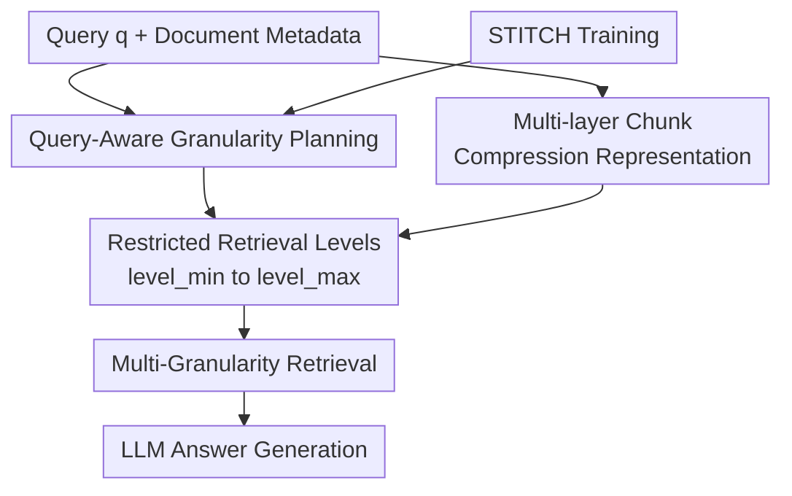

# SmartChunk Retrieval: Query-Aware Chunk Compression with Planning for Efficient Document RAG

**Conference**: ICLR 2026  
**OpenReview**: [https://openreview.net/forum?id=Myti1QwL2t](https://openreview.net/forum?id=Myti1QwL2t)  
**Code**: None  
**Area**: Information Retrieval / Document RAG / LLM Efficiency  
**Keywords**: Query-adaptive retrieval, chunk compression, document RAG, reinforcement learning planner, long-document Q&A  

## TL;DR
SmartChunk Retrieval utilizes a low-latency planner to select the appropriate chunk granularity range for each query and directly generates high-level chunk embeddings using a lightweight compression encoder. This achieves Q&A performance close to or exceeding tree/graph-based RAG in long-document scenarios at a significantly lower cost.

## Background & Motivation
**Background**: Mainstream RAG systems for long-document Q&A typically segment documents into chunks of fixed length or fixed semantic boundaries, retrieve the top-k chunks via vector search, and provide these as evidence to an LLM. Recent improvements have diverged into two paths: optimizing static segmentation (e.g., sentence chunks, 512-token chunks, sliding windows, semantic chunking, late chunking) or constructing multi-layered trees or graphs (e.g., RAPTOR, MAL RAG, GraphRAG) to carry cross-paragraph or cross-chapter semantics using coarser-grained nodes.

**Limitations of Prior Work**: The primary issue with fixed segmentation is not that any specific chunk size is suboptimal, but that no single size is optimal for all queries. Extractive questions may require only a sentence or paragraph, where overly large chunks bury answers in noise; conversely, narrative understanding, synthesis, or multi-hop questions require spanning long contexts where small chunks fragment the evidence. Tree/graph-based RAG alleviates this but often requires recursive clustering, summarization, and indexing of the entire document, incurring high costs and latency, especially when relying on GPT-level summarizers.

**Key Challenge**: Long-document RAG simultaneously requires fine-grained grounding and high-level semantic summarization. However, these needs are not static attributes but are jointly determined by the query, document structure, and answer format. Existing systems either pre-construct all levels at high cost or select a single fixed granularity, which is cheaper but prone to missing relevant evidence.

**Goal**: The authors decompose the problem into two sub-objectives: first, predicting the minimum and maximum chunk granularity range for a given query and document metadata to avoid blindly constructing full hierarchies; second, when high-level chunks are needed, generating high-level semantic embeddings directly from low-level chunk embeddings instead of generating summary text with an LLM.

**Key Insight**: The critical observation is that chunk granularity selection in RAG can be treated as a low-cost planning problem. The planner does not need to answer the question or read the entire corpus; it only needs to determine whether to search for sentence, paragraph, section, or document-level evidence based on the query and metadata. Furthermore, the primary role of high-level chunks is to provide a summary semantic representation for the retriever, which does not strictly require readable text.

**Core Idea**: SmartChunk uses a query-aware planner to control the retrieval granularity range and an embedding-level compressor to replace expensive LLM summarization, transforming "on-demand multi-granularity retrieval" from a heavy tree-based RAG into a lightweight, deployable module.

## Method

### Overall Architecture
SmartChunk retains the vanilla RAG retriever and generator while adding two modules before retrieval: a planner $P$ and a Chunk Compression Encoder $E$. Given a query $q$ and document set $D$, the planner first predicts the lower and upper bounds of the required chunk levels $(level_{min}, level_{max})$. Simultaneously, the compression encoder aggregates low-level chunks into multi-layer embedding representations. The retriever then searches only within the range selected by the planner, and the generator produces the answer using the retrieved evidence.

The emphasis of this workflow is "plan before retrieval." Instead of building a full chunk tree for every query or providing all levels to the retriever, the system restricts the candidate space to a granularity interval that is "sufficient to answer the question without excessive expansion."

Formally, the document is represented as a multi-layer chunk hierarchy $H(D)$, where each chunk has a level (e.g., sentence, paragraph, section, document, or token spans like 128, 256, 512, 1024). The planner outputs $P(q, MetaData(D)) = (level_{min}, level_{max})$, and the candidate set is restricted to $C = \{c \in H(D) \mid level(c) \in [level_{min}, level_{max}]\}$. Thus, the retrieval strategy $\pi$ aims not only to improve accuracy but also to reduce token costs, API fees, and latency.

### Key Designs
**1. Query-Aware Granularity Planning: Turning chunk size from a static hyperparameter into a per-query decision**

The SmartChunk planner addresses the core mismatch of fixed chunking: different queries require different context scales. For example, in QASPER, questions like "How is embedding quality assessed?" may have answers concentrated in a single sentence or paragraph. In NarrativeQA, questions about why a character's motivations changed require integrating clues across the entire story. Thus, the planner does not output a single size but a "minimum usable granularity" and a "maximum useful granularity," allowing the retriever to maintain both fine-grained localization and coarse-grained semantics.

This design is more nuanced than simple classification. The planner makes structured decisions between accuracy, cost, and latency: too fine leads to fragmentation, too coarse introduces noise, and too broad increases costs. A lightweight SLM serves as the planner, with reasoning traces kept under approximately 128 tokens to maintain ~1-second latency in interactive systems.

**2. STITCH: Training a low-cost planner via "RL exploration with imitation backfill"**

The difficulty in training the planner lies in the absence of ground-truth labels. The optimal $(level_{min}, level_{max})$ for a question isn't directly known, and generating full supervision traces with LLMs is expensive and noisy. STITCH (Solve with RL, Then Imitate To Close Holes) divides training into three steps: first, a vanilla RL rollout is performed. If the planner finds a correct, low-latency plan, those success samples are used for policy updates. If it fails, short hints are extracted from expert traces for a hinted RL rollout. If it still fails with hints, the full expert trace is added to an imitation learning buffer for SFT.

This cycle allows RL to handle easy samples through exploration, reducing rote memorization of pseudo-labels, while expert trajectories focus on difficult samples. The reward function is composite: $R = R_{QA} + R_{Cost} + R_{Format} + R_{Length}$, where $R_{QA}$ rewards correctness, $R_{Cost}$ penalizes excessive chunk construction, $R_{Length}$ penalizes long reasoning traces, and $R_{Format}$ ensures parsable output.

**3. Chunk Compression Encoder: Bypassing expensive summarization with direct high-level embedding learning**

The high cost of multi-layer RAG primarily stems from higher-level node construction. A direct approach uses an LLM summarizer $S$ to condense low-level chunks $\{c_1,\ldots,c_m\}$ into text $\hat{s}$, then an embedding encoder $\epsilon$ produces the high-level embedding $e_{gt}=\epsilon(\hat{s})$. This yields good semantics but is expensive for large corpora.

SmartChunk trains a lightweight compression model to predict high-level summary embeddings directly from low-level embeddings: $e_{comp}=S(\epsilon(c_1),\ldots,\epsilon(c_m))$. The objective is to minimize $L_{comp}=\|e_{comp}-e_{gt}\|_2^2$. While $e_{gt}$ still comes from a "summarize-then-encode" teacher pipeline during training, the teacher is not used during deployment. The compressor essentially learns "what the embedding of a summary would look like," retaining semantic advantages without repeated GPT-level summarizer calls.

**4. Synthetic Supervision Pipeline: Scaling pseudo-labels for training**

To provide initial signals for STITCH, a four-stage synthetic data pipeline was designed. First, a full chunk hierarchy is built from sentence to document. Second, top-k retrieval and answer generation are performed for each query. Third, if the answer is correct, the min/max levels of the retrieved chunks are recorded as pseudo-labels; if incorrect, the search is expanded to see if a correct answer can be recovered. Fourth, reasoning traces are generated based on these labels, sampled from multiple LLM families (1.5B to 671B parameters) to ensure stylistic diversity.

This step ensures the planner learns to provide reasoning without being locked into the style of a single teacher. Appendix experiments show that SFT traces from a single model are insufficient; mixing traces from 6 models improved planning accuracy from ~50% to 74.3%, while STITCH reached 81.8%.

### Key Experimental Results

#### Main Results
SmartChunk was evaluated on NarrativeQA, QASPER, QuALITY, Natural Questions, and NewsQA.

| Method | QA Acc | Retrieval recall | Monetary cost($) | Latency(s) |
|------|--------|------------------|------------------|------------|
| Fixed-size chunking (sentence) | 0.251 | 0.517 | 0.007 | 1.16 |
| Fixed-size chunking (512) | 0.285 | 0.648 | 0.006 | 1.09 |
| Late chunking | 0.363 | 0.661 | 0.007 | 1.26 |
| RAPTOR | 0.526 | 0.714 | 0.398 | 3.21 |
| MAL RAG | 0.561 | 0.842 | 0.301 | 4.14 |
| GRAG | 0.547 | 0.806 | 0.269 | 4.20 |
| SMARTCHUNK | 0.564 | 0.829 | 0.078 | 3.62 |

The critical finding is that SmartChunk achieves near-peak accuracy while significantly reducing costs. Compared to MAL RAG, SmartChunk slightly improved QA Acc (0.564 vs 0.561) with a monetary cost of 0.078, which is approximately 26% of MAL RAG's cost.

#### Ablation Study
Ablations show that the planner and compressor target different cost sources: removing the planner increases the candidate pool (raising cost/latency); removing the compressor and using GPT for summaries is even more expensive.

| Configuration | QA Acc | Retrieval recall | Monetary cost($) | Latency(s) |
|------|--------|------------------|------------------|------------|
| SMARTCHUNK | 0.564 | 0.829 | 0.078 | 3.62 |
| w/o P | 0.539 | 0.773 | 0.096 | 1.94 |
| w/o E (directly encode) | 0.427 | 0.723 | 0.079 | 2.00 |
| w/o E (summarize) | 0.582 | 0.861 | 0.204 | 3.85 |

### Key Findings
- **Query-Adaptive Granularity**: NarrativeQA prompts the planner to select larger chunks (~1725 tokens), whereas QASPER prompts smaller ones (~230 tokens), proving the planner adapts to document types.
- **Semantic Bottlenecks**: The compressor is vital; `w/o E (directly encode)` dropped QA Acc to 0.427, indicating that high-level chunks require specific summary-style semantic bottlenecks for effective retrieval.
- **OOD Performance**: On NewsQA (out-of-domain), SmartChunk achieved 0.875 F1 zero-shot, outperforming fixed chunking (0.846) at a cost of 0.026.
- **Training Strategy**: STITCH reached 0.820 planning accuracy with 418k tokens, whereas standard SFT+RL only reached 0.763 with nearly double the tokens.

## Highlights & Insights
- Shifting chunk size from an offline engineering hyperparameter to an online planning decision is highly effective.
- "Summary embeddings" bypass the need for human-readable intermediate text, making tree-based RAG properties more like a cacheable embedding module.
- STITCH effectively manages the exploration-exploitation trade-off for planners where ground-truth labels are noisy or non-existent.
- The concept of a "Resource-Aware Planner" is transferable to other tasks like agent tool selection or multi-modal document retrieval.

## Limitations & Future Work
- **Structure Assumptions**: In QuALITY (entity-dense fact retrieval), graph-based methods (GRAG) may still hold an advantage as hierarchy is less critical than relational facts.
- **Training Barrier**: While inference is cheap, training SmartChunk involves significant resources (e.g., 8x H100s and GPT-4o teacher signals).
- **Planner Dependency**: If the planner incorrectly excludes a necessary level based on the first 1000 tokens of metadata/prompt, the downstream retriever cannot recover the answer.

## Related Work & Insights
- **vs Late Chunking**: SmartChunk focuses on multi-layer granularity and high-level compression, which is complementary to Late Chunking's contextual embedding preservation.
- **vs RAPTOR / MAL RAG**: These rely on recursive summarization for the entire corpus. SmartChunk uses a planner to limit the levels accessed and a compressor to minimize construction costs for those levels.
- **vs RAG Agents**: Traditional routers often pick tools; the SmartChunk planner specifically targets chunk granularity, allowing for a focused, low-latency SLM.

## Rating
- Novelty: ⭐⭐⭐⭐☆
- Experimental Thoroughness: ⭐⭐⭐⭐☆
- Writing Quality: ⭐⭐⭐⭐☆
- Value: ⭐⭐⭐⭐⭐

<!-- RELATED:START -->

## Related Papers

- [\[ICLR 2026\] Query-Aware Flow Diffusion for Graph-Based RAG with Retrieval Guarantees](query-aware_flow_diffusion_for_graph-based_rag_with_retrieval_guarantees.md)
- [\[ICLR 2026\] Beyond RAG vs. Long-Context: Learning Distraction-Aware Retrieval for Efficient Knowledge Grounding](beyond_rag_vs_long-context_learning_distraction-aware_retrieval_for_efficient_kn.md)
- [\[ICLR 2026\] OSCAR: Online Soft Compression for RAG](oscar_online_soft_compression_for_rag.md)
- [\[ICLR 2026\] GRO-RAG: Gradient-aware Re-rank Optimization for Multi-source Retrieval-Augmented Generation](gro-rag_gradient-aware_re-rank_optimization_for_multi-source_retrieval-augmented.md)
- [\[ICLR 2026\] Retro*: Optimizing LLMs for Reasoning-Intensive Document Retrieval](retro_optimizing_llms_for_reasoning-intensive_document_retrieval.md)

<!-- RELATED:END -->
## Related Papers

- [\[ICLR 2026\] Query-Aware Flow Diffusion for Graph-Based RAG with Retrieval Guarantees](query-aware_flow_diffusion_for_graph-based_rag_with_retrieval_guarantees.md)
- [\[ICLR 2026\] Beyond RAG vs. Long-Context: Learning Distraction-Aware Retrieval for Efficient Knowledge Grounding](beyond_rag_vs_long-context_learning_distraction-aware_retrieval_for_efficient_kn.md)
- [\[ICLR 2026\] OSCAR: Online Soft Compression for RAG](oscar_online_soft_compression_for_rag.md)
- [\[ICLR 2026\] GRO-RAG: Gradient-aware Re-rank Optimization for Multi-source Retrieval-Augmented Generation](gro-rag_gradient-aware_re-rank_optimization_for_multi-source_retrieval-augmented.md)
- [\[ICLR 2026\] Retro*: Optimizing LLMs for Reasoning-Intensive Document Retrieval](retro_optimizing_llms_for_reasoning-intensive_document_retrieval.md)

<!-- RELATED:END -->
