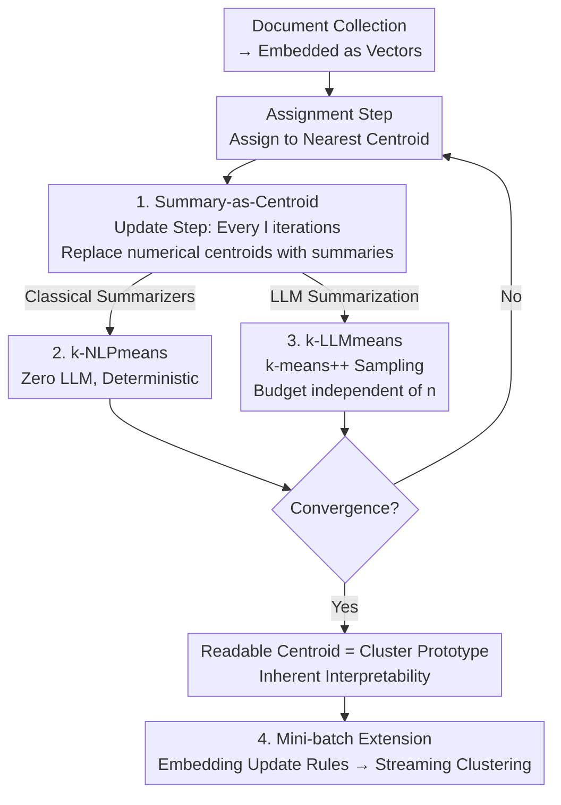

# Summaries as Centroids for Interpretable and Scalable Text Clustering

**Conference**: ICLR 2026  
**arXiv**: [2502.09667](https://arxiv.org/abs/2502.09667)  
**Code**: None  
**Area**: Information Retrieval  
**Keywords**: Text Clustering, k-means, Summary-as-Centroid, Interpretability, Streaming Clustering, LLM-optional

## TL;DR

Proposes k-NLPmeans and k-LLMmeans, which periodically replace numerical centroids with text summaries (summary-as-centroid) during k-means iterations. This achieves interpretable cluster prototypes while maintaining standard k-means objectives, ensuring that LLM call volume remains independent of the dataset size.

## Background & Motivation

- **Limitations of standard k-means on text**: Numerical averaging blurs text semantics, and centroids are not human-understandable.
- **Problem with existing LLM clustering methods**:
  1. **Poor scalability**: The number of LLM calls grows with the size of the dataset.
  2. **Opaque optimization**: Methods rely on heuristic prompting, greedy merging, and similarity thresholds without clear objective functions.
- There is a need for a clustering method that is both interpretable and scalable.

## Method

### Overall Architecture

This paper aims to simultaneously achieve two properties that are typically difficult to combine: the scalability of k-means and the interpretability of results for human understanding. The approach modifies only one part of the k-means process—while the assignment step still assigns each document to the nearest centroid and the update step still uses standard numerical means in most iterations, a cluster's numerical centroid is replaced every $l$ iterations with the result of "summarizing the text in that cluster and then re-embedding the summary into the vector space." Consequently, the centroid can continue to participate in Euclidean distance calculations while serving as a human-readable prototype description. The entire process consistently optimizes the standard k-means objective. Summaries can be generated by zero-cost classical NLP summarizers (k-NLPmeans) or by LLMs (k-LLMmeans), and this step can be embedded into mini-batch update rules for streaming clustering.

### Key Designs

**1. Summary-as-Centroid: Making centroids both vectors and readable text**

Numerical averaging on text flattens semantics, resulting in unintelligible centroids. The authors periodically replace the mean with a summary: ordinary iterations still use $\boldsymbol{\mu}_j = \frac{1}{|C_j|}\sum_{i \in [C_j]} \mathbf{x}_i$, but every $l$ iterations, $\boldsymbol{\mu}_j = \text{Embedding}(f_{\text{summarizer}}(C_j))$ is executed. This involves summarizing the text within cluster $C_j$ and then re-embedding the result. The summary itself serves as the cluster prototype, providing inherent interpretability. Since the result remains an embedding vector, the subsequent assignment step requires no modification. Experiments show that even performing a summary step only at $l=60$ is sufficient to pull k-means out of local optima and significantly improve accuracy.

**2. k-NLPmeans: Achieving zero LLM usage with classical NLP summarizers**

To avoid LLM costs and non-determinism, this version eliminates LLM calls by using classical extractive summarizers $f_{\text{NLP}}^{(q)}$ to select the top-$q$ sentences. Three options are provided: Centroid-based (calculating the centroid of sentence embeddings and picking the $q$ most similar sentences), TextRank (building a similarity graph of sentences and using PageRank scoring), and LSA-style SVD (performing singular value decomposition on sentence embeddings and selecting sentences by principal component contribution). All three are fast, deterministic, and runnable offline without external dependencies. Notably, this zero-LLM version approaches or matches the LLM version on most benchmarks, suggesting that most gains come from the "summary-as-centroid" structure rather than the generative power of LLMs.

**3. k-LLMmeans: Fixing the LLM budget to be independent of data scale**

When higher summary quality is desired, the LLM version is used, updating centroids as $\boldsymbol{\mu}_j = \text{Embedding}(f_{\text{LLM}}(p_j))$, where the prompt $p_j = \text{Prompt}(I, \{d_{z_i} \mid z_i \sim [C_j]\}_{i=1}^{m_j})$. Crucially, the LLM only reads a few representative samples obtained via k-means++ sampling from the cluster rather than all documents. k-means++ sampling produces better summaries than random sampling. Since each summary step performs exactly $k$ LLM calls, the total volume is $O(k \times \text{number of summary steps})$, which is entirely decoupled from the dataset size $n$. In contrast, methods like ClusterLLM and LLMEdgeRefine have $O(n)$ complexity, which scales poorly with data growth.

**4. Mini-batch Extension: Low-memory streaming clustering**

To handle data streams, the authors embed the summary step into the mini-batch k-means update rule. Batches $D_1, \ldots, D_b$ are received sequentially, and centroids are updated incrementally using k-NLPmeans or k-LLMmeans after each batch, preserving the low-memory characteristics of mini-batch k-means. This naturally extends "summary-as-centroid" from static clustering to online scenarios, which is why the paper introduces the StackExchange streaming clustering benchmark.

### Loss & Training

Regardless of whether a normal mean step or a summary step is used, the optimization objective remains the standard within-cluster sum of squares (WCSS):

$$\min_{C_1, \ldots, C_k} \sum_{j=1}^k \sum_{i \in [C_j]} \|\mathbf{x}_i - \boldsymbol{\mu}_j\|^2$$

Summarization only changes the way centroid values are calculated without changing the objective; thus, convergence properties are inherited from k-means. If a summary step fails or yields poor quality, the process gracefully degrades to standard mean updates, ensuring the results are no worse than original k-means.

## Key Experimental Results

### Main Results (text-embedding-3-small)

| Method | Bank77 ACC | CLINC ACC | GoEmo ACC | MASSIVE(D) ACC | MASSIVE(I) ACC |
|------|-----------|----------|----------|---------------|---------------|
| k-means | ~65 | ~77 | ~20 | ~59 | ~52 |
| k-NLPmeans LSA-mult | **67.1** | **80.2** | **22.3** | **63.3** | **55.3** |
| k-LLMmeans single | 67.1 | 78.1 | **24.0** | — | — |
| k-LLMmeans mult | Higher | Higher | Higher | Higher | Higher |

### LLM Efficiency Comparison

| Method | LLM Call Complexity | Data Dependency |
|------|-------------|---------|
| ClusterLLM | $O(n)$ | Scales with data |
| LLMEdgeRefine | $O(n)$ | Scales with data |
| k-NLPmeans | **$O(0)$** | **Zero LLM** |
| k-LLMmeans | **$O(k \times \text{summary steps})$** | **Independent of $n$** |

### Key Findings

1. Even a **single summary step** ($l=60$) significantly improves k-means performance.
2. k-NLPmeans (Zero LLM) approaches or matches k-LLMmeans on most benchmarks.
3. k-means++ sampling of input documents produces better LLM summaries than random sampling.
4. Consistent improvements are observed across 4 embedding models, 5 LLMs, and 3 classical NLP methods.
5. In streaming clustering scenarios, it outperforms standard mini-batch k-means.

## Highlights & Insights

- **Minimalist modification, significant impact**: Only the centroid update step of k-means is modified, with everything else remaining the same.
- **LLM-optional design**: k-NLPmeans achieves most of the benefits without any reliance on LLMs.
- **Inherent interpretability**: Each centroid is a human-readable text summary.
- **Graceful degradation**: Automatically degrades to standard k-means if summary quality is poor, ensuring performance is at least as good as the original.
- **Fixed LLM budget**: LLM calls are limited to $k \times$ summary steps, making it feasible for large-scale data.
- **Introduction of StackExchange streaming clustering benchmark**.

## Limitations

- Summary quality is constrained by the capabilities of the summarizer itself.
- For clusters with high semantic overlap, summaries may fail to distinguish them effectively.
- Requires pre-specifying the number of clusters $k$ (inheriting a k-means limitation).
- The frequency of summary steps $l$ needs tuning, though experiments show low sensitivity.

## Related Work

- LLM Clustering: ClusterLLM, IDAS, LLMEdgeRefine, etc.
- Classical Text Clustering: k-medoids, spectral clustering, BERTopic.
- Streaming Clustering: mini-batch k-means, LLM-based online methods.

## Rating

- **Novelty**: ⭐⭐⭐⭐ — The concept of summary-as-centroid is concise and novel.
- **Technical Depth**: ⭐⭐⭐ — The logic is clear, though theoretical analysis is limited.
- **Experimental Thoroughness**: ⭐⭐⭐⭐⭐ — Extremely comprehensive across 4 datasets, 4 embeddings, 5 LLMs, and 3 NLP methods.
- **Value**: ⭐⭐⭐⭐⭐ — Plug-and-play, interpretable, and scalable with high practical utility.

<!-- RELATED:START -->

## Related Papers

- [\[ICLR 2026\] Hierarchical Concept-based Interpretable Models](hierarchical_concept-based_interpretable_models.md)
- [\[ICLR 2026\] Hybrid Deep Searcher: Scalable Parallel and Sequential Search Reasoning](hybrid_deep_searcher_scalable_parallel_and_sequential_search_reasoning.md)
- [\[ICLR 2026\] ZeroGR: A Generalizable and Scalable Framework for Zero-Shot Generative Retrieval](zerogr_a_generalizable_and_scalable_framework_for_zero-shot_generative_retrieval.md)
- [\[ACL 2025\] LDIR: Low-Dimensional Dense and Interpretable Text Embeddings with Relative Representations](../../ACL2025/information_retrieval/ldir_low-dimensional_dense_and_interpretable_text_embeddings_with_relative_repre.md)
- [\[ICLR 2026\] AssoMem: Scalable Memory QA with Multi-Signal Associative Retrieval](assomem_scalable_memory_qa_with_multi-signal_associative_retrieval.md)

<!-- RELATED:END -->
