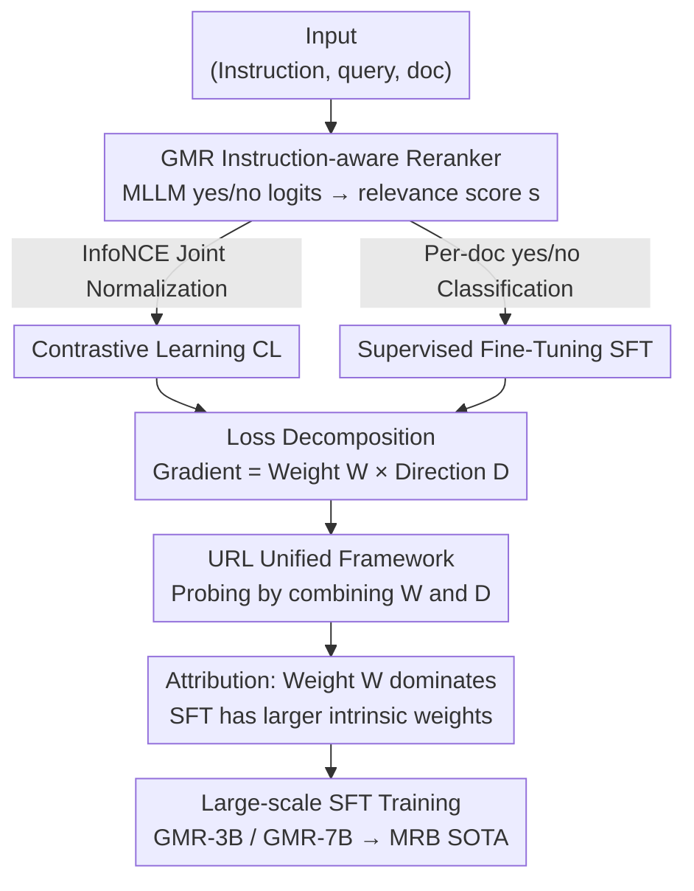

# Supervised Fine-Tuning or Contrastive Learning? Towards Better Multimodal LLM Reranking

**Conference**: ICLR 2026  
**OpenReview**: [https://openreview.net/forum?id=1Mh2q7L0eY](https://openreview.net/forum?id=1Mh2q7L0eY)  
**Code**: https://hf.co/vec-ai/lychee-rerank-mm (Model open-sourced)  
**Area**: Information Retrieval / Multimodal Reranking  
**Keywords**: Reranking, Contrastive Learning, Supervised Fine-Tuning, Multimodal Retrieval, Loss Decomposition

## TL;DR
This paper systematically compares two mainstream routes for training LLM rerankers: Contrastive Learning (CL) and Supervised Fine-Tuning (SFT). By decomposing the gradients into "weight × direction" components, it proves that SFT's superiority stems primarily from the **weight** term (providing larger update steps for hard samples). Based on this, GMR-3B / GMR-7B are trained using pure SFT, achieving SOTA on the self-constructed 40-dataset MRB benchmark for general multimodal reranking.

## Background & Motivation
**Background**: Reranking is a critical stage in the retrieval pipeline for rescored candidates. The current mainstream is the pointwise setting—independently scoring relevance for each query-candidate pair. Historically, there have been two paths to train such rerankers: **Contrastive Learning** (CL, using InfoNCE loss on relevant/irrelevant pairs) and **Supervised Fine-Tuning** (SFT, treating it as binary classification where the model predicts "yes"/"no" tokens and uses the "yes" probability as the score).

**Limitations of Prior Work**: In BERT-style encoders, research suggests CL is more effective than discriminative classification. However, with generative LLMs, SFT appears more effective as predicting the next token aligns with the LLM's generative nature. These conflicting conclusions lack consensus in the community, and no clear explanation exists as to **why** these differences occur.

**Key Challenge**: CL and SFT loss functions appear distinct (one uses joint normalization across negatives, the other uses independent cross-entropy). How their updates to model parameters differ has never been decomposed and compared. Relying solely on end-to-end performance leaves it unclear whether the difference lies in the "magnitude" or the "direction" of the optimization signal.

**Goal**: To decompose the "which is better" question into two controllable sub-problems: the contributions of **weight (update magnitude)** and **direction (update orientation)**. This study uses **Universal Multimodal Retrieval (UMR)** as a testbed to address the long-standing gap in multimodal reranking.

**Key Insight**: The authors observe that the gradients of CL and SFT losses with respect to hidden states can both be written as `Weight scalar × Direction vector`. Since the forms are isomorphic, a unified framework can be built to combine weights from one method with directions from the other for controlled probing, precisely attributing the performance gap.

**Core Idea**: By decomposing the reranking loss into weight and direction components, it is discovered that **SFT's advantage originates almost entirely from the larger weight term** (there is no clear winner in terms of direction). In short, SFT wins by providing larger update steps for hard samples rather than better update directions.

## Method

### Overall Architecture
The paper aims to answer whether CL or SFT is better for LLM reranking and why. The mechanism involves: building a standard multimodal pointwise reranker (GMR) and training the same backbone with both CL and SFT; decomposing the gradients into **weight W and direction D components**; implementing a Unified Reranking Loss (URL) framework to allow free combinations of W and D for probing; and finally, using large-scale pure SFT training to produce SOTA rerankers.

### Key Designs

**1. GMR: Instruction-aware Pointwise Multimodal Reranker and yes/no Scoring**

To compare CL and SFT fairly, GMR uses a strong Multimodal LLM (Qwen2.5-VL-Instruct) as the backbone. Inputs are organized as `(instruction ins., query q, document d)` triplets. Instructions provide task descriptions (e.g., "Find a screenshot related to the user's question" in visual document retrieval) to guide the model, an approach proven effective in MLLM retrieval.

The scoring method varies by objective. Under SFT, the normalized probability of "yes" and "no" logits is used: $s(\text{ins.}, q, d) = \frac{\exp(z_y)}{\exp(z_y)+\exp(z_n)}$, where $z_y, z_n$ are the logits for "yes" and "no" tokens. Under CL, the "yes" logit $s = z_y$ is used directly. This ensures both paradigms share the same backbone and input template for fair attribution.

**2. Decomposition into "Weight × Direction" and the URL Framework**

This is the Core Idea of the paper. The authors calculated the partial derivatives of the loss with respect to the hidden states for each instance (one positive $d_0^+$, $N$ negatives $d_i^-$). They found CL and SFT gradients share an isomorphic `Weight × Direction` form. The positive instance weight for CL is $W^+_{CL}=\frac{\sum_i \exp(z_y(h_i^-))}{\exp(z_y(h_0^+))+\sum_i \exp(z_y(h_i^-))}$, which aggregates **all negatives** in the denominator. In contrast, the SFT weight is $W^+_{SFT}=\frac{\exp(z_n(h_0^+))}{\exp(z_y(h_0^+))+\exp(z_n(h_0^+))}$, related only to the **current document**. For direction, the positive direction for CL is $D^+_{CL}=M_y$, while for SFT it is $D^+_{SFT}=M_y-M_n$ ($M_y, M_n$ are the embedding projections of the tokens).

The URL framework expresses loss as $L = \text{mean}(W^+D^+ + \sum_i W_i^- D_i^-)$, with toggle switches for the weight and direction sources. Probing experiments (e.g., $W_{SFT}+D_{CL}$) allow for **clean attribution** of performance differences.

**3. Weight Dominance and Instance-Adaptive Update Scheduling**

Probing shows that **changing weights results in a performance shift ($\Delta W \approx 1.1–1.5$) far greater than changing directions ($\Delta D \approx 0.2–0.6$)**. SFT's superiority lies in its weight. $W_{CL}$ is naturally suppressed by the sum of all negatives in the denominator, whereas $W_{SFT}$ is larger due to per-document normalization. In reranking, which often uses small batches due to long input tokens and limited negatives, the small weight issue of CL is particularly severe.

The authors also proved that weights function as an **instance-adaptive guide**: updating less for easy samples and more for hard samples. Setting weights to a constant 1 ($W_{base}$) caused performance to drop to 49.47, but adding a mask (weight = 0 if score $s > 1-\tau$) recovered it to 56.57. SFT weights inherently achieve this scheduling.

**4. Direction: Native SFT Direction is Near-Optimal**

Probing was conducted on direction. First, adding more classification tokens beyond "yes/no" (e.g., "true/false") did not change performance, suggesting two tokens are sufficient. Second, replacing the fixed token embeddings with a randomly initialized learnable projection $D_{Rand}$ helped CL (+1.32) but hurt SFT (-1.34). SFT effectively leverages the semantic signals in pre-trained token embeddings; thus, its native direction is near-optimal.

### Loss & Training
The final GMR models use pure SFT (cross-entropy on "yes"/"no" for each triplet: $L^{SFT}_i = -\log p(l \mid z(\{\text{yes,no}\} \mid \text{ins.}, q, d_i))$). The backbone is Qwen2.5-VL-Instruct 3B / 7B with LoRA (rank 16, LR 1e-4). Max input length is 3200 tokens. Training involved 1.5M samples with 16 negatives per sample (using a mix of random and hard negative mining).

## Key Experimental Results

### Main Results
The MRB benchmark includes 40 test sets across 9 task types. GME-2B served as the retriever to provide top-100 candidates.

| Model | Size | Single-modal T→T(14) | Cross-modal T→VD(5) | Mixed IT→IT(3) | ALL(40) |
|------|------|------|------|------|------|
| GME-2B (Retriever) | 2.21B | 49.59 | 66.39 | 66.89 | 52.54 |
| Jina-rerank-m0 | 2.21B | 55.36 | 73.13 | 51.54 | 54.36 |
| MonoQwen2-VL | 2.21B | 48.89 | 71.29 | 35.83 | 44.20 |
| **GMR-3B (Ours)** | 3.75B | 59.22 | 72.38 | 79.08 | **61.40** |
| **GMR-7B (Ours)** | 8.29B | 61.08 | 72.94 | 82.19 | **63.85** |

GMR-3B outperforms Jina-m0 significantly. On T→T tasks, GMR-7B exceeds Qwen3-Reranker, despite the latter being specialized for text. On the multi-image MRMR Knowledge subset, GMR-7B leads with 74.22 NDCG@10.

### Ablation Study
Loss component combinations (MRB average score) and weight function probes:

| Configuration | Metric | Description |
|------|---------|------|
| $W_{SFT}+D_{SFT}$ | 58.09 | Full SFT (Best) |
| $W_{SFT}+D_{CL}$ | 57.88 | CL Direction, -0.21 |
| $W_{CL}+D_{SFT}$ | 56.99 | CL Weight, -1.10 |
| $W_{CL}+D_{CL}$ | 56.40 | Full CL |
| $W_{base}$ (Weight = 1) | 49.47 | Constant weight failure |
| $W_{base}$ + τ mask | 56.57 | "Stop update if learned" rule ▲7.10 |
| $W_{base}$ + $W_{SFT}$ | 58.19 | SFT Weight ▲8.72 |

### Key Findings
- **Weight is the main factor**: The performance drop from changing weights (1.10–1.48) is multiple times larger than from changing directions (0.21–0.59).
- **Adaptive weighting is essential**: Constant weights fail (49.47), while a simple "easy-example masking" rule approaches CL performance, confirming weights function as difficulty-aware update schedulers.
- **SFT direction is near-optimal**: Learnable projections or additional tokens do not improve SFT, showing it already fully utilizes the semantics of "yes/no" embeddings.
- **Scaling and depth robust**: SFT scales well with more negatives (up to 16) and remains robust even as reranking depth increases to top-100, unlike Jina-m0 which begins to decline.

## Highlights & Insights
- **Attribution Methodology**: Decomposing losses into weight × direction via the URL framework provides a beautiful paradigm for transforming vague end-to-end comparisons into attributable experiments.
- **Reranking Batch Constraints**: By linking CL's weakness in reranking to "small batch size + long inputs → gradient vanishing," the authors provide a concrete explanation for reranking model selection.
- **Weight as Adaptive Learning Rate**: Interpreting weight as an instance-level scheduler (fewer updates for learned samples) connects this to concepts like focal loss and hard example mining.

## Limitations & Future Work
- The study focuses on **pointwise** reranking; the validity of the weight-direction conclusions for listwise or pairwise settings remains unverified.
- Conclusions are drawn from "small batch, limited negative" scenarios. If negatives could be scaled as in dense retrieval, CL's weight issue might be mitigated.
- The analysis is based on multimodal retrieval; generalizability across tasks like pure-text large-batch reranking or recommendation systems requires more empirical evidence.

## Related Work & Insights
- **vs CL-based rerankers (Nogueira 2019 / Zhang 2024)**: These use BERT-era InfoNCE. Ours proves CL weights are overly suppressed by joint normalization in LLM reranking.
- **vs SFT-based rerankers (Nogueira 2020 / Qwen3-Reranker)**: These use binary classification empirically. Ours provides the Mechanism: SFT's per-document weights are naturally larger and instance-adaptive.
- **vs Universal Multimodal Retrieval (Zhang 2025b)**: While prior work focuses on the retriever, the MRB benchmark and GMR models fill the gap in multimodal reranking evaluation.

## Rating
- Novelty: ⭐⭐⭐⭐⭐ Answers the long-standing "SFT vs CL" question through controlled component attribution.
- Experimental Thoroughness: ⭐⭐⭐⭐⭐ 40-dataset MRB + MRMR + extensive ablations on W/D, negatives, and depth.
- Writing Quality: ⭐⭐⭐⭐ Clear logic, though dense formulas require careful reading.
- Value: ⭐⭐⭐⭐⭐ Provides both a reusable attribution methodology and SOTA open-source models/benchmarks.

<!-- RELATED:START -->

## Related Papers

- [\[ICML 2025\] FedRAG: A Framework for Fine-Tuning Retrieval-Augmented Generation Systems](../../ICML2025/information_retrieval/fedrag_a_framework_for_fine-tuning_retrieval-augmented_generation_systems.md)
- [\[ACL 2026\] GIFT: Guided Fine-Tuning and Transfer for Enhancing Instruction-Tuned Language Models](../../ACL2026/information_retrieval/gift_guided_fine-tuning_and_transfer_for_enhancing_instruction-tuned_language_mo.md)
- [\[ICLR 2026\] MetaEmbed: Scaling Multimodal Retrieval at Test-Time with Flexible Late Interaction](metaembed_scaling_multimodal_retrieval_at_test-time_with_flexible_late_interacti.md)
- [\[ICLR 2026\] Let LLMs Speak Embedding Languages: Generative Text Embeddings via Iterative Contrastive Refinement](let_llms_speak_embedding_languages_generative_text_embeddings_via_iterative_cont.md)
- [\[ICLR 2026\] MRMR: A Realistic and Expert-Level Multidisciplinary Benchmark for Reasoning-Intensive Multimodal Retrieval](mrmr_a_realistic_and_expert-level_multidisciplinary_benchmark_for_reasoning-inte.md)

<!-- RELATED:END -->
