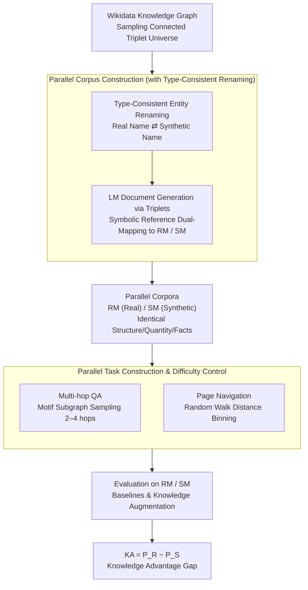

# SynthWorlds: Controlled Parallel Worlds for Disentangling Reasoning and Knowledge in Language Models

**Conference**: ICLR 2026  
**arXiv**: [2510.24427](https://arxiv.org/abs/2510.24427)  
**Code**: [GitHub](https://github.com/behavioral-data/synthworlds)  
**Area**: Robotics  
**Keywords**: Knowledge Advantage Gap, Reasoning vs Memorization, Parallel Corpora, Multi-hop QA, RAG Evaluation

## TL;DR

The authors construct parallel corpora with identical structures where entities are mapped to real and synthetic names respectively. By comparing task performance across these "parallel worlds," they quantify the LLM's Knowledge Advantage Gap ($\text{KA}$) and find that this gap persists even with RAG and CoT enhancements.

## Background & Motivation

**Background**: Language models have shown increasingly excellent performance on complex tasks such as multi-hop question answering and web navigation. However, since training data is often undisclosed, it is difficult to determine whether performance gains stem from reasoning capabilities or memorization of factual knowledge from the training set. Existing benchmarks are gradually failing as training data expands—for instance, on MuSiQue (released in 2021), designed for questions models could not answer without documents, Llama-3.3-70B can now reach over 26% F1 in zero-resource settings.

**Limitations of Prior Work**:
1. **Human-Curated Evaluation Sets**: High cost, difficult to scale, require continuous updates, and will eventually be covered by model training data.
2. **Synthetic Data Methods**: Either directly use existing content (e.g., novels) leading to parametric knowledge leakage, or use overly simple templates (e.g., "The job of David is a farmer") that fail to test complex relational reasoning.
3. **Limitations of Synthetic-Only Tasks**: Success only proves reasoning ability; failure remains ambiguous—it could be the reasoning chain is too difficult, or the model lacks the background knowledge it usually relies on.

**Key Challenge**: Existing evaluation methods cannot simultaneously control task reasoning difficulty and the contribution of parametric knowledge. Experimental decoupling of reasoning and memorization is necessary to answer the fundamental question: "Is the model reasoning or recalling?"

**Goal**: Propose the SynthWorlds framework to automatically generate two structurally identical parallel corpora from a knowledge graph:
- **Real-Mapped (RM)**: Entities use real names (e.g., Geoffrey Hinton, University of Toronto), where parametric knowledge may be helpful.
- **Synth-Mapped (SM)**: Entities use synthetic names (e.g., Caleb Ardent, University of Metrovale), where parametric knowledge is entirely useless.

Parallel tasks of identical difficulty are constructed on both corpora, allowing the contribution of parametric knowledge to be precisely quantified via the performance gap $\text{KA} = P_R - P_S$.

## Method

### Overall Architecture

SynthWorlds addresses the question: Is the increasing strength of models in multi-hop QA and web navigation due to genuine reasoning or memorization of facts seen during training? The approach thoroughly separates "reasoning difficulty" from "parametric knowledge." It samples a set of connected triplet facts from the Wikidata knowledge graph as a "universe," then instantiates this same set of structural facts into two parallel worlds—Real-Mapped (RM) with real names and Synth-Mapped (SM) with synthetic names. The document counts, token counts, fact counts, hyperlink structures, and reasoning chain lengths of the two corpora match exactly; the **only variable** is whether the entity names were encountered during pre-training. In the RM world, parametric knowledge can assist; in the SM world, it is useless. The performance drop between RM and SM on the same task can thus be cleanly attributed to "memorization." Two parallel tasks (multi-hop QA and page navigation) with difficulty binned accordingly are constructed on these aligned corpora. Finally, the performance difference $\text{KA} = P_R - P_S$ quantifies the contribution of memorization. Each corpus contains 6,290 documents, approximately 1.5 million tokens, and 161K facts, covering 956 entity types and 354 relationships.

### Key Designs

**1. Parallel Corpus Construction: Creating "Parallel Worlds" via Type-Consistent Renaming**

The difficulty in decoupling reasoning and memory lies in data generation: using existing content leaks knowledge, while using simple templates fails to test complex reasoning. SynthWorlds generation follows three steps: sampling a **connected and self-consistent** universe of triplets from Wikidata; performing **systematic renaming** of entities; and finally directing an LM to generate documents following the triplet structure. Documents initially use symbolic reference placeholders, which are then mapped to both Real-Mapped (RM) and Synth-Mapped (SM) versions, ensuring identical sentence structures.

The core innovation is maintaining **ontological type compatibility** during renaming: persons are replaced by persons (Geoffrey Hinton → Caleb Ardent), cities by cities (Toronto → Metrovale), and derived names are synchronized (University of Toronto → University of Metrovale, rather than a mismatch like Grandvale Bank). Replacing with random strings would introduce systematic differences in name length or word frequency, contaminating the attribution to parametric knowledge. Type-consistent renaming removes "entity-specific factual knowledge" while keeping "common knowledge" (e.g., doctors are in hospitals) and general domain knowledge available—ensuring the performance drop truly stems from memorization.

**2. Parallel Task Construction & Difficulty Control: Aligning Task Difficulty Across Worlds**

Decoupling requires tasks of "equal difficulty" on RM and SM. The paper uses the same sampled subgraph $S$ to instantiate tasks across both corpora. Multi-hop QA samples subgraphs matching specific reasoning motifs from the fact graph $G_{facts}$, generates single-hop questions using an LM, and combines them into multi-hop questions before re-mapping entities into RM/SM versions. Difficulty is determined by the number of hops and motif complexity, with 6 motifs covering 2–4 hops, forcing cross-document reasoning. Page navigation treats symbolic references as hyperlinks to build a document graph $G_{doc}$. Agents must reach a target page from a source page by clicking links or backtracking. The **expected random walk distance** serves as a difficulty proxy, with tasks divided into 5 bins ranging from 50 to 10M. Since the structure is identical, any success rate difference is attributed to knowledge rather than task difficulty.

**3. Knowledge Advantage Gap Metric System: Quantifying Memorization as a Difference**

With aligned parallel tasks, the contribution of memorization is defined as the performance difference $\text{KA} = P_R - P_S$. The paper distinguishes between two conditions: Baseline KA ($\text{KA}^{base} = P_R^{base} - P_S^{base}$) characterizes the pure contribution of parametric knowledge; Augmented KA ($\text{KA}^{ext} = P_R^{ext} - P_S^{ext}$) characterizes the residual gap after adding RAG or CoT. The gap reduction ($\text{KA}^{base} - \text{KA}^{ext}$) measures how much the external enhancement compensates for the memory advantage. Because $P_S^{base}$ is near random (parametric knowledge is useless in the synthetic world), $\text{KA}^{base}$ is effectively equivalent to the "degree of model dependence on memory."

## Key Experimental Results

### Main Results

Evaluated 6 models: GPT-5-mini, Gemini-2.0-Flash, gpt-oss-20B, gpt-oss-120B, Kimi-K2-Instruct, Kimi-K2-Thinking.

**Multi-hop QA (F1 Score)**:

| Setting | GPT-5-mini RM | GPT-5-mini SM | KA |
|------|:---:|:---:|:---:|
| Closed-book | ~20 | ~0 | **~20** |
| One-step RAG | Improved | Slight Improvement | Widened (-4.0) |
| IRCoT + RAG | Further Improved | Significant Improvement | **Narrowed (+5.2)** |
| Reading Comprehension | High | Equal or Higher | ~0 |

Key Findings:
- In closed-book settings, SM accuracy is near zero, validating the synthetic world.
- **One-step RAG widens the KA gap**—the gain for RM is greater than for SM, suggesting the retriever itself relies on parametric knowledge.
- IRCoT + RAG narrows the gap through alternating retrieval and reasoning; GPT-5-mini reduced the gap by 5.2, Gemini-2.0-Flash by 10.3.

**Page Navigation (Success Rate)**:

| Setting | GPT-5-mini RM | GPT-5-mini SM | KA |
|------|:---:|:---:|:---:|
| Links Only | High | Low | **~30** |
| Content + Links | High | Moderate Improvement | ~20.7 (Narrowed 9.3) |

- Providing page content significantly improves SM performance, but the gap remains.
- Analysis of external knowledge: In the Links Only condition, 48% (GPT-5-mini) and 60% (Gemini-2.0-Flash) of reasoning steps mentioned entities not appearing on the current page.

### Ablation Study

**Impact of Reasoning Difficulty on KA**:

| Task Difficulty | QA 2-hop KA | QA 4-hop KA | Nav Easy KA | Nav Hard KA |
|----------|:---:|:---:|:---:|:---:|
| Closed-book / Links Only | Larger | Smaller (RM also drops) | Smaller | Larger |
| With augmentation | Narrowed | Partially Narrowed | Significantly Narrowed | Partially Narrowed |

- In simple QA tasks, the RM advantage is larger (easier to recall directly); in difficult tasks, RM performance also drops.
- In Reading Comprehension settings, SM performance matches or exceeds RM, suggesting parametric knowledge may **interfere** with context-based reasoning.
- In navigation, harder paths show larger KA—the model relies on parametric knowledge to find "shortcuts."

## Highlights & Insights

1. **Exquisite Experimental Design**: The construction of parallel worlds achieves a true decoupling of reasoning and memory, a feat not fully realized in previous work.
2. **Deep and Counter-intuitive Discoveries**: The finding that One-step RAG widens the KA gap reveals the internal dependence of LM-based retrievers on parametric knowledge.
3. **Automated and Scalable Framework**: New corpora can be generated arbitrarily to prevent the evaluation set from being absorbed into training data.
4. **Comprehensive Evaluation**: Covers 6 models across multiple settings and tasks.
5. **Practical Quantification**: The Knowledge Advantage Gap framework is clear and directly applicable to other evaluation scenarios.

## Limitations & Future Work

1. Currently validated only on the Wikidata-based corpus; generalizability to other knowledge graphs or domains (e.g., code, mathematics) needs verification.
2. While type-consistent, synthetic names might introduce subtle distributional shifts (e.g., different statistical properties of names) affecting some results.
3. The paper is categorized under robotics in some contexts, but the core content is LLM evaluation.

## Rating

⭐⭐⭐⭐⭐ — The experimental design is exceptionally sophisticated, achieving the first true controlled decoupling of LLM reasoning and memory. Findings such as the KA framework and the widening gap with One-step RAG have profound implications for the evaluation of RAG and agent systems.

<!-- RELATED:START -->

## Related Papers

- [\[ICLR 2026\] Hybrid Deep Searcher: Scalable Parallel and Sequential Search Reasoning](hybrid_deep_searcher_scalable_parallel_and_sequential_search_reasoning.md)
- [\[ICLR 2026\] G-reasoner: Foundation Models for Unified Reasoning over Graph-structured Knowledge](g-reasoner_foundation_models_for_unified_reasoning_over_graph-structured_knowled.md)
- [\[ACL 2026\] RiTeK: A Dataset for Large Language Models Complex Reasoning over Textual Knowledge Graphs in Medicine](../../ACL2026/information_retrieval/ritek_a_dataset_for_large_language_models_complex_reasoning_over_textual_knowled.md)
- [\[ICLR 2026\] RefTool: Reference-Guided Tool Creation for Knowledge-Intensive Reasoning](reftool_reference-guided_tool_creation_for_knowledge-intensive_reasoning.md)
- [\[ICLR 2026\] MLP Memory: A Retriever-Pretrained Memory for Large Language Models](mlp_memory_a_retriever-pretrained_memory_for_large_language_models.md)

<!-- RELATED:END -->
## Related Papers

- [\[ICLR 2026\] Hybrid Deep Searcher: Scalable Parallel and Sequential Search Reasoning](hybrid_deep_searcher_scalable_parallel_and_sequential_search_reasoning.md)
- [\[ICLR 2026\] G-reasoner: Foundation Models for Unified Reasoning over Graph-structured Knowledge](g-reasoner_foundation_models_for_unified_reasoning_over_graph-structured_knowled.md)
- [\[ACL 2026\] RiTeK: A Dataset for Large Language Models Complex Reasoning over Textual Knowledge Graphs in Medicine](../../ACL2026/information_retrieval/ritek_a_dataset_for_large_language_models_complex_reasoning_over_textual_knowled.md)
- [\[ICLR 2026\] RefTool: Reference-Guided Tool Creation for Knowledge-Intensive Reasoning](reftool_reference-guided_tool_creation_for_knowledge-intensive_reasoning.md)
- [\[ICLR 2026\] MLP Memory: A Retriever-Pretrained Memory for Large Language Models](mlp_memory_a_retriever-pretrained_memory_for_large_language_models.md)

<!-- RELATED:END -->
