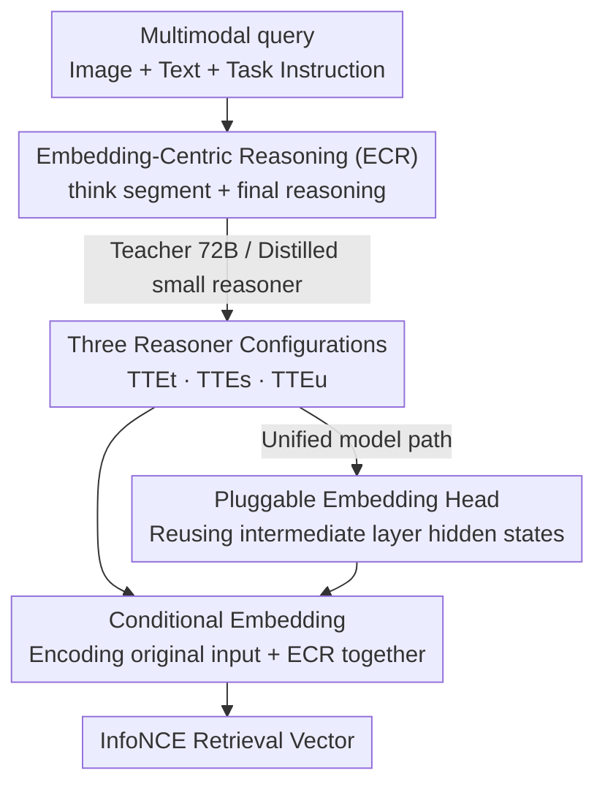

# Think Then Embed: Generative Context Improves Multimodal Embedding

**Conference**: ICLR 2026  
**OpenReview**: [https://openreview.net/forum?id=AKXXMK5YTI](https://openreview.net/forum?id=AKXXMK5YTI)  
**Code**: None  
**Area**: Multimodal VLM / Multimodal Retrieval / Representation Learning  
**Keywords**: Universal Multimodal Embedding, Think-Then-Embed, Chain-of-Thought, Retrieval, MMEB

## TL;DR
To address the failure of using Multimodal Large Language Models (MLLMs) directly as encoders under complex instructions, this work proposes the Think-Then-Embed (TTE) framework. It first employs a reasoner to generate an "Embedding-Centric Reasoning" (ECR) trajectory, and then utilizes an embedder to produce vectors conditioned on both the original input and this reasoning trajectory. TTE achieves SOTA on MMEB-V2 (TTE$_t$-7B 71.5%), leading other open-source models by an absolute margin of approximately 7%.

## Background & Motivation
**Background**: Universal Multimodal Embedding (UME) is a current hotspot in retrieval—where the same image or text is encoded into different vectors based on accompanying task instructions. The mainstream approach is to treat MLLMs directly as encoders: the query and target are each passed through the MLLM, the hidden state of the last token is used as the embedding, and the positive sample pair is pulled together using the InfoNCE contrastive loss. Along this path, the community has primarily focused on "training-side tricks"—hard negative mining, additional training stages, external data, and better pooling methods.

**Limitations of Prior Work**: These works treat MLLMs as pure encoders, **completely wasting the generative and reasoning capabilities they learned during pre-training**. Many tasks in MMEB-V2 (VQA, classification, visual grounding, composed retrieval) inherently require multi-step reasoning. For instance, in a RefCOCO query like "the vehicle second closest to the camera," it is difficult to directly encode this phrase to match an image region; the model must first reason that "it refers to that old-fashioned double-decker bus with a bright yellow upper half and deep blue lower half" to achieve precise localization. The more complex the instructions and the more compositional reasoning required, the more inadequate the pure encoding paradigm becomes.

**Key Challenge**: Embedding quality is limited by the model's "depth of understanding" of instructions, and a single forward encoding pass does not leave space for the model to "think." It is forced to compress complex instructions into a vector all at once, unable to clarify semantics step-by-step through intermediate steps as in generative tasks.

**Goal**: (1) Explicitly insert a reasoning stage before embedding; (2) Implement this reasoning without relying on giant external reasoners; (3) Integrate the reasoner and embedder into a single model to save parameters and computation.

**Key Insight**: The authors draw inspiration from the success of Chain-of-Thought (CoT). Since the embedding produced by an MLLM is inherently generated under the condition of the "entire preceding token sequence," prepending a high-quality reasoning text to the query can theoretically "condition" the embedding onto a semantic space more conducive to retrieval.

**Core Idea**: Replace "direct encoding" with "Think-Then-Embed"—first generate an embedding-centric reasoning trajectory, and then let the embedding be conditioned on both the original input and this trajectory.

## Method

### Overall Architecture
TTE decomposes traditional "single-step encoding" into two steps: a **reasoner** $g_\omega$ first reads the multimodal query $\langle V, T, [\text{Ins}]\rangle$ and generates an Embedding-Centric Reasoning (ECR) trajectory $\psi$; subsequently, an **embedder** $f_\theta$ encodes the original input concatenated with this trajectory, taking the hidden state of the last token as the final embedding:

$$h = \text{Pooling}\big(f_\theta(V, [\text{Ins}], T, \psi)\big), \qquad \psi = g_\omega(V, [\text{Ins}], T).$$

The training of the embedder still uses the standard unidirectional $q \to t$ InfoNCE contrastive loss, the only difference being that the hidden states of the query/target are now additionally conditioned on the ECR. Regarding the source of the reasoner, this work provides three instantiations: generation by a giant teacher model (TTE$_t$), distilling a same-scale backbone into a smaller reasoner (TTE$_s$), and merging the reasoner and embedder into a single model that outputs the result in one forward pass via an embedding head (TTE$_u$).

### Key Designs

**1. Embedding-Centric Reasoning (ECR): Making "Thinking" Serve "Embedding"**

This is the soul of TTE. Ordinary CoT serves to "answer questions correctly," whereas ECR is intermediate reasoning specifically designed to "produce good embeddings." Formally, for a pair $(q,t)$, the ideal ECR is the text that maximizes the contrastive objective: $\psi^\star_i \in \arg\max_\psi \log \frac{\phi(h^i_q, h^i_t)}{\sum_j \phi(h^i_q, h^j_t)}$. Since optimizing the reasoner directly against this objective (e.g., via RL) is difficult, this work simplifies the process: using manually designed task prompts and formats, the reasoner generates according to the template `<think> … </think> Final Reasoning`—first outputting an intermediate CoT, then a final reasoning. The content varies by task type: for QA-like queries, the CoT is standard step-by-step reasoning; for simple embedding tasks like visual documents, the CoT is a detailed description of visual inputs and the final reasoning is its summary; for grounding, it is a detailed description of the referred object and its surrounding visual context. By conditioning the embedder on this "task-aligned" reasoning, it can construct vectors that are more semantically aligned and better understand task intent. Notably, experiments show that ECR text itself cannot be directly used for text-based retrieval (the T2T baseline is significantly worse); its value lies in providing signals to the embedder rather than replacing it.

**2. Three Reasoner Configurations: A Spectrum Between Performance and Computation**

Where the ECR is generated from determines the cost and ceiling of the system. This work offers three levels. **TTE$_t$ (Teacher Reasoner)** uses a powerful large model (QWEN2.5-VL-72B) as the reasoner while keeping the embedder lightweight (Qwen2VL-2B/7B). While seemingly expensive, the authors point out that in many real retrieval tasks, ECR only needs to be generated once offline for the index side (e.g., writing detailed descriptions for visual documents). Only new data points require running the reasoner; online retrieval of old data does not trigger it—this is effectively a "Test-Time Scaling for retrieval," where a stronger external reasoner can be swapped in at any time. **TTE$_s$ (Distilled Small Reasoner)**, to eliminate dependence on 72B, uses teacher-generated ECRs as training data to fine-tune a backbone of the same scale as the embedder (2B/7B) into a dedicated reasoner. The objective is the standard NLL likelihood $L_{\text{SFT}}(\omega) = -\frac{1}{T}\sum_t \log p_\omega(\psi_t \mid V, [\text{Ins}], T, \psi_{t'<t})$. The distilled small reasoner is highly competitive across MMEB-V2, becoming the strongest tier among open-source models. The authors also found that even using the backbone's own zero-shot generated ECR leads to performance gains, but it is bottlenecked by the quality of zero-shot ECR, necessitating SFT distillation.

**3. Unified Model with Pluggable Embedding Head: Reusing Hidden States for Single-Pass Vector Output**

Both TTE$_t$ and TTE$_s$ require running the model twice, which is costly. **TTE$_u$** integrates the reasoner and embedder into the same backbone: after the reasoner generates the ECR, all its generated hidden states are fed into a pre-trained embedding head to produce a vector in a single forward pass. The authors first attempted "joint SFT + contrastive" multi-task training but found it consistently degraded performance due to difficult training curriculum (details in Appendix). Thus, they adopted a **two-stage strategy**—the first stage fine-tunes the entire backbone as a reasoner on ECR data, and the second stage freezes the backbone and trains only the embedding head on top; this prevents the contrastive and generative objectives from interfering with each other's gradients. Regarding the embedding head itself, this work provides the first systematic comparison: simple attention poolers, NV-Embed style latent poolers, QFormer-style heads, and MHSA heads "self-initialized" with the last $n$ layers of the backbone. The conclusion is that a simple depth=1 pooler is insufficient (increasing query count does not help), while moving the focus from the last layer to **earlier intermediate layers** (e.g., the 8th layer from the end) and stacking multiple MHSA layers works best. When using the last 8 layers for self-initialization, TTE$_u$ can match the performance of a separately fine-tuned embedder (TTE$_s$). The insight is that the last layer of an MLLM is specialized for token-level discrimination (predicting the next word) and may not be optimal for retrieval representation, whereas intermediate layers retain richer semantic structures.

### Loss & Training
The embedder uses a unidirectional InfoNCE contrastive loss with temperature $\tau=0.02$. The backbone uses LoRA (rank 16 / alpha 64), with a global batch size of 8192, utilizing GradCache to expand the per-GPU batch size. MMEB-V1 is trained for 1 epoch, while MMEB-V2 is trained for 2.3 epochs following the data weighting and interleaved sampling of VLM2Vec-V2. SFT for the ECR reasoner is full-parameter fine-tuning (freezing the visual encoder) with lr 2e-5, batch 128, for 1 epoch, using DeepSpeed ZeRO-1 for optimizer offloading.

## Key Experimental Results

### Main Results
Evaluation covers MMEB-V1 (36 tasks: classification/VQA/retrieval/grounding) and MMEB-V2 (78 tasks, adding video and visual documents/VisDoc). Image/Video results report Precision@1, while VisDoc reports NDCG@5.

| Benchmark | Model | Metric | Ours | Prev. SOTA | Gain |
|------|------|------|------|----------|------|
| MMEB-V1 (7B) | TTE$_t$ | Overall | 78.5 | 72.5 (QQMM) | +6.0 |
| MMEB-V1 (7B) | TTE$_s$ | Overall | 73.3 | 72.5 (QQMM) | +0.8 (Best Open) |
| MMEB-V1 (7B) | TTE$_t$ vs VLM2Vec-V1 | Overall | 78.5 | 65.8 | +12.7 |
| MMEB-V2 (7B) | TTE$_t$ | All | 71.5 | 71.3 (seed-1.6, closed+big data) | +0.2 (Rank 1) |
| MMEB-V2 (7B) | TTE$_s$ | All | 68.6 | 61.2 (VLM2Vec-V2) | +7.4 (Best Open) |
| MMEB-V2 (2B) | TTE$_t$ vs VLM2Vec-V2 | All | 68.6 | 58.0 | +10.6 |

TTE$_t$-7B reached the top of MMEB-V2 with 71.5%, surpassing the closed-source model seed-1.6-embedding trained on massive internal data. When not relying on a teacher, TTE$_s$ is the strongest open-source model at both 2B and 7B scales. Improvements mainly stem from VQA, classification, and harder video retrieval (+5%, significantly higher than the ~2% for image retrieval), confirming that harder tasks benefit more from ECR.

### Ablation Study

| Config | MMEB-V1 Overall (7B) | Explanation |
|------|----------------------|------|
| Baseline (Direct Encoding) | 65.8 | VLM2Vec-V1 |
| + zero-shot ECR (No SFT reasoner) | 68.3 | Improvement even with self-generated reasoning |
| + SFT-ed reasoner (TTE$_s$) | 73.3 | Further +5% (absolute) after distillation |
| TTE$_t$ w/o CoT (Final reasoning only) | 76.6 | Removing intermediate CoT |
| TTE$_t$ w/ CoT (Full ECR) | 78.1 | Full ECR |

Embedding head ablation (MMEB-V1, TTE$_s$=68.7): Simple attention pooler only achieved 47–49 (barely moving from query 1 to 16), NV-Embed style latent pooler 44.4, QFormer head 65.7–67.1, while the 8th-to-last layer self-initialized MHSA head reached 68.8, matching the separately fine-tuned embedder.

### Key Findings
- **CoT is not optional**: Removing intermediate CoT caused consistent drops in classification, retrieval, and grounding (VQA dropped least as it focuses on final answers). Furthermore, 7B benefited more than 2B—stronger language capability allows better utilization of intermediate reasoning.
- **Embedder is robust to noisy ECR**: Even if the ECR itself is imperfect and retrieval accuracy is low when using ECR alone, the embedder can extract useful signals without blindly trusting it. However, "robustness" does not mean "quality doesn't matter"—swapping reasoners (e.g., TTE$_s$ vs TTE$_t$) still significantly impacts final performance.
- **Intermediate layers > last layer**: When the backbone is frozen, hidden states near the 8th layer from the end are more suitable for retrieval representation than the last layer. However, this gain is relatively small; most improvements actually come from the trainable capacity of the embedding head itself. Trends are reversed in LoRA + last token settings—selecting more lower layers is worse because there are fewer LoRA-adaptable blocks.
- **Teacher model is not "the bigger the better"**: Qwen2.5-VL-32B performed similarly to 72B. In contrast, Gemini2.5-Pro surged in video/video-moment retrieval (up to +14% absolute) but performed slightly worse than 72B on images/VisDoc—teacher advantages are highly task-dependent.

## Highlights & Insights
- **Heuristically "reconnecting" generation to embedding**: The biggest "aha" moment is the realization that the UME community treats MLLMs as mute encoders, whereas TTE reactivates generative priors by using reasoning text as a "soft condition"—a simple idea that addresses a neglected capability dimension.
- **ECR's offline nature keeps costs controllable**: By limiting the expensive reasoner to "one-time offline generation during indexing," online retrieval avoids it entirely. This effectively shifts test-time computation to the indexing side, making it engineering-practical and naturally supportive of "plug-and-play" performance gains via stronger reasoners.
- **Transferable discovery of intermediate layer embeddings**: The observation that "the last layer is specialized for token discrimination, while intermediate layers should be used for retrieval" is useful for all LLM-based embeddings and can be tested directly on text-only models.
- **Decoupled two-stage training is superior to joint training**: Training the reasoner first, then freezing it to train the head, avoids contaminating generative capabilities with contrastive gradients. This "objective isolation" curriculum design can be reused in any unified architecture performing dual tasks.

## Limitations & Future Work
- **ECR relies on manual prompt templates rather than end-to-end learning**: The authors explicitly leave "optimizing the reasoner directly with retrieval signals (e.g., RL)" for future work. Current ECR quality is limited by handwritten prompts and formats.
- **Teacher tier (TTE$_t$) still requires giant reasoners**: While offline generation is justified as reasonable, the generation overhead of a 72B reasoner remains non-negligible for scenarios with new distributions or massive new data points.
- **Root cause of joint training failure is not fully explored**: Why "joint SFT + contrastive" stalled is attributed only to "difficult curriculum adjustment," lacking deeper mechanistic analysis, which was relegated to the Appendix.
- **Improvement Directions**: Making ECR generation a learnable objective driven by RL/contrastive signals, or allowing the reasoner to adaptively decide the length of "thinking" for different tasks, could further lower inference costs while maintaining accuracy.

## Related Work & Insights
- **vs VLM2Vec / UniME / LLaVE / B3 (Pure Encoder MLLM Embedding)**: These focus on training-side tricks (hard negatives, extra stages, external data) while treating MLLMs as encoders. This work takes an orthogonal path by introducing an explicit reasoning stage, achieving a 12.7% gain over VLM2Vec-V1 using the same 7B backbone.
- **vs LLM Query Rewriting**: Traditional query rewriting is for text-only retrieval, uses external retrievers, and doesn't involve learned embeddings. TTE's reasoning acts on both query and target and produces learned multimodal embeddings. The closest work, Bai et al. (2025b), uses query rewriting for single-modal CLIP text-to-video retrieval to compensate for information asymmetry, but it remains an encoder approach without generative reasoning conditions.
- **vs Unified Generation + Contrastive Models (e.g., Yu et al. 2025)**: These train generation and embedding as two unrelated tasks in parallel. TTE's unified model emphasizes "generating first, then using the generated product to enhance the embedding"—a causal serial relationship rather than a parallel one.

## Rating
- Novelty: ⭐⭐⭐⭐⭐ Reconnecting neglected MLLM generative capabilities to embedding via "think-then-embed" is an orthogonal and self-consistent perspective.
- Experimental Thoroughness: ⭐⭐⭐⭐⭐ Dual SOTA on MMEB-V1/V2; complete ablations on reasoner tiers, head designs, teacher capacity, and layer selection.
- Writing Quality: ⭐⭐⭐⭐ Clear main storyline and good visualization; some parts like the joint training failure felt slightly rushed in the Appendix.
- Value: ⭐⭐⭐⭐⭐ Provides a new plug-and-play, test-time scalable paradigm for UME with strong engineering feasibility.

<!-- RELATED:START -->

## Related Papers

- [\[ICLR 2026\] Embedding-Based Context-Aware Reranker](embedding-based_context-aware_reranker.md)
- [\[ICLR 2026\] Let LLMs Speak Embedding Languages: Generative Text Embeddings via Iterative Contrastive Refinement](let_llms_speak_embedding_languages_generative_text_embeddings_via_iterative_cont.md)
- [\[ACL 2026\] More Than Efficiency: Embedding Compression Improves Domain Adaptation in Dense Retrieval](../../ACL2026/information_retrieval/more_than_efficiency_embedding_compression_improves_domain_adaptation_in_dense_r.md)
- [\[ICLR 2026\] Frustratingly Simple Retrieval Improves Challenging, Reasoning-Intensive Benchmarks](frustratingly_simple_retrieval_improves_challenging_reasoning-intensive_benchmar.md)
- [\[ICLR 2026\] Supervised Fine-Tuning or Contrastive Learning? Towards Better Multimodal LLM Reranking](supervised_fine-tuning_or_contrastive_learning_towards_better_multimodal_llm_rer.md)

<!-- RELATED:END -->
