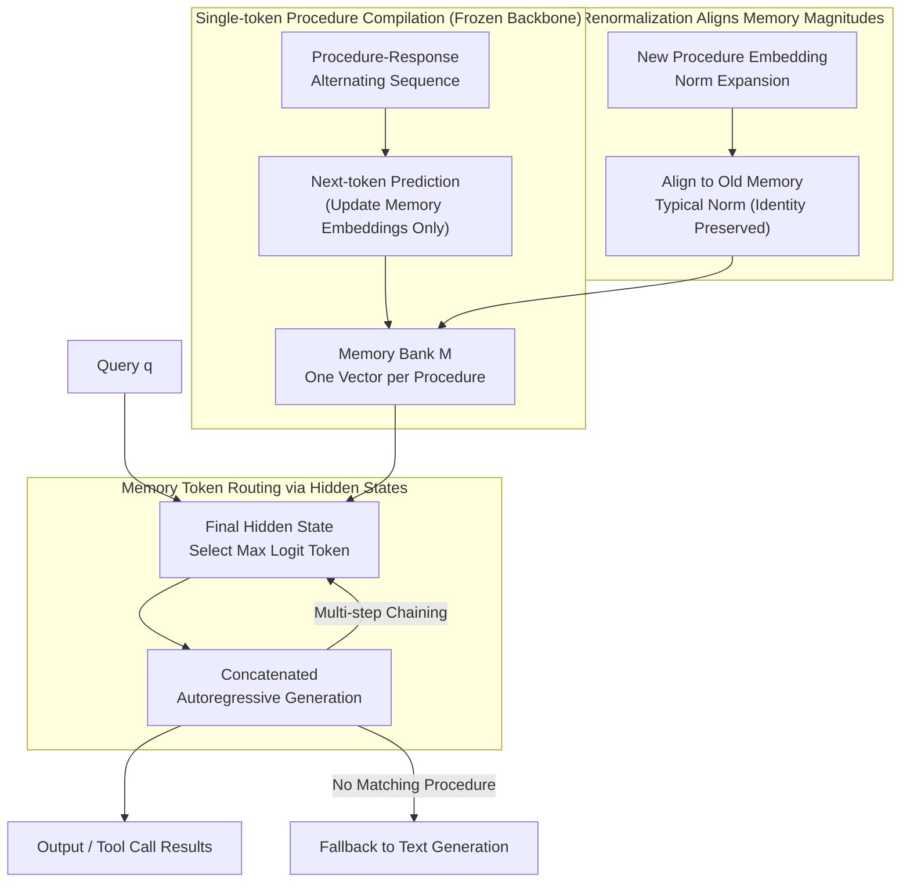

# TokMem: One-Token Procedural Memory for Large Language Models

**Conference**: ICLR 2026  
**arXiv**: [2510.00444](https://arxiv.org/abs/2510.00444)  
**Code**: [https://github.com/MANGA-UOFA/TokMem](https://github.com/MANGA-UOFA/TokMem)  
**Area**: Information Retrieval  
**Keywords**: Procedural Memory, Memory Token, Continual Learning, Context Compression, Tool Calling

## TL;DR

TokMem is proposed to compile reusable task procedures into a single trainable memory token. This token serves as both a procedure index and a generation control signal, enabling efficient invocation of 1000+ task procedures without long prompts while supporting continual expansion without forgetting.

## Background & Motivation

- **Efficiency Bottlenecks of Long Prompts**: Modern LLMs rely on prompts for behavioral control, but long prompt construction is costly, involves quadratic self-attention computational overhead, and consumes the context window, leading to truncation.
- **Limitations of Retrieval Augmentation**: While methods like RAG externalize prompts, retrieved content still occupies the context window in text form, and frequently used procedures require re-interpretation for each call.
- **Cognitive Science Inspiration**: Human procedural memory (e.g., riding a bicycle) is compiled into efficient skills through practice, bypassing the need to re-read declarative knowledge each time.
- **Core Idea**: Compress frequently used task procedures into dedicated memory tokens to achieve procedure invocation with constant overhead.

## Method

### Overall Architecture

TokMem addresses the long-standing challenge of "difficulty in long prompt reuse": modern LLMs utilize prompts to control behavior, but prepending the entire procedure description to the context for every query consumes window space and incurs quadratic attention overhead. The proposed approach compresses each frequently used task procedure into a unique trainable token that simultaneously acts as a "procedure index" and a "generation control signal." The pipeline consists of three phases: **During training**, procedures are compiled into tokens—$l$ additional special tokens are added to the vocabulary to form a memory bank $M = [\bm{m}_1, \ldots, \bm{m}_l]^\top \in \mathbb{R}^{l \times d}$. Each $\bm{m}_i$ is a trainable vector corresponding to a unique procedure without a text form. Only these embeddings are updated while the backbone LLM remains frozen. **During inference**, the model directly routes the appropriate memory token from the query's hidden states and feeds it back for autoregressive response generation; multi-step tasks can chain the prediction of subsequent tokens. **During continual expansion**, a one-step renormalization aligns new memories with old ones to prevent new procedures from suppressing older ones.

### Key Designs

**1. Single-token Procedure Compilation: Replacing "Reading Prompts" with "Retrieving a Vector"**

The fundamental pain point of long prompts is that procedural knowledge enters the context as text every time, consuming window space and incurring quadratic attention costs. TokMem organizes training sequences as alternating "queries + procedure-response pairs" $\bm{a} = (q_1, \ldots, q_k, a_{m_i}, a_{r_{i1}}, a_{r_{i2}}, \ldots, a_{m_j}, a_{r_{j1}}, \ldots)$, where $a_{m_i}$ is the memory token and $a_{r_{ij}}$ are the target response tokens. Standard next-token prediction loss $\mathcal{L}(\bm{a}; M) = -\sum_{i>k} \log \Pr(a_i \mid \bm{a}_{<i}; M)$ is used for training, but gradients are only backpropagated to the memory embeddings. The backbone LLM and original token embeddings remain untouched. Thus, the procedural knowledge is "compiled" into its vector, enabling constant-time invocation and bypassing long prompt costs.

**2. Direct Routing via Hidden States: Shared Mechanism for Retrieval and Generation**

Once compiled, an entry point is needed to select the correct procedure. TokMem reuses the language model head instead of building a separate retriever. Given a query $q$, the distribution over memory tokens is calculated from the final hidden state $h_k$ as $P(a_{m_i} \mid q) \propto \exp(\text{logit}(m_i \mid h_k))$. The token with the highest logit is appended to the query to form $[q; a_{m^*}]$ for autoregressive generation. Since the memory token serves as both an index and a control signal, retrieval and generation are two sides of the same action. This mechanism naturally supports two features: multi-step procedure chaining (predicting the next memory token after a response segment to link tool calls like parse→search→format) and elegant fallback (when no procedure matches, all memory logits remain low, allowing the model to default to standard text generation).

**3. Magnitude Renormalization: Preventing New Procedures from Suppressing Old Ones**

Continually adding procedures to the memory bank leads to a specific failure: the norms of newly trained embeddings tend to expand, systematically lowering the logits of old memories in the softmax routing, which causes implicit forgetting. TokMem applies a one-step post-processing fix: for each embedding in the new set $A$, $\bm{m}_i \leftarrow \bm{m}_i \cdot \frac{\bar{n}_I}{\|\bm{m}_i\|_2 + \varepsilon}$, which scales the magnitude to the typical norm of existing memories $\bar{n}_I = \text{mean}_{j \in I} \|\bm{m}_j\|_2$ while preserving the direction. This eliminates suppression without damaging the learned semantics. With a complexity of $O(|A|d)$, this ensures new procedures can be added without catastrophic forgetting.

## Experiments

### Atomic Memory Recall: Super-Natural Instructions (ROUGE-L)

| Model | Method | 10 Tasks | 200 Tasks | 1000 Tasks | Average |
|------|------|--------|---------|---------|------|
| Qwen 0.5B | RAG | 50.4 | 38.8 | 34.7 | 40.7 |
| Qwen 0.5B | Fine-Tuning | 52.4 | 40.6 | 43.2 | 45.2 |
| Qwen 0.5B | Replay Memory | 52.4 | 47.2 | 46.7 | 48.7 |
| Qwen 0.5B | **TokMem** | **52.8** | **49.3** | **50.0** | **50.7** |
| Llama 3.2 3B | RAG | 60.0 | 45.8 | 39.9 | 47.3 |
| Llama 3.2 3B | **TokMem** | **68.0** | **61.2** | **61.5** | **62.9** |
| Llama 3.1 8B | **TokMem** | **75.4** | **65.1** | **64.8** | **67.0** |

### Memory Routing Accuracy

| Method | 10 Tasks | 200 Tasks | 1000 Tasks |
|------|--------|---------|---------|
| Sentence-BERT (RAG) | 99.6 | 88.7 | 79.7 |
| TokMem (Qwen 0.5B) | 99.4 | 97.4 | 94.7 |
| TokMem (Llama 8B) | 99.8 | 98.9 | **97.5** |

### Compositional Memory Recall: Tool Calling (APIGen)

| Model | Method | Parameters | Tool Choice Avg | Param F1 Avg |
|------|------|--------|-------------|-----------|
| Llama 1B | ICL | - | 16.4 | 0.4 |
| Llama 1B | RAG | - | 16.9 | 2.7 |
| Llama 1B | Fine-Tuning | 0.85M | 9.0 | 68.6 |
| Llama 1B | **TokMem** | **0.10M** | **86.2** | 68.9 |

### Key Findings

- TokMem maintains 94.7% routing accuracy even with 1000 tasks (smallest model), significantly outperforming RAG's 79.7%.
- Extremely high training efficiency: Performance with only 10 samples exceeds RAG with 500 samples.
- Trainable parameters are much fewer than LoRA fine-tuning (0.10M vs. 0.85M) while achieving comparable or superior performance.
- No catastrophic forgetting in continual learning; performance degrades only slightly as tasks increase.
- Supports multi-step procedure chaining, enabling sequential recall of parse→search→format in tool-calling scenarios.

## Highlights

- **Elegant Concept**: Combines cognitive science with engineering by compressing procedural knowledge into a single token.
- **Parameter Isolation**: Each procedure is stored independently, naturally preventing forgetting and fitting continual learning scenarios.
- **Extreme Efficiency**: Constant-sized memory overhead eliminates the quadratic computational costs associated with long prompts.
- **Impressive Routing Accuracy**: Maintains 94.7% accuracy while managing 1000 tasks even on a 0.5B model.

## Limitations

- Procedures must be pre-defined and trained; zero-shot procedure creation is not supported.
- Information capacity of a single token is finite; complex procedures may not be fully encoded.
- The upper bound of the embedding space capacity is unknown; routing may degrade as the number of procedures becomes extremely large.
- Renormalization is a post-processing step and may not fully resolve distribution shifts in continual learning.
- Validation is limited to QA and tool-calling; applicability to creative generation or long-form text remains unexplored.

## Related Work

- **Context Engineering**: CoT, RAG, MemGPT—all utilize text to expand prompts, consuming the context window.
- **Parameter-Efficient Fine-Tuning**: LoRA, Adapter—updates backbone parameters, which may lead to forgetting.
- **Soft Prompting**: Prompt tuning, Prefix tuning—trains continuous prompt vectors but usually does not model them as independent memory units.
- **Cognitive Science**: ACT-R theory of procedural memory—where skills are compiled into efficient modules through practice.
- **TokMem**: First to apply the tokenization concept from NLP to procedural memory management.

## Rating

| Dimension | Score |
|------|------|
| Novelty | ★★★★★ |
| Theoretical Depth | ★★★☆☆ |
| Experimental Thoroughness | ★★★★☆ |
| Practical Value | ★★★★☆ |
| Writing Quality | ★★★★☆ |

<!-- RELATED:START -->

## Related Papers

- [\[ICLR 2026\] MLP Memory: A Retriever-Pretrained Memory for Large Language Models](mlp_memory_a_retriever-pretrained_memory_for_large_language_models.md)
- [\[ICLR 2026\] Expert Heads: Robust Evidence Identification for Large Language Models](expert_heads_robust_evidence_identification_for_large_language_models.md)
- [\[ICLR 2026\] Query-Level Uncertainty in Large Language Models](query-level_uncertainty_in_large_language_models.md)
- [\[ICLR 2026\] DeepRAG: Thinking to Retrieve Step by Step for Large Language Models](deeprag_thinking_to_retrieve_step_by_step_for_large_language_models.md)
- [\[ICML 2026\] Understand and Accelerate Memory Processing Pipeline for Large Language Model Inference](../../ICML2026/information_retrieval/understand_and_accelerate_memory_processing_pipeline_for_disaggregated_llm_infer.md)

<!-- RELATED:END -->
