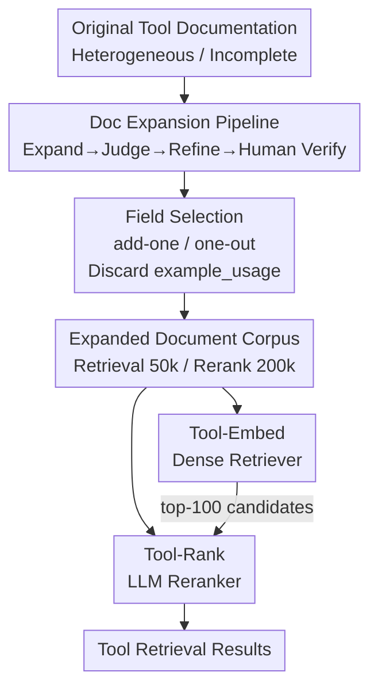

# Tools Are Under-Documented: Simple Document Expansion Boosts Tool Retrieval

**Conference**: ICLR 2026  
**OpenReview**: [https://openreview.net/forum?id=g9D9MgG7iW](https://openreview.net/forum?id=g9D9MgG7iW)  
**Code**: https://github.com/EIT-NLP/Tool-REX  
**Area**: Information Retrieval / Tool Retrieval / LLM Agent  
**Keywords**: Tool Retrieval, Document Expansion, Dense Retrieval, Reranker, OOD Generalization

## TL;DR
This paper identifies that the primary bottleneck in tool retrieval is the poor quality of existing tool documentation. It proposes a low-cost LLM pipeline to systematically supplement original tool documents into structured profiles containing specific fields (`function_description`, `when_to_use`, `limitations`, `tags`). The authors construct the TOOL-REX benchmark along with a large-scale training corpus, and train Tool-Embed (dense retriever) and Tool-Rank (reranker), achieving a new SOTA by pushing $N@10$ to 52.23 and 56.44 on ToolRet and TOOL-REX respectively.

## Background & Motivation
**Background**: As LLM tool calling (tool learning / tool-augmented agents) becomes a mainstream paradigm, tool retrieval—selecting the most relevant tools from thousands of APIs for a user query—has become the "entry point" of the tool-use chain. The community has established benchmarks like ToolBench, ToolACE, MetaTool, and ToolRet, while attempting various query/document expansion methods to improve retrieval.

**Limitations of Prior Work**: User queries are often ambiguous or informal, creating a persistent "semantic gap" with technical, formal tool documentation. This low semantic overlap challenges retrieval models, especially on OOD queries. Existing methods like Re-Invoke (adding LLM-generated pseudo-queries), EASYTOOL (restructuring long docs into concise forms), MassTool (multi-task retrieval), and ScaleMCP (dynamic weighting of doc segments) tend to "bypass" the issue of poor documentation rather than fixing it at the source.

**Key Challenge**: The authors argue that a primary cause of poor performance has been overlooked: **tool documentation itself is flawed**. Documentation lacks standardization (e.g., the same function having over 7 different descriptions in ToolRet) and suffers from incomplete information (lacking explicit "when to use" scenarios or operational constraints). Some datasets even lack basic description fields. This underlying data issue sets a performance ceiling for all models.

**Goal**: Rather than patching the model side, the goal is to "fix" tool documentation from the data side—making documents complete, standardized, and enriched with retrieval-friendly semantic signals.

**Key Insight**: Utilize LLMs to "expand" original documents into structured profiles. This expansion is query-agnostic and strictly grounded in the original text, allowing it to both enhance existing baselines and provide a large-scale corpus for training specialized retrieval/ranking models.

**Core Idea**: Instead of modifying retrieval models to accommodate poor documentation, a low-cost LLM pipeline is used to supplement tool documents with structured fields. By fixing the "data," retrieval performance improves naturally.

## Method

### Overall Architecture
TOOL-REX is built upon ToolRet (35 datasets, 7,615 retrieval tasks, 43,215 unique tools across Web/Code/Customized categories). The methodology is divided into two phases: First, "fixing the documents" via a four-stage pipeline that expands each original document $d_{\text{original}}$ into a structured profile $d_{\text{profile}}$, resulting in an expanded document $d_{\text{expansion}} = d_{\text{original}} \cup d_{\text{profile}}$. Field selection is determined by an add-one/one-out contribution analysis. Second, "training specialized models on fixed documents" using the expanded corpus (50k for retrieval, 200k for reranking, where training is limited to Web-category tools to leave Code/Customized for OOD evaluation). This results in Tool-Embed and Tool-Rank, forming a two-stage "recall-then-rerank" system.

### Key Designs

**1. Document Expansion Pipeline: Low-cost Document Fixing via "Mid-sized Generation + Strong Model Verification"**

To address "heterogeneous and incomplete documentation," the authors designed a four-stage pipeline that balances cost and quality by using a cheaper mid-sized model for core generation and a stronger model only for failing samples. **Stage 1: Expansion**: Qwen3-32B (Reasoning mode) expands original docs into structured profiles with five fields: `function_description` (summary), `tags` (keywords), `when_to_use` (scenarios), `limitations` (constraints), and `example_usage` (API calls). `function_description` and `tags` are mandatory; others are generated only if supported by the original text to prevent hallucination. **Stage 2: Judgment**: Rule-based checks verify JSON validity, followed by LLaMa-3.1-70B acting as a semantic judge to ensure fidelity. **Stage 3: Refinement**: For the ~1.5% (approx. 600) failing samples, GPT-4o regenerates the content. **Stage 4: Human Verification**: 100 random samples were manually checked for fidelity and consistency, achieving 100% pass rate. Expanded documents grew from 131.72 to 177.61 tokens on average.

**2. Field Selection: Add-one / One-out Analysis Proving "Longer is Not Always Better"**

Adding all fields to a document carries costs—longer inputs dilute significant signals and risk truncation. To quantify contributions, the authors used two protocols: **Add-One** (starting from original doc, adding one field at a time) and **One-Out** (starting from full expansion, removing one field at a time). Testing on GritLM and BM25 using $N@10$ yielded two conclusions: first, full expansion is suboptimal—removing `example_usage` improved $N@10$; second, `example_usage` provided minimal (or negative) gain, while `function_description` and `tags` were critical. Consequently, the final profile **discards example_usage and retains function_description, when_to_use, limitations, and tags**.

**3. Tool-Embed: Specialized Dense Retriever Trained on Expanded Corpus**

To address the lack of specialized dense models for tool retrieval, the authors used Qwen3-Embedding-0.6B / 4B as backbones. They performed full-parameter fine-tuning for one epoch on 50k expanded pairs using the InfoNCE loss, sampling 5 random negatives per positive. Critically, **training data only includes Web-category tools**; Code and Customized categories were never seen during training, ensuring a rigorous OOD evaluation. Tool-Embed-4B achieved SOTA on TOOL-REX with $N@10=52.23$, $R@10=63.13$, and $C@10=51.61$.

**4. Tool-Rank: LLM Reranker Modeled as Binary Classification**

The second-stage reranker uses Qwen3-Reranker-4B with LoRA fine-tuning ($r=32$, $\alpha=64$, dropout 0.1) for one epoch. During inference, Tool-Rank processes a query–document pair and outputs `true` or `false` tokens. The relevance score is calculated by normalizing the logits:

$$P(\text{relevant} \mid q, d) = \frac{\exp(\ell_{\text{true}})}{\exp(\ell_{\text{true}}) + \exp(\ell_{\text{false}})}$$

By reranking the top-100 candidates from Tool-Embed-4B, Tool-Rank further pushes $N@10$ from 52.23 to 56.44 ($+4.21$), setting a new SOTA across all TOOL-REX metrics.

### Loss & Training
- **Tool-Embed**: InfoNCE contrastive loss, 5 random out-of-domain negative samples per positive, 1 epoch full-parameter tuning on Qwen3-Embedding-0.6B/4B.
- **Tool-Rank**: Cross-Entropy + LoRA ($r=32$, $\alpha=64$, dropout 0.1), 1 epoch on Qwen3-Reranker-4B; inference uses normalized true/false logits.
- Experiments conducted on 2×A100 (80GB). To isolate expansion effects, Tool-Embed$_{\text{original}}$ / Tool-Rank$_{\text{original}}$ were trained on identical data without the `tool_profile` field.

## Key Experimental Results

### Main Results
Comparing 12 representative retrieval/reranking models on ToolRet and TOOL-REX using $N@10$ (NDCG), $R@10$ (Recall), and $C@10$ (Completeness).

| Benchmark | Model | $N@10$ | $R@10$ | $C@10$ |
|------|------|------|------|------|
| TOOL-REX | Qwen3-Embedding-8B (Prev. SOTA Baseline) | 46.23 | 56.83 | 46.70 |
| TOOL-REX | **Tool-Embed-0.6B (Ours)** | 48.10 | 59.16 | 47.81 |
| TOOL-REX | **Tool-Embed-4B (Ours, Retrieval SOTA)** | **52.23** | **63.13** | **51.61** |
| TOOL-REX | + Qwen3-Reranker-4B | 53.43 | 64.97 | 52.55 |
| TOOL-REX | **+ Tool-Rank-4B (Ours, Final SOTA)** | **56.44** | **67.81** | **56.60** |

Compared to MTEB open-source SOTA, the final results represent gains of $+10.23, +10.29, \text{and } +9.08$ across metrics.

### Ablation Study
The core ablation compares "Expanded Training" vs. "Non-expanded Training" (removing `tool_profile` fields, all other parameters identical) using Qwen3-Embedding-0.6B (43.13 $N@10$) as a reference.

| Configuration | $N@10$ Gain | Description |
|------|-----------|------|
| Tool-Embed$_{\text{original}}$-0.6B / 4B | +3.69 / +3.67 | Non-expanded training |
| Tool-Embed-0.6B / 4B (Expanded) | +4.97 / +6.69 | Significant gains from expansion; 4B scales better |
| Tool-Rank$_{\text{original}}$-4B | +2.00 | Non-expanded reranking |
| Tool-Rank-4B (Expanded) | +4.21 | Reranking gain doubles (reaching 56.44) |

Field-level ablations confirmed that `example_usage` drags down performance, while `function_description` and `tags` provide the highest contributions.

### Key Findings
- **Expansion acts as an effective training signal**: Even when evaluated on original ToolRet (with unexpanded test documents), models trained on expanded data outperform those trained on original data. This suggests that exposure to standardized, rich documentation during training improves generalization to heterogeneous docs.
- **OOD Generalization holds**: Models trained only on "Web" tools consistently outperformed baselines on unseen "Code" and "Customized" categories, proving they learn transferable semantics rather than surface-level patterns.
- **"Similarity Dilution" is beneficial**: Expansion reduces absolute similarity for both positive and negative samples due to length dilution. However, this is **asymmetric**: positive similarity drops negligible amounts (Web $-0.0014$), while negative similarity drops significantly more (Customized negatives $-0.0152$), making positives and negatives more separable.
- **More fields are not always better**: The removal of `example_usage` confirms that LLM-based expansion is a double-edged sword requiring field-level validation.

## Highlights & Insights
- **Focusing on "Data" rather than "Model"**: While many works focus on model architecture or query rewriting, this paper demonstrates that the bottleneck lies in document quality. This data-centric "fix the source" perspective and its transferability to general RAG scenarios is the major highlight.
- **Pragmatic field contribution analysis**: The add-one/one-out methodology transforms prompt engineering into quantifiable field-level experiments, revealing counter-intuitive findings like the harmfulness of example usage.
- **Elegant "Asymmetric Similarity Dilution" explanation**: Provides mechanistic evidence for why longer documents can actually lead to better retrieval via improved separability.
- **Cost-effective data pipeline**: The strategy of using mid-sized models for bulk generation and strong models for the 1.5% "hard" samples is a highly efficient paradigm for large-scale data synthesis.

## Limitations & Future Work
- **Dependency on LLM expansion quality**: Since expansion is strictly grounded in the original text, if the source document is extremely sparse (e.g., no description at all), expansion cannot recover non-existent information.
- **Static Field Selection**: The choice of function/when-to-use/limitations/tags might not be optimal for all domains; cross-domain field optimization remains to be explored.
- **Evaluation Scope**: While ToolRet covers 35 datasets, these are derived from existing benchmarks. The effectiveness on real-world production tools with more diverse documentation styles requires further validation.
- **Document Length Increase**: The average $+35\%$ token increase necessitates a trade-off between retrieval cost/truncation risks and performance in large-scale tool libraries.

## Related Work & Insights
- **vs. Re-Invoke**: Re-Invoke adds pseudo-queries to documents but still works around "bad documentation." This work rewrites the document structure and fills missing info at the source.
- **vs. EASYTOOL**: EASYTOOL focuses on subtraction (conciseness/standardization), whereas this work focuses on addition (supplementing missing context) and pair-wise model training.
- **vs. MassTool / ScaleMCP**: These optimize the retrieval process itself (multi-task or dynamic weighting). This paper proves that data-side improvements provide additive gains that can be stacked on top of any retriever (BM25, GritLM, Qwen3).

## Rating
- Novelty: ⭐⭐⭐⭐ The data-centric perspective is clear, though doc expansion itself is a systematic refinement of existing ideas.
- Experimental Thoroughness: ⭐⭐⭐⭐⭐ Comprehensive coverage across 12 baselines, dual benchmarks, field-level ablations, OOD testing, and similarity analysis.
- Writing Quality: ⭐⭐⭐⭐ Logical argumentation; the pipeline and field analysis are clearly articulated.
- Value: ⭐⭐⭐⭐ Provides the TOOL-REX benchmark, two training corpora, and two SOTA models as solid infrastructure for the tool retrieval community.

<!-- RELATED:START -->

## Related Papers

- [\[ICLR 2026\] Frustratingly Simple Retrieval Improves Challenging, Reasoning-Intensive Benchmarks](frustratingly_simple_retrieval_improves_challenging_reasoning-intensive_benchmar.md)
- [\[ICLR 2026\] RefTool: Reference-Guided Tool Creation for Knowledge-Intensive Reasoning](reftool_reference-guided_tool_creation_for_knowledge-intensive_reasoning.md)
- [\[ICLR 2026\] Retro*: Optimizing LLMs for Reasoning-Intensive Document Retrieval](retro_optimizing_llms_for_reasoning-intensive_document_retrieval.md)
- [\[ICLR 2026\] SmartChunk Retrieval: Query-Aware Chunk Compression with Planning for Efficient Document RAG](smartchunk_retrieval_query-aware_chunk_compression_with_planning_for_efficient_d.md)
- [\[CVPR 2025\] ChatHuman: Chatting about 3D Humans with Tools](../../CVPR2025/information_retrieval/chathuman_chatting_about_3d_humans_with_tools.md)

<!-- RELATED:END -->
