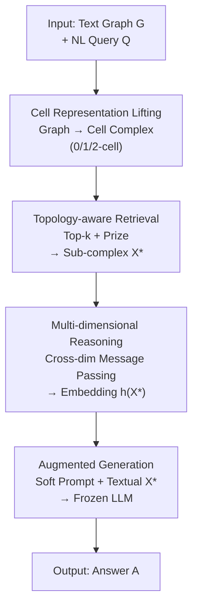

# The Topology of Reasoning: Augmenting Generation with Retrieved Cell Complexes for Text-Graph QA

**Conference**: ICLR 2026  
**OpenReview**: [https://openreview.net/forum?id=TiX4Oz0PrQ](https://openreview.net/forum?id=TiX4Oz0PrQ)  
**Code**: https://github.com/Snnzhao/TopoRAG  
**Area**: Information Retrieval / GraphRAG / Knowledge Graph Question Answering  
**Keywords**: Retrieval-Augmented Generation, Text-Graph Question Answering, Cell Complexes, Topological Deep Learning, High-dimensional Structures

## TL;DR
TopoRAG "lifts" text graphs into cell complexes, treating nodes, edges, and cycles as 0/1/2-cells. It employs topology-aware sub-complex retrieval and multi-dimensional message passing to feed high-order dependencies (cycles) into LLMs, consistently outperforming GraphRAG baselines such as G-Retriever and SubgraphRAG across three TGQA datasets.

## Background & Motivation

**Background**: Retrieval-Augmented Generation (RAG) mitigates LLM hallucinations and enhances factuality by dynamically retrieving external knowledge. For structured data, GraphRAG extends retrieval from documents to graph elements—G-Retriever models retrieval as a Prize-Collecting Steiner Tree (PCST) to extract compact subgraphs, while GNN-RAG and SubgraphRAG design specialized subgraph retrieval modules.

**Limitations of Prior Work**: Existing methods operate almost exclusively on **low-dimensional structures**, treating nodes as entities (0D) and edges or paths as pairwise/sequential relations (1D). Crucially, they **ignore cycles**. However, answers to many questions are embedded within closed loops: for example, "What is the furniture made of the same material as the floor that the mat is lying on?" requires reasoning over a closed relational circuit of spatial and material consistency, which cannot be adequately captured by nodes and edges alone.

**Key Challenge**: Cycles represent **first homology** ($H_1$) information, serving as naturally high-dimensional topological features. The retrieval units of mainstream GraphRAG (nodes, edges, paths, subtrees) are structurally limited to a 1-skeleton, unable to accommodate "independent cycle" dependencies. Recent empirical studies on LLM reasoning also observe that stronger reasoning behavior often accompanies cyclic dependency patterns, implying that effective reasoning inherently relies on non-linear relational organization.

**Goal**: To explicitly incorporate high-dimensional topological structures like cycles into both retrieval and reasoning stages—retrieving cycles relevant to the query and enabling information exchange between cells of different dimensions during reasoning.

**Key Insight**: The authors adopt **regular cell complexes** from algebraic topology as a unified container. A graph is a 1D complex (points = 0-cells, edges = 1-cells); by "attaching" a 2D disk (2-cell) along each "fundamental cycle," one obtains a complex capable of carrying 0/1/2D structures simultaneously.

**Core Idea**: Lift text graphs into cell complexes, use "high-dimensional PCST" to retrieve sub-complexes containing cycles, and compress the topological context into a soft prompt for the LLM via cross-dimensional message passing—effectively "replacing subgraphs with cell complexes and explicitly bringing cycles into RAG."

## Method

### Overall Architecture
TopoRAG addresses the "cycle blindness" of GraphRAG. The pipeline transforms a text-attributed graph into a prompt containing high-dimensional topological context for a frozen LLM. It consists of four serial modules: **Cell Representation Lifting** (graphs to 0/1/2-cells), **Topology-aware Sub-complex Retrieval** (selecting relevant cells), **Multi-dimensional Topological Reasoning** (cross-dimensional message passing), and **Cell Complex Augmented Generation** (injecting embeddings as soft prompts).

### Key Designs

**1. Cell Representation Lifting: Converting Graphs into Searchable Cycles**

Targeting the lack of high-dimensional elements, this step treats a text graph $G=(V,E,\{t_n\},\{t_e\})$ as a 1D complex $X^{(1)}$. Attributes of nodes and edges are encoded via a pre-trained LM (e.g., SentenceBERT) to get $z^0_v$ and $z^1_{(u,v)}$. To **identify cycles and attach 2-cells**, the authors fix a spanning tree $T \subseteq G$ and apply a quotient map $\gamma: G \to G/T$. Each non-tree edge $e \in E \setminus T$ forms a "fundamental cycle" with its unique path in $T$. Attaching a 2-cell $x^2_e$ to each such cycle yields $X^{(2)}$.
The quantity of non-tree edges equals the cyclomatic rank $\beta_1(G) = |E| - |V| + 1$. These fundamental cycles form a **basis** for the first homology group $H_1(G; \mathbb{Z})$, providing a concise topological summary of all independent cyclic dependencies.

**2. Topology-aware Sub-complex Retrieval: Generalizing PCST to High Dimensions**

To select query-relevant portions, 0-cells and 1-cells are ranked by cosine similarity to the query embedding $z_q$: $X^{(d)}_k = \text{TopK}_{x^d} \cos(z_q, z^d_{x^d})$. A **prize mechanism** is introduced: ranked 0/1-cells receive prizes $\text{prize}(x_i) = k-r$. The prize for a 2-cell is the aggregated prize of its boundary cells minus a size penalty:
$$\text{prize}(x^2) = \sum_{d \in \{0,1\}} \sum_{x^d \in \partial_d x^2} \text{prize}(x^d) - \text{cost}(x^2), \quad \text{cost}(x^2) = |\partial_1 x^2| \cdot C_2$$
The optimal sub-complex $X^*$ is found by maximizing the total prize under a connectivity constraint and maintaining **boundary consistency** (if a 2-cell is selected, its boundary 0/1-cells must also be included). This elevates cycles to first-class citizens in retrieval.

**3. Multi-dimensional Topological Reasoning: Bridging Dimensions**

Information must flow between dimensions to form a structured context. A **two-phase message passing** scheme is used:
- **Phase 1**: $L$-hop propagation on the 1-skeleton, where 0-cells and 1-cells aggregate messages from their faces and cofaces.
- **Phase 2**: Cells of all dimensions exchange information via **upper adjacency**: $h^{L+1}_x = \text{UPDATE}(h^L_x, m^L_F, m^L_C, m^{L+1}_\uparrow)$.
The "upper adjacency" $m^{L+1}_\uparrow$ carries 2-cell structure info back to boundary nodes/edges. The final sub-complex embedding $h_{X^*} = \text{POOL}(\{h^{L+1}_x\})$ represents both semantic attributes and topological dependencies.

**4. Cell Complex Augmented Generation: Dual-Path Injection**

The topological context is delivered to the LLM via two paths:
- **Soft Prompt**: The embedding $h_{X^*}$ is aligned to the LLM's space via an MLP: $\hat h_{X^*} = \text{MLP}_\phi(h_{X^*})$.
- **Textualization**: The sub-complex structure is flattened into a text string $\text{textualize}(X^*)$.
The final answer is generated as $p_{\theta,\phi}(Y \mid X^*, x_q) = \prod_i p_{\theta,\phi}(y_i \mid y_{<i}, [\hat h_{X^*}; h_t])$, where the LLM ($\theta$) remains frozen and only the encoder/MLP ($\phi$) are trained.

### Loss & Training
The objective is to maximize the conditional likelihood of the ground-truth answer $A^*$. In the **prompt-tuning** setting, only soft prompt parameters are updated. In the **LoRA** setting, the LLM is fine-tuned with low-rank adapters. The backbone used is Llama-2-7B. Training utilizes AdamW with a learning rate of $1 \times 10^{-5}$ and early stopping.

## Key Experimental Results

### Main Results
Evaluation on Three datasets (ExplaGraphs, SceneGraphs, WebQSP) across different tuning settings:

| Setting | Method | ExplaGraphs (Acc) | SceneGraphs (Acc) | WebQSP (Hit) |
|------|------|------|------|------|
| Frozen+PT | G-Retriever | 0.8516 | 0.8131 | 70.49 |
| Frozen+PT | SubgraphRAG | 0.8535 | 0.8074 | 86.61 |
| Frozen+PT | **TopoRAG** | **0.8899** | **0.8362** | **87.10** |
| Tuned (LoRA) | G-Retriever w/ LoRA | 0.8705 | 0.8683 | 73.79 |
| Tuned (LoRA) | GNN-RAG | 0.8466 | 0.8149 | 85.70 |
| Tuned (LoRA) | **TopoRAG w/ LoRA** | **0.9151** | **0.8768** | **90.66** |

TopoRAG significantly outperforms baselines, with gains of approximately 5.12%, 0.98%, and 4.67% on the three datasets, respectively.

### Ablation Study
| Configuration | ExplaGraphs (Acc) | WebQSP (Hit) | Description |
|------|------|------|------|
| w/o CRL | 0.8576 | 84.96 | Replaced cell lifting with vanilla graph |
| w/o TSR | 0.8524 | 84.23 | Replaced topological retrieval with shortest path |
| w/o MTR | 0.8611 | 85.46 | Replaced multi-dim reasoning with GCN |
| **TopoRAG (full)** | **0.9151** | **90.66** | Full model |

TSR (retrieval) has the most significant impact on WebQSP, proving that retrieving cycles as whole units is critical.

### Key Findings
- **Cycle retrieval is the primary performance driver**: Removing the 2-cell retrieval mechanism leads to the steepest performance drop.
- **Sweet spot for layers $L$**: Increasing reasoning steps improves ability up to a threshold (around $L=3$ or $4$), after which over-smoothing occurs.
- **Moderate $k$ for 2-cells**: Too few 2-cells lose information, while too many introduce noise.
- **SceneGraphs vs. WebQSP**: Gains are smaller on SceneGraphs (0.98%) because scene graphs are denser and baselines are already strong; high-dimensional structures provide higher marginal utility for multi-hop path/cycle-heavy queries like WebQSP.

## Highlights & Insights
- **Mapping "Fundamental Cycles" to RAG units**: Using spanning trees to enumerate cycles provides a sound theoretical basis for "which cycles to retrieve" while keeping it computationally tractable.
- **High-dimensional PCST**: Generalizing PCST from trees to cell complexes by incorporating boundary consistency and cycle prizes is an elegant adaptation of combinatorial optimization.
- **Upper Adjacency Pathways**: The two-stage message passing ensures that cyclic constraints encoded in 2-cells actually influence the representations of nodes and edges, a pathway often missing in standard GNNs.

## Limitations & Future Work
- **Dimension Ceiling**: While the framework supports higher dimensions, only up to 2-cells (cycles) were tested.
- **Spanning Tree Dependency**: The set of fundamental cycles depends on the chosen spanning tree; its impact on retrieval stability remains unexplored.
- **Scale and Latency**: The number of 2-cells grows with cyclomatic rank, which may increase overhead on large-scale graphs.
- **Future Directions**: Exploring learnable cycle selection or integrating persistent homology features.

## Related Work & Insights
- **vs. G-Retriever**: Both use PCST and soft prompts, but G-Retriever is limited to 1-skeleton components (subtrees). TopoRAG treats cycles as first-class entities.
- **vs. SubgraphRAG**: SubgraphRAG focuses on efficient low-dimensional subgraph retrieval; TopoRAG wins by capturing high-dimensional topological dependencies.
- **vs. GNN-RAG**: GNN-RAG uses standard GNNs for reasoning; TopoRAG’s MTR adds "upper adjacency" channels specifically for cycle-to-node information flow.

## Rating
- Novelty: ⭐⭐⭐⭐⭐ 
- Experimental Thoroughness: ⭐⭐⭐⭐ 
- Writing Quality: ⭐⭐⭐⭐ 
- Value: ⭐⭐⭐⭐ 

<!-- RELATED:START -->

## Related Papers

- [\[ICLR 2026\] G-reasoner: Foundation Models for Unified Reasoning over Graph-structured Knowledge](g-reasoner_foundation_models_for_unified_reasoning_over_graph-structured_knowled.md)
- [\[ICLR 2026\] When to use Graphs in RAG: A Comprehensive Analysis for Graph Retrieval-Augmented Generation](when_to_use_graphs_in_rag_a_comprehensive_analysis_for_graph_retrieval-augmented.md)
- [\[ICLR 2026\] Youtu-GraphRAG: Vertically Unified Agents for Graph Retrieval-Augmented Complex Reasoning](youtu-graphrag_vertically_unified_agents_for_graph_retrieval-augmented_complex_r.md)
- [\[ICLR 2026\] Counterfactual Reasoning for Retrieval-Augmented Generation](counterfactual_reasoning_for_retrieval-augmented_generation.md)
- [\[ICLR 2026\] LinearRAG: Linear Graph Retrieval Augmented Generation on Large-scale Corpora](linearrag_linear_graph_retrieval_augmented_generation_on_large-scale_corpora.md)

<!-- RELATED:END -->
