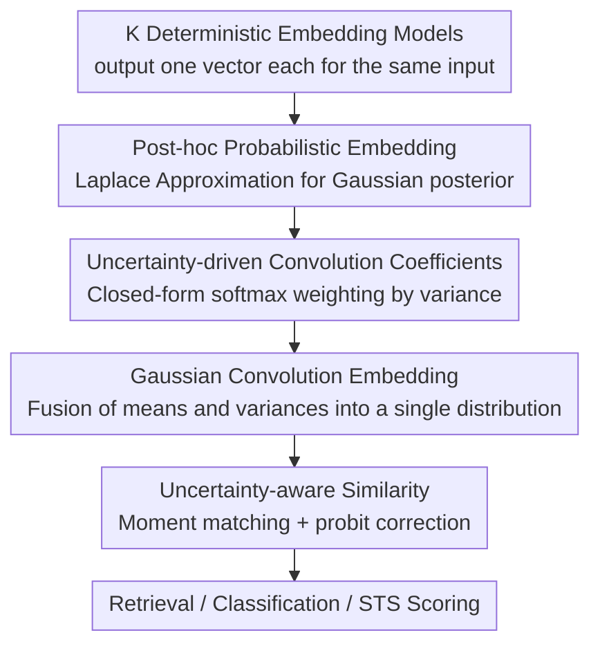

# Uncertainty-driven Embedding Convolution

**Conference**: ICLR 2026  
**OpenReview**: [https://openreview.net/forum?id=7fdcVi2fTJ](https://openreview.net/forum?id=7fdcVi2fTJ)  
**Code**: https://github.com/MLAI-Yonsei/UEC  
**Area**: Information Retrieval / Text Embeddings / Uncertainty Modeling  
**Keywords**: Embedding Ensemble, Probabilistic Embeddings, Laplace Approximation, Uncertainty-aware, Retrieval

## TL;DR
UEC converts multiple pre-trained text embedding models into Gaussian probabilistic embeddings **post-hoc**. It then adaptively fuses them using weights estimated from each model's uncertainty for the current query and scores them using a variance-embedded similarity function. It consistently outperforms baselines such as uniform/weighted ensembles and model merging in retrieval, classification, and STS tasks.

## Background & Motivation
**Background**: Text embeddings are core modules in modern NLP pipelines, supporting tasks like similarity, retrieval, QA, and classification. Numerous embedding models (BERT, E5, BGE, GTE, etc.) exist, but they have varying strengths across different tasks, languages, or domains—**no single model dominates all scenarios**. Thus, integrating multiple embeddings to leverage their complementary strengths is a natural progression.

**Limitations of Prior Work**: Performing ensembles at the representation layer (fusing output vectors) is more general than model merging at the parameter layer. However, mainstream ensemble methods—uniform averaging or fixed weighting—treat every embedding as an **equally reliable deterministic vector**, completely ignoring whether a specific model is "confident" about the current input. The paper uses the "jaguar" example: when one model interprets it as an "animal" and another as a "car," uniform averaging merges these conflicting semantics, leading directly to retrieval failure.

**Key Challenge**: Deterministic ensembles discard the critical information of "model reliability/uncertainty." When some models are poorly calibrated or mismatched with the target task, blind equal-weight fusion can be dragged down by unreliable embeddings, resulting in suboptimal and unstable performance.

**Goal**: Make the ensemble coefficients **query-adaptive**—assigning lower weights to models that are less reliable for the current input. Simultaneously, the similarity scoring should reflect the uncertainty of the embeddings. Furthermore, the entire mechanism must be **post-hoc and retraining-free**, applicable to any existing embedding model.

**Key Insight**: The authors formalize "uncertainty" as the **variance** of the embedding. By upgrading a deterministic embedding to a Gaussian distribution (mean + variance), reliability can be measured by the magnitude of the variance, and the favorable mathematical properties of Gaussians (linear combinations remain Gaussian) can be used for closed-form derivations.

**Core Idea**: Use **Laplace Approximation** to attach a Gaussian posterior to each embedding model post-hoc. Then, perform **Gaussian Convolution** in the embedding space—where weights are derived via a closed-form softmax from a surrogate loss involving variances. Finally, score using an uncertainty-aware similarity (a lightweight proxy for 2-Wasserstein distance).

## Method

### Overall Architecture
UEC addresses the problem of "how to fuse $K$ existing embedding models into a more robust and accurate representation based on their respective reliability without retraining." It divides this into a three-step sequential process: first, individual deterministic embeddings are upgraded to Gaussian probabilistic embeddings (obtaining mean $\mu_k$ and variance $\Sigma_k$); next, query-adaptive convolution coefficients $\pi_k$ are calculated based on variance using a closed-form softmax for weighted fusion to obtain a Gaussian convolution embedding; finally, an uncertainty-aware similarity function is used to score the query and candidates. The entire pipeline requires no learnable parameters for training and consists entirely of closed-form or analytical derivations, incurring almost zero extra overhead.

### Key Designs

**1. Post-hoc Probabilistic Embedding: Attaching variance via Laplace Approximation without retraining**

The pain point is that a deterministic embedding is a single point that cannot express "how confident the model is about this input." UEC applies the Laplace Approximation (LA) only to the **last layer weights** $W^{(L)}$ of the embedding model. By performing a second-order Taylor expansion of the negative log-posterior around the MAP solution $\hat{W}^{(L)}$, a Gaussian weight posterior $p(W^{(L)}\mid D)\approx \mathcal{N}(\hat{W}^{(L)}, H_{\hat{W}^{(L)}}^{-1})$ is obtained, where $H$ is the Hessian of the negative log-posterior. Since the MAP solution corresponds exactly to the pre-trained weights, this step **requires no retraining**. Applying this probabilistic last layer to the fixed penultimate representation $h^{(L-1)}(x)$ transforms the output from a point into a Gaussian random vector:

$$z(x)\sim\mathcal{N}\!\left(\hat{W}^{(L)\top}h^{(L-1)}(x),\; h^{(L-1)}(x)^\top H_{\hat{W}^{(L)}}^{-1} h^{(L-1)}(x)\right)$$

To achieve efficiency, a **diagonal approximation** of the Hessian is used. Thus, each off-the-shelf model is painlessly upgraded to a "mean + dimension-wise variance" probabilistic embedding, where the variance naturally captures the epistemic uncertainty of the model for the current input.

**2. Uncertainty-driven Convolution Coefficients: Closed-form softmax via surrogate loss**

Given $K$ Gaussian embeddings $z_k\sim\mathcal{N}(\mu_k,\Sigma_k)$, UEC performs **Gaussian Convolution**: $z(x)=\sum_k \pi_k(x) z_k(x)$, with $\sum_k\pi_k=1$. Since the linear combination of independent Gaussians remains Gaussian, the result $z(x)\sim\mathcal{N}(\sum_k\pi_k\mu_k,\ \sum_k\pi_k^2\Sigma_k)$ is available in closed form, and uncertainty is propagated automatically. The key is determining the coefficients $\pi_k$. The authors design an **uncertainty-aware surrogate loss**: leveraging the relationship that "squared Euclidean distance ≈ cosine similarity" under $\ell_2$-normalized features in contrastive learning, they use squared loss as a proxy for InfoNCE. For a positive pair $(x,x')$, this loss decomposes the error of each model into a **fidelity term** (distance of means $\|\mu_k(x)-\mu_k(x')\|^2$) and an **uncertainty term** ($\mathrm{tr}(\Sigma_k(x))+\mathrm{tr}(\Sigma_k(x'))$), weighted by $\pi_k$.

However, during retrieval, document embeddings $x'$ are pre-indexed and cannot be recalculated per query. Thus, the authors discard all terms depending on $x'$, retaining only the query-side components, and add an entropy regularization $-T H(\pi)$ (equivalent to KL divergence against a uniform prior to prevent weight collapse). This yields a convex optimization with a closed-form solution as a tempered softmax:

$$\pi_k(x;T)\approx\frac{\exp\!\big(-\mathrm{tr}(\Sigma_k(x))/T\big)}{\sum_{j}\exp\!\big(-\mathrm{tr}(\Sigma_j(x))/T\big)}$$

Intuitively, as the trace of the variance for a model on the current query increases (less confident), its exponential term decreases, leading to a lower weight. This achieves **per-query, data-adaptive** weighting rather than global fixed weights, dynamically adjusting to query heterogeneity and distribution shifts.

**3. Uncertainty-aware Similarity: Embedding variance into scoring as a lightweight 2-Wasserstein proxy**

After fusion, the query Gaussian $q\sim\mathcal{N}(\mu_q,\Sigma_q)$ and candidate Gaussian $c\sim\mathcal{N}(\mu_c,\Sigma_c)$ are obtained. Calculating distribution distances like KL or Wasserstein is theoretically rigorous but computationally expensive. UEC proposes a lightweight estimate: first, normalize the means, approximate cosine similarity as $s\approx q^\top c$, then perform **moment matching** on this dot product to obtain its Gaussian approximation $s\sim\mathcal{N}(\mu_s,\sigma_s^2)$, where $\mu_s=\mu_q^\top\mu_c$, and $\sigma_s^2=\mu_q^\top\Sigma_c\mu_q+\mu_c^\top\Sigma_q\mu_c+\mathrm{tr}(\Sigma_q\Sigma_c)$. Finally, use **probit approximation** to fold the variance into the score:

$$\hat{s}\approx\frac{\mu_s}{\sqrt{1+\tfrac{\pi}{8}\sigma_s^2}}$$

Larger variance drags the score toward the mean, effectively "discounting" uncertain matches. The paper proves (Theorem 1) that under a small-variance assumption, $\hat{s}=1-\tfrac12 W_2^2+O(\varepsilon^2)$, meaning ranking by $\hat{s}$ is consistent with ranking by the squared 2-Wasserstein distance (error $O(\varepsilon^2)$). Thus, this estimator requires no sampling, has near-zero overhead, and possesses theoretical guarantees matching rigorous distribution distance ranking.

### Loss & Training
UEC has **no training phase**. All three components are analytically derived post-hoc: the Laplace posterior comes from pre-trained weights and the diagonal Hessian; convolution coefficients are the closed-form softmax solution of an entropy-regularized optimization; similarity is obtained analytically via moment matching and probit approximation. The only hyperparameter is the temperature $T$ (controlling sensitivity to uncertainty).

## Key Experimental Results

### Main Results
Evaluated on MTEB subsets covering retrieval, classification, and STS. Base models include three weaker SBERT-style models (BGE / E5 / GTE), alongside a strong multilingual baseline (GTE-MB) and a probabilistic embedding baseline (GroVE). Baselines include model merging (Uniform/Weighted/Task Arithmetic) and ensembles (Uniform/Weighted).

Retrieval (Average over 5 datasets):

| Metric | Best Single | Uniform Ens. | Weighted Ens. | UEC |
|------|-----------|---------|---------|------|
| Avg. nDCG@10 ↑ | 77.48 (GroVE) | 76.19 | 77.76 | **79.58** |
| Avg. Recall@100 ↑ | 90.06 (GTE) | 89.61 | 90.12 | **90.69** |
| Avg. AUC@10 ↑ (Calibration) | 65.16 (GroVE) | 60.76 | 63.13 | **67.61** |

For classification (5 datasets), Avg. Accuracy 68.89 / F1 61.04 / AUROC 73.02 are all optimal. For STS (10 datasets), Avg. Spearman is **76.49**, ranking first on 8/10 datasets. In MIRACL language expert experiments, UEC retrieval performance approaches the "oracle" upper bound (selecting the best model per language) and even **exceeds the oracle** in uncertainty metrics like AUC@10. Heatmaps confirm it assigns higher weight to the Arabic model for Arabic inputs and to the Chinese model for Chinese inputs.

### Ablation Study
Components were removed according to the MIRACL protocol (Unc Sim = Uncertainty Similarity, Unc Conv = Uncertainty Convolution Coefficients):

| Configuration | nDCG@10 | Recall@10 | AUC@10 |
|------|---------|-----------|--------|
| UEC (Full) | 59.65% | 80.07% | 91.04% |
| − Unc Sim | 58.72% (↓0.93) | 78.13% (↓1.94) | 82.48% (↓8.56) |
| − Unc Conv | 48.45% (↓11.20) | 66.69% (↓13.38) | 10.30% (↓80.74) |
| − Unc Sim & Conv | 46.78% (↓22.87) | 62.66% (↓17.41) | 4.01% (↓87.03) |

### Key Findings
- **Uncertainty-driven Convolution Coefficients (Unc Conv) are the most significant contributors**: Separately removing it causes nDCG@10 to drop by 11.2 percentage points and AUC@10 to crash to 10.30% (↓80.74), showing adaptive weighting is the backbone of performance and calibration. Uncertainty Similarity (Unc Sim) contributes more to calibration (dropping AUC@10 by 8.56) with a smaller impact on pure retrieval accuracy.
- **Improved Calibration**: Laplace probabilistic embeddings consistently show lower ECE compared to deterministic versions (UEC 0.075 → 0.032). The Var-ECE of similarity variance $\sigma_s^2$ is also the lowest (0.028), indicating variance is a reliable uncertainty estimate.
- **Almost Zero Overhead**: UEC maintains the same asymptotic complexity $O(KD)$ as baselines. Similarity estimation only increases computation time by **0.6%**, making it suitable for real-time deployment. It is the only method supporting automatic coefficient selection, per-data coefficients, and uncertainty-aware similarity simultaneously.
- **Rescuing Hard Cases**: In cases where all single models ranked a positive sample outside the top 10 (e.g., 12th/28th/37th), UEC used uncertainty-based integration to pull it into 6th place, achieving a hit.

## Highlights & Insights
- **"Variance as Reliability" as a fully closed-form pipeline**: From Laplace posterior to softmax coefficients and probit similarity, the entire process has no trainable parameters but successfully implements "automatic down-weighting of unconfident models"—a prime example of applying Bayesian uncertainty to ensembles beyond pure theory.
- **Critical Engineering Trade-offs for Retrieval**: The surrogate loss originally contained document-side terms, but recognizing that document embeddings are pre-indexed and cannot be re-calculated per query, the authors discarded document-dependent terms. This sacrifice for deployment reality yielded the clean, closed-form softmax.
- **Theorem 1 provides theoretical insurance**: Using probit scores as a proxy for expensive 2-Wasserstein distances, and proving ranking consistency ($O(\varepsilon^2)$ error), ensures the method is both fast and theoretically grounded.
- The framework is transferable to any scenario requiring fusion of multiple representations (multimodal, multi-retriever, multi-retriever voting), provided variance can be estimated for each source.

## Limitations & Future Work
- **Modeling only Epistemic Uncertainty**: UEC relies on diagonal Laplace, capturing only epistemic uncertainty. It does not yet cover aleatoric uncertainty or full predictive uncertainty, and the posterior structure is simplified.
- **Same-dimension Assumption**: Requires all embeddings to share the same dimensionality, limiting direct integration of models with heterogeneous dimensions; relaxing this is a clear future direction.
- **Inheriting Base Model Biases**: UEC does not eliminate biases from underlying models; fairness dimensions are unaddressed.
- **Small-variance Assumption**: Theoretical guarantees for similarity rely on $\varepsilon < 1$. When variance is very large, the approximation and ranking consistency might degrade.
- The authors vision extending the framework to multimodal scenarios (interacting heterogeneous uncertainties from vision/speech/text).

## Related Work & Insights
- **vs. Deterministic Ensembles (Uniform/Weighted Average)**: These treat all embeddings as equally reliable point vectors. UEC upgrades each to a Gaussian and weights them adaptively by query-specific variance—avoiding being dragged down by conflicting semantics like the "jaguar" example.
- **vs. Model Merging / Task Arithmetic**: Parameter-layer merging is constrained by architecture and is globally static; UEC operates at the representation layer, is more general, and adaptively adjusts coefficients per query.
- **vs. Probabilistic Embeddings like GroVE**: Methods like GroVE usually require additional training on the strongest single model; UEC is **post-hoc**, retraining-free, and specifically provides a scalable, theoretically supported lightweight similarity measure rather than just generating embeddings.

## Rating
- Novelty: ⭐⭐⭐⭐⭐ First fully post-hoc, uncertainty-calibrated embedding ensemble framework; all three components have clear probabilistic/theoretical support.
- Experimental Thoroughness: ⭐⭐⭐⭐ Covers retrieval/classification/STS + calibration diagnostics + ablation + efficiency, though base model scales are relatively small.
- Writing Quality: ⭐⭐⭐⭐ Clear three-step process description; formulas are well-integrated with motivations.
- Value: ⭐⭐⭐⭐⭐ Near-zero overhead, plug-and-play, directly applicable to existing retrieval systems with high practical utility.

<!-- RELATED:START -->

## Related Papers

- [\[ICLR 2026\] Query-Level Uncertainty in Large Language Models](query-level_uncertainty_in_large_language_models.md)
- [\[ICLR 2026\] Conformalized Hierarchical Calibration for Uncertainty-Aware Adaptive Hashing](conformalized_hierarchical_calibration_for_uncertainty-aware_adaptive_hashing.md)
- [\[ICLR 2026\] Think Then Embed: Generative Context Improves Multimodal Embedding](think_then_embed_generative_context_improves_multimodal_embedding.md)
- [\[ICLR 2026\] On the Theoretical Limitations of Embedding-Based Retrieval](on_the_theoretical_limitations_of_embedding-based_retrieval.md)
- [\[ICLR 2026\] Embedding-Based Context-Aware Reranker](embedding-based_context-aware_reranker.md)

<!-- RELATED:END -->
