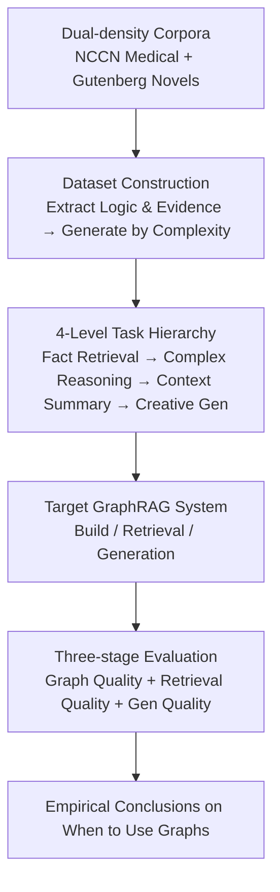

# When to use Graphs in RAG: A Comprehensive Analysis for Graph Retrieval-Augmented Generation

**Conference**: ICLR 2026  
**OpenReview**: [https://openreview.net/forum?id=i9q9xDMjG7](https://openreview.net/forum?id=i9q9xDMjG7)  
**Code**: https://github.com/GraphRAG-Bench/GraphRAG-Benchmark  
**Area**: Information Retrieval / Retrieval-Augmented Generation (RAG) / GraphRAG / Benchmarking  
**Keywords**: GraphRAG, Retrieval-Augmented Generation, Benchmark, Multi-hop Reasoning, Graph-structured Retrieval

## TL;DR
Addressing the contradiction that GraphRAG often underperforms relative to basic RAG on real-world tasks, this paper proposes GraphRAG-Bench. This benchmark covers the entire pipeline from graph construction to retrieval and generation, featuring tasks across four difficulty levels. It systematically answers "when and why to use graphs": basic RAG suffices for simple fact retrieval, while graph structures provide substantial gains in complex multi-hop reasoning and context summarization tasks requiring the integration of scattered concepts, though at the cost of significantly higher token consumption.

## Background & Motivation
**Background**: RAG enables LLMs to answer domain-specific or private knowledge questions without retraining by retrieving relevant text from external corpora. To overcome the limitation where "chunk-based splitting loses context," GraphRAG organizes knowledge into graphs (nodes represent entities/events/topics, edges represent logical/causal/associative relations). During retrieval, it captures interconnected subgraphs by traversing the graph, enabling the capture of thematic evolution, indirect dependencies, and multi-hop reasoning chains. Systems like Microsoft GraphRAG, LightRAG, HippoRAG, StructRAG, and KAG claim superior performance in handling complex multi-hop queries.

**Limitations of Prior Work**: Recent studies have found that GraphRAG underperforms compared to naive RAG in many scenarios. Some reports show GraphRAG accuracy is 13.4% lower on Natural Questions and 16.6% lower on time-sensitive queries. Although reasoning depth increases by 4.5% on HotpotQA, it incurs an average latency increase of 2.3x. There is a severe disconnect between "conceptual potential" and "actual performance."

**Key Challenge**: There is no fair, quantifiable benchmark to evaluate the actual value of graph structures in RAG. Existing benchmarks like HotpotQA, MultiHopRAG, and UltraDomain suffer from three major flaws: (1) Coarse task complexity—they overemphasize the retrieval difficulty of finding scattered facts while ignoring the reasoning difficulty of synthesizing facts into logical answers; (2) Inconsistent corpus quality and low information density—mostly derived from Wikipedia/News, they lack domain hierarchies and have sparse entities (averaging only 12.7 relations in HotpotQA and 3.82 in MultiHopRAG), making it impossible to test GraphRAG's strength in utilizing domain hierarchies; (3) Black-box evaluation—they only measure final answer accuracy/fluency, failing to pinpoint where the graph structure contributes.

**Goal**: Build a benchmark that fairly measures the value of graph structures and use it to answer two questions: Is GraphRAG actually useful? In which scenarios does the graph structure provide measurable benefits?

**Key Insight**: Since existing benchmarks fail in "task difficulty gradients," "corpus density," and "pipeline observability," the design is reversed: task difficulty increases along the "retrieval difficulty × reasoning difficulty" axes, the corpus includes both high-density structured knowledge and loose text, and evaluation covers graph quality $\rightarrow$ retrieval quality $\rightarrow$ generation quality.

**Core Idea**: Use a benchmark called GraphRAG-Bench with "four difficulty levels + dual-density corpora + three-stage full-link metrics" to transform the debate over "when to use graphs" from intuition into quantifiable empirical evidence.

## Method

### Overall Architecture
GraphRAG-Bench is a "benchmark + evaluation protocol" designed to compare different GraphRAG systems in a controlled environment by scoring their internal processes. It consists of three core components: (i) Dataset construction pipeline—extracting logic and evidence from raw corpora to generate questions of varying difficulty; (ii) A hierarchy of 4-level tasks—from fact retrieval to creative generation; (iii) A multi-stage evaluation framework covering graph construction quality, retrieval quality, and generation quality. A GraphRAG system builds a graph, retrieves, and generates outputs on dual-density corpora, and the benchmark quantifies performance at each stage to create a global profile of the system's strengths and weaknesses.

### Key Designs

**1. 4-Level Task Hierarchy with Dual-Dimensional Increments: Separating Retrieval and Reasoning**

Current benchmarks equate "multi-hop" with "sequential fact-finding," missing the true utility of graph structures (synthesizing interconnected concepts). This benchmark pulls tasks along two dimensions into four levels: Level 1 Fact Retrieval (isolated knowledge, focuses on keyword matching); Level 2 Complex Reasoning (logical chains across documents); Level 3 Context Summary (synthesizing fragments into structured answers, emphasizing logical consistency); Level 4 Creative Generation (inference beyond retrieval, involving hypotheses/new scenarios). Low levels verify retrieval, while high levels test reasoning depth, providing a scale to distinguish where graphs add value versus where they add noise.

**2. Dual-density Corpora + Evidence-driven Question Generation: Anchoring Difficulty in Evidence Structure**

To measure the ability to utilize domain hierarchies, the corpora include both high-density structured knowledge and loose text. The authors use NCCN Medical Guidelines (explicit hierarchies and standardized protocols like "Symptom-Drug-Efficacy") and pre-20th-century novels from Gutenberg (implicit, non-linear narratives that avoid pre-training contamination). Questions are generated by converting raw text into structured domain ontologies and extracting fine-grained evidence. Level 1 tasks use isolated subgraphs, while complex tasks use cross-paragraph multi-hop sequences. This ensures difficulty requires "synthesizing context hierarchies" rather than just stacking discrete facts.

**3. Three-stage Full-link Evaluation Metrics: Deconstructing the Black Box**

To understand where graphs assist, the paper designs three sets of metrics. **Graph Quality** uses structural metrics: Node/Edge counts, Average Degree, and Average Clustering Coefficient.
$$\text{AVERAGE DEGREE}=\frac{1}{|V|}\sum_{v\in V}\deg(v)$$
Indicating integration and traversal efficiency.
$$\frac{1}{|V|}\sum_{v\in V}C(v), \text{ where } C(v)=\frac{2\cdot T(v)}{\deg(v)\,(\deg(v)-1)}$$
Where $T(v)$ is the number of triangles for node $v$; higher values indicate local coherence for local reasoning. **Retrieval Quality** uses Evidence Recall (completeness) and Context Relevance (semantic alignment). **Generation Quality** uses Lexical Overlap, Answer Accuracy, Faithfulness (factuality relative to context), and Evidence Coverage.

## Key Experimental Results

Experiments evaluated 7 frameworks (MS-GraphRAG, HippoRAG, HippoRAG2, LightRAG, Fast-GraphRAG, RAPTOR, Lazy-GraphRAG) and basic RAG (+/- rerank) using GPT-4o-mini.

### Main Results: Generation Accuracy (ACC, excerpt from Table 3)

| Dataset | Method | Fact Retrieval | Complex Reasoning | Context Summary | Creative Gen (Faithfulness) |
|--------|------|----------|----------|------------|------------|
| Novel | Basic RAG (w/ rerank) | **60.92** | 42.93 | 51.30 | 49.21 |
| Novel | HippoRAG2 | 60.14 | **53.38** | **64.10** | 49.84 |
| Novel | RAPTOR | 49.25 | 38.59 | 47.10 | **70.85** |
| Medical | Basic RAG (w/ rerank) | 64.73 | 58.64 | 65.75 | 36.74 |
| Medical | HippoRAG2 | **66.28** | **61.98** | 63.08 | 58.78 |
| Medical | LightRAG | 63.32 | 61.32 | 63.14 | **78.76** |

Key Observation: **Basic RAG is equal to or better than GraphRAG for simple fact retrieval** (60.92 vs 60.14 on Novel), as graph overhead introduces noise here. **GraphRAG is significantly superior in complex reasoning and summarization** (e.g., HippoRAG2 @ 53.38 vs RAG @ 42.93 in reasoning).

### Retrieval Quality (Evidence Recall / Context Relevance, excerpt from Table 4)

| Dataset | Method | Fact Retrieval-Recall | Complex Reasoning-Recall | Context Summary-Recall |
|--------|------|----------|----------|----------|
| Novel | Basic RAG (w/ rerank) | **83.21** | 64.47 | 73.38 |
| Novel | HippoRAG | 80.44 | **87.91** | **90.95** |
| Novel | HippoRAG2 | 70.29 | 69.77 | 82.50 |

RAG achieves 83.2% recall for Level 1 questions. However, for Level 2-3, HippoRAG reaches 87.9%–90.9% recall, highlighting the ability of graph structures to connect information across distant text segments.

### Graph Complexity vs. Efficiency

| Metric | MS-GraphRAG | HippoRAG2 | LightRAG | Fast-GraphRAG | HippoRAG |
|------|-------------|-----------|----------|---------------|----------|
| Avg Degree (Novel) | 1.48 | **8.75** | 2.10 | 3.19 | 1.73 |
| Avg Clustering (Novel) | 0.315 | **0.657** | 0.212 | 0.324 | 0.100 |
| Avg Tokens (Novel) | 38707 | 1008 | 100832 | 4204 | 7208 |

HippoRAG2 constructs significantly denser graphs, which correlates with higher recall; however, the cost is token expansion—MS-GraphRAG (global) and LightRAG consume between $4 \times 10^4$ and $10^5$ tokens, while HippoRAG2 is more efficient at the $10^3$ level.

### Key Findings
- **Core "When to Use" Conclusion**: Naive RAG is enough for simple fact retrieval; graphs introduce redundancy or noise. Graph structures yield measurable gains only in tasks requiring the synthesis of interconnected concepts (Complex Reasoning, Summary, Creative Gen).
- **Graph Density $\approx$ Retrieval Power**: Graphs with higher average degrees/clustering coefficients (like HippoRAG2) show higher recall and better generation; graph quality acts as the mediator between construction and effect.
- **The Graph Tax**: GraphRAG prompts are typically 1-2 orders of magnitude longer than naive RAG, which can actually lower Context Relevance due to context flooding.
- **Precision-Coverage Trade-off**: RAPTOR shows the highest faithfulness in creative tasks (70.9%), but basic RAG covers more evidence (40.0%), suggesting GraphRAG retrieval can be fragmented—good for precision, bad for broad synthesis.

## Highlights & Insights
- **Redefining "Multi-hop"**: By identifying that existing benchmarks reduce multi-hop to sequential retrieval, the author uses "evidence-structure driven generation" to anchor difficulty in hierarchical/ontological synthesis.
- **Three-stage Metric Portability**: Breaking down "Graph Quality $\rightarrow$ Retrieval Quality $\rightarrow$ Generation Quality" makes the contribution of each stage observable, a framework transferable to any structured retrieval system.
- **Dual-density Corpus Design**: Pairing NCCN (high density) with Gutenberg (low density) allows testing for both domain hierarchy utilization and robustness against loose narratives.
- **Key Insight**: GraphRAG is not universally better or worse; it has a clear boundary of applicability, turning a vague debate into an actionable engineering guide.

## Limitations & Future Work
- **Limitations of Prior Work noted by authors**: Focus on technical evaluation may overlook social biases; 2 domains do not represent every possible corpus density.
- **Self-identified Limitations**: (1) Dependence on GPT-4o-mini—results might differ with stronger/weaker LLMs; (2) Hyperparameter sensitivity (schema, depth) was not fully controlled; (3) Efficiency only counted tokens, not offline graph construction time/cost.
- **Future Work**: Introducing "Task Difficulty" as a continuous knob to plot "Graph Gain vs. Difficulty" curves and developing cost-sensitive metrics (e.g., gain per token).

## Related Work & Insights
- **Vs. Existing GraphRAG Methods**: Rather than proposing a new model, this work provides a "courtroom" to compare MS-GraphRAG, LightRAG, etc., creating an empirical map of their costs and strengths.
- **Vs. Existing RAG Benchmarks**: Unlike HotpotQA/MultiHopRAG which focus on text and seq-retrieval, this is the first benchmark specifically designed to evaluate the structural properties of graphs.
- **Insight**: When evaluating a new paradigm, it is more important to verify if existing benchmarks can measure its "true capability" than to simply achieve SOTA.

## Rating
- Novelty: ⭐⭐⭐⭐ Not a new model, but the "hierarchical task + dual-density + full-link metric" design is robust.
- Experimental Thoroughness: ⭐⭐⭐⭐ Extensive coverage with 7 frameworks across levels; lacks multi-LLM causal experiments.
- Writing Quality: ⭐⭐⭐⭐ Logical flow from defects to design solutions.
- Value: ⭐⭐⭐⭐⭐ Provides an engineering guide for when to adopt GraphRAG and a public benchmark.

<!-- RELATED:START -->

## Related Papers

- [\[ICLR 2026\] LinearRAG: Linear Graph Retrieval Augmented Generation on Large-scale Corpora](linearrag_linear_graph_retrieval_augmented_generation_on_large-scale_corpora.md)
- [\[ACL 2025\] Pandora's Box or Aladdin's Lamp: A Comprehensive Analysis Revealing the Role of RAG Noise in Large Language Models](../../ACL2025/information_retrieval/pandora_box_rag_noise.md)
- [\[ICLR 2026\] Youtu-GraphRAG: Vertically Unified Agents for Graph Retrieval-Augmented Complex Reasoning](youtu-graphrag_vertically_unified_agents_for_graph_retrieval-augmented_complex_r.md)
- [\[ICLR 2026\] The Topology of Reasoning: Augmenting Generation with Retrieved Cell Complexes for Text-Graph QA](topology_of_reasoning_retrieved_cell_complex-augmented_generation_for_textual_gr.md)
- [\[ACL 2025\] Graph of Records: Boosting Retrieval Augmented Generation for Long-context Summarization with Graphs](../../ACL2025/information_retrieval/gor_rag_long_context_summary.md)

<!-- RELATED:END -->
