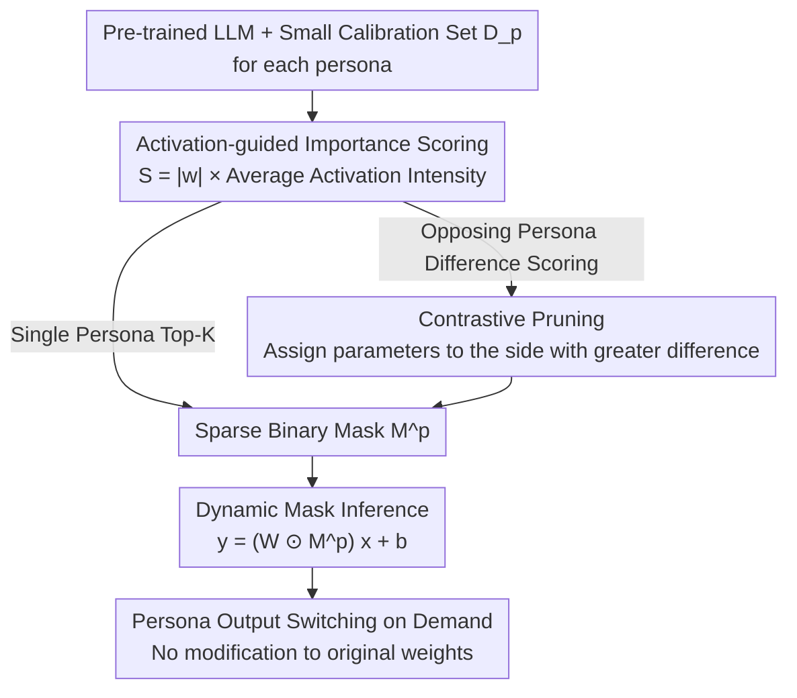

# Your Language Model Secretly Contains Personality Subnetworks

## Basic Information

- **Conference**: ICLR 2026
- **arXiv**: [2602.07164](https://arxiv.org/abs/2602.07164)
- **Code**: [GitHub](https://github.com/Ruimeng-Ye/Persona)
- **Area**: Information Retrieval
- **Keywords**: persona subnetwork, network pruning, contrastive pruning, MBTI, activation-guided masking

## TL;DR

This paper proposes extracting personality-specific subnetworks from pre-trained LLMs through activation-guided pruning, enabling efficient personality switching without any training, and introduces a contrastive pruning strategy to enhance parameter separation between opposing personalities.

## Background & Motivation

- Humans naturally switch personalities across different social contexts. While LLMs can also adopt various roles, existing methods rely heavily on external knowledge injection.
- **Prompting**: Simple and fast, but personality maintenance is unstable and prone to drift.
- **RAG**: Requires a retrieval pipeline and suffers from interference issues.
- **Fine-tuning**: Requires additional training with high costs (hours to days).
- **Core Problem**: Do LLMs truly require external intervention to exhibit different personalities? Or are these behaviors already embedded within the parameter space?
- Inspired by the Lottery Ticket Hypothesis, the authors hypothesize that a single pre-trained model **already contains** multiple "winning ticket" subnetworks corresponding to different personalities.

## Method

### Overall Architecture

The method reframes "personality switching" from an external intervention problem into an internal subnetwork selection problem: for each personality, a small amount of calibration data is collected, and activation statistics are used to identify a sparse binary mask within the pre-trained LLM. During inference, the mask is multiplied by the weights to toggle the personality, without updating any parameters. The workflow focuses on "how to score channels" and "how to prevent overlapping of opposing personalities"—importance scores are calculated for each channel based on calibration data, using Top-K for single personalities or difference-based scoring for opposing personalities to push parameters apart, resulting in sparse masks that can be applied dynamically.

### Key Designs

**1. Sparse Mask Goal: Defining Personality as a Set of Retained Connections**

For each personality $p \in \mathcal{P}$, the authors assume access to a small-scale calibration set $\mathcal{D}_p = \{(x_i^p, y_i^p)\}_{i=1}^{N_p}$. The goal is to find a binary mask $\mathbf{M}^p$ that maximizes the alignment of the selected subnetwork on that personality's data: $\max_{\mathbf{M}^p} \mathbb{E}_{(x,y) \sim \mathcal{D}_p} [\log P_{\mathcal{M}_p}(y|x)]$, subject to the sparsity constraint $\|\mathbf{M}^p\|_0 \leq (1 - \rho) d$, where $\rho$ is the target sparsity rate. This step transforms the open question of "external knowledge requirement" into the operational goal of "selecting a subset of fixed parameters," echoing the winning ticket perspective.

**2. Activation-guided Importance Scoring: Using Persona Data to Decide Which Channels to Keep**

Weight magnitude alone cannot distinguish personalities. Thus, the authors calculate the average activation intensity for each channel on calibration data: $\mathbf{A}_p^{(l)}[j] = \mathbb{E}_{(x,y) \sim \mathcal{D}_p} [|\mathbf{h}_j^{(l)}(x)|]$. This is multiplied by the weight magnitude to obtain an importance score $S_{ij}^p = |w_{ij}| \cdot \mathbf{A}_p^{(l)}[j]$. For each output channel $i$, the Top-K input channels with the highest scores are retained to form the mask $\mathbf{M}^p$. This "weight $\times$ activation" scoring, inherited from Wanda, requires only forward passes without gradients, making the transition from calibration to mask generation matter of minutes.

**3. Contrastive Pruning: Forcing Opposing Personalities into Different Parameters**

When scoring Introversion and Extroversion separately, the masks often overlap significantly, diluting the switching effect. Contrastive pruning uses the "difference between two personalities" for scoring to push parameters toward deeper separation. Two variants are proposed: Contrastive-Wanda uses the normalized difference of activation statistics: $S_{ij}^p = |w_{ij}| \cdot \phi\left(\frac{\mu_{ij}^{p_+} - \mu_{ij}^{p_-}}{\sqrt{\sigma_{ij}^{p_+} + \sigma_{ij}^{p_-}} + \varepsilon}\right)$, emphasizing connections with significant differences. Contrastive-Sparse first performs row-normalization $\tilde{S}_{ij}^p = \frac{S_{ij}^p}{\sum_k S_{ik}^p}$, then calculates the difference between normalized scores $C_{ij} = |\tilde{S}_{ij}^{p_+} - \tilde{S}_{ij}^{p_-}|$, assigning each parameter to the side with the higher score to create two disjoint masks $\mathbf{M}^{p_+}, \mathbf{M}^{p_-}$. This design allows Contrastive Pruning to significantly outperform standard Wanda in AI Persona tasks.

**4. Dynamic Mask Inference: Toggling Personalities Without Touching Original Weights**

During inference, masks act on weights via element-wise multiplication: $\mathbf{y} = (\mathbf{W} \odot \mathbf{M}^p) \mathbf{x} + \mathbf{b}$. Original weights remain untouched, allowing a single model to switch between different personality masks without reloading or fine-tuning. The authors also provide an optional soft gate $G = \mathbf{M}^p + \gamma(1 - \mathbf{M}^p)$, where pruned connections retain $\gamma$ times their residual instead of being zeroed out. When $\gamma = 0$, it degrades to a standard hard mask, facilitating a trade-off between "personality intensity" and "general capability."

## Experimental Results

### Datasets & Models

- **Datasets**: MBTI (16 personality types), AI Persona (Power-seeking/Wealth-seeking/Hallucination detection), RoleAgentBench (Role-playing).
- **Models**: LLaMA-2-13B, LLaMA-3-8B, Qwen2.5-14B.

### Main Results

**AI Persona Classification (LLaMA-2-13B)**:

| Method | Power-Seeking | Wealth-Seeking | Hallucination |
|------|:---:|:---:|:---:|
| Prompt | 41.0% | 44.0% | 58.5% |
| RAG | 45.5% | 50.5% | 64.5% |
| Wanda | 51.5% | 54.5% | 89.0% |
| Contrastive Wanda | 54.0% | 66.0% | 95.0% |
| Contrastive Sparse | **56.5%** | 64.5% | **96.0%** |
| SFT (Upper Bound) | 64.0% | 71.0% | 97.5% |

Contrastive pruning improved Power-Seeking by +15.5 and Wealth-Seeking by +20.5 compared to the Prompt method.

**RoleAgentBench Role-playing (LLaMA-3-8B)**:

| Method | Friends | Harry Potter | Sherlock | Big Bang | Venice |
|------|:---:|:---:|:---:|:---:|:---:|
| Prompt | 18.37 | 42.06 | 42.11 | 29.55 | 41.67 |
| Sparse | **51.02** | **53.97** | **60.53** | **61.76** | **70.83** |

### Ablation Study

**Mask Analysis**:

| MBTI Dimension | Avg Difference Rate (%) | Attn | MLP |
|-----------|:---:|:---:|:---:|
| I vs. E | 1.34 | 1.28 | 1.44 |
| F vs. T | 1.08 | 1.03 | 1.14 |
| N vs. S | 0.75 | 0.75 | 0.76 |
| J vs. P | 0.76 | 0.73 | 0.79 |

- Larger differences in I/E and F/T dimensions lead to better switching effects.
- Differences in MLP layers are consistently larger than in Attention layers, suggesting personality separation primarily relies on FFN transformations.

**General Capability Impact** (LLaMA-3-8B):

| Method | MMLU | HellaSwag |
|------|:---:|:---:|
| Base Model | 0.378 | 0.675 |
| Wanda | 0.369 | 0.668 |
| Sparse | 0.362 | 0.653 |

General capability degradation after pruning is minimal (≤1.6%), indicating that personality subnetworks occupy only a small fraction of the model capacity.

## Highlights & Insights

1.  **New Perspective**: For the first time, personality representation in LLMs is understood through the Lottery Ticket Hypothesis, proving that personality behavior is embedded rather than externally induced.
2.  **Training-free**: Requires no gradient updates, using only small-scale calibration data (hundreds to thousands of samples).
3.  **Contrastive Pruning**: Specially designed strategies effectively enhance parameter disentanglement between opposing personalities.
4.  **Practical & Efficient**: Mask switching requires only minutes of computation and supports rapid personality toggling.

## Limitations & Future Work

1.  Weak mask separation in N/S and J/P dimensions leads to unstable personality switching in these dimensions.
2.  Cosine similarity for some personality pairs remains high in upper layers (e.g., L39 for INFJ-INFP reaches 0.9883), indicating that deep-level entanglement is difficult to resolve.
3.  Currently validated only on 13B models; scalability to larger or smaller models remains unknown.
4.  The quality and representativeness of calibration data may impact pruning effectiveness.

## Related Work & Insights

- **Persona Modeling**: Prompting (Shao et al., 2023), RAG (Zerhoudi, 2024), Fine-tuning (Zhou et al., 2023).
- **Network Pruning**: Lottery Ticket Hypothesis (Frankle & Carlin, 2019), Wanda (Sun et al., 2023), SparseGPT (Frantar & Alistarh, 2023).
- **Mechanistic Interpretability**: Truth direction (Li et al., 2023), activation steering (Zou et al., 2022), FFN key-value memory (Geva et al., 2023).

## Rating

- **Novelty**: ⭐⭐⭐⭐ — Novel perspective using pruning for personality discovery rather than compression.
- **Technical Contribution**: ⭐⭐⭐⭐ — Contrastive pruning is well-designed with clear theoretical intuition.
- **Experimental Thoroughness**: ⭐⭐⭐⭐ — Tested on three datasets and three models with detailed ablations.
- **Writing Quality**: ⭐⭐⭐⭐ — Clearly organized with rich illustrations.
- **Value**: 8/10

<!-- RELATED:START -->

## Related Papers

- [\[ICCV 2025\] LangBridge: Interpreting Image as a Combination of Language Embeddings](../../ICCV2025/information_retrieval/langbridge_interpreting_image_as_a_combination_of_language_embeddings.md)
- [\[ACL 2025\] Re-identification of De-identified Documents with Autoregressive Infilling](../../ACL2025/information_retrieval/reidentification_deidentified.md)
- [\[ACL 2025\] Uncovering Visual-Semantic Psycholinguistic Properties from the Distributional Structure of Text Embedding Space](../../ACL2025/information_retrieval/psycholinguistic_visual_semantic.md)
- [\[ICML 2026\] Understand and Accelerate Memory Processing Pipeline for Large Language Model Inference](../../ICML2026/information_retrieval/understand_and_accelerate_memory_processing_pipeline_for_disaggregated_llm_infer.md)
- [\[ECCV 2024\] Towards Open-Ended Visual Recognition with Large Language Model](../../ECCV2024/information_retrieval/towards_open-ended_visual_recognition_with_large_language_models.md)

<!-- RELATED:END -->
