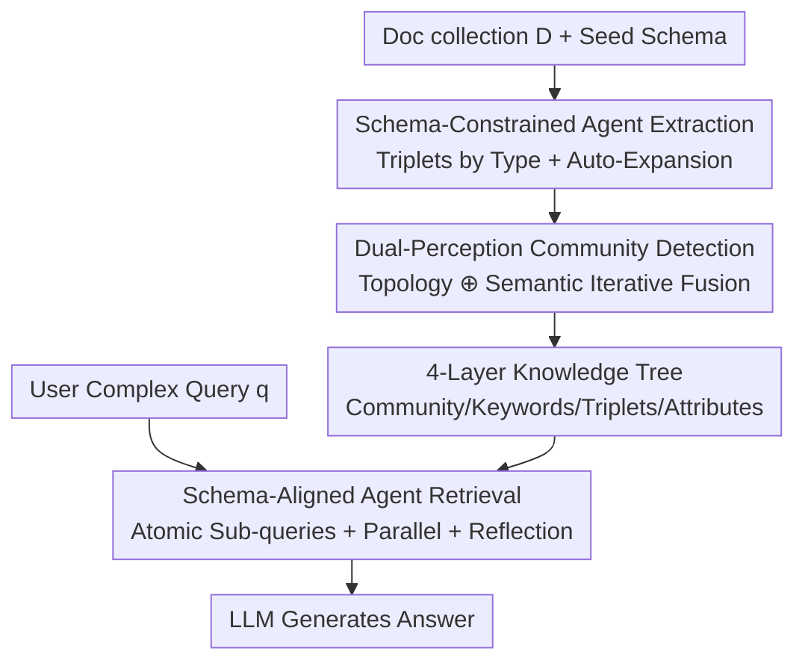

# Youtu-GraphRAG: Vertically Unified Agents for Graph Retrieval-Augmented Complex Reasoning

**Conference**: ICLR 2026  
**OpenReview**: [https://openreview.net/forum?id=yCtgZ2G39E](https://openreview.net/forum?id=yCtgZ2G39E)  
**Code**: https://github.com/TencentCloudADP/Youtu-GraphRAG  
**Area**: Retrieval-Augmented Generation / GraphRAG / Agent  
**Keywords**: GraphRAG, Graph Construction, Community Detection, Agent-based Retrieval, Knowledge Leaking

## TL;DR
Youtu-GraphRAG utilizes a "graph schema" to vertically integrate traditionally isolated graph construction and retrieval. The construction end uses the schema to constrain extraction and perform automatic expansion; the indexing end builds a four-layer knowledge tree via "topology + semantic" dual-perception community detection; the retrieval end uses the same schema to decompose complex questions into atomic sub-queries with iterative reflection. It saves up to 33.60% tokens and improves accuracy by 16.62% across 6 benchmarks compared to SOTA.

## Background & Motivation

**Background**: GraphRAG (Graph Retrieval-Augmented Generation) organizes fragmented documents into an explicit knowledge graph, allowing LLMs to perform multi-hop reasoning along entity-relation paths. This addresses the limitations of standard RAG regarding "coherent relationships between discrete information" and "multi-hop reasoning." Since the seminal work by Edge et al., this field has split into two branches: one focusing on **retrieval** (LightRAG for vector sparsification, GNN-RAG/GFM-RAG using Graph Neural Networks, HippoRAG 1&2 introducing memory and personalized PageRank), and the other focusing on **construction** (from KGP’s hyperlink/KNN graphs to GraphRAG’s community detection summaries and RAPTOR/E2GraphRAG’s recursive tree clustering).

**Limitations of Prior Work**: Both branches optimize in isolation—focusing only on construction or only on retrieval, treating the other as an untunable black box (denoted by grey "non-customized components" in Figure 1). Consequently, the constructed graph may not be retrieval-friendly, and the retrieval process cannot leverage structural and semantic signals within the graph, leading to suboptimal reasoning performance. This fragmentation is further amplified during domain shifts.

**Key Challenge**: Construction and retrieval are two interdependent steps in a pipeline, yet they are "naturally misaligned"—there is no common intermediate representation that allows the constructed graph to serve retrieval at both structural and semantic levels. Furthermore, an overlooked evaluation dilemma exists: in almost all current GraphRAG benchmarks (e.g., HotpotQA), entities have already been "seen" during LLM pre-training. Models can answer using parametric memory, failing to test **true GraphRAG retrieval capabilities** (termed "knowledge leaking" by the authors).

**Goal**: (1) To find a unified medium to link construction and retrieval; (2) To enable reasoning to traverse different knowledge granularities (entities, triplets, keywords, communities); (3) To create a fair evaluation set that shields against knowledge leaking.

**Key Insight**: The authors bet on the "**graph schema**" as the unified medium. The schema (triplets of entity types, relations, and attribute types) constrains extraction and suppresses noise during construction, while guiding question decomposition during retrieval, ensuring consistent type constraints throughout the process.

**Core Idea**: Use a pervasive graph schema to vertically unify "schema-constrained extraction + dual-perception community detection for knowledge trees + schema-aligned agent retrieval" into a closed loop, supplemented by an "anonymity reversion" task for fair evaluation.

## Method

### Overall Architecture
The system takes a document collection $D$ and a seed schema $S=\langle S_e, S_r, S_{attr}\rangle$ as input, outputting an answer to a complex query $q$. The pipeline is vertically integrated by the same schema in three stages: **Construction**, where a schema-bound extraction agent extracts triplets and automatically expands the schema; **Indexing**, where dual-perception community detection reorganizes the dense graph into a four-layer knowledge tree (Community → Keywords → Triplets → Attributes); and **Retrieval**, where a retrieval agent uses the same schema to decompose complex questions into parallel atomic sub-queries and performs iterative "reasoning-reflection" via multi-route retrieval.

### Key Designs

**1. Schema-Constrained Agent Extraction: Compressing Open Extraction into Controlled Generation**

Existing GraphRAG methods often use pure LLM or OpenIE for entity-relation extraction, which inevitably introduces noise. This paper redefines extraction as "schema-constrained generation." Given a seed schema $S=\langle S_e, S_r, S_{attr}\rangle$ ($S_e$ for entity types, $S_r$ for relations, $S_{attr}$ for attribute types), a frozen LLM agent $f_{LLM}(S,D)$ is restricted to identifying information within $S$. extracted triplets $T(d)$ are defined as $T(d)=\{(h,r,t),(e,r_{attr},e_{attr}) \mid \{f(h),f(t),f(e)\}\in S_e,\ \{r,r_{attr}\}\in S_r,\ e_{attr}\in S_{attr}\}$. This shrinks the search space to a structured schema, reducing noise.

To prevent rigidity, an adaptive agent **dynamically expands the schema**: candidate expansions $\Delta S=\langle\Delta S_e,\Delta S_r,\Delta S_{attr}\rangle=\mathbb{I}[f_{LLM}(d,S)\odot S]\geq\mu$ are adopted if confidence exceeds $\mu=0.9$ and the patterns are high-frequency and context-consistent. This maintains the precision of "strict schema guidance" while allowing "flexible knowledge acquisition."

**2. Dual-Perception Community Detection & 4-Layer Knowledge Tree: Clustering by Structure and Semantics**

Dense triplet graphs can become noisy. Traditional algorithms like Louvain focus only on structural connectivity, ignoring semantics. This paper proposes a dual-perception framework. First, entity representation is computed using a frozen LM to encode one-hop neighborhoods: $e_i=\frac{1}{|N_i|}\sum_{(e_i,r,e_j)\in N_i} f_{LM}[e_i\|r_{ij}\|e_j]$. Second, K-means performs initial partitioning with cluster count $k=\min(\max(2,\lfloor E/\beta\rfloor),\eta)$.

The core is an iterative scoring function $\phi(e_i,C_m)=S_r(e_i,C_m)\oplus\lambda\, S_s(e_i,C_m)$, linearly fusing **relational connectivity** ($S_r$, Jaccard similarity of edges) and **subgraph semantic similarity** ($S_s$, cosine similarity of embeddings). For merging, a representative $e^*_{center}$ is chosen per community; communities merge if the expected score difference is below $\epsilon$. This results in a depth $L=4$ knowledge tree $K=\bigcup_{\ell=1}^{4}L_\ell$: L4 Communities, L3 Keywords (hub entities), L2 Entity-Relation Triplets, and L1 Attributes.

**3. Schema-Aligned Agent Retrieval: Decomposing Complex Problems into Atomic Sub-queries**

Directly querying a large knowledge tree for multi-hop questions is inaccurate. The retrieval agent uses the **same schema** $S$ for query decomposition: $Q=f_{LLM}(q,S)=\{q_1,q_2,\dots,q_i\}$. Each sub-query is filtered by schema types to target node-level attributes, triplets, or community verification. This ensures sub-queries align with valid graph patterns.

Above this, a "reasoning-reflection" loop is implemented. An agent $\mathcal{A}=\langle H, f_{LLM}\rangle$ maintains a memory $H$ of reasoning steps and results. Actions $A^{(t)}=f_{LLM}(q_t, H^{(t-1)})$ alternate between forward reasoning and backward reflection. Retrieval uses multiple routes (entity retrieval, triplet matching, community filtering, DFS path traversal). Ablation shows this loop is the most significant contributor (a 19.8% drop on 2Wiki without it).

> Additionally, the authors propose **Anonymity Reversion** and the AnonyRAG dataset. By anonymizing entities and requiring the model to revert them, the task blocks "parametric memory" and tests true retrieval performance.

## Key Experimental Results

### Main Results
Evaluation across 6 benchmarks using DeepSeek-V3 and Qwen3. Two modes: **Open mode** (allows parametric knowledge) and **Reject mode** (requires refusal if evidence is insufficient). Top-20 accuracy for DeepSeek:

| Dataset / Mode | Ours | Prev. SOTA | Gain |
|----------------|------|------------|------|
| HotpotQA / Open | 86.50 | 81.80 (HippoRAG2) | +4.7 |
| HotpotQA / Reject | 81.20 | 74.90 (HippoRAG2) | +6.3 |
| 2Wiki / Reject | 77.60 | 66.00 (HippoRAG-IRCOT) | +11.6 |
| MuSiQue / Reject| 47.50 | 37.80 (HippoRAG2) | +9.7 |
| G-Bench / Open | 86.54 | 79.37 (HippoRAG2) | +7.2 |
| AnonyRAG-CHS / Open | 42.88 | 36.77 (HippoRAG) | +6.1 |

The gains in Reject mode (7-14 points) are generally larger than in Open mode, indicating the advantage comes from retrieval quality. Efficiency: Construction token consumption is the lowest across 6 datasets.

### Ablation Study
DeepSeek results for Reject mode (Top-20):

| Configuration | HotpotQA | 2Wiki | MuSiQue | AnonyRAG-CHS |
|---------------|----------|-------|---------|--------------|
| Full (Youtu-GraphRAG) | 81.20 | 77.60 | 47.50 | 42.88 |
| w/o Community | 79.50 | 75.10 | 44.00 | 39.97 |
| w/o Agent | 75.30 | 57.80 | 40.00 | 37.60 |
| w/o Schema | 77.10 | 73.40 | 45.60 | 35.61 |

### Key Findings
- **Agent loop is most critical**: Removing the Agent causes hits of 19.8% and 7.5% on 2Wiki and MuSiQue, validating iterative reflection for multi-hop problems.
- **Community detection aids global questions**: Removal leads to a 1.7-2.5% drop in multi-hop QA.
- **Schema is key for cross-domain initialization**: Dropping it results in a 7.27% decrease on the knowledge-intensive AnonyRAG-CHS.
- **Ours w/o Agent** serves as a strong lightweight version for real-time interaction.

## Highlights & Insights
- **Schema as a "Vertical Axis"**: Unifying construction and retrieval via shared type constraints is a clean engineering abstraction that aligns two previously disjoint phases.
- **Dual-Perception Community Detection** merges topology and semantics explicitly, improving both accuracy and efficiency by reducing comparisons to node-to-node level.
- **Addressing Knowledge Leaking**: The Anonymity Reversion task highlights a major flaw in current GraphRAG evaluation—the reliance on parametric memory.
- Higher gains in Reject mode serve as strong evidence that retrieval quality has fundamentally improved.

## Limitations & Future Work
- Schema quality defines the upper bound; the system is sensitive to initial seed schema quality in new domains.
- Sensitivity analysis for fixed hyperparameters (e.g., $\mu=0.9$, $\eta=200$) is not fully provided.
- The cost of iterative reasoning-reflection and convergence criteria for the agent could be further detailed.
- Evaluating intermediate stages, such as schema expansion errors or community summary factuality, remains an area for future work.

## Related Work & Insights
- **vs. HippoRAG 1&2**: While HippoRAG is strong in retrieval, it lacks construction-retrieval synergy. Ours outperforms HippoRAG2 significantly in Reject mode.
- **vs. GraphRAG / RAPTOR / E2GraphRAG**: These methods focus on deep construction but treat retrieval as a black box. Our dual-perception detection builds knowledge trees while reducing token costs.
- **vs. LightRAG / GNN-RAG**: These optimize specific retrieval components; this work proposes "vertical unification" as the next paradigm.

## Rating
- Novelty: ⭐⭐⭐⭐
- Experimental Thoroughness: ⭐⭐⭐⭐⭐
- Writing Quality: ⭐⭐⭐⭐
- Value: ⭐⭐⭐⭐⭐

<!-- RELATED:START -->

## Related Papers

- [\[ICLR 2026\] G-reasoner: Foundation Models for Unified Reasoning over Graph-structured Knowledge](g-reasoner_foundation_models_for_unified_reasoning_over_graph-structured_knowled.md)
- [\[ICLR 2026\] LinearRAG: Linear Graph Retrieval Augmented Generation on Large-scale Corpora](linearrag_linear_graph_retrieval_augmented_generation_on_large-scale_corpora.md)
- [\[ICLR 2026\] When to use Graphs in RAG: A Comprehensive Analysis for Graph Retrieval-Augmented Generation](when_to_use_graphs_in_rag_a_comprehensive_analysis_for_graph_retrieval-augmented.md)
- [\[ICML 2026\] Graph-R1: Towards Agentic GraphRAG Framework via End-to-end Reinforcement Learning](../../ICML2026/information_retrieval/graph-r1_towards_agentic_graphrag_framework_via_end-to-end_reinforcement_learnin.md)
- [\[ICLR 2026\] The Topology of Reasoning: Augmenting Generation with Retrieved Cell Complexes for Text-Graph QA](topology_of_reasoning_retrieved_cell_complex-augmented_generation_for_textual_gr.md)

<!-- RELATED:END -->
