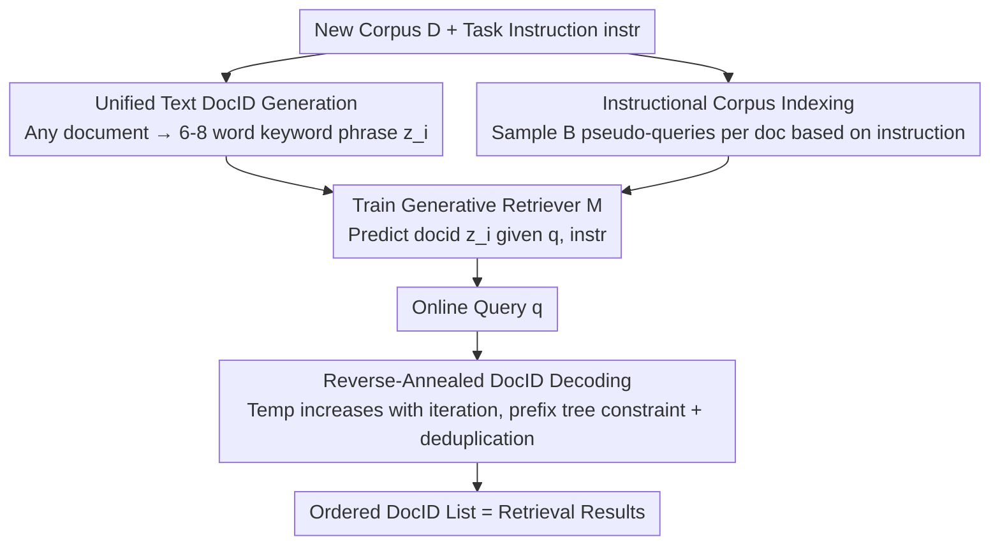

# ZeroGR: A Generalizable and Scalable Framework for Zero-Shot Generative Retrieval

**Conference**: ICLR 2026  
**OpenReview**: [https://openreview.net/forum?id=RBoAwiQl5L](https://openreview.net/forum?id=RBoAwiQl5L)  
**Code**: https://github.com/sunnweiwei/ZeroGR  
**Area**: Information Retrieval / Generative Retrieval  
**Keywords**: Generative Retrieval, Zero-Shot Retrieval, Instruction Tuning, DocID, Reverse-Annealed Decoding

## TL;DR
ZeroGR utilizes natural language task instructions to generalize Generative Retrieval (GR) from supervised single-task settings to zero-shot heterogeneous retrieval. It unifies arbitrary document formats into keyword-based text DocIDs, builds indexes using an instruction-tuned query generator for pseudo-query generation, and employs "reverse-annealed" decoding to balance precision and recall, achieving new SOTA results for GR on BEIR/MAIR and approaching the performance of dense retrieval.

## Background & Motivation

**Background**: Dense Retrieval (DR) is currently the dominant IR paradigm, encoding queries and documents into vectors for Maximum Inner Product Search (MIPS). Generative Retrieval (GR) offers an alternative path—compressing corpus information into model parameters and directly "generating" document identifiers (DocIDs) during retrieval. This approach is end-to-end optimizable and naturally aligns with generative language models. GR has proven competitive in web search and knowledge-intensive retrieval when large-scale supervised data is available.

**Limitations of Prior Work**: GR suffers from poor generalization. Existing GR models are mostly fine-tuned on specific corpora and query distributions, leading to failure in unseen out-of-distribution (OOD) tasks. However, real-world retrieval is highly heterogeneous—corpora may consist of tables, code, legal documents, or meeting minutes, and relevance criteria vary by task. Most scenarios are **zero-shot**, lacking supervised data entirely. GR models designed for supervised settings struggle in these data-scarce, heterogeneous environments.

**Key Challenge**: All three stages of GR are constrained by "single-task supervision": ① DocID designs often rely on rule-based schemes (titles/URLs/snippets) that fail on custom formats; ② Corpus indexing relies on pseudo-queries, but index quality collapses if pseudo-query distributions deviate from real queries (especially in heterogeneous tasks); ③ DocID decoding uses constrained beam search, which easily collapses onto a few high-probability sequences, hurting recall. None of these components possess "task-awareness."

**Goal**: Enable GR to construct a dedicated generative retrieval index for any new task using only a natural language task instruction, achieving zero-shot generalization.

**Key Insight**: Although training data is absent in zero-shot IR, task instructions are almost always available and inexpensive. By using instructions as a unified interface, task-awareness can be injected into DocID design, corpus indexing, and DocID decoding—instruction tuning naturally allows models to adapt to different relevance criteria.

**Core Idea**: Re-engineer the GR triad with "instruction-driven" components: a unified text DocID generator + an instruction-tuned pseudo-query generator + reverse-annealed decoding. This is supported by OpenInstIR, a large-scale open-source instruction retrieval dataset covering 69 tasks, to facilitate systematic research on instruction tuning scalability.

## Method

### Overall Architecture

ZeroGR addresses the problem of "how to transform a new corpus $D$ and a task instruction $instr$ into a functional zero-shot generative retrieval index." The process is divided into **offline indexing** and **online retrieval**, involving three Llama-based components.

Offline Phase: For each document $d_i$ in the corpus, a DocID generator $G_\psi$ compresses it into a unified text DocID $z_i$ (a keyword-style short phrase). An instruction-based query generator $G_\theta$ then samples $B$ pseudo-queries $\{q_{i,1},\dots,q_{i,B}\}$ for each document based on the instruction, forming $\langle q_{i,j}, z_i\rangle$ training pairs. These pairs are used to train the generative retriever $M$ to predict the corresponding DocID given an instruction and query, effectively "burning" the corpus into the model parameters. The trained $M(z\mid q, instr)$ serves as the index.

Online Phase: For an incoming query $q$, a reverse-annealed decoding strategy is used to decode an ordered DocID list from a "valid DocID prefix tree" token by token.

### Key Designs

**1. Unified Text DocID Generator: Compressing any format into keyword phrases**

To address the failure of rule-based DocIDs (titles/URLs) on heterogeneous corpora, ZeroGR trains a model $G_\psi$ to map **any format** of document (paragraphs, tables, code, legal docs) into a short, keyword-rich phrase (typically 6–8 words) sorted by coverage. Formally, the DocID is the token sequence of length $\le L$ ($L=8$) with the highest generation probability:

$$z_i = G_\psi(d_i) = \arg\max_{t \in V^{\le L}} G_\psi(t \mid d_i)$$

In practice, a strong LM (e.g., GPT-4o) generates $\langle d_i, z_i\rangle$ pairs, which are distilled into a smaller model (Llama-3.2-1B) for fast, scalable generation. This ensures DocIDs are **natural language and semantically readable** (aiding LM decoding) while maintaining low collision rates—empirical tests show collisions drop below 1% for prefixes over 6 words and reach 0.45% at 8 words. Unlike RQ-VAE, which quantizes vectors into tokens, text DocIDs provide a large branching factor at the first decoding step that narrows quickly, aligning with LM generation patterns.

**2. Instruction-tuned Pseudo-query Generator: Aligning distributions via task instructions**

To solve the distribution shift of pseudo-queries (prevalent in DSI-QG for heterogeneous tasks), ZeroGR uses a 1B Llama instruction-tuned on diverse IR datasets with verbalized task instructions as the query generator $G_\theta$. Given document $d_i$ and instruction $instr$, it samples pseudo-queries:

$$q_{i,j} \sim G_\theta(\cdot \mid d, instr)$$

For each document, $B$ queries $Q_i=\{q_{i,1},\dots,q_{i,B}\}$ are sampled at temperature 1. The retriever $M$ is trained using cross-entropy on these $\langle q_{i,j}, z_i\rangle$ pairs:

$$L(\phi) = -\sum_{d_i\in D}\sum_{q_{i,j}\in Q_i}\log M(z_i\mid q_{i,j}, instr)$$

"Instruction conditioning" makes query generation **task-aware**. Experiments show that training on diverse tasks leads to richer query length distributions (unlike models trained only on MS MARCO, which output ~8-word queries), indicating the model adjusts query styles by task. Increasing $B$ (e.g., to 16) consistently improves Acc@1; with 8 queries, it parity BM25, and with 16, it surpasses it, confirming that multi-view queries provide better semantic coverage.

**3. Reverse-Annealed DocID Decoding: Balancing precision and recall dynamically**

To prevent beam search from collapsing into a few high-probability sequences, ZeroGR proposes reverse-annealed sampling. It generates $K$ DocIDs sequentially, but the sampling temperature **increases across iterations**. The $i$-th DocID is sampled token-by-token using temperature $t_i=g(i)$ over the prefix tree $T$: $x_{i,j}\sim \mathrm{Softmax}(\ell_{i,j}/t_i)\,T_{i,j}$, where $T_{i,j}$ masks probabilities to legal tokens within the tree. Once a DocID is completed, its leaf is removed from the tree to prevent duplicates. The temperature follows a normalized sigmoid schedule:

$$t_i = g(i) = T_{\max}\cdot\frac{\sigma(k(\tfrac{i}{K}-m)) - \sigma(-km)}{\sigma(k(1-m)) - \sigma(-km)}, \quad \sigma(z)=\frac{1}{1+e^{-z}}$$

Where $k$ controls the slope and $m$ sets the inflection point. The intuition is to use low temperatures initially for high precision (locking in the most relevant DocIDs) and increase temperature later to encourage exploration and boost recall. This yields a ranked list that is **precise at the top and broad at the tail**, outperforming pure greedy (high Acc@1 but low recall) and pure nucleus sampling (high recall but poor Acc@1).

### Loss & Training
All three components are Llama-based. The DocID generator is trained using Llama-1B-Instruct on synthetic pairs for 5 epochs (LR 5e-5). The query generator follows the same setup on OpenInstIR. The generative retriever is trained specifically for each evaluated task following the "Document Indexing" workflow using the cross-entropy loss $L(\phi)$.

## Key Experimental Results

Evaluated on BEIR (11/12 tasks) and MAIR (38 tasks, seen/unseen categories). Metrics include Top-1 Acc, nDCG@10, and Recall@100. The best model is based on Llama-3B.

### Main Results

Cross-domain comprehensive results (Acc@1 for MAIR, nDCG@10 for BEIR):

| Model | Paradigm | MAIR Avg | BEIR Avg |
|------|------|---------|---------|
| BM25 | Sparse | 36.1 | 42.4 |
| BGE-Large | Multi-task DR | 39.4 | 51.8 |
| OpenAI-Embed-v3 | Multi-task DR | 40.6 | 54.2 |
| E5-mistral-7B | Instruct DR | 46.8 | — |
| GritLM-7B | Instruct DR | 47.0 | 45.0 |
| **ZeroGR-3B** | **Gen. GR** | **41.1** | 48.1 |

As a generative retriever, ZeroGR-3B matches OpenAI-Embed-v3 on MAIR (41.1 vs 40.6) and outperforms BGE-Large, significantly narrowing the gap between GR and dense retrieval. While it trails 7B-scale instruction-tuned DR models, it has less than half the parameters.

Internal GR comparison (BEIR nDCG@10):

| Method | Training Data | BEIR Avg |
|------|---------|---------|
| GENRE | GPL | 23.0 |
| TIGER | OpenInstIR | 31.0 |
| GENRET | GPL | 41.1 |
| **ZeroGR** | OpenInstIR | **44.9** |

### Ablation Study

| Configuration | Key Metric | Description |
|------|---------|------|
| Diversity: MS MARCO only | Acc@1 28.6 | Single-task training |
| Diversity: + OpenInstIR (69 tasks) | Acc@1 31.3 | Task diversity improves length distribution and reduces collisions |
| DocID: RQ-VAE | Acc@1 0.248 | Standard quantization DocID |
| DocID: Unified Text (Ours) | Acc@1 0.276 | Best, outperforms Summary (0.206) |
| Decoding: Greedy | Acc@1 45.7 / Rec 73.8 | High precision, low recall |
| Decoding: Nucleus | Acc@1 42.0 / Rec 82.8 | High recall, lower precision |
| Decoding: Reverse-Annealed | Acc@1 45.7 / Rec 82.4 | High precision and high recall |

### Key Findings
- **Task diversity drives performance**: Expanding from MS MARCO to the 69-task OpenInstIR improved unseen Acc@1 from 28.6 to 31.3. Query distributions became richer and collision rates dropped, proving task-awareness is learned through exposure to variety.
- **Unified text DocIDs are superior**: Keeping other factors constant, the proposed text DocID (0.276) outperformed RQ-VAE (0.248) and Summary (0.206). An 8-word DocID yields only 0.45% collisions, proving it is both readable and distinctive.
- **Reverse-annealing resolves the precision-recall trade-off**: While greedy excels at precision and nucleus at recall, reverse-annealing scores highly in both, representing a true Pareto improvement.
- **Scalability**: Performance scales monotonically with the number of queries per document (surpassing BM25 at 16) and with backbone size (0.5B to 3B).

## Highlights & Insights
- **Instruction as a unified interface** is a clever solution for zero-shot GR. Injecting instructions into DocID generation, query sampling, and decoding effectively provides GR with a task-awareness "switch."
- **Text DocIDs achieve readability and low collision simultaneously**: 6–8 word keyword phrases align with LM generation habits (wide-to-narrow branching) while keeping collisions under 1%, avoiding the unreadability of RQ-VAE.
- **Reverse-annealing is a transferable decoding trick**: The concept of "increasing temperature with rank" could be applied to any ranking generation task (e.g., multi-answer generation) requiring "precision at the top, variety at the tail."
- **OpenInstIR is a contribution in itself**: A dataset with 69 tasks, 6 domains, and 41 million pairs enables systematic study of scaling instruction tuning in retrieval.

## Limitations & Future Work
- **Retriever requires per-task training**: The generative index is constructed by training on task-specific pseudo-data. Indexing costs grow with the number of tasks/corpora; scalability to massive corpora remains to be fully verified.
- **Gap with top-tier instruction DR**: ZeroGR-3B trails 7B DR models on MAIR. Scaling to larger parameters or finding the absolute upper bound of the generative paradigm is an open challenge.
- **Dependency on strong LMs for DocID data**: DocID training pairs are generated using GPT-4o. Distillation quality depends on the teacher model; robustness across domains without re-generating data is not fully explored.
- **Hyperparameter robustness**: Sensitivity analysis for reverse-annealing parameters ($k, m, T_{\max}$) was not detailed, leaving questions about whether the optimal temperature curve is task-dependent.

## Related Work & Insights
- **vs. DSI-QG (Pseudo-query indexing)**: While both use pseudo-queries, DSI-QG distributions often drift. ZeroGR uses instruction-tuned generators to align distributions, providing a significant advantage in heterogeneous settings.
- **vs. RQ-VAE DocIDs**: RQ-VAE quantizes vectors into tokens. ZeroGR uses keyword-based text. The difference lies in readability and the shape of the decoding tree; ZeroGR performs better in Acc@1 and is more natural for LMs.
- **vs. Instruction DR (E5-mistral / GritLM)**: Both leverage instruction tuning. However, ZeroGR is the first GR framework capable of zero-shot generalization. Its primary disadvantage is lower absolute performance compared to 7B-scale DR models.

## Rating
- Novelty: ⭐⭐⭐⭐⭐ First GR framework for zero-shot generalization across heterogeneous tasks.
- Experimental Thoroughness: ⭐⭐⭐⭐⭐ Dual benchmarks (BEIR+MAIR) with comprehensive ablations.
- Writing Quality: ⭐⭐⭐⭐ Clear structure and excellent visualizations.
- Value: ⭐⭐⭐⭐⭐ Significantly advances the zero-shot utility of GR and provides a valuable dataset.

<!-- RELATED:START -->

## Related Papers

- [\[CVPR 2025\] EZSR: Event-based Zero-Shot Recognition](../../CVPR2025/information_retrieval/ezsr_event-based_zero-shot_recognition.md)
- [\[ICML 2026\] BlitzRank: Principled Zero-shot Ranking Agents with Tournament Graphs](../../ICML2026/information_retrieval/blitzrank_principled_zero-shot_ranking_agents_with_tournament_graphs.md)
- [\[ICLR 2026\] BTZSC: A Benchmark for Zero-Shot Text Classification Across Cross-Encoders, Embedding Models, Rerankers and LLMs](btzsc_a_benchmark_for_zero-shot_text_classification_across_cross-encoders_embedd.md)
- [\[ICLR 2026\] Summaries as Centroids for Interpretable and Scalable Text Clustering](summaries_as_centroids_for_interpretable_and_scalable_text_clustering.md)
- [\[ICLR 2026\] Hybrid Deep Searcher: Scalable Parallel and Sequential Search Reasoning](hybrid_deep_searcher_scalable_parallel_and_sequential_search_reasoning.md)

<!-- RELATED:END -->
