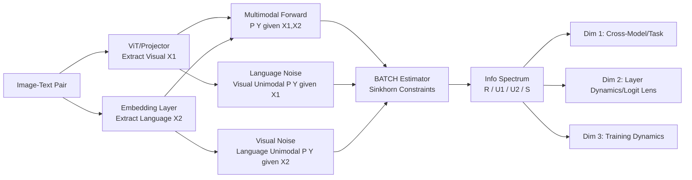

# A Comprehensive Information-Decomposition Analysis of Large Vision-Language Models

**Conference**: ICLR 2026  
**OpenReview**: [https://openreview.net/forum?id=6WsBGk4Iag](https://openreview.net/forum?id=6WsBGk4Iag)  
**Code**: [https://github.com/RiiShin/pid-lvlm-analysis](https://github.com/RiiShin/pid-lvlm-analysis)  
**Area**: Interpretability / Multimodal Large Model Analysis  
**Keywords**: Partial Information Decomposition (PID), Large Vision-Language Models (LVLM), Synergy, Multimodal Fusion, Information Theory, logit lens  

## TL;DR
This work pioneeringly uses Partial Information Decomposition (PID) to decompose the "decision-relevant information" of LVLMs into four non-negative atoms: redundant, unique visual, unique language, and synergistic. It constructs a model-agnostic estimation pipeline to quantitatively characterize whether LVLMs rely on genuine cross-modal fusion or language priors across 26 models and 4 datasets from three dimensions: "breadth, depth, and time."

## Background & Motivation
- **Background**: LVLMs show impressive performance in VQA, image captioning, and open-ended reasoning, but their internal decision-making processes remain opaque. Aggregate metrics like accuracy only reflect "if" a model is correct, failing to reveal "why"—whether it genuinely integrates visual evidence or simply exploits language priors.
- **Limitations of Prior Work**: Existing LVLM interpretability works often analyze individual modalities in a "microscopic" manner (attention maps, attribution heatmaps, linear probes, multimodal neurons) or introduce ad-hoc metrics lacking theoretical grounding. While Mutual Information (MI) measures "total information," it cannot decompose complex interactions between multiple inputs.
- **Key Challenge**: Answering whether predictions are driven by vision, language, or their interaction requires a quantitative tool that is both theoretically grounded in information theory and applicable to high-dimensional LVLM embeddings, which is currently missing.
- **Goal**: To provide a process-level analysis framework applicable across models, tasks, layers, and training stages, moving beyond the "accuracy-only" evaluation paradigm.
- **Key Insight**: **【Information Spectrum】** By treating visual features $X_1$ and language features $X_2$ as two inputs and model prediction $Y$ as the target, PID decomposes the total mutual information $I(X_1,X_2;Y)$ into four non-negative atoms: Redundancy $R$, Unique Visual $U_1$, Unique Language $U_2$, and Synergy $S$. This "Information Spectrum" is used to diagnose the intrinsic information processing strategies of LVLMs.

## Method

### Overall Architecture
Given an image-text pair, the framework first extracts mean-pooled token embeddings of image and text as source features $X_1$ and $X_2$. A standard multimodal forward pass yields $P(Y|X_1,X_2)$, followed by two unimodal forward passes $P(Y|X_1)$ and $P(Y|X_2)$ where the other modality is replaced by noise. Finally, these three predictive distributions and source features are fed into the BATCH estimator to solve for $\{R, U_1, U_2, S\}$. This pipeline is a process-level descriptor characterizing model behavior without architectural changes, retraining, or ground-truth labels.

### Key Designs

**1. PID Spectrum and BATCH Estimator Implementation: Computing information atoms on high-dimensional embeddings.** PID is more useful than mutual information because interaction information $I(X_1;X_2;Y)$ in a three-variable system can be negative and difficult to interpret, whereas PID strictly decomposes $I(X_1,X_2;Y)$ into four non-negative atoms. Following the definition by Bertschinger et al., atoms are solved over a set of distributions $\Delta_P$ that maintain source-target marginals: Redundancy $R=\max_{Q\in\Delta_P} I_Q(X_1;X_2;Y)$, Unique Visual $U_1=\min_{Q\in\Delta_P} I_Q(X_1;Y|X_2)$, Unique Language $U_2=\min_{Q\in\Delta_P} I_Q(X_2;Y|X_1)$, and Synergy $S=I(X_1,X_2;Y)-\min_{Q\in\Delta_P} I_Q(X_1,X_2;Y)$. For estimation on continuous high-dimensional LVLM embeddings, this work adopts the BATCH estimator proposed by Liang et al., which parameterizes distributions with neural networks, optimizes information-theoretic objectives on minibatches, and uses Sinkhorn algorithm variants to enforce marginal constraints.

**2. Focusing Analysis on Multiple-choice VQA + Noise Masking Unimodal Conditions: Ensuring "unimodal prediction" is clean without extra components.** BATCH requires $Y$ to be a finite set, so multiple-choice VQA (e.g., {A,B,C,D}) is used to avoid noise from open-ended answer clustering and the need for extra projection heads. To estimate $P(Y|X_1)$ and $P(Y|X_2)$, a corruption scheme inspired by Meng et al. is used, replacing the other modality sequence in the embedding layer with noise: each noise vector is sampled i.i.d. from $\mathcal{N}(\mu, \mathrm{diag}(\sigma^2))$, where $\mu,\sigma$ are per-dimension means and standard deviations computed over the dataset. This "calibrated noise" erases one modality while keeping the remaining embeddings within the distribution.

**3. Confidence Threshold Re-normalization + Soft Aggregation for Output Marginals: Preventing measurement artifacts from restricted candidates.** Re-normalization on restricted candidate sets can inflate confidence; when a model gives low scores to all candidates in the full vocabulary, forced normalization creates artificial structure. Thus, token-length normalized scores $S_{\mathrm{orig}}$ are computed first, and a threshold is applied: if $\sum_{y\in\mathcal{Y}} S_{\mathrm{orig}}(Y{=}y|\cdot)\geq\tau$, the normalized $P(Y|\cdot)$ is used; otherwise, it reverts to a uniform distribution $U(K)$ over $K=|\mathcal{Y}|$ to prevent low-confidence guessing from polluting PID calculations. For marginal $P(Y)$ estimation, soft aggregation is used: the normalized distributions of $N$ samples are averaged $P(Y)=\frac{1}{N}\sum_{i=1}^N \hat{P}_i(Y)$, preserving true output statistics and ensuring faithful PID analysis.

**4. Three-Dimensional Analysis Protocol: Breadth × Depth × Time.** The framework provides four-atom spectra, but insights come from three complementary dimensions. The breadth dimension performs large-scale comparisons across 26 models and 4 datasets, cross-validated by a behavioral intervention (accuracy drop $D_{\mathrm{vision}}$ after removing images). The depth dimension uses logit lens on representative models (InternVL3, Qwen2.5-VL, LLaVA-1.5) to project hidden states to the LM head for per-layer PID. The time dimension replicates the two-stage training of LLaVA-1.5, saving checkpoints to characterize the emergence of fusion.

## Key Experimental Results

### Main Results: Correlation between Accuracy and PID Atoms (Spearman ρ across 26 models)

| Dataset | Type | $S$ (ρ) | $U_2$ (ρ) | $I(X_1,X_2;Y)$ (ρ) | $I(X_1;X_2;Y)$ (ρ) |
|---|---|---|---|---|---|
| MMBench | Synergy-driven | **0.750** (p<0.001) | 0.194 | 0.632 | -0.757 |
| POPE | Synergy-driven | **0.742** (p<0.001) | -0.009 | 0.157 | -0.701 |
| Reefknot | Knowledge-driven | 0.357 (p=0.073) | 0.313 | 0.266 | -0.348 |
| PMC-VQA | Knowledge-driven | 0.432 (p=0.027) | **0.406** (p=0.040) | 0.559 | -0.587 |

On synergy-driven tasks, $S$ is the strongest correlate of accuracy (ρ≈0.75); on knowledge-driven tasks, $U_2$ becomes more predictive (significant on PMC-VQA), while $S$ remains beneficial but not dominant.

### Intervention Validation: Correlation between Image Removal Accuracy Drop $D_{\mathrm{vision}}$ and $S$

| Dataset | $D_{\mathrm{vision}}$ vs $S$ (ρ) | p-value |
|---|---|---|
| MMBench | 0.809 | <0.001 |
| POPE | 0.744 | <0.001 |
| Reefknot | 0.459 | 0.018 |
| PMC-VQA | 0.400 | 0.043 |

Models with higher $S$ are more sensitive to visual ablation, confirming that $S$ captures decision-relevant visual dependence.

### Ablation Study: Scaling Effects on Synergy-driven Tasks (ΔAcc vs ΔS, ΔU₂)

| Family | Scale (B) | S→M ΔAcc | S→M ΔS | S→M ΔU₂ | M→VL ΔAcc | M→VL ΔS |
|---|---|---|---|---|---|---|
| LLaVA-OneVision | 0.5→7→72 | 11.9 | 11.9 | -6.5 | 3.1 | 14.8 |
| InternVL2.5 | 2→8→78 | 7.3 | 36.8 | -55.6 | 3.6 | 10.6 |
| InternVL3 | 2→8→78 | 2.7 | 2.5 | -6.2 | 6.4 | 4.6 |

The proportion of unique language $U_2$ does not systematically increase with scale (it often decreases); accuracy gains align more with the growth of $S$, refuting the common expectation that larger models rely more on language priors.

### Key Findings
- **Finding 1-2 (Task Level)**: Benchmarks fall into two mechanisms: **Synergy-driven** (MMBench/POPE, high $S$) and **Knowledge-driven** (Reefknot/PMC-VQA, low $S$, high $U_2$). Synergy-driven accuracy is primarily determined by $S$, while $U_2$ is more predictive in knowledge-driven tasks.
- **Finding 3-4 (Model Level)**: Model families exhibit stable, opposing strategies: **Fusion-centric** (InternVL2.5/3, Qwen2.5-VL; high $S$, low $U_2$) vs. **Language-centric** (Gemma3, Cambrian; low $S$, high $U_2$). Scaling primarily strengthens $S$ rather than $U_2$.
- **Finding 5 (Layer-wise)**: A consistent **three-phase** information flow exists: info emerges in middle-late layers, language-based representation peaks in the penultimate layer ($U_2$), and decisive synergistic fusion occurs in the final layer ($S$). $R$ and $U_1$ remain minimal throughout.
- **Finding 6 (Training)**: In LLaVA-1.5 training, $S$ is negligible during alignment pre-training and **primarily emerges during visual instruction tuning**.

## Highlights & Insights
- **Quantifying "Fusion" as a Non-negative Scalar**: Previously a qualitative concept, "multimodal fusion" is given a theoretically grounded measure via synergy $S$, which explains accuracy better than total information $I(X_1,X_2;Y)$. Superior models better convert overlapping cues into effective cross-modal synergy.
- **Mutual Reinforcement of Three Evidence Chains**: Correlation (ρ≈0.75), behavioral intervention ($D_{\mathrm{vision}}$ vs $S$), and stable family strategies collectively support that $S$ captures true visual dependence.
- **Pinpointing the "Birth" of Fusion**: The vague notion of "instruction tuning importance" is refined to "$S$ is almost entirely unlocked during visual instruction tuning," providing a diagnostic signal for future training design.

## Limitations & Future Work
- **Discrete Target Space Constraint**: PID estimation requires a finite $Y$, limiting the framework to multiple-choice VQA rather than open-ended generation.
- **Approximation of Unimodal Probes**: Using calibrated noise to mask a modality is a stable proxy, but $U_1, U_2, S$ are measured under these probes rather than natural unimodal inputs.
- **Correlation vs. Causality**: PID atoms are derived from predictions; their relationship with accuracy/interventions is correlational, not a complete causal mechanism.
- **Future Work**: Develop PID estimators for generative settings; use $(U_1, U_2, S)$ as diagnostic signals or auxiliary objectives for scaling and instruction tuning.

## Related Work & Insights
- **VLM Interpretability**: Methods like attribution heatmaps, attention analysis, and logit lens are often single-modality "microscopic" views. This work unifies these into an information-theoretic framework.
- **Information Theory × Multimodal Learning**: While MI and Information Bottleneck (IB) are used for representation learning, they cannot decompose multi-input interactions. This work is the first to apply PID to modern LVLM analysis of composition, flow, and evolution.
- **Insights**: The "process-level descriptor" approach can be transferred to any multi-input system where source features and finite targets can be defined.

## Rating
- **Novelty**: ⭐⭐⭐⭐⭐ First systematic, large-scale application of PID for internal LVLM analysis. The "Information Spectrum" perspective is theoretically grounded and provides actionable insights.
- **Experimental Thoroughness**: ⭐⭐⭐⭐⭐ 26 models × 4 datasets across breadth/depth/time dimensions with multiple cross-validations.
- **Writing Quality**: ⭐⭐⭐⭐ Logic is progressive across task, family, layer, and training questions; however, PID estimation details might be steep for non-information theory readers.
- **Value**: ⭐⭐⭐⭐⭐ Provides a diagnostic tool beyond accuracy, directly aiding the understanding and design of the next generation of LVLMs.

<!-- RELATED:START -->

## Related Papers

- [\[ICLR 2026\] Neuron-Level Analysis of Cultural Understanding in Large Language Models](neuron-level_analysis_of_cultural_understanding_in_large_language_models.md)
- [\[ICLR 2026\] Inducing Dyslexia in Vision Language Models](inducing_dyslexia_in_vision_language_models.md)
- [\[ACL 2025\] Cracking Factual Knowledge: A Comprehensive Analysis of Degenerate Knowledge Neurons in Large Language Models](../../ACL2025/interpretability/degenerate_knowledge_neurons.md)
- [\[ICLR 2026\] Concepts' Information Bottleneck Models](concepts_information_bottleneck_models.md)
- [\[ICLR 2026\] Linear Mechanisms for Spatiotemporal Reasoning in Vision Language Models](linear_mechanisms_for_spatiotemporal_reasoning_in_vision_language_models.md)

<!-- RELATED:END -->
