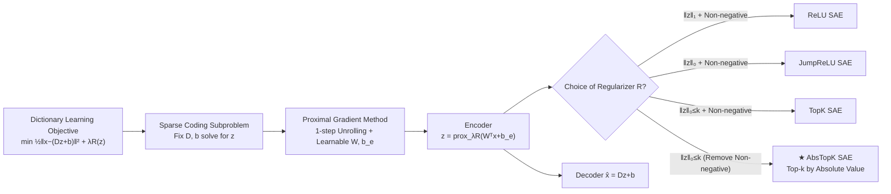

# AbsTopK: Rethinking Sparse Autoencoders For Bidirectional Features

**Conference**: ICLR 2026  
**OpenReview**: [https://openreview.net/forum?id=EEs6I4cO7S](https://openreview.net/forum?id=EEs6I4cO7S)  
**Code**: TBD  
**Area**: Interpretability / Mechanistic Interpretability  
**Keywords**: Sparse Autoencoders, Dictionary Learning, Proximal Gradient, Bidirectional Features, Activation Steering, LLM Interpretability  

## TL;DR
This paper derives SAEs using a unified framework of "unrolled proximal gradient descent for sparse coding," proving that ReLU, JumpReLU, and TopK are proximal operators for different sparse regularizers. It identifies that their shared non-negativity constraint splits bidirectional semantic concepts (e.g., male vs. female) into two redundant features. Consequently, the authors propose **AbsTopK SAE**, which removes the non-negativity constraint and selects the top $k$ activations by absolute value. This allows a single feature to encode opposite concepts using signs, outperforming TopK and JumpReLU in reconstruction, interpretability, and steering tasks, while rivaling or exceeding supervised Difference-in-Mean.

## Background & Motivation
**Background**: Sparse Autoencoders (SAEs) are the mainstream tools for mechanistic interpretability in LLMs, decomposing hidden states into a set of overcomplete, ideally interpretable features (e.g., Golden Gate Bridge, sycophantic tone, Hebrew characters). By amplifying or suppressing specific features, one can steer model behavior. Various variants like ReLU, JumpReLU, and TopK exist, but most are constructed empirically by "swapping activation functions."

**Limitations of Prior Work**: ① There is a lack of a principled framework to derive these variants from the original dictionary learning objective, making it impossible to systematically analyze their implicit regularizers and common drawbacks. ② More critically, recent research found that simple supervised methods like Difference-in-Mean (DiM, which calculates a direction vector by the mean difference between positive and negative samples for a concept) outperform SAEs on many steering benchmarks. This raises doubts about whether SAE features faithfully correspond to the model's internal representations.

**Key Challenge**: All current SAEs (ReLU/JumpReLU/TopK) use sparse regularizers that **force activations to be non-negative**, retaining only positive activations. However, the linear representation hypothesis and classical word analogies ($v_{king} - v_{man} + v_{woman} \approx v_{queen}$) suggest that many semantic axes are inherently **bidirectional**; positive and negative displacements along a concept direction represent opposite meanings (e.g., male/female, positive/negative sentiment). The non-negativity constraint effectively cuts the representation space in half, forcing the model to either use two independent features to represent "male" and "female" (fragmentation, redundancy) or discard one direction entirely. This is the structural root cause of incomplete SAE representations and inferior steering compared to DiM.

**Goal**: Establish a unified derivation framework from dictionary learning to SAEs and answer whether non-negative activation is truly necessary for SAEs and if allowing negative activations enables the discovery of richer bidirectional concepts.

**Core Idea**: **"Unified SAE via Proximal Unrolling + $\ell_0$ Hard Thresholding without Non-negativity"**. The SAE encoder is interpreted as a one-step unrolling of the proximal gradient for sparse coding, where different activation functions correspond to proximal operators of different regularizers. By choosing a pure $\ell_0$ constraint without non-negativity, the proximal operator becomes **AbsTopK**, which selects the top $k$ components by absolute value, naturally preserving positive and negative activations.

## Method

### Overall Architecture
The starting point is the classic dictionary learning objective: learn an overcomplete dictionary $D$ such that each token's hidden representation $x$ can be reconstructed by a sparse linear combination $x \approx Dz + b$ (where $z$ is sparse). Solving for $z$ with a fixed dictionary is a sparse coding problem, which can be solved iteratively using the **proximal gradient method**. This paper takes zero initialization, a step size of 1, performs one iteration, and replaces fixed parameters with learnable parameters $W$ and $b_e$. Thus, this single proximal update $z = \mathrm{prox}_{\lambda R}(W^\top x + b_e)$ exactly matches the form of an SAE encoder, paired with a decoder $\hat{x} = Dz + b$. In other words, **"the choice of sparse regularizer $R$" is equivalent to "the choice of activation function"**. This unifies scattered SAE variants into a single proximal perspective and exposes their shared non-negativity shortcoming, leading to AbsTopK.

### Key Designs

**1. Unified Proximal Unrolling Framework: Reinterpreting activations as proximal operators.** This is the theoretical foundation. Starting from the proximal gradient update $z^{(t+1)} = \mathrm{prox}_{\mu\lambda R}(z^{(t)} - \mu D^\top(Dz^{(t)} + b - x))$, setting $z^{(0)} = 0$ and $\mu = 1$ for one step, and replacing dictionary-related constants with learnable $W$ (for $D$) and $b_e$ (for $-D^\top b$), yields the encoder $z = \mathrm{prox}_{\lambda R}(W^\top x + b_e)$. Lemma 1 in the paper provides three correspondences: the proximal operator of $R(z) = \|z\|_1 + \iota_{\{z \ge 0\}}$ is the soft-thresholding $\mathrm{ReLU}_\lambda$; $R(z) = \|z\|_0 + \iota_{\{z \ge 0\}}$ corresponds to $\mathrm{JumpReLU}_{\sqrt{2\lambda}}$; and $R(z) = \iota_{\{\|z\|_0 \le k, z \ge 0\}}$ corresponds to $\mathrm{TopK}_k$. This clarifies why ReLU is inferior to JumpReLU/TopK (it corresponds to an $\ell_1$ convex relaxation) and highlights that all three include the non-negativity indicator $\iota_{\{z \ge 0\}}$.

**2. Removing Non-negativity → AbsTopK Hard Thresholding Operator.** Since the non-negativity constraint is embedded in the regularizer, it is removed: a pure $\ell_0$ constraint $R(z) = \iota_{\{\|z\|_0 \le k\}}$ is used (no longer requiring $z \ge 0$). Its proximal operator solves $\min_z \frac{1}{2}\|u - z\|_2^2 \text{ s.t. } \|z\|_0 \le k$, and the closed-form solution is to keep the **top $k$ components of $u$ with the largest absolute values and zero the rest**. That is, $(\mathrm{AbsTopK}_k(u))_i = u_i$ if $i \in H_k(u)$ and $0$ otherwise, where $H_k$ is the set of indices of the top $k$ components by magnitude. The only difference from TopK is that TopK takes the top $k$ positive values (implicitly performing a ReLU), whereas AbsTopK takes the top $k$ magnitudes and **retains their original signs**. This is the classic hard-thresholding operator from compressed sensing.

**3. Encoding Bidirectional Semantics with Signs, Eliminating Fragmentation.** The design motivation comes from a toy example: $man \approx male + people$, $woman \approx female + people$. Because non-negative SAEs cannot take negative values, they must allocate two oppositely oriented dictionary atoms $d_i, d_j$ (each with non-negative activations) to represent "male" and "female," splitting and redundantly representing the semantic axis. AbsTopK requires only **one signed "gender" feature**, where positive activation represents male and negative represents female, compactly fitting the bipolar semantic axis into one dimension. This design explains why AbsTopK achieves tighter reconstruction and more controllable steering.

## Key Experimental Results

Training Setup: JumpReLU, TopK, and AbsTopK SAEs were trained on monology/pile-uncopyrighted across multiple models: GPT-2 Small, Pythia-70M, Gemma-2-2B, Gemma-3-12B, Qwen3-4B, and Llama-3.1-8B. Evaluation covers unsupervised metrics, 7 probing/steering tasks, and the safety-utility trade-off.

### Main Results (Steering Safety vs. General Capability, Excerpt from Table 1)

| Model | Layer | Metric | Original | JumpReLU | TopK | **AbsTopK** | DiM (Supervised) |
|-------|-------|--------|----------|----------|------|-------------|------------------|
| Qwen3-4B | 18 | MMLU↑ | 77.3 | 75.0 (-2.3) | 75.2 (-2.1) | **75.9 (-1.4)** | 75.8 (-1.5) |
| Qwen3-4B | 18 | HarmBench↑ | 17.0 | 79.1 (+62.1) | 78.2 (+61.2) | **81.3 (+64.3)** | 80.6 (+63.6) |
| Gemma2-2B | 12 | MMLU↑ | 52.2 | 48.8 (-3.4) | 49.1 (-3.1) | **51.3 (-0.9)** | 51.0 (-1.2) |
| Llama3.1-8B | 24 | HarmBench↑ | 15.2 | 89.9 (-) | 89.2 (-) | 91.3 (+76.1) | **92.4 (+77.2)** |

Interpretation: Conventional SAEs improve safety (HarmBench) but cause significant drops in general capability (MMLU). AbsTopK achieves the best safety-utility trade-off. Compared to DiM, which requires labeled data and extracts single concepts, AbsTopK provides comparable safety with better preservation of general capability.

### Ablation Study (Feature Bidirectionality, Table 2, Gemma-2-2B)

| Category | AbsTopK (L12) | TopK (L12) | AbsTopK (L16) | TopK (L16) |
|----------|---------------|------------|---------------|------------|
| Bidirectionally Meaningful (Total) | 29.7% | 5.3% | 31.2% | 4.1% |
| ↳ Positive/Negative are Opposites | 20.2% | 2.6% | 21.5% | 1.8% |
| Unidirectionally Meaningful | 56.4% | 78.8% | 57.8% | 80.3% |
| No Clear Meaning | 13.9% | 15.9% | 11.0% | 15.6% |

### Key Findings
- **Reconstruction and Language Modeling**: On Qwen3-4B Layer 20, AbsTopK achieves lower training MSE, the smallest normalized reconstruction error at most sparsity levels, and the highest Loss Recovered.
- **7 Probing/Steering Tasks**: AbsTopK generally outperforms TopK and JumpReLU on Unlearning, Absorption, SCR, TPP, RAVEL, and Sparse Probing. Its advantage is particularly pronounced in SCR, which directly measures the reliability of bidirectional interventions.
- **Bidirectionality is Not Noise**: The percentage of "No Clear Meaning" features in AbsTopK is comparable to TopK (~11-16%), indicating that the additional bidirectional features are not merely noise. TopK itself has a few "opposite meaning" features (2-3%), suggesting the underlying representation naturally supports bidirectional axes, but non-negativity prevents full utilization. AbsTopK effectively "promotes" many unidirectional features into meaningful bidirectional ones.

## Highlights & Insights
- **Theoretical Elegance**: Using "one-step proximal gradient unrolling + learnable parameters" unifies ReLU, JumpReLU, and TopK into one formula. This naturally explains why ReLU is inferior to the others as a choice between $\ell_1$ relaxation and $\ell_0$ strong regularization.
- **Minimal Code Change, Maximal Gain**: Compared to TopK, AbsTopK simply replaces "select top positive values" with "select top magnitudes and retain signs." This one-line change unlocks bidirectional features and significantly closes the gap with supervised DiM.
- **Precise Problem Diagnosis**: Attributing the failure of SAEs to outperform simple DiM to semantic fragmentation caused by non-negativity, supported by both toy examples and automated evaluation.
- **Control Insights**: Bidirectional features are crucial for steering tasks—many interventions require movement in both directions along a semantic axis, which unidirectional features cannot natively support.

## Limitations & Future Work
- **Only Evaluated $\ell_0$/AbsTopK Path**: The paper notes that hard thresholding could be extended to JumpReLU (setting thresholds for both positive and negative activations), but this was omitted to isolate the "bidirectional axis" hypothesis.
- **Single-Step Proximal is an Approximation**: The encoder performs only one step, which is an approximation of the exact sparse code. Multi-step unrolling (multi-layer encoders) might provide more accurate sparse codes but with higher computational costs.
- **Scalability of $\ell_0$ Operator**: AbsTopK relies on the top-k hard threshold. The paper calls for more efficient or neuroplasticity-aligned $\ell_0$ approximations for extremely large models.
- **Reliance on LLM-based Evaluation**: Bidirectionality classification was performed using Gemini 2.5 Flash, which carries risks of scoring bias and lacks large-scale human verification.

## Related Work & Insights
This work sits at the intersection of three lines of research: ① SAE variant taxonomy (ReLU, JumpReLU, TopK), unified here via proximal frameworks; ② Dictionary learning and unrolled networks (ISTA, LISTA, proximal gradients, hard thresholding), specifically bringing hard-thresholding to SAEs; ③ Supervised steering methods (DiM) and linear representation hypotheses. A key insight for future research is that sparse interpretability tools should be designed by "choosing regularizers" rather than just "swapping activations," while reconsidering default constraints like non-negativity that may sacrifice representation integrity.

## Rating
- **Novelty**: ⭐⭐⭐⭐⭐ Unified proximal framework + AbsTopK without non-negativity, providing a theoretical explanation for the shortcomings of existing variants.
- **Experimental Thoroughness**: ⭐⭐⭐⭐ Covers 4-6 models, multiple layers, 3 unsupervised metrics + 7 probing/steering tasks + safety-utility trade-offs + automated bidirectionality evaluation.
- **Writing Quality**: ⭐⭐⭐⭐⭐ Clean theoretical derivation (Lemma 1) and clear causal links from problem diagnosis to solution.
- **Value**: ⭐⭐⭐⭐⭐ A one-line code change allows SAEs to rival or exceed supervised DiM and unlocks bidirectional controllable steering, offering immediate utility to the community.

<!-- RELATED:START -->

## Related Papers

- [\[ICLR 2026\] Sparse Autoencoders Trained on the Same Data Learn Different Features](sparse_autoencoders_trained_on_the_same_data_learn_different_features.md)
- [\[ICLR 2026\] Learning Multimodal Dictionary Decompositions with Group-Sparse Autoencoders](learning_multimodal_dictionary_decompositions_with_group-sparse_autoencoders.md)
- [\[ICLR 2026\] Toward Faithful Retrieval-Augmented Generation with Sparse Autoencoders](toward_faithful_retrieval-augmented_generation_with_sparse_autoencoders.md)
- [\[ICLR 2026\] On the Limits of Sparse Autoencoders: A Theoretical Framework and Reweighted Remedy](on_the_limits_of_sparse_autoencoders_a_theoretical_framework_and_reweighted_reme.md)
- [\[ICLR 2026\] Uncovering Conceptual Blindspots in Generative Image Models Using Sparse Autoencoders](uncovering_conceptual_blindspots_in_generative_image_models_using_sparse_autoenc.md)

<!-- RELATED:END -->
