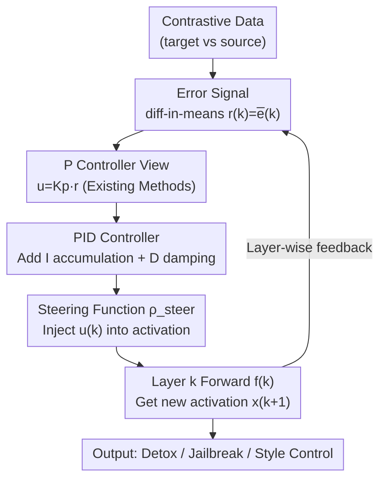

# Activation Steering with a Feedback Controller

**Conference**: ICLR2026  
**OpenReview**: [https://openreview.net/forum?id=vzkEX2SwFD](https://openreview.net/forum?id=vzkEX2SwFD)  
**Code**: https://github.com/dungnvnus/pid-steering  
**Area**: Interpretability / Activation Steering  
**Keywords**: Activation Steering, Control Theory, PID Controller, Steady-state Error, Safety Alignment

## TL;DR
This paper reinterprets LLM activation steering as a feedback control problem in control theory. It proves that mainstream methods such as ActAdd, DirAblate, and Mean-AcT are essentially Proportional (P) controllers and thus possess inherent steady-state errors. Consequently, it proposes using a full PID controller to calculate steering vectors (PID Steering), which consistently outperforms original methods in tasks like detoxification, jailbreaking, and image style control.

## Background & Motivation
**Background**: To align LLM behavior with expectations (e.g., reducing toxic content, refusing harmful requests, changing generation styles), a popular lightweight alternative to costly post-training (SFT/RLHF) is **activation steering**. This involves adding a "steering vector" directly to the hidden states of specific layers during inference to push activations from regions representing concept A toward those representing concept B. Steering vectors are typically calculated using "difference-in-means": the difference between the mean activations of two contrasting datasets (e.g., harmful vs. harmless prompts) at each layer, resulting in a direction $r(k)=\mu_{\text{target}}(k)-\mu_{\text{source}}(k)$.

**Limitations of Prior Work**: Most of these methods (ActAdd adding $x+\alpha r$, DirAblate projecting activations onto the orthogonal complement of $r$, Mean-AcT using layer-wise incremental estimation) are almost entirely **empirically driven** and lack theoretical performance guarantees. Crucially, the authors found they share a common flaw: the steering effect leaves a **residual bias that cannot be eliminated**. Even when attempting to drive the error to zero, it consistently plateaus at a non-zero level.

**Key Challenge**: The fundamental reason is that these methods focus only on the "current layer error" for correction, where the correction amount is proportional to the current error. In control theory, this is exactly the form of a **pure Proportional (P) controller**. A classic defect of P-controllers is the existence of **steady-state error**: when a system is subjected to persistent disturbances, the residual bias cannot be eliminated by proportional terms alone, regardless of the gain, while increasing the gain leads to oscillations. The autoregressive and layer-by-layer nature of LLMs constitutes a dynamical system with disturbances, but previous algebraic perspectives (treating activation space as static geometry) completely ignore this dynamical structure.

**Goal**: (1) Provide a rigorous control-theoretic framework for activation steering; (2) Find a steering vector calculation method that eliminates steady-state error without introducing severe oscillations or overshoot.

**Key Insight**: Since existing methods = P-controllers, control theory already offers a solution—the **Integral (I) term** specifically used to eliminate steady-state bias and the **Derivative (D) term** specifically used to suppress overshoot. Combining all three yields the **PID controller**, a staple in industry for a century.

**Core Idea**: Replace implicit P-controllers with a full PID controller to calculate steering vectors—the P term aligns with target semantic directions, the I term accumulates errors across layers to eliminate persistent bias, and the D term suppresses sharp changes in activation to reduce overshoot. this links activation steering to the stability guarantees of control theory.

## Method

### Overall Architecture
The layer-wise forward pass of an LLM, $x(k{+}1)=f^{(k)}(x(k))$, is viewed as the state evolution of a discrete-time dynamical system, where the steering vector is the "control input" $u(k)$ applied to this system. The control goal is to make the activation difference (error signal) $\bar e(k)$ between two contrasting datasets converge to zero—effectively making the steered branch behave entirely like the target. The entire pipeline is a **layer-wise closed loop**: at each layer, the error signal $r(k)\!=\!\bar e(k)$ is calculated via difference-in-means, fed into a PID controller to compute the steering vector $u(k)$, and then injected into the activations via a steering function $\rho_{\text{steer}}$. The resulting next-layer activation determines the subsequent error signal, forming a feedback loop.

The key novelty is not inventing a new module but **reinterpretation and upgrading**: first proving that "existing methods = P-controllers" (using only $K_p r(k)$), and then upgrading the controller to PID (adding integration of historical errors and differentiation of error change rates). Since PID only modifies the step of "how to calculate $u(k)$," it is a **plug-and-play** replacement that can be applied to any steering paradigm such as ActAdd, DirAblate, or Mean-AcT (the combination with Mean-AcT is termed PID-AcT).

### Key Designs

**1. Rewriting Activation Steering as a State-Feedback P-Controller: Revealing the Root of Steady-State Error**

This is the "foundation" of the paper. The authors discretize a continuous-time state-feedback controller $\dot x(t)=g(x(t),u(t),t)$ (using the Euler method) and set the system dynamics as $g=f(\rho_{\text{steer}}(x,u),t)-x$, yielding $x(k)=f^{(k)}(\rho_{\text{steer}}(x(k{-}1),K_p r(k{-}1)))$. Comparing this with existing steering methods $x(k)=f^{(k)}(\rho_{\text{steer}}(x(k{-}1),r(k{-}1)))$ immediately reveals: **existing methods are pure P-controllers with control input $u(k)=K_p r(k)$**, where the difference-in-means vector $r(k)$ plays the role of the "state tracking error" $e(k)=x_{\text{sp}}(k)-x(k)$ ($x_{\text{sp}}$ is the setpoint, i.e., target state). With different $\rho_{\text{steer}}$ and error calculation methods, this recovers ActAdd ($x+\alpha u$, non-sequential), DirAblate (projection onto orthogonal complement), and Mean-AcT ($x+\alpha u$, sequential).

With this equivalence, Proposition 1 provides a theoretical verdict: P-controlled activation steering guarantees **Input-to-State Stability (ISS)**, but as long as a persistent disturbance $w(k)$ exists, the error will converge to a **non-zero steady-state value proportional to the disturbance** $\bar e_{ss}\propto w$. That is, all these methods naturally fail to eliminate residual bias—this is a structural issue of the controller, not a tuning problem.

**2. PID Steering: Using Integral to Eliminate Bias and Derivative to Suppress Overshoot**

Since P-controllers are structurally flawed, the authors upgrade the control input to a full PID. In continuous time $u(t)=K_p r(t)+K_i\!\int_0^t r(\tau)d\tau+K_d\frac{dr(t)}{dt}$, which after discretization via Lemma 1 yields the core formula:

$$u(k)=K_p\,r(k)+K_i\sum_{j=0}^{k-1} r(j)+K_d\big(r(k)-r(k-1)\big).$$

Each of the three terms has a specific motivation: the **P term** $K_p r(k)$ provides immediate correction for the current error, ensuring the steering responds to the semantic direction of each layer; the **I term** $K_i\sum_{j<k} r(j)$ accumulates errors from all preceding layers, effectively "remembering" the persistent bias missed by the P term to compensate for the steady-state error; the **D term** $K_d(r(k)-r(k{-}1))$ monitors the **rate of change** of the error, pulling back when the error drops too quickly to damp the overshoot caused by the I term. Note that "time" here refers to the **layer index $k$**: integration equals accumulation across layers, and differentiation equals the difference between adjacent layers. PID unfolds layer-by-layer in the forward direction without extra training or weight updates.

**3. Sequential vs. Non-sequential Error Signal Calculation: Respecting Layer-wise Causality**

The paper follows two approaches for calculating $r(k)$. **Non-sequential** calculates difference-in-means directly on original (unsteered) activations $r(k)=\mathbb{E}_{\text{target}}[x_{\text{sp}}(k)]-\mathbb{E}_{\text{source}}[x(k)]$, which is simple but ignores the causal dependency where interventions in one layer change activations in the next. **Sequential** (inherited from Mean-AcT) first injects the calculated $u(k{-}1)$, performs a forward pass to get $\tilde x(k)$, and then calculates the difference-in-means on this intervened activation. The latter aligns better with closed-loop control—each correction is built upon a state that has already been corrected, avoiding redundant or conflicting interventions. The primary configuration PID-AcT uses the sequential approach.

**4. Theoretical Stability Guarantees: ISS, Bias Elimination, and Overshoot Suppression**

To ensure PID is more than just empirically effective, the authors provide theorems. Proposition 3 proves that under appropriate gains, the PI closed-loop remains ISS, and the **integral term precisely cancels the "matchable" component** $w_\parallel$ of the disturbance (the part falling within the range of the Jacobian), leaving only the uncompensatable orthogonal component $w_\perp$. This theoretically explains why PI can eliminate the steady-state error left by P. However, PI can **overshoot** (oscillating around the setpoint before stabilizing). Theorem 1 then proves that after adding the D term, the closed-loop remains ISS and **retains** the bias elimination ability of the integral term; Theorem 2 further proves that **the first peak of PID overshoot does not exceed that of PI** ($A_0^{\text{PID}}\le A_0^{\text{PI}}$). Together: PID eliminates the steady-state error of P while suppressing the oscillations of PI.

### A Complete Example
Using a jailbreak task as an example: harmful prompts from ADVBENCH are used as the source, and harmless prompts from ALPACA as the target. The "refusal direction" difference-in-means $r(k)$ is calculated layer-by-layer. At layer $k$, the PID controller synthesizes the current layer error (P), accumulated error from previous layers (I), and the rate of change (D) into a steering vector $u(k)$, which is injected via ActAdd to push activations toward "non-refusal." Over the layer-wise closed loop, the error of the steered branch changes from plateaus at non-zero levels (P solo, blue line in Fig. 3) to crossing zero and converging cleanly (PID, green line), with significantly less overshoot than PI (red line). Ultimately, the model responds to harmful requests it would otherwise refuse, increasing the Attack Success Rate (ASR).

## Key Experimental Results
The study covers both text and image modalities, three downstream tasks (detoxification, jailbreaking, image style control), three steering paradigms (ActAdd, Mean-AcT, Angular Steering), and multiple model families (Qwen2.5, Gemma2, Llama3, 3B–14B; diffusion models SDXL-Lightning, Flux).

### Main Results: Toxicity Mitigation
On RealToxicityPrompts, PID-AcT achieves the strongest toxicity reduction while maintaining general capabilities (PPL / MMLU remain stable). Below are selected results for Gemma2-2B (top) and Llama3-8B (bottom); lower is better for toxicity/PPL, higher is better for MMLU:

| Model | Method | CLS Toxic(%)↓ | 0-shot Toxic(%)↓ | QVQ(%)↓ | PPL-Wiki↓ | MMLU↑ |
|------|------|----|----|----|----|----|
| Gemma2-2B | Original | 4.17 | 13.42 | 14.17 | 13.98 | 53.1 |
| Gemma2-2B | Mean-AcT (Seq.) | 0.68 | 3.23 | 3.70 | 14.92 | 51.80 |
| Gemma2-2B | **PID-AcT (Ours)** | **0.51** | **2.90** | **3.40** | 15.22 | 51.30 |
| Llama3-8B | Original | 5.80 | 15.00 | 15.81 | 9.06 | 65.30 |
| Llama3-8B | Mean-AcT (Seq.) | 1.21 | 5.09 | 5.73 | 9.83 | 64.22 |
| Llama3-8B | **PID-AcT (Ours)** | **0.72** | **4.36** | **4.90** | 9.56 | 64.50 |

The authors report that PID-AcT reduces toxicity to approximately **1/8.2 (Gemma2) and 1/8.1 (Llama3)** of the original model, ranking first within the sequential family (Mean-AcT / Linear-AcT) and outperforming editing baselines like ActADD, AURA, ITI-C, and CAA.

### Main Results: Jailbreaking (ASR↑)
Replacing the Difference-in-Means (DIM) direction with the proposed method within the Angular Steering framework, and comparing ASR with ITI and RePE while monitoring general capabilities via tinyBenchmarks:

| Model | Method | ASR↑ | tinyMMLU↑ | tinyHellaSwag↑ |
|------|------|----|----|----|
| Qwen2.5 series | DIM | 74.03 | 66.11 | 72.40 |
| Qwen2.5 series | ITI | 70.19 | 66.62 | 72.71 |
| Qwen2.5 series | RePE | 68.44 | 65.70 | 72.03 |
| Qwen2.5 series | **PID (ours)** | **76.07** | 67.29 | 72.59 |

PID ranks first in ASR with almost no loss in general benchmarks (e.g., tinyMMLU is slightly higher than DIM).

### Key Findings
- **Error curves are most convincing**: In Figure 3, P-control (blue) plateaus at a non-zero level = steady-state error; PI (red) crosses zero but with large overshoot; PID (green) also converges to zero with significantly smaller overshoot—precisely matching the predictions of Proposition 1, Proposition 3, and Theorem 2.
- **I term for bias, D term for damping**: Ablations moving from P→PI→PID sequentially show the elimination of steady-state error followed by the suppression of overshoot, proving both terms are indispensable.
- **Costs stem from the base framework**: The slight MMLU drop in PID-AcT is attributed to the properties of the AcT framework rather than PID itself.

## Highlights & Insights
- **Unified framework via equivalence**: Proving that ActAdd, DirAblate, and Mean-AcT are P-controllers provides a clean narrative. Upgrading P→PID benefits the entire family of methods.
- **"Time Axis" on the layer dimension**: Mapping integration to cross-layer accumulation and differentiation to layer-wise differences allows classic PID theory to be seamlessly applied to LLM forward passes with zero training or weight updates.
- **Alignment between theory and curves**: Control-theoretic concepts like steady-state error and overshoot are verified through observable scalar signals $\langle\bar e(0),\bar e(k)\rangle$ rather than remaining theoretical.
- **Transferability**: viewing inference-time intervention as feedback control can be generalized to diffusion model steering, agent behavior constraints, or any scenario involving step-by-step corrections. Generality was validated in image style control for diffusion models.

## Limitations & Future Work
- **Uncompensatable orthogonal disturbances**: Proposition 3 states the integral term can only eliminate "matchable" components $w_\parallel$ in the Jacobian range space. The orthogonal component $w_\perp$ cannot be compensated.
- **Hyperparameter tuning for $K_p, K_i, K_d$**: Compared to a single $\alpha$, PID introduces more hyperparameters. Stability conditions are provided, but tuning costs and sensitivity require more systematic exploration.
- **Jailbreaking as a double-edged sword**: Using ASR increases to prove effectiveness essentially demonstrates how to bypass security mechanisms; this technology can be used for both alignment and abuse.
- **Local linearization assumptions**: Error dynamics are characterized by the mean local Jacobian $\bar A(k)$. The impact of strong non-linearity and discretization errors (Euler method) is not deeply explored. ⚠️ Refer to the Appendix for formula details.

## Related Work & Insights
- **vs. ActAdd / DirAblate / Mean-AcT (Difference-in-means family)**: These use the difference-in-means directly. This paper proves this is equivalent to P-control with steady-state error. PID serves as an "upgrade patch" for the whole family across frameworks.
- **vs. Token-level control works (Luo 2023 / Soatto 2023 / Kong 2024)**: Those apply control theory to the token generation process or treat high-level behaviors as control signals. This work dives into the **construction of layer-wise feature directions**, modeling layer-by-layer activation evolution as a dynamical system with finer control granularity.
- **vs. Activation editing baselines like CAA / ITI-C / AURA**: While these use empirical tricks, this paper provides a unified control-theoretic framework with stability guarantees, consistently outperforming them in detoxification and jailbreaking.

## Rating
- Novelty: ⭐⭐⭐⭐⭐ Unifying activation steering family as P-controllers and upgrading with PID is novel and explanatory.
- Experimental Thoroughness: ⭐⭐⭐⭐ Extensive cross-modal/task/model validation; curves match theoretical propositions. Diffusion model section is slightly brief.
- Writing Quality: ⭐⭐⭐⭐ Clear "unify then upgrade" narrative; theorems correspond well with figures. High formula density may be challenging for readers without a control-theory background.
- Value: ⭐⭐⭐⭐⭐ Plug-and-play, zero training, connects inference-time behavior control to classical control theory with both practical utility and theoretical depth.

<!-- RELATED:START -->

## Related Papers

- [\[ICML 2026\] Closing the Loop: PID Feedback Control for Interpretable Activation Steering in Symbolic Music Generation](../../ICML2026/interpretability/closing_the_loop_pid_feedback_control_for_interpretable_activation_steering_in_s.md)
- [\[NeurIPS 2025\] CBMAS: Cognitive Behavioral Modeling via Activation Steering](../../NeurIPS2025/interpretability/cbmas_cognitive_behavioral_modeling_via_activation_steering.md)
- [\[ICML 2026\] Steer Like the LLM: Activation Steering that Mimics Prompting](../../ICML2026/interpretability/steer_like_the_llm_activation_steering_that_mimics_prompting.md)
- [\[ICLR 2026\] Emergent Discrete Controller Modules for Symbolic Planning in Transformers](emergent_discrete_controller_modules_for_symbolic_planning_in_transformers.md)
- [\[ICLR 2026\] REAL: Reading Out Transformer Activations for Precise Localization in Language Model Steering](real_reading_out_transformer_activations_for_precise_localization_in_language_mo.md)

<!-- RELATED:END -->
