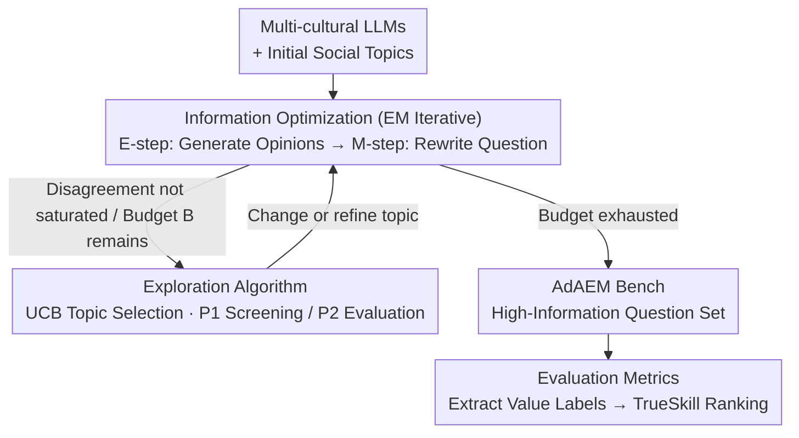

# AdAEM: An Adaptively and Automated Extensible Measurement of LLMs' Value Difference

**Conference**: ICLR 2026 (Oral)  
**arXiv**: [2505.13531](https://arxiv.org/abs/2505.13531)  
**Code**: [https://github.com/ValueCompass/AdAEM](https://github.com/ValueCompass/AdAEM)  
**Area**: Interpretability  
**Keywords**: LLM value evaluation, dynamic benchmarks, information theory optimization, Schwartz Value Theory, cultural differences

## TL;DR
The authors propose AdAEM, an adaptive and self-extending LLM value assessment framework. It uses information theory optimization to automatically generate test questions that maximize the revelation of value differences between different LLMs, addressing the "information deficiency" problem of existing static benchmarks that fail to distinguish model value orientations.

## Background & Motivation

While Large Language Models (LLMs) have made significant progress in knowledge and instruction following, they may generate harmful, biased, or illegal content. Evaluating the intrinsic value orientations of LLMs has become a crucial way to comprehensively diagnose model misalignment, cultural adaptability, and bias.

**Limitations of Prior Work**: Current value assessment benchmarks face an "information deficiency" challenge—test questions are either outdated, contaminated, or too general. They only capture shared safety value orientations (such as HHH) across different LLMs, leading to convergent and indistinguishable evaluation results. For instance, on existing benchmarks like SVS and ValueBench, GPT-4 and GLM-4 (from the US and China, respectively) show almost identical preferences in the Hedonism dimension, which is clearly unreasonable.

**Key Challenge**: Static benchmarks cannot evolve synchronously with the development of LLMs, nor can they explore controversial topics arising from cultural differences.

**Core Idea**: Design a self-extending dynamic evaluation framework. By probing the internal value boundaries of multiple LLMs from different cultures and time periods, the framework automatically generates test questions that provoke value differences, theoretically maximizing an information-theoretic objective.

## Method

### Overall Architecture
AdAEM takes a set of LLMs from different cultures and periods (e.g., models from the US and China) and a batch of initial general social topics as input. The goal is to produce a test question set that maximizes the differentiation of these models' value orientations. It models the task of "finding the most informative questions" as an iterative exploit-explore process: the exploitation side (Information Optimization) iteratively refines questions within the current topic in an EM-like manner to maximize model disagreement; the exploration side (Exploration Algorithm) uses a multi-armed bandit approach to balance between "continuing to refine the current topic" and "starting a new topic." These two phases alternate until the budget is exhausted. The final question set is then passed to an evaluation module, which extracts value labels from each model's response and aggregates them into comparable value scores using relative rankings.

### Key Designs

**1. Information Optimization: Forcing value disagreement through question design**

The fundamental flaw of static benchmarks is that questions are too "safe," causing all LLMs to give convergent HHH responses. AdAEM explicitly incorporates "discriminability" into the optimization objective, seeking a question $x$ that maximizes the distance between the value distributions of different models. The objective function is the sum of two terms: the first is the KL divergence of each model $\theta_i$'s value distribution $p_{\theta_i}(v|x)$ relative to the group average distribution $p_M(v|x)$, which is essentially a generalized Jensen-Shannon divergence—a larger divergence indicates models "argue" more over this question. The second is a decoupling regularization term that penalizes the deviation between the question's inherent value bias $\hat p(v|x)$ and the models' actual stances, preventing questions with strong leading phrasing from forcing model responses into false disagreements.

$$x^* = \arg\max_x \sum_{i=1}^K \left\{ \alpha_i \, \text{KL}\big[p_{\theta_i}(v|x) \,\|\, p_M(v|x)\big] + \frac{\beta}{2} \sum_v \big|\hat p(v|x) - p_{\theta_i}(v|x)\big| \right\}$$

where $\alpha_i$ represents model weights and $\beta$ controls the strength of decoupling. Since questions are discrete text and gradients cannot be calculated, the authors approximate this $\arg\max$ using EM-like iterations in the text space: the E-step (Response Generation) has each model generate several opinions for the current question, keeping the one with the highest score; the M-step (Question Refinement) fixes these opinions and rewrites the question to be more informative. Each refinement round is checked against four dimensions: value consistency, value difference, semantic coherence, and semantic difference, ensuring the questions amplify disagreement while remaining readable and on-topic.

**2. Exploration Algorithm: Using multi-armed bandits to decide whether to refine or move on**

Relying solely on optimizing a single topic can lead to local optima, but blindly expanding to new topics is costly. AdAEM treats each candidate topic as an arm of a bandit and uses a UCB strategy to adaptively balance between "continuing to refine the current most promising topic" and "exploring unmined new topics," prioritizing limited budget on high-reward directions. To further reduce costs, the system uses tiered model collaboration: a set of smaller, faster LLMs (P1) performs low-cost topic exploration and screening, then high-potential questions are passed to a stronger set of LLMs (P2) for final scoring. The total number of explorations is capped by budget $B$, maintaining a controllable curve between question quality and computational overhead.

**3. Evaluation Metrics: Extracting value labels and aggregating via relative ranking**

A model's response often contains mixed stances; assigning an absolute score is neither stable nor comparable. AdAEM first performs opinion-based value assessment: multiple independent opinions are extracted from each LLM response, and a classifier identifies labels across Schwartz's 10 value dimensions for each opinion. These are then merged via a logical OR into a value profile for that model on that question. In the aggregation stage, instead of absolute scores, TrueSkill (a Bayesian skill rating) is used to conduct pairwise comparisons across models for each dimension, iteratively updating "skill" values. The final value score is represented by the win rate. Relative ranking naturally handles differences in response styles across models, making it more robust and reproducible than absolute scoring.

### Loss & Training
AdAEM does not involve parameter training; all optimization is performed in-context via LLM API calls. The core objective is the $x^*$ formula provided in "Information Optimization." The sum of the information term (generalized JS divergence) and the decoupling regularizer (strength $\beta$) constitutes the object to be maximized. The $\arg\max$ is solved approximately in the text space via EM iterations without any gradient backpropagation.

## Key Experimental Results

### Main Results
AdAEM Bench is built on the 10 dimensions of Schwartz Value Theory, containing 12,310 test questions covering 106 countries.

| Benchmark | # Questions | Avg. Length | Self-BLEU | Similarity |
|-----------|-------------|-------------|-----------|------------|
| SVS | 57 | 13.00 | 52.68 | 0.61 |
| ValueBench | 40 | 15.00 | 26.27 | 0.60 |
| ValueDCG | 4,561 | 11.21 | 13.93 | 0.36 |
| **AdAEM** | **12,310** | **15.11** | **13.42** | **0.44** |

### Ablation Study

| Configuration | Key Metric | Description |
|---------------|------------|-------------|
| Value Priming Experiment | Target Value +31%, Opposite Value -58% | p < 0.01, validating assessment effectiveness |
| Intragroup Value Change | +17% | Consistent with Schwartz value structure predictions |
| Reliability Analysis | Cronbach's α = 0.8991 | "Good" reliability |
| Human Evaluation Improvement | Reasonableness +6.7%, Value Discriminability +31.6% | Cohen's κ = 0.93 |

### Key Findings
- Benchmarking 16 LLMs revealed four interesting findings: (1) more advanced LLMs prefer safety-related dimensions (e.g., Universalism); (2) LLMs in the same series show similar value orientations regardless of model size; (3) significant value differences exist between reasoning and chat LLMs; (4) larger LLMs enhance specific dimensional preferences.
- AdAEM surpasses baseline benchmarks in information score after only a few iterations.
- Across different topic categories (e.g., technical innovation vs. philosophical beliefs), all LLMs exhibit distinctly different value orientations.
- GLM-4 (Chinese developed) and GPT-4-Turbo (US developed) show significant regional differences on culture-related topics.

## Highlights & Insights
- This is the first work to introduce dynamic evaluation into the LLM value assessment field, featuring an elegant, theory-driven self-extension mechanism.
- The design of the information-theoretic objective function is clever, balancing both discriminability and decoupling.
- The explore-exploit strategy via Multi-Armed Bandit is natural and efficient.
- The introduction of the TrueSkill rating system is more reliable compared to traditional absolute scoring.
- The ICLR 2026 Oral designation indicates high recognition from reviewers.
- Cross-cultural analysis reveals cultural biases within LLM training data and alignment strategies.

## Limitations & Future Work
- Restricted to Schwartz Value Theory, not covering Moral Foundations Theory (MFT) or Kohlberg’s stages of moral development.
- Primarily focused on the English context, with insufficient exploration of multilingual and multicultural scenarios.
- Due to budget constraints, only a limited set of representative LLMs were selected.
- Automatically generated controversial content could potentially be misused.
- The value classifier (GPT-4o) itself may contain biases.

## Related Work & Insights
- Complementary to static benchmarks like ValueBench and ValueDCG, introducing a dynamic evaluation paradigm.
- Inspired by dynamic evaluation work such as DyVal, but applied to value assessment for the first time.
- Related to black-box optimization work like PromptAgent, but with an objective function focused on value differentiation.
- Insight: This method can be transferred to other evaluation scenarios requiring dynamic benchmarks, such as safety assessments and cultural adaptability testing.

## Rating
- Novelty: ⭐⭐⭐⭐⭐
- Experimental Thoroughness: ⭐⭐⭐⭐⭐
- Writing Quality: ⭐⭐⭐⭐
- Value: ⭐⭐⭐⭐⭐

<!-- RELATED:START -->

## Related Papers

- [\[ICLR 2026\] Decoupling Dynamical Richness from Representation Learning: Towards Practical Measurement](decoupling_dynamical_richness_from_representation_learning_towards_practical_mea.md)
- [\[ICML 2026\] Cognitive Fatigue in Autoregressive Transformers: Formalization and Measurement](../../ICML2026/interpretability/cognitive_fatigue_in_autoregressive_transformers_formalization_and_measurement.md)
- [\[ICLR 2026\] Formal Mechanistic Interpretability: Automated Circuit Discovery with Provable Guarantees](formal_mechanistic_interpretability_automated_circuit_discovery_with_provable_gu.md)
- [\[ICLR 2026\] Automated Interpretability Metrics Do Not Distinguish Trained and Random Transformers](automated_interpretability_metrics_do_not_distinguish_trained_and_random_transfo.md)
- [\[AAAI 2026\] Hypothesis Generation via LLM-Automated Language Bias for ILP](../../AAAI2026/interpretability/hypothesis_generation_via_llm-automated_language_bias_for_ilp.md)

<!-- RELATED:END -->
