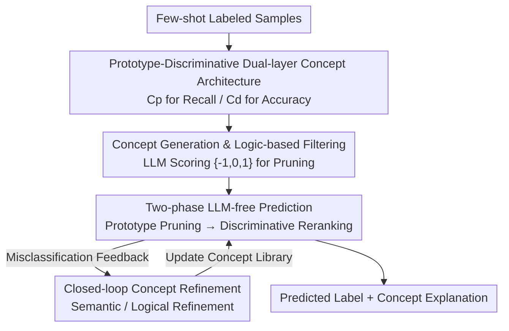

# Adaptive Concept Discovery for Interpretable Few-Shot Text Classification

**Conference**: ICLR2026  
**OpenReview**: [https://openreview.net/forum?id=UZBQ7iZzYz](https://openreview.net/forum?id=UZBQ7iZzYz)  
**Code**: https://github.com/alexiszlf/StructCBM  
**Area**: Interpretability / Concept Bottleneck Models / Few-shot Text Classification  
**Keywords**: Concept Bottleneck Models, Few-shot Learning, Text Classification, Interpretability, LLM Concept Generation

## TL;DR
StructCBM transforms the Concept Bottleneck Model (CBM) into a paradigm that relies solely on sample-concept similarity for prediction without training a classification head. It uses an LLM to generate a dual-layer concept library—consisting of "Prototype Concepts + Discriminative Concepts"—from a minimal set of samples. It produces interpretable predictions through two-stage similarity matching (recalling candidate labels followed by discriminative contrast) and employs a closed-loop "misclassification feedback to LLM for concept refinement" mechanism. At 10-shot, it outperforms all existing CBMs, approaches the black-box performance of direct LLM calls on semantically dense datasets, and eliminates the need for LLMs during inference.

## Background & Motivation
**Background**: Few-shot text classification is a high-frequency requirement in real-world business scenarios. The current strongest approach is to use Large Language Models (LLMs) directly for in-context learning or zero-shot prediction, which yields impressive results.

**Limitations of Prior Work**: LLMs have two unavoidable flaws: high inference cost, as calling large models for every instance in large-scale data is expensive and slow; and being a "black box," failing to provide trustworthy explanations in auditing-sensitive fields like finance, healthcare, and law. Concept Bottleneck Models (CBMs) are natural "white-box" alternatives that force predictions through a layer of human-readable concepts. However, existing LLM-enhanced CBMs fail in few-shot settings. They either require repeated LLM calls during inference (e.g., TBM, BC-LLM), failing to save costs, or require substantial data to train a "concept-to-label" prediction layer (e.g., CB-LLM, SparseCBM), failing in few-shot scenarios.

**Key Challenge**: CBMs split prediction into a "concept matching function $f(\cdot)$ + white-box prediction model $g(\cdot)$." The bottleneck lies in $g(\cdot)$, which maps concept activations to labels and must be trained on data. In few-shot settings, data is insufficient to train a reliable $g(\cdot)$. Furthermore, existing methods treat "text-concept similarity" as a supervised learning target, preventing the concepts themselves from being iteratively corrected.

**Goal**: To create a CBM truly adapted for few-shot learning that does not depend on LLMs during inference and allows for iterative refinement of concepts.

**Key Insight**: The authors observe that since $g(\cdot)$ is difficult to train, it should be eliminated. By utilizing the rich prior knowledge of LLMs to establish an explicit one-to-one correspondence between concepts and labels, $g(\cdot)$ degrades into a static mapping. This shifts the optimization pressure entirely to the "concept representation $f(\cdot)$," which aligns with the LLM's strength in concept generation.

**Core Idea**: From a probabilistic perspective, the prediction $P(y|x,C)$ is decomposed from "coarse to fine": $P(y|x,C)=\sum_{Y_k\subset Y}P(y|Y_k,x,C)P(Y_k|x,C)$, which first recalls a top-$k$ candidate label set $Y_k$ containing the ground truth (recall-oriented) and then determines the top-1 within the candidates (accuracy-oriented). Since a flat concept library is suboptimal for both tasks, two specialized sets of concepts—**Prototype Concepts** $C_p$ for recall and **Discriminative Concepts** $C_d$ for accuracy—are used within a "Generation-Prediction-Refinement" closed-loop workflow.

## Method

### Overall Architecture
The input to StructCBM consists of a few labeled samples (e.g., 10 or even 1 per class) and the target text, and the output is a predicted label plus a readable conceptual explanation. The pipeline is a "Generation → Prediction → Refinement" loop: first, the LLM generates a dual-layer concept library ($C_p$ + $C_d$) from samples and performs logical annotation filtering. During inference, the LLM is bypassed entirely; predictions reflect two-step decisions based on text embedding similarity—prototype pruning for recall followed by discriminative reranking. Misclassified samples are fed back to the LLM to trigger semantic or logical refinement of the concept library. Finally, the embedding model can be optionally fine-tuned to enhance similarity accuracy.

### Key Designs

**1. Dual-layer Architecture: Separating Recall and Accuracy**

This design addresses the issue where flat concept libraries struggle to balance recall and accuracy. The authors split the concept library into two complementary subsets. **Prototype Concepts** $C_p=\bigcup_{y_i\in Y}C_p^i$ are organized by class, where each subset $C_p^i$ corresponds to label $y_i$ and captures the core common features of that class (e.g., typical expressions for "Sports" in news classification). The goal is high recall. **Discriminative Concepts** $C_d=\bigcup_{y_i\neq y_j}C_d^{i,j}$ are organized by pairs of classes, where each $c_d^{i,j}$ provides fine-grained evidence that $y_i$ possesses but the confusing class $y_j$ lacks. The goal is high precision. Causal analysis suggests this architecture answers both "why $y_i$" (via $C_p$) and "why not the confusing $y_j$" (via $C_d$), providing a sufficient explanation. Because the label-concept mapping is a fixed 1-to-1 correspondence, the prediction layer $g(\cdot)$ becomes a static mapping, bypassing the difficulty of training a classifier in few-shot settings.

**2. Concept Generation and Logic-based Filtering**

The two concept sets are generated using different strategies. For $C_p$, multiple samples from the same target class are fed to the LLM to summarize shared features. For $C_d$, samples from classes $y_i$ and $y_j$ are provided together to identify concepts unique to $y_i$. Each concept includes a name and a readable description (descriptions are converted to embeddings for similarity matching). Discriminative concepts for all pairs entail $O(|Y|^2)$ overhead; for large label spaces ($|Y|\gg10$), $C_d$ is only generated for top-$K$ semantic neighbors based on $C_p$ similarity, reducing complexity to $O(|Y|K)$. After generation, logic-based filtering removes low-quality concepts. For a sample $x_i$ and concept $c$, the LLM provides a score $a(x_i,c)\in\{-1,0,1\}$ (contradictory/irrelevant/consistent). A prototype concept $c_p^i$ is selected only if enough same-class samples are judged consistent, while $c_d^{i,j}$ requires target class samples to score positively and contrast class samples to score non-positively.

**3. Two-phase LLM-free Prediction**

Once established, inference relies solely on embedding similarity calculation without LLM calls. Similarity is measured by cosine similarity $\text{sim}(x,c)=\cos(e(x),e(c))$. **Stage 1: Prototype Pruning**: A prototype support score $s_p^i(x)=\frac{1}{m}\sum_{c_p^i\in\text{top-}m(C_p^i,x)}\text{sim}(x,c_p^i)$ is calculated for each class, averaging the top-$m$ relevant prototype concepts. The top-$k$ classes form the candidate set $Y_k$. **Stage 2: Discriminative Reranking**: For pairs $(y_i,y_j)$ in the candidate set, a relative discriminative score is calculated $s_d^{i,j}(x)=\max\{\text{sim}(x,c_d^{i,j})\}-\max\{\text{sim}(x,c_d^{j,i})\}$, which is aggregated into a net discriminative score $s_d^i(x)=\sum_{y_j\in Y_k,j\neq i}s_d^{i,j}(x)$. The final score $s^i(x)=\alpha\cdot s_p^i(x)+(1-\alpha)\cdot s_d^i(x)$ fuses both pieces of evidence. This hierarchical decision process mirrors human reasoning and ensures transparency.

**4. Closed-loop Concept Refinement + Embedding Fine-tuning**

Misclassified samples provide feedback. **Semantic Refinement** addresses two types of errors: for recall errors (ground truth not in $Y_k$), related prototypes are rewritten to maximize average similarity with support samples; for ranking errors (wrong selection in $Y_k$), misleading discriminative concepts are rewritten to minimize similarity with the error sample. To prevent concept drift and overfitting, a regularization constraint (Reg.) ensures updated concepts maintain or improve similarity with correctly matched positive samples. Hard samples that cannot be fixed by semantic refinement trigger **Logical Refinement**, where the LLM generates new concepts specifically to cover them. Optionally, the embedding model is fine-tuned using a cosine similarity loss $\hat{e}=\arg\min_e\sum_{(x_i,c_j)\in P}\|\delta(i,j)-\cos(e(x_i),e(c_j))\|^2$ on sample-concept pairs from the same label.

### Loss & Training
Ours lacks a traditionally trained end-to-end classifier. The only parameter training occurs during optional embedding fine-tuning using the regression loss above. LLM usage is concentrated in the "construction phase" (generation, annotation, refinement) using DeepSeek-V3; the inference phase requires zero LLM calls. The default embedding model is all-mpnet-base-v2.

## Key Experimental Results

### Main Results
Testing on four cross-domain datasets under a strict 10-shot setting, StructCBM significantly outperforms all white-box CBMs. It even surpasses 10-shot DeepSeek-ICL on AGNews and approaches zero-shot DeepSeek-Direct on MedAbs while remaining interpretable.

| Dataset | Metric | StructCBM | Strongest White-box CBM | Black-box LLM (DeepSeek-ICL) |
|--------|------|-----------|-------------------------|-----------------------------|
| SST2 | Acc | 0.8390 | 0.6326 (CBLLM) | 0.9630 |
| AGNews | Acc | 0.8545 | 0.6834 (CBLLM) | 0.7900 |
| MedAbs | Acc | 0.6070 | 0.3778 (SparseCBM) | 0.6374 |
| FinaQuery | Acc | 0.7742 | 0.5056 (C3M) | 0.8360 |

### Ablation Study
Using $\alpha=0.75$, the components were incrementally added:

| Configuration | SST2 | AGNews | MedAbs | FinaQuery |
|------|------|--------|--------|-----------|
| $C_p$ only | 0.7507 | 0.7224 | 0.5530 | 0.6051 |
| $C_p+C_d$ | 0.8029 | 0.7930 | 0.5547 | 0.6491 |
| +Refine | 0.7677 | 0.8141 | 0.5900 | 0.6900 |
| +Refine+Reg. | 0.8127 | 0.8235 | 0.6004 | 0.7177 |
| +Train (Full) | 0.8390 | 0.8545 | 0.6070 | 0.7742 |

### Key Findings
- **Discriminative Concepts $C_d$ are essential**: Adding $C_d$ consistently improves performance, proving fine-grained boundary analysis is vital for disambiguation.
- **Unconstrained refinement causes overfitting**: Pure Refinement dropped accuracy on SST2, but the Reg. constraint recovered it, highlighting the need for anti-drift measures.
- **Optimal $\alpha\geq0.5$**: Prototype signals should be the primary driver, with discriminative concepts acting as fine-tuners for hard negatives.
- **Strong Robustness**: Performance is stable across different LLMs, embedding backbones, and shot counts (reaching 0.6624 on AGNews at 1-shot).

## Highlights & Insights
- **"Eliminating the classifier head" is the breakthrough**: The few-shot CBM bottleneck is the inability to train $g(\cdot)$. Ours uses LLM priors to establish a hard 1-to-1 concept-label mapping, simplifying the problem to concept quality and embedding similarity.
- **Decomposition of Probability**: Splitting $P(y|x,C)$ into recall and precision stages and assigning them to $C_p/C_d$ respectively is a clean example of theory-driven architecture.
- **Closed-loop refinement**: Using errors as fuel to improve concepts, while distinguishing between recall and ranking errors, is far more precise than naive regeneration.
- **Inference with zero LLM calls**: Costs are paid once during setup; inference is performed via similarity, achieving interpretability and low cost simultaneously.

## Limitations & Future Work
- **Quadratic overhead of $C_d$**: While top-$K$ clustering helps, the $O(|Y|^2)$ potential remains an issue for massive label spaces.
- **Reliance on semantic density**: Ours still lags behind black-box LLMs on tasks with thin semantic information (e.g., SST2), suggesting it is best suited for domains where concepts can be clearly described.
- **Dependence on LLM annotation reliability**: Pruning and refinement rely on LLM scoring, which might be unstable for highly specialized or very long texts.

## Related Work & Insights
- **vs CB-LLM / SparseCBM**: These require large-scale data to train embedding models for concept matching. Ours functions at 10-shot by eliminating the trainable classification head.
- **vs TBM / BC-LLM**: These use dynamic concept discovery but still require LLMs during inference. Ours moves the LLM cost to a one-time construction phase.
- **vs Post-hoc Explanations (LIME/SHAP)**: Ours is transparent by design; every decision is faithfully produced via human-readable concepts rather than post-hoc attribution.

## Rating
- Novelty: ⭐⭐⭐⭐⭐ First to apply LLM-enhanced CBM to few-shot by eliminating the classification head.
- Experimental Thoroughness: ⭐⭐⭐⭐ Extensive datasets, ablations, and robustness tests; qualitative interpretability analysis is present.
- Writing Quality: ⭐⭐⭐⭐⭐ Logical flow from probabilistic decomposition to architectural implementation is excellent.
- Value: ⭐⭐⭐⭐⭐ High practical value for regulated industries requiring interpretable, low-cost few-shot models.

<!-- RELATED:START -->

## Related Papers

- [\[ICML 2026\] CB-SLICE: Concept-Based Interpretable Error Slice Discovery](../../ICML2026/interpretability/cb-slice_concept-based_interpretable_error_slice_discovery.md)
- [\[CVPR 2026\] Hierarchical Concept Embedding & Pursuit for Interpretable Image Classification](../../CVPR2026/interpretability/hierarchical_concept_embedding_pursuit_for_interpretable_image_classification.md)
- [\[ICLR 2026\] Debugging Concept Bottleneck Models through Removal and Retraining](debugging_concept_bottleneck_models_through_removal_and_retraining.md)
- [\[ICML 2026\] How Few-Shot Examples Add Up: A Causal Decomposition of Function Vectors in In-Context Learning](../../ICML2026/interpretability/how_few-shot_examples_add_up_a_causal_decomposition_of_function_vectors_in_in-co.md)
- [\[ICLR 2026\] From Concepts to Components: Concept-Agnostic Attention Module Discovery in Transformers](from_concepts_to_components_concept-agnostic_attention_module_discovery_in_trans.md)

<!-- RELATED:END -->
