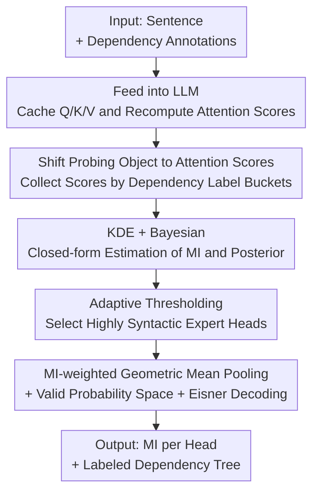

# An Information-Theoretic Parameter-Free Bayesian Framework for Probing Labeled Dependency Trees from Attention Score

**Conference**: ICLR2026  
**OpenReview**: [https://openreview.net/forum?id=q7raIuTQDK](https://openreview.net/forum?id=q7raIuTQDK)  
**Code**: https://github.com/ChristLBUPT/IPBP  
**Area**: Interpretability / Syntactic Probing / Attention Analysis  
**Keywords**: Syntactic Probing, Mutual Information, Bayesian Inference, Dependency Trees, Attention Score

## TL;DR
IPBP does not train any probing network. It directly performs kernel density estimation on the joint distribution of "attention scores" and "dependency relations" to calculate the mutual information (MI) between each attention head and various dependency types in closed form. Using Bayesian posterior + geometric mean pooling + Eisner decoding, it reconstructs **labeled** dependency trees. On several 7B/8B LLMs, it proves more accurate than many supervised/unsupervised baselines and is inherently interpretable.

## Background & Motivation

**Background**: Understanding how neural language models encode syntax is a key to peering into how they "understand language." The classic approach is **probing**: training a supervised classifier on the model's hidden states to predict dependency syntax trees (Hewitt & Manning 2019, Pimentel et al.), or directly treating certain model states as evidence of syntax (Htut et al.). Even though mechanistic interpretability (circuit analysis) has recently become popular, probing remains valuable—it provides **dataset-level** conclusions, whereas circuit methods are mostly sample-level; furthermore, syntax is one of the most topologically complex and critical concepts for human understanding in language.

**Limitations of Prior Work**: The authors systematically identified two common pitfalls in existing probing practices. First, most methods **"use uninterpretability to explain uninterpretability"**—to extract syntax from hidden states, an external trainable network (ranging from linear mappings to deep MLPs or pseudo-attention heads) is attached. This creates a bitter trade-off: linear mappings are simple and interpretable but have limited expressive power; deep networks can fit any relationship, but the network itself is uninterpretable, making it impossible to distinguish whether the extracted syntax comes from the probed LM or if the strong probe "unconditionally" learned to predict syntax. An intuitive thought experiment: given only the isolated words `eat` and `breakfast` without context, a probe might guess that `breakfast` is the object of `eat`—this is the risk of the "probe learning the task itself," which is especially severe for modern LLMs with larger hidden dimensions (forcing larger probing networks).

**Key Challenge**: The structure of hidden state vectors differs significantly from dependency trees, necessitating a trainable mapping network for alignment. Meanwhile, contextualized embeddings are saturated with semantics, which is the root cause of concerns regarding "probes self-learning the task." The tension between accuracy and interpretability is essentially determined by the starting point of selecting hidden states as the probing object.

**Key Insight**: Since hidden states are suboptimal, one "should pay attention to attention." Attention is the **only** component in a Transformer that involves relationships between words (MLP and Add/Norm are token-wise), and dependency syntax is precisely a relationship between words. Attention scores are stacked matrices, and dependency trees can also be written as adjacency matrices. The two are naturally consistent conceptually and topologically. Unfortunately, the few existing methods for direct attention probing (Clark et al., Htut et al.) can only extract low-quality or incomplete (unlabeled) trees—because they commit a second error: **over-trusting attention scores**. Attention scores after softmax normalization happen to be valid probability distributions, so researchers directly treat them as dependency probabilities. However, attention scores do not need to "serve syntax exclusively," so one must first **filter out non-syntactic attention heads** and apply **interpretable transformations** to raw scores rather than using them raw.

**Core Idea**: Instead of training a supervised network on hidden states, it is better to **directly estimate the multivariate distribution of attention scores and dependency relations, calculating their mutual information (MI) in closed form without any parameters**. This is paired with a decoding algorithm combining MI and Bayesian posteriors to reconstruct labeled dependency trees. Being parameter-free and attention-based almost entirely precludes the possibility of "probes self-learning the task."

## Method

### Overall Architecture

The IPBP (Information-theoretic Parameter-free Bayesian Probing) pipeline contains no trainable parameters. Given a dataset annotated with $\langle \text{sentence, dependency tree}\rangle$ and an LLM with $b$ layers and $h$ heads per layer: sentences are fed into the model; Q/K/V for each head are cached to **recompute unnormalized attention scores**; scores are "bucketed" based on the ground-truth dependency labels of each token pair; Kernel Density Estimation (KDE) is performed for each head and each dependency type, combined with empirical priors to derive conditional likelihood, joint, marginal, and posterior distributions via Bayes' theorem; MI for each head toward each dependency is calculated in closed form; an adaptive threshold (MI divided by label entropy) is used to select "highly syntactic expert heads"; finally, the posteriors of these heads are aggregated via MI-weighted geometric mean pooling to construct a valid multivariate probability space for **labeled** dependency tree reconstruction using Eisner's dynamic programming. The output consists of two things: fine-grained MI values for each head/dependency and the reconstructed labeled dependency tree.

### Key Designs

**1. Shifting the Probing Object from Hidden States to Attention Scores: Preventing "Probe Self-learning" at the Source**

This is the foundation of the paper. Previous methods focused on hidden states, forcing the use of trainable mapping networks and falling into the "accuracy vs. interpretability" dilemma. IPBP breaks this by changing the probing object: attention is the only Transformer component encoding inter-token relations, isomorphic to word relations like dependency. Specifically, for each head $(b, h)$ and each dependency label $l \in L \cup \{\phi\}$ (where $\phi$ denotes no dependency), a set of scores $A_{b, h; l}$ is initialized. When traversing the dataset, the ground-truth dependency $l^{[i][j]}$ and attention score $a^{[i][j]}_{b, h}$ of token pair $\langle x_i, x_j \rangle$ are paired, and the score is placed in the corresponding bucket. Since no trainable parameters are introduced and the method is based directly on attention, the risk of "the probed LLM knowing nothing while the probe learns the task" is virtually eliminated. Notably, the authors avoid raw softmax scores, instead caching Q/K/V to **recompute unmasked unnormalized scores**—different sentence lengths cause softmax scores to fall into different magnitude ranges, disrupting density estimation; since softmax is non-invertible, reconstruction from QK is necessary.

**2. KDE + Bayesian Closed-form MI Estimation: One Density Estimation is Enough, Avoiding the Curse of Dimensionality**

After shifting to attention scores, how can one quantify "how much information a head contains about a dependency"? The answer is Mutual Information (MI). However, here $L$ is a discrete variable and $A_{b, h}$ is a continuous variable, making the joint distribution a **mixture distribution**. The MI form differs slightly from the classical definition:

$$\mathrm{MI}(L; A_{b,h}) = \sum_{l\in L\cup\phi}\int f(l,a)\,\log\frac{f(l,a)}{P(l)\,f(a)}\,da$$

The key lies in estimating several types of distributions. The prior $\hat P(L=l)$ is approximated by the empirical probability of bucket sizes. The continuous part is more difficult: the authors noted that the mixture distribution **requires only univariate density**. Thus, for each $A_{b,h;l}$, a Gaussian kernel KDE is used to estimate the conditional likelihood $\hat f(A_{b,h} \mid L=l)$. Then, treating $A_{b,h}$ as evidence and $L$ as the hypothesis, Bayes' theorem is applied: the likelihood $\hat f(A_{b,h} \mid L)$ multiplied by the prior $\hat P(L)$ yields the joint $\hat f(A_{b,h},L)$, and summing over all $L$ yields the marginal $\hat f(A_{b,h})$. The posterior $\hat f(L \mid A_{b,h})$ follows. The elegance of this design is that by utilizing the mixture-joint distribution + Bayes' theorem, the required density estimation is reduced to **a single univariate KDE**, nimbly avoiding the curse of dimensionality where multivariate KDE degrades rapidly when the number of variables > 1—this is where it improves upon related methods like Moon et al. (multiple multivariate KDEs) and Gao et al. (kNN estimation of PMI, which lacks a distribution for reconstruction).

**3. Binary MI under Expert Head Hypothesis + Adaptive Thresholding: Selecting "Syntactic Experts" per Relation**

Original MI measures the shared information of a head across **all** dependency relations, which is too coarse. A more realistic scenario is that a head **specializes in specific types** of dependencies (the "Expert Head" hypothesis, also the premise of Htut et al.). Thus, the authors modify MI into a binary form for a single relation $l$ ($l$ vs. non-$l$):

$$\mathrm{MI}_{\text{binary}}(l; A_{b,h}) = \int f(l,a)\log\frac{f(l,a)}{P(l)f(a)}da + \int f(\lnot l,a)\log\frac{f(\lnot l,a)}{P(\lnot l)f(a)}da$$

Where $f(\lnot l, A_{b,h})$ is obtained by marginalizing $\hat f(A_{b,h}, L)$ over $L \in (L \cup \{\phi\}) - \{l\}$, and $P(\lnot l) = 1 - \hat P(l)$. When reconstructing the tree, a set of heads $H_l$ responsible for each relation $l$ is selected. The difficulty is that $\mathrm{MI}_{\text{binary}}$ magnitudes vary across dependency relations, making fixed thresholds unfair. The authors leverage the fact that "MI is upper-bounded by the entropy of the variables": since the differential entropy of the continuous $A_{b,h}$ is unreliable (may be negative), they use the discrete side's entropy:

$$\hat H(\mathbb{1}_l(L)) = \hat P(L)\log\hat P(L) + \hat P(\lnot L)\log\hat P(\lnot L)$$

Dividing MI by this entropy yields a ratio normalized to $[0, 1]$ used as an **adaptive threshold**, dynamically selecting heads per relation. This allows comparison across magnitudes and aligns with the expert head intuition.

**4. MI-weighted Geometric Mean Pooling + Legal Probability Space + Eisner Decoding: Binding Posteriors into Labeled Trees**

After selecting $H_l$, two problems arise from "multi-head + multi-label": most previous probing produced **unlabeled** trees, and even supervised dependency parsing uses independent networks for arcs and labels. IPBP has a large set of posterior probabilities and requires a decoding algorithm that balances these posteriors while forming a valid probability space. An ideal model treats arc prediction as **voting**: each head $\langle b_i, h_i \rangle$ in $H_l$ votes with weight $e^{\mathrm{MI}_{\text{binary}}}$. If the vote weight exceeds a ratio, the arc is considered present; however, continuous weights cannot be used for dynamic programming, and the $O(2^{|H_l|})$ search space is too expensive. The authors relax this into a form that is easy to compute and reasonable—the **geometric mean** of posteriors (in log space):

$$\log \mathrm{GP}_{H_l}(x_i,x_j;l) = \frac{\sum_{\langle b_k,h_k\rangle}\mathrm{MI}_{\text{binary}}(l;A_{b_k,h_k})\cdot\log\hat f(L=l\mid A_{b_k,h_k})}{\sum_{\langle b_m,h_m\rangle}\mathrm{MI}_{\text{binary}}(l;A_{b_m,h_m})}$$

This approximates the Logarithmic Opinion Pooling commonly used in Bayesian inference, serving as a reasonable approximation when expert heads are numerous. However, since different arcs are determined by different head sets, the sum of probabilities for each relation is not guaranteed to be 1. The authors construct a larger multivariate probability space $\{0,1\}^{|L|+1}$, treating the dependency between $x_i, x_j$ as $|L|+1$ independent votes. The $l$-th vote has existence probability $\mathrm{GP}_{H_l}$ and non-existence probability $1-\mathrm{GP}_{H_l}$. The overall arc probability is:

$$P(x_i,x_j;l) = \mathrm{GP}_{H_l}(x_i,x_j;l)\times\prod_{l'\in L+\{\phi\}-\{l\}}\{1-\mathrm{GP}_{H_{l'}}(x_i,x_j;l)\}$$

Thus, all types of dependency arcs are determined within a unified, valid probability space. Finally, following supervised dependency analysis, Eisner's dynamic programming algorithm is used to decode the complete **labeled** dependency tree. This design allows IPBP to directly output labeled trees in one step, unlike older methods that predict arcs and labels separately.

### Loss & Training
IPBP is entirely **parameter-free and training-free**, involving no loss function. The only requirements are setting a few hyperparameters like the Gaussian kernel bandwidth $B$ (see Appendix D.1 of the original paper) and implementation-level GPU optimization for KDE and integration. For fair comparison, head selection methods are unified with a limit of $\sum_l|H_l|\le 2000$ syntactic heads.

## Key Experimental Results

### Main Results
On open\_llama\_7b, using the English UD 2.9 dataset, while fixing the tree reconstruction algorithm and replacing only the "head importance/MI estimation" or "reconstruction method" to compare baselines (UAS = Unlabeled Attachment Score, LAS = Labeled Attachment Score):

| Method | UAS | LAS | Description |
|------|------|------|------|
| Random Model | 12.4 | 0.8 | Randomly initialized weights, lower bound |
| L./R. Branching | 16.6 / 26.4 | - | Simple branching baselines, unlabeled |
| Probeless | 34.8 | 20.9 | Parameter-free neuron analysis |
| IoU | 38.3 | 26.6 | Jaccard similarity |
| ElasticNet (LFF) | 41.9 | 31.3 | Supervised linear |
| V-Information | 41.3 | 20.9 | SOTA information-theoretic entropy estimation (compute-intensive) |
| Raw Score | 32.3 | 16.6 | Reconstruction using raw attention scores |
| **IPBP** | **49.1** | **30.6** | Ours |
| IPBP + MIpos | **49.9** | **34.8** | Variant incorporating positive sample MI |

IPBP's UAS significantly exceeds all baselines. Even the computationally expensive supervised V-Information achieves an LAS of only 20.9, far lower than IPBP—the authors use this to argue that "when data is long-tailed and dimensions are low, supervised deep networks are not necessarily a panacea." The Raw Score baseline (32.3/16.6) shows a huge gap compared to IPBP, confirming the necessity of posterior transformations.

### Ablation Study

| Config | UAS | LAS | Description |
|------|------|------|------|
| IPBP | 49.1 | 30.6 | Full model |
| IPBP + MIpos | 49.9 | 34.8 | Added positive sample MI, best performer |
| IPBP (transposed) | 42.6 | 28.0 | Mapping $l^{[i][j]}$ to $a^{[j][i]}$ |
| IPBP (undirected)\* | 45.3 | 28.4 | Undirected trees (UUAS/ULAS) |
| IPBP (arc only) | 36.5 | N/A | Reconstruction of unlabeled arcs only |

Regarding models/languages, Mistral-7B (50.4 UAS) and open\_llama\_7b (49.1) performed best. French and Spanish results were slightly lower, indicating the general applicability of the method across languages and models.

### Key Findings
- **MIpos provides significant gain**: Attention scores are long-tailed (most token pairs have no dependency, falling into the $A_\phi$ bucket and containing noise). Calculating a "syntactic MI" exclusively for $l\neq\phi$ and mixing it with the original MI consistently improves points (LAS 30.6 $\rightarrow$ 34.8).
- **Decoder captures left/right dependencies adaptively**: Masked attention can only see the previous context, making left dependencies (pointing to previous words) naturally easier to capture. Interestingly, right dependencies can also be captured via "looking back"—in the transposed setting, 5 of the top 10 best-reconstructed labels are look-ahead dependencies, compared to 3/10 in the original setting.
- **Model Layer $\approx$ Tree Level**: Using MI-weighted layer indices (similar to Tenney’s "center of gravity" concept) to compute Pearson correlation with the average depth of each dependency label yielded $\rho=0.69, p=0.03$. The intuition that lower layers handle local/phrasal dependencies while higher layers handle global/clausal dependencies was systematically quantified and verified for the first time.

## Highlights & Insights
- **"Changing the Probing Object" is more effective than "Changing the Probe"**: Previously, focus was on adding smarter probing networks to hidden states. IPBP does the opposite, shifting the object to attention scores isomorphic to syntax, which dispels the clouds of "probe self-learning" at the source—a strategy that could be transferred to other probing tasks.
- **Mixed Distribution + Bayesian reduces Multivariate KDE to Univariate**: The trick for avoiding the curse of dimensionality is elegant—split the continuous-discrete mixed distribution into conditional univariate densities and use Bayes' theorem to link joint/marginal/posterior distributions. This allows for closed-form MI using a single KDE.
- **Fine-grained MI as a free "Analysis Foundation"**: Because the output includes MI functions and probability distributions per head and label, IPBP provides more than just a tree; it provides raw materials for visualization, mechanistic analysis, and layer-wise correspondence. Supervised probes do not offer this.
- **The "Impossible Trinity"**: Simpler architecture + less compute, complex high-quality labeled trees, and transparent interpretability—achieved simultaneously.

## Limitations & Future Work
- **Dependence on Labeled Data**: The method requires UD data with $\langle \text{sentence, dependency tree} \rangle$ annotations to estimate distributions; it is not entirely unsupervised. It probes whether "the model knows these specific syntactic structures" rather than discovering new structures.
- **Low Absolute Scores**: The best LAS is approximately 35, far from supervised dependency parsers (which often reach 90+). It is a "probing/interpretation" tool rather than a "high-performance parser"; horizontal LAS comparisons must include this caveat.
- **Structural Compromises in Masked Attention**: To use the lower-triangular scores actually used during generation, variants like transposed/undirected either sacrifice direction or labels, while the original setting might use masked upper-triangular scores. How to cleanly handle causal masking remains an open question.
- **Limited Derived Conclusions**: The authors admit that due to space, only a small number of analysis conclusions were provided. More interesting findings (mechanistic analysis, unbiased probing, etc.) are left in the appendix, encouraging future fine-grained research based on their MI/distributions.

## Related Work & Insights
- **vs. Supervised Hidden State Probing (Hewitt & Manning, Pimentel et al.)**: They train classifiers on hidden states, trapped in the accuracy vs. interpretability dilemma and suspected of probe self-learning. IPBP is parameter-free, based on attention, avoids these issues via the probing object, and produces labeled trees.
- **vs. V-Information (Pimentel 2020b, 2022)**：Both take an information-theoretic path, but V-Information uses trainable networks to approximate conditional entropy, is computationally expensive, and requires tricks for attention probing. Ours uses closed-form KDE + Bayesian MI, which is more efficient and achieves higher LAS.
- **vs. Raw Attention Methods (Clark, Vig & Belinkov, Ravishankar et al.)**: They treat softmax scores directly as dependency probabilities, producing low-quality unlabeled trees. IPBP filters expert heads and applies geometric mean pooling on posteriors, proving that "transformation before use" is far superior to raw use (49.1 vs. 32.3 UAS).
- **vs. KDE/kNN MI Estimation (Moon 1995, Gao 2017)**: Moon performs multiple multivariate KDEs and hits the curse of dimensionality. Gao uses kNN to estimate PMI but cannot produce distributions for tree reconstruction. IPBP uses mixture distributions for a single univariate KDE and preserves full probability functions for reconstruction and visualization.

## Rating
- Novelty: ⭐⭐⭐⭐⭐ "Shifting probing object to attention + parameter-free closed-form MI + one-step labeled trees" is a reconstruction of the probing paradigm.
- Experimental Thoroughness: ⭐⭐⭐⭐ Compared across multiple models/languages and against neuron analysis/supervised/unsupervised baselines with structural ablations; absolute metrics are low but aligned with its role as a probing tool.
- Writing Quality: ⭐⭐⭐⭐ Rigorous derivations and logically staged motivation; formula-heavy, presenting a barrier to readers without a Bayesian background.
- Value: ⭐⭐⭐⭐⭐ Provides a parameter-free, interpretable "analysis foundation" for dataset-level conclusions, offering sustained inspiration for syntactic interpretability research.

<!-- RELATED:START -->

## Related Papers

- [\[ICLR 2026\] TimeSeg: An Information-Theoretic Segment-Wise Explainer for Time-Series Predictions](timeseg_an_information-theoretic_segment-wise_explainer_for_time-series_predicti.md)
- [\[ICLR 2026\] Attention, Please! Revisiting Attentive Probing Through the Lens of Efficiency](attention_please_revisiting_attentive_probing_through_the_lens_of_efficiency.md)
- [\[NeurIPS 2025\] Curvature Tuning: Provable Training-free Model Steering From a Single Parameter](../../NeurIPS2025/interpretability/curvature_tuning_provable_training-free_model_steering_from_a_single_parameter.md)
- [\[ICLR 2026\] Bayesian Neural Networks for Functional ANOVA Model](bayesian_neural_networks_for_functional_anova_model.md)
- [\[ICLR 2026\] Decoupling Positional and Symbolic Attention in Transformers](decoupling_positional_and_symbolic_attention_in_transformers.md)

<!-- RELATED:END -->
