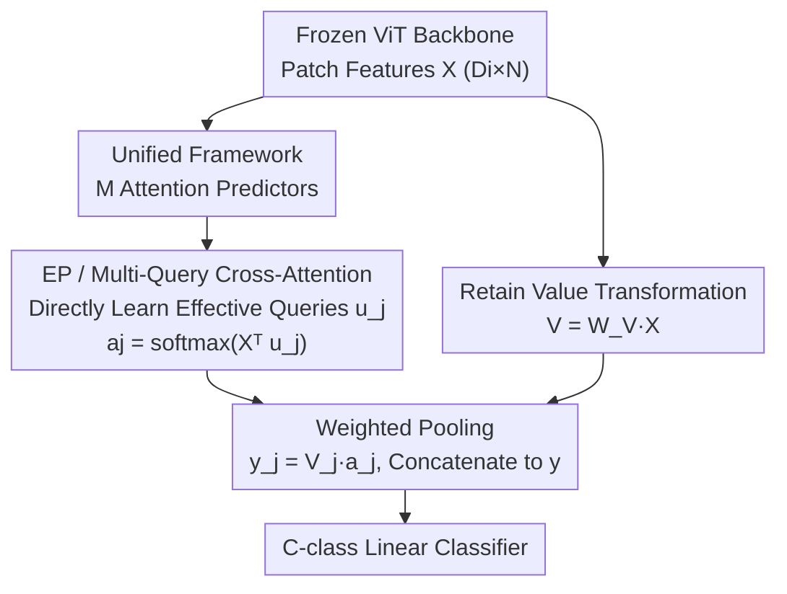

# Attention, Please! Revisiting Attentive Probing Through the Lens of Efficiency

**Conference**: ICLR 2026  
**OpenReview**: [https://openreview.net/forum?id=PXo0gtT7Al](https://openreview.net/forum?id=PXo0gtT7Al)  
**Code**: https://vrg.fel.cvut.cz/ep/ (Project Page)  
**Area**: Self-Supervised / Representation Learning Evaluation  
**Keywords**: Attentive Probing, Representation Evaluation, Multi-Query Cross-Attention, Parameter Efficient, Frozen Backbone

## TL;DR
Addressing the common parameter bloat in "attentive probing"—an increasingly popular evaluation protocol for frozen representations—this paper first unifies existing methods into a single framework. By leveraging the **mathematical equivalence** between Multi-Head Cross-Attention (MHCA) and Multi-Query Cross-Attention (MQCA), it removes redundant projection matrices to propose the extremely lightweight Efficient Probing (EP). On ImageNet-1K, EP achieves 75.6% accuracy for MAE ViT-B using less than 1.4M parameters (compared to 67.7% for linear probing) and consistently outperforms linear probing and existing attentive probes across diverse pre-training paradigms.

## Background & Motivation
**Background**: Three mainstream protocols exist for evaluating pre-trained representations: k-NN, Linear Probing (LP), and Full Fine-Tuning (FT). While FT yields the highest accuracy, its computational cost is becoming unsustainable in the era of large models. Consequently, "frozen backbone + lightweight probe" is becoming the de facto evaluation standard.

**Limitations of Prior Work**: Standard linear probing attaches a classification head to a single global representation (e.g., the `[CLS]` token). While effective for models trained with global objectives (like DINO's Joint-Embedding Architecture, JEA), it significantly underestimates models that **disperse discriminative information across local patch representations**—such as Masked Image Modeling (MAE, SimMIM), Autoregressive (AIM), and Diffusion (DiT) models, which lack a centralized global token. "Attentive probing" emerged to bridge this gap: using attention to **selectively aggregate** discriminative descriptors from patch features for linear classification.

**Key Challenge**: Despite its adoption by AIM, CAE, V-JEPA, and CAPI, attentive probing lacks a systematic study. Existing methods vary significantly in design, are generally **over-parameterized, computationally inefficient**, and the mechanism of how attention aggregation improves classification remains unclear. Ultimately, a probe is an evaluation tool and should not be heavier than the representation it evaluates.

**Goal**: This work re-examines attentive probing through the lens of "accuracy vs. parameter efficiency": (1) Systematically unify existing methods into a single framework for the first comprehensive benchmark; (2) Design a lightweight yet accurate attentive probe; (3) Clarify the relationship between attention quality and classification accuracy.

**Key Insight**: The authors observe that the key projection matrix $W_K$ in standard multi-head cross-attention (MHCA) maps learnable queries back to the full space of input features. This step **can be absorbed by a set of "effective queries" learned directly in the input space**. Since the two are mathematically equivalent, the bulky projection matrices are entirely redundant.

**Core Idea**: Replace MHCA (with key/query projection matrices) with "Multi-Query Cross-Attention (MQCA) learning multiple queries directly in the input feature space." This reduces learnable parameters from $D_a(D_i{+}1)$ to $D_i M$ while maintaining mathematical equivalence, resulting in Efficient Probing (EP).

## Method

### Overall Architecture
The objective of attentive probing: Given a feature matrix $X \in \mathbb{R}^{D_i \times N}$ ($N = W \times H$ patch features, each $D_i$-dimensional) from a frozen ViT backbone, an attention pooling mechanism aggregates it into an image-level feature $y \in \mathbb{R}^{D_o}$, which is then fed to a $C$-class linear classifier.

The authors unify all attention pooling designs into **$M$ attention predictors**: the $j$-th predictor outputs an $\ell_1$-normalized attention vector $a_j \in \mathbb{R}^N$ (reshaping to $W \times H$ yields an attention map). The value features $V = W_V X$ are split into $M$ sub-matrices $V_j \in \mathbb{R}^{d_o \times N}$ ($d_o = D_o/M$), and the output feature is partitioned accordingly:

$$y_j = V_j a_j = W_{V_j} X a_j .$$

In essence, each predictor **weighted-pools** $N$ patch features into a $d_o$-dimensional subspace of the final representation, and these $M$ segments are concatenated to form $y$. This abstraction reveals that existing methods like AbMILP, AIM, DELF, SimPool, and V-JEPA represent different choices for constructing these $M$ predictors. EP is designed as the most parameter- and computation-efficient construction within this framework.

### Key Designs

**1. Unified Framework: Consolidating Diverse Attention Pooling into "M Predictors + Value Aggregation"**

Varied designs in attentive probing make horizontal comparison difficult. The authors align them into standard algorithmic steps (query source, key/value transformations, attention calculation, and pooling). In this framework: AbMILP is a simple case with $M=1$ and $W_K, W_V$ as identity matrices; AIM is MHCA with batch normalization; DELF uses an MLP for scalar attention ($M=1$) with softplus instead of softmax; SimPool ($M=1$) uses a data-dependent input vector $u = \frac{1}{N}X^\top \mathbf{1}$ with layer norm; and V-JEPA stacks an MLP with GeLU and residuals above MHCA, equivalent to a transformer block. This systematic comparison makes the sources of over-parameterization evident.

**2. EP / Multi-Query Cross-Attention (MQCA): Learning Queries in Input Space to Remove Redundancy**

Standard MHCA attention is $\hat{a}_j = (W_{K_j}X)^\top q_j = X^\top W_{K_j}^\top q_j$, where $q_j$ is a learnable query. The authors observe that $W_{K_j}^\top$ only serves to map $q_j$ back to the $D_i$-dimensional space of input features. Instead of learning $W_{K_j}$ and $q_j$ separately, EP **directly learns the mapped vector in the $D_i$ space**. By defining the "effective query" $u_j := W_{K_j}^\top q_j \in \mathbb{R}^{D_i}$, the attention becomes:

$$\hat{a}_j = X^\top u_j, \qquad a_j = \mathrm{softmax}(\hat{a}_j), \quad j \in \{1,\dots,M\}.$$

The process **eliminates all projection matrices** except for the queries. This reduces parameters from $D_a(D_i{+}1)$ to $D_i M$ and computation from $N D_a(D_i{+}1)$ to $N D_i M$. Since $M$ is typically orders of magnitude smaller than $D_i$, the savings are significant. This is a "free" improvement because **MQCA is mathematically equivalent to MHCA**: EP12 and AIM12 achieve the same accuracy (75.1%), but EP uses fewer parameters (1.36M vs 1.95M).

**3. Retaining Value Transformation $W_V$ + Using $D_o/M$ as a Budget Knob**

While EP cuts query/key projections, it **deliberately retains the value transformation** $V = W_V X$. Ablations show $W_V$ is critical: adding $W_V$ to vanilla Global Average Pooling (GAP) improves accuracy from 66.7% to 68.0%, while removing it from EP12 drops accuracy from 75.1% to 72.1%. Intuitively, attention determines "what to aggregate," while $W_V$ determines "what the representation should look like." EP also introduces two knobs—the number of queries $M$ and output dimension $D_o$—allowing the method to scale across different parameter budgets on the Pareto front.

### Loss & Training
Probing follows standard settings: frozen backbone, 90 epochs of training for the attention pooling and classifier. Performance is reported as Top-1 accuracy on validation sets, alongside trainable parameter counts and FLOPs. Unless otherwise specified, $D_o = D_i = D_a$. EP is also compatible with PEFT; combining LoRA on all $W_V$ layers with EP (LoRA+EP) yields the benefits of both.

## Key Experimental Results

### Main Results
Evaluations span 7 classification benchmarks (IN-1K, CIFAR-100, Places365, CUB-200, Aircraft, Cars, Food-101) across five pre-training paradigms (MIM, JEA, Hybrid, VLM, Generative). The following table compares protocols on ImageNet-1K (EP default is EP32):

| Pre-training | Architecture | k-NN | Linear Probing LP | EP | Gain (EP vs LP) |
|--------------|--------------|------|-------------------|----|-----------------|
| MAE (MIM)    | ViT-S/16     | 26.7 | 47.4              | 64.6 | **+17.2**       |
| MAE (MIM)    | ViT-B/16     | 46.1 | 67.7              | 75.6 | +7.9            |
| SimMIM (MIM) | ViT-B/16     | 15.1 | 51.5              | 65.1 | +13.6           |
| DiT (Gen)    | DiT-XL/2     | 8.3  | 32.7              | 57.0 | **+24.3**       |
| BEiTv2 (MIM) | ViT-B/16     | 74.8 | 79.0              | 81.7 | +2.7            |
| DINOv2 (Mix) | ViT-L/14     | 83.5 | 85.2              | 85.6 | +0.4            |
| CLIP (VLM)   | ViT-L/14     | 77.2 | 82.3              | 83.4 | +1.1            |
| SigLIP (VLM) | ViT-L/16     | 83.7 | 84.1              | 86.1 | +2.0            |

Key Observation: **Models optimizing patch local representations (rather than explicit global ones) benefit most from attentive probing** (e.g., DiT +24.3). For models with strong global descriptors (DINO/JEA), the gain is marginal. EP also **shifts relative rankings**: MIM methods that initially seemed weaker under LP/k-NN (like MAE) outperform contrastive methods, challenging the notion that MIM representations are inherently "weaker."

### Ablation Study

| Configuration | Key Metric (Top-1) | Note |
|---------------|-------------------|------|
| EP12 (Full) | 75.1% | Same accuracy as AIM12, but 1.36M vs 1.95M params |
| Single-head w/o $W_K$ | 71.8→71.7% | $W_K$ absorbed by single query; negligible effect |
| Multi-head w/o $W_K$ (Identity) | 75.1→72.9% | Queries limited to subspaces; significant drop |
| GAP + $W_V$ | 66.7→68.0% | Steady gain from value transformation |
| EP12 w/o $W_V$ | 75.1→72.1% | $W_V$ is a critical, non-optional component |
| LoRA+EP (850K params) | 76.99% | Outperforms pure EP (75.58%) and all-layer LoRA (76.72%) |

### Key Findings
- **Superior Efficiency**: EP64 achieves 75.6% SOTA on MAE ViT-B with <1.4M parameters. EP48 (with $D_o = D_i/8$) reaches 70.3% with only ~200K parameters (4x fewer than linear probing).
- **Complementary to PEFT**: EP outperforms single-layer LoRA, BitFit, and LayerNorm tuning in terms of parameter efficiency. LoRA+EP at 850K parameters reaches 76.99%, indicating that EP captures information that LoRA does not, and vice versa.
- **Correlation: Localization Quality ↔ Classification Accuracy**: Predictors that focus more on the foreground object (lower entropy, centroid within GT box) contribute more to accuracy. EP tends to fixate on the object rather than "background shortcuts."
- **Complementary Attention Maps**: Multiple queries in EP focus on distinct semantic parts (tail, beak, etc.), showing higher complementarity scores than MHSA, V-JEPA, or AIM.

## Highlights & Insights
- **"Mathematical Equivalence → Free Slimming"**: EP's brilliance lies not in inventing new structures but in proving $W_K$ is redundant via absorption, significantly reducing parameters **without losing accuracy**.
- **Recalibrated Evaluation Conclusions**: Using the wrong probe (LP) systematically underestimates local-representation models, leading to misjudgments like "MIM is inferior to contrastive learning." EP corrects this bias.
- **Probes as Analysis Tools**: The correlation between localization and accuracy, along with complementary attention maps, transforms probing from a scoring tool into a window for understanding representation interpretability.
- **Adjustable Budget Knob**: The $M$ and $D_o$ hyperparameters allow a single method to cover the entire Pareto front from 200K to millions of parameters.

## Limitations & Future Work
- **Limited to Image Classification + ViT**: Experiments focused on patch-token ViT classification; generalization to dense tasks (segmentation/detection) or CNN backbones is not yet verified.
- **Linear Assumption**: The "free equivalence" relies on linear projections. For variants with non-linearities (e.g., DELF's ReLU or V-JEPA's MLP blocks), this shortcut may not hold directly.
- **Correlation, Not Causation**: The link between localization quality and accuracy is observed correlation; the paper does not prove that forcing focus *causes* higher accuracy.
- **Future Directions**: Applying EP as a universal lightweight aggregator for dense downstream tasks or using localization/complementarity as explicit regularization terms during training.

## Related Work & Insights
- **vs. AIM / MHCA**: EP is mathematically equivalent to these in terms of accuracy but is more parameter-efficient (e.g., 1.36M vs 1.95M).
- **vs. AbMILP / DELF / SimPool**: These are special cases of the framework with $M=1$ and limited expressive power compared to EP's multi-query design.
- **vs. V-JEPA / CaiT / ViT Block**: These methods use significantly more parameters but provide marginal gains compared to EP.
- **vs. LoRA / BitFit / PEFT**: PEFT adapts the backbone (task-adaptive), whereas EP is a representation-preserving probe; they are complementary rather than redundant.
- **vs. Slot Attention**: EP is a minimalist version of slot attention (single iteration, no LayerNorm/GRU/MLP) where learnable queries compensate for the lack of iterative refinement.

## Rating
- Novelty: ⭐⭐⭐⭐ (Solidified via the "equivalence implies redundancy" perspective and unified framework)
- Experimental Thoroughness: ⭐⭐⭐⭐⭐ (Broad coverage of 5 paradigms, 7 datasets, and PEFT benchmarks)
- Writing Quality: ⭐⭐⭐⭐⭐ (Clear derivation, effective tables, and insightful conclusions)
- Value: ⭐⭐⭐⭐⭐ (Provides a lightweight standard for the community and corrects systematic evaluation biases)

<!-- RELATED:START -->

## Related Papers

- [\[ICLR 2026\] Probing Rotary Position Embeddings through Frequency Entropy](probing_rotary_position_embeddings_through_frequency_entropy.md)
- [\[ACL 2026\] Through a Compressed Lens: Investigating The Impact of Quantization on Factual Knowledge Recall](../../ACL2026/interpretability/through_a_compressed_lens_investigating_the_impact_of_quantization_on_factual_kn.md)
- [\[ICLR 2026\] An Information-Theoretic Parameter-Free Bayesian Framework for Probing Labeled Dependency Trees from Attention Score](an_information-theoretic_parameter-free_bayesian_framework_for_probing_labeled_d.md)
- [\[CVPR 2026\] Selection-as-Nonlinearity: Bridging Attention and Activation via a Joint Game-Decision Lens for Interpretable, Discriminative Visual Representations](../../CVPR2026/interpretability/selection-as-nonlinearity_bridging_attention_and_activation_via_a_joint_game-dec.md)
- [\[ICLR 2026\] GAVEL: Towards Rule-Based Safety through Activation Monitoring](gavel_towards_rule-based_safety_through_activation_monitoring.md)

<!-- RELATED:END -->
