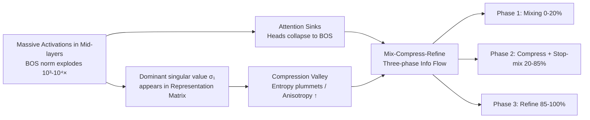

# Attention Sinks and Compression Valleys in LLMs are Two Sides of the Same Coin

**Conference**: ICLR 2026  
**OpenReview**: [https://openreview.net/forum?id=c5TFhCJ6fs](https://openreview.net/forum?id=c5TFhCJ6fs)  
**Code**: TBD  
**Area**: LLM Interpolability / Representational Geometry  
**Keywords**: Attention sinks, compression valleys, massive activations, residual stream, information flow, depthwise computation  

## TL;DR
This paper demonstrates that two seemingly independent puzzles in LLMs—attention sinks and compression valleys—are actually **two facets of the same mechanism: massive activations in the residual stream**. Based on this, it proposes the Mix-Compress-Refine three-phase information flow theory, unifying the explanation of why embedding tasks are strongest in the middle layers while generation tasks require the full depth.

## Background & Motivation
**Background**: Attention sinks refer to attention heads dumping massive attention scores onto semantically meaningless tokens (usually BOS). Compression valleys refer to the middle-layer representations having abnormally low matrix entropy and high anisotropy. Both phenomena appear across various model scales but have been **studied as independent puzzles**: sinks are attributed to positional bias, anti-over-mixing, or pre-training dynamics, while compression valleys are attributed to the information bottleneck hypothesis.

**Limitations of Prior Work**: (1) The two lines of explanation are disconnected; (2) Compression valleys lack **causal evidence** and are mostly explained by hypotheses like the information bottleneck, without knowing what actually drives the compression; (3) There is no unified mechanism to explain why these stages emerge at specific depths.

**Key Challenge**: Why do powerful models waste attention on meaningless tokens? Why do high-dimensional representations self-compress mid-computation? If these two "counter-intuitive" phenomena are isolated, a unified answer cannot be provided.

**Goal**: Find a single underlying mechanism driving both phenomena and characterize how Transformers organize computation along the depth dimension.

**Key Insight**: **Attention sinks and compression valleys are not two separate phenomena, but two inevitable consequences of massive activations**. When the activation norm of a specific token (typically BOS) explodes by $10^3–10^4$ times in the middle layers, it creates a dominant singular value in the representation matrix—this **mathematically** necessitates compression and simultaneously corresponds to the formation of attention sinks. One mechanism, two sides.

## Method

### Overall Architecture
The argument is structured in two parts. The first is **mechanism unification**: using empirical correlations across six models to show the synchronized emergence of the three phenomena, proving via a theorem that massive activations **mathematically lead** to spectral dominance and entropy decline, and through ablation studies confirming the causal link. The second is **theoretical synthesis**: proposing the Mix-Compress-Refine three-phase information flow theory and validating it through "task-phase" matching in downstream performance.

### Key Designs

**1. Empirical Characterization of Synchronized Emergence.** The authors measure three quantities layer-by-layer across six models (Pythia 410M/6.9B, LLaMA3 8B, Qwen2 7B, Gemma 7B, Bloom 1.7B, spanning 410M–120B): matrix entropy $H(X)=-\sum_j p_j\log p_j$ (where $p_j=\sigma_j^2/\lVert X\rVert_F^2$), the BOS sink-rate, and the L2 norm of BOS. The three curves align precisely: once the BOS norm spikes, entropy drops below 0.5 bit and the sink-rate nears 1.0. The Pearson correlation between BOS norm and entropy is $r=-0.9\pm0.18$, and $r=0.58\pm0.25$ for sink-rate. Crucially, this transition layer is **fixed** for each model (e.g., Layer 5 for Pythia 410M) regardless of input, indicating an architectural, deterministic mechanism. Training checkpoint analysis shows these emerge together around 1k steps.

**2. Theorem 1: Massive Activations Necessitate Compression.** This is the theoretical anchor. Let $M=\lVert x_0\rVert^2$ be the squared norm of BOS, and $R=\sum_{i\neq 0}\lVert x_i\rVert^2$ be the sum of squared norms of the remaining tokens. With the alignment term $\alpha=\frac{1}{R}\sum_{i\neq0}\lVert x_i\rVert^2\cos^2\theta_i\in[0,1]$, the maximum singular value satisfies $\sigma_1^2\ge M+\alpha R$. Intuitively, as $M$ increases or remaining tokens align with BOS ($\alpha\to1$), the dominant singular value is pushed higher. This leads to three compression bounds (Corollary 2): letting $c=M/R$ and $p=(c+\alpha)/(c+1)$, spectral dominance $\sigma_1^2/\sum_{j\ge2}\sigma_j^2\ge(c+\alpha)/(1-\alpha)$, anisotropy $p_1\ge p$, and entropy $H(X)\le -p\log p-(1-p)\log(1-p)+(1-p)\log(r-1)$. Thus, when $c\gg1$ or $\alpha\to1$, the matrix tends toward rank-one and zero entropy—compression becomes a mathematical necessity.

**3. Causal Ablation.** The authors use a clean intervention: at the layer where massive activations emerge, they zero out the MLP's contribution to BOS: $x^{(\ell+1)}_{\text{BOS}}\leftarrow x^{(\ell)}_{\text{BOS}}+\text{Attn}^{(\ell)}(x_{\text{BOS}})$, removing $\text{MLP}^{(\ell)}(x_{\text{BOS}})$. On LLaMA3 8B, by cutting this term at Layer 0: entropy stops falling (staying at 0.4–0.5 bit vs. 0.02), the sink-rate drops from ~1.0 to zero, and the BOS norm remains only ~2× larger than other tokens instead of 100×. This confirms all three effects share the same cause.

**4. Mix-Compress-Refine Theory.** The authors argue Transformer computation is partitioned based on the rise and fall of massive activations:
- **Phase 1: Mixing (0–20%)**: No massive activations; attention is dispersed (row entropy > 0.7); context is integrated but limited to prevent "over-smoothing."
- **Phase 2: Compression + Mixing Cessation (20–85%)**: Massive activations emerge, necessitating compression. Sinks turn most heads into approximate "no-ops" (attending to a near-zero value norm token like BOS effectively skips the head), shutting down mixing. High-level semantics are preserved in the compressed residual stream via a few dominant directions.
- **Phase 3: Refining (85–100%)**: BOS norm recedes, content token norms rise, and norms equalize. The mathematical basis for compression collapses, representations re-expand, and attention shifts from sinks to sharp positional patterns (identity/previous-token heads), specifically refining tokens for output.

## Key Experimental Results

### Synchronized Emergence and Causal Validation

| Phenomenon | Measurement | Result |
|------|------|------|
| Synchronization | BOS Norm ↔ Entropy Pearson r | $-0.9\pm0.18$ (6 models) |
| Synchronization | BOS Norm ↔ Sink-rate Pearson r | $0.58\pm0.25$ |
| Theoretical Tightness | Mid-layer Entropy Bound vs. Empirical | Almost identical (Rank-one approximation) |
| Causal Ablation | LLaMA3 8B cut BOS-MLP@L0 | Entropy 0.02 → 0.4-0.5; Sink-rate 1.0 → 0 |

### Phase-Task Matching in Downstream Performance

| Task Type | Evaluation Method | Peak Depth | Phase |
|----------|----------|----------|------|
| Generation (Perplexity) | LogitLens / WikiText-2 | Monotonic improvement to full depth | Phase 3 (steepest gain) |
| Multiple Choice Reasoning | LogitLens / ARC·HellaSwag | Flat until 40-60%, then steep rise | Late Phase 2 → Phase 3 |
| Embedding (MTEB) | Frozen backbone + Linear probe | 25-75% depth | Phase 2 (strongest compression) |

### Key Findings
1. **Unified Mechanism**: Attention sinks, compression valleys, and massive activations appear simultaneously in the same layer and training stage across scales with extremely high correlation.
2. **Causal Root of Compression**: Ablating massive activations eliminates both compression and sinks, replacing the "information bottleneck hypothesis" with a verifiable mechanism.
3. **Resolution of Optimal Layer Dispute**: The "optimal middle layer" depends on the objective—embedding tasks benefit from Phase 2's low-dimensional compression, while generation/reasoning requires Phase 3's norm equalization and positional head refinement.

## Highlights & Insights
- **Elegant Narrative**: The "two sides of a coin" narrative links two disparate research lines via a single inequality. The theoretical bounds match empirical data perfectly in middle layers.
- **Comprehensive Methodology**: Combines Theorem 1 (provable bounds), empirical curves across 6 models, and clean causal ablations.
- **Actionable Insights**: The Mix-Compress-Refine theory provides engineering guidance for task-specific layer selection and **phase-aware early exiting**.
- **Cross-scale Consistency**: Validated from 410M to 120B parameters, appearing early in training, suggesting it is a universal organizational principle of Transformers.

## Limitations & Future Work
- **Mid-layer Focus**: Theorem 1 is most powerful when massive activations are present; it does not explain **why** they emerge at specific layers.
- **Qualitative Boundaries**: Phase 2 contains internal sub-phases where generation performance begins to improve; the boundaries are not yet perfectly delineated by massive activations alone.
- **Phenomenological Nature**: The work explains the consequences of BOS massive activations but does not determine if this is an optimal encoding strategy or a quirk of MLP dynamics.
- **Engineering Implementation**: Phase-aware early exiting and task-based layer selection are proposed as directions but lack end-to-end efficiency/accuracy gain experiments.

## Related Work & Insights
- **Attention Sinks**: Xiao et al. (StreamingLLM), Barbero et al. (anti-over-mixing), Sun et al. / Cancedda (linking to massive activations)—this work is the first to unify sinks with representational geometry.
- **Compression Valleys**: Skean et al. (Information Bottleneck), Razzhigaev et al. (Anisotropy)—this work provides the causal mechanism missing in prior studies.
- **Depthwise Computation**: Lad et al. (stage-wise sensitivity), Csordás et al. (Refinement vs. Computation)—the Phase 2 → Phase 3 transition aligns with the shift from "future token" to "current token" focus.

## Rating
- **Novelty**: ⭐⭐⭐⭐⭐ Unifies two independent puzzles with a single mechanism and the first provable compression theorem.
- **Experimental Thoroughness**: ⭐⭐⭐⭐ Covers 6 models (410M–120B), training dynamics, and causal ablation; lacks end-to-end engineering benchmarks.
- **Writing Quality**: ⭐⭐⭐⭐⭐ Clear narrative; the "two sides of a coin" theme is well-supported by theory and visualization.
- **Value**: ⭐⭐⭐⭐⭐ Offers both a unified mechanistic explanation and actionable guidance for efficiency and model design.

<!-- RELATED:START -->

## Related Papers

- [\[ICLR 2026\] From Tokens to Thoughts: How LLMs and Humans Trade Compression for Meaning](from_tokens_to_thoughts_how_llms_and_humans_trade_compression_for_meaning.md)
- [\[ICLR 2026\] Sparse Autoencoders Trained on the Same Data Learn Different Features](sparse_autoencoders_trained_on_the_same_data_learn_different_features.md)
- [\[ICLR 2026\] Learning is Forgetting: LLM Training As Lossy Compression](learning_is_forgetting_llm_training_as_lossy_compression.md)
- [\[ICLR 2026\] Why Low-Precision Transformer Training Fails: An Analysis on Flash Attention](why_low-precision_transformer_training_fails_an_analysis_on_flash_attention.md)
- [\[ICLR 2026\] From Concepts to Components: Concept-Agnostic Attention Module Discovery in Transformers](from_concepts_to_components_concept-agnostic_attention_module_discovery_in_trans.md)

<!-- RELATED:END -->
