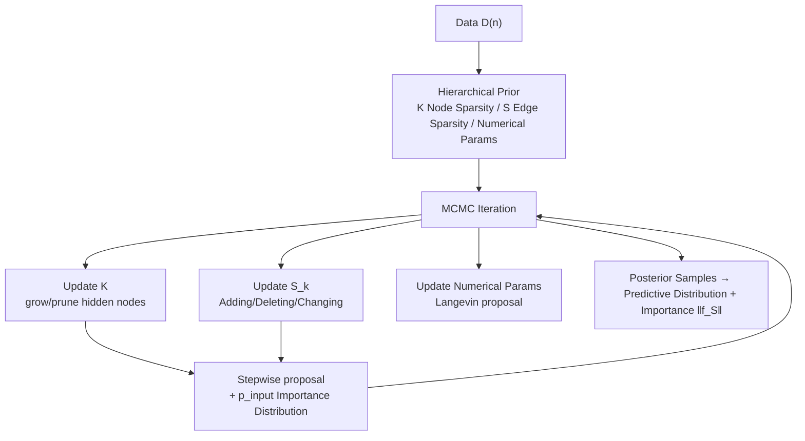

# Bayesian Neural Networks for Functional ANOVA Model

**Conference**: ICLR 2026  
**OpenReview**: [https://openreview.net/forum?id=cvZhXILRLI](https://openreview.net/forum?id=cvZhXILRLI)  
**Code**: Provided in supplementary materials  
**Area**: Interpretable Machine Learning / functional ANOVA / Bayesian Neural Networks  
**Keywords**: Functional ANOVA, Tensor Product Neural Network, Bayesian Neural Network, High-order Interaction, MCMC, Posterior Consistency  

## TL;DR
The model treats the selection of components to be estimated within the functional ANOVA framework as learnable parameters. It utilizes an MCMC algorithm with stepwise proposals to automatically search for and estimate high-order interaction components in high-dimensional inputs. This approach circumvents the computational bottleneck of ANOVA-TPNN, where the number of components grows exponentially with the interaction order due to the requirement of pre-enumerating all components.

## Background & Motivation
**Background**: The functional ANOVA model uniquely decomposes a high-dimensional function $f(x)$ into a sum of low-dimensional components $f(x)=\sum_{S\subseteq[p]}f_S(x_S)$, where each component $f_S$ satisfies sum-to-zero constraints. This allows for understanding the model through low-dimensional effects such as main effects and second-order interactions—a paradigm followed by GAM, SS-ANOVA, MARS, and recent models like NAM/NBM/NODE-GAM. ANOVA-TPNN, proposed by Park et al. (2025), uses specially designed Tensor Product Neural Networks (TPNNs) as basis functions that naturally satisfy sum-to-zero constraints, enabling stable and unique estimation of each component.

**Limitations of Prior Work**: Methods like ANOVA-TPNN require **pre-specifying the set of components to be estimated**. In the model $f(x)=\sum_{S:|S|\le d}\sum_k\beta_{S,k}\phi(x_S\mid\cdot)$, once the maximum order $d$ is set, the required number of TPNNs grows exponentially with $d$. When the input dimension $p$ is large, the number of components (and thus networks to be trained) explodes, limiting practical applications to $d=1$ or $2$. For instance, extending ANOVA-TPNN to third-order interactions on synthetic data with $p=50$ requires approximately 19,600 networks, exceeding standard computational capacities.

**Key Challenge**: Prediction accuracy is often determined by high-order interactions (the paper finds the most critical component in MADELON data is a 4th-order interaction). However, the cost of "exhaustive pre-specification" inflates exponentially with the order, forcing the removal of high-order components and compromising both prediction and interpretability.

**Goal**: To enable the model to automatically discover and estimate important high-order interaction components without pre-enumerating them or consuming massive computational resources.

**Core Idea**: Instead of fixing the component set $S$, the architecture—specifically "which components to use and how many hidden nodes to employ"—is treated as a parameter for inference. Since the number of hidden nodes $K$ and the component sets $S_k$ are not numerical parameters and cannot be updated via gradient descent, a Bayesian approach is adopted. A specialized MCMC algorithm searches through the high-posterior regions of the architecture, resulting in **Bayesian-TPNN**.

## Method

### Overall Architecture
Bayesian-TPNN represents the model as $f(x)=\sum_{k=1}^{K}\beta_k\phi(x\mid\Theta_k)$, where $\Theta_k=(S_k,b_{S_k,k},\Gamma_{S_k,k})$ and $S_k\subseteq[p]$ is the set of input variables connected to the $k$-th hidden node. It can be viewed as a **shallow network with sparse edges**: $K$ is the number of hidden nodes (node sparsity), and each node connects to a group of input variables $S_k$ via active edges (edge sparsity), where the size of $S_k$ corresponds to the interaction order. Since architecture parameters like $K$ and $\{S_k\}$ cannot be updated via gradients, inference is structured in three layers: designing hierarchical priors for the architecture and parameters → using MCMC to iteratively update $K$, $S_k$, and numerical parameters → proving posterior consistency for the true components.

### Key Designs

**1. Architecture as Learnable Parameters: Integrating component selection into Bayesian inference.** This is the pivot of the paper. Unlike traditional methods that treat the component set $\{S:|S|\le d\}$ as a fixed setting, this work treats $K$ and $S_k$ as random parameters for inference. Each TPNN basis $\phi(x_S\mid S,B,R)=\prod_{j\in S}\big[1-\sigma(\frac{x_j-b_j}{\gamma_j})+c_j\,\sigma(\frac{x_j-b_j}{\gamma_j})\big]$ still satisfies sum-to-zero (via constant $c_j$), ensuring that decomposition uniqueness and interpretability are maintained regardless of the architecture found by MCMC. The inclusion of high-order components shifts from a manual discrete choice to a posterior problem explored by MCMC.

**2. Three-layer Hierarchical Prior: Encouraging parsimonious architectures via node/edge sparsity and Bayesian CART-style distributions.** Parameters are divided into three groups with respective priors. The number of hidden nodes follows $\pi(K=k)\propto\exp(-C_0 k\log n)$, penalizing complexity as the sample size grows to ensure node sparsity (following masked BNN concepts from Kong et al. 2023). Given $K$, each $S_k$ independently follows a mixture distribution $\sum_{d=1}^p w_d\,\mathrm{Uniform}(\mathrm{power}([p],d))$, where weights $w_d$ are determined by $w_d\propto(1-p_{\text{adding}}(d))\prod_{\ell<d}p_{\text{adding}}(\ell)$ and $p_{\text{adding}}(\ell)=\alpha_{\text{adding}}(1+\ell)^{-\gamma_{\text{adding}}}$. This mechanism, borrowed from Bayesian CART, favors lower-order interactions while requiring stronger evidence for high-order ones. Numerical parameters use standard priors (Normal, Uniform, Gamma, and Inverse-Gamma for noise).

**3. Stepwise Search + p_input Importance Proposal: Biasing MCMC toward important high-order interactions.** This is the core algorithmic innovation. MCMC updates $K$, $(S_k,b,\Gamma,\beta)$, and noise parameters $\eta$ iteratively, but the proposal is designed to favor important high-order interactions using two tools: a pre-trained input importance distribution $p_{\text{input}}(\cdot)$ (derived from global SHAP values of a DNN or XGBoost feature importance) and a **stepwise move**. When adding a node, the algorithm clones an existing node $S_{k^*}$ and adds one edge based on $p_{\text{input}}(\cdot\mid S_{k^*}^c)$, yielding $S^{\text{new}}=S_{k^*}\cup\{j_{k^*}\}$. This increases the order by exactly one while preserving the existing structure to avoid accuracy drops. Node additions use "Random" sampling (from the prior) with probability $M/(M+K)$ and "Stepwise" sampling with probability $K/(M+K)$. Updates to $S_k$ use Adding/Deleting/Changing operations combined with Langevin proposals for faster numerical convergence. This mechanism allows the model to "climb" from useful low-order structures to high-order ones.

**4. Posterior Consistency Guarantee: Theoretical proof of consistent estimation for components.** The authors prove that the posterior of Bayesian-TPNN is consistent. Under regularity conditions such as $0<\inf_x p_X(x)\le\sup_x p_X(x)<\infty$, there exists $\xi>0$ such that for any $\varepsilon>0$ and all $S\subseteq[p]$, the truncated posterior $\pi_\xi(f:\|f_{0,S}-f_S\|_{2,n}>\varepsilon\mid X^{(n)},Y^{(n)})\to 0$. This implies that not only does the overall function converge, but **every individual component** also converges to its true value, ensuring the interpretability of low-dimensional curves.

## Key Experimental Results

### Main Results (8 Real Datasets, Predictive Accuracy)
RMSE for regression (lower is better), AUROC for classification (higher is better). Compared against ANOVA-TPNN, NAM, Linear, XGB, BART, and mBNN.

| Dataset | Metric | Bayesian-TPNN | ANOVA-TPNN | NAM | XGB | BART | mBNN |
|---|---|---|---|---|---|---|---|
| BOSTON | RMSE↓ | **3.654** | 3.671 | 3.832 | 4.130 | 4.073 | 4.277 |
| MPG | RMSE↓ | **2.386** | 2.623 | 2.755 | 2.531 | 2.699 | 2.897 |
| FICO | AUROC↑ | 0.793 | **0.802** | 0.764 | 0.793 | 0.701 | 0.740 |
| CHURN | AUROC↑ | **0.849** | 0.848 | 0.835 | 0.848 | 0.835 | 0.833 |
| MADELON | AUROC↑ | **0.854** | 0.587 | 0.644 | 0.884 | 0.751 | 0.650 |

Bayesian-TPNN is generally comparable to or better than the strongest baselines. On MADELON, which relies on high-order interactions, it significantly outperforms ANOVA-T2PNN (0.854 vs 0.587), approaching the performance of the black-box XGB.

### Uncertainty Quantification + Ablation Study
As a transparent model, its UQ outperforms black-box Bayesian models like BART and mBNN.

| Dataset | Metric | Bayesian-TPNN | BART | mBNN |
|---|---|---|---|---|
| BOSTON | CRPS↓ | **2.202** | 2.623 | 3.144 |
| MPG | CRPS↓ | **1.510** | 1.553 | 2.142 |
| FICO | ECE↓ | **0.036** | 0.054 | 0.219 |
| FICO | NLL↓ | **0.554** | 0.632 | 0.773 |

Component Selection (Synthetic data, $p=50$, AUROC reported):

| True Model | Interaction Order | Bayesian-TPNN | ANOVA-T2PNN | NA2M |
|---|---|---|---|---|
| $f^{(1)}$ | 1st-order | **1.000** | 0.999 | 0.528 |
| $f^{(1)}$ | 2nd-order | **1.000** | 0.978 | 0.508 |
| $f^{(1)}$ | 3rd-order | **0.740** | N/A | N/A |
| $f^{(3)}$ | 1st-order | **1.000** | 0.781 | 0.522 |

Second-order baselines require ~19,600 networks for third-order tasks and are thus computationally infeasible; Bayesian-TPNN provides meaningful AUROC at the third order.

### Key Findings
- **High-order Interactions Drive Performance**: In MADELON, the most important component selected is a 4th-order interaction (49, 242, 319, 339), explaining the massive gain over the second-order ANOVA-TPNN.
- **Integration with CBM**: As a final classifier for Concept Bottleneck Models, it achieves top performance on CELEBA-HQ (AUROC 0.936) and CATDOG (0.878).
- **Readability**: In BOSTON, main effect curves with 95% credible intervals clearly visualize monotonic and threshold relationships (e.g., Rooms↑ Price↑, LSTAT↑ Price↓).

## Highlights & Insights
- **Bayesianizing Model Selection**: By making the maximum order $d$ and component set posterior objects, this work bypasses the "exponential explosion" bottleneck of functional ANOVA. This is a paradigm shift from manual hyperparameter tuning to automated architectural inference.
- **Clever Stepwise + Importance Prior**: Cloning existing nodes for expansion recycles useful structures and guides the search toward data-indicated variables, providing a "handrail" for high-dimensional discrete architecture search.
- **Consistency + Robust UQ for Interpretable Models**: The transparent model exceeds black-box BART/mBNN in UQ and offers posterior consistency for each component, addressing concerns that interpretability necessitates a sacrifice in performance or reliability.

## Limitations & Future Work
- **Dependence on Pre-trained $p_{\text{input}}$**: Performance degrades if a non-informative uniform distribution is used in high dimensions; the current reliance on external SHAP/feature importance introduces a dependency. The authors propose an adaptive $p_{\text{input}}$ update mechanism for future work.
- **MCMC Costs**: While more efficient than exhaustive TPNNs, MCMC mixing speed and convergence diagnostics in high-dimensional, multi-modal posterior spaces remain challenging.
- **Basis Restriction**: Sum-to-zero is guaranteed by the TPNN structure, binding the expressivity to this specific family. Its sufficiency for highly non-smooth high-order structures is not fully explored.

## Related Work & Insights
- **ANOVA-TPNN (Park et al. 2025)**: Provided the sum-to-zero TPNN basis and unique estimation; this work inherits the basis but renovates the pre-specification requirement.
- **Learnable BNN Architectures**: mBNN (Kong et al. 2023) and S-RJMCMC (Nguyen et al. 2024) explore architecture as parameters; this work customizes proposals for functional ANOVA's edge-sparse structure.
- **Bayesian Tree Search**: Bayesian CART (Chipman 1998) and BART (Chipman 2010) provided the grow/prune/change MH paradigm, which this work adapts to the "edge sets" of neural hidden nodes.
- **Insight**: When a model's bottleneck is a combinatorial space too large to exhaust, Bayesianizing the structures and designing biased proposals towards useful regions is a powerful strategy, especially for feature interaction selection.

## Rating
- **Novelty**: ⭐⭐⭐⭐ Converts component selection into inferable architecture parameters and solves high-order exploration via stepwise importance proposals.
- **Experimental Thoroughness**: ⭐⭐⭐⭐ Comprehensive real-world and synthetic comparisons including UQ and CBM applications.
- **Writing Quality**: ⭐⭐⭐⭐ Logical flow from motivation to theory; mechanisms are clearly explained.
- **Value**: ⭐⭐⭐⭐ Makes high-dimensional functional ANOVA with high-order interactions practical, supported by posterior consistency and strong UQ.

<!-- RELATED:START -->

<!-- RELATED:END -->

## Related Papers

- [\[ICLR 2026\] Certified Evaluation of Model-Level Explanations for Graph Neural Networks](certified_evaluation_of_model-level_explanations_for_graph_neural_networks.md)
- [\[ICLR 2026\] FAME: Formal Abstract Minimal Explanation for Neural Networks](fame_formal_abstract_minimal_explanation_for_neural_networks.md)
- [\[ICLR 2026\] Explainable K-means Neural Networks for Multi-view Clustering](explainable_k_-means_neural_networks_for_multi-view_clustering.md)
- [\[ICLR 2026\] Discovering Alternative Solutions Beyond the Simplicity Bias in Recurrent Neural Networks](discovering_alternative_solutions_beyond_the_simplicity_bias_in_recurrent_neural.md)
- [\[ICLR 2026\] Addressing Divergent Representations from Causal Interventions on Neural Networks](addressing_divergent_representations_causal.md)

<!-- RELATED:END -->
