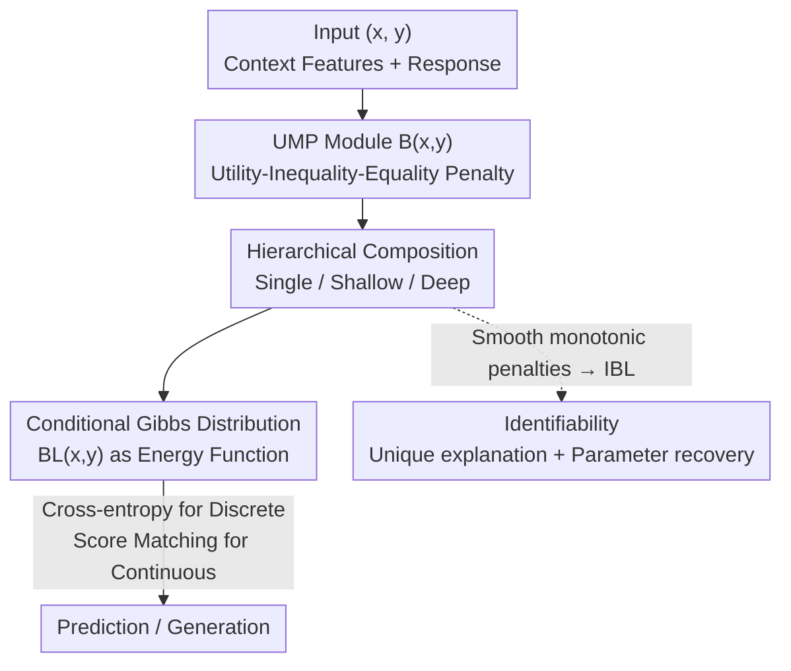

# Behavior Learning (BL)

**Conference**: ICLR2026  
**OpenReview**: [https://openreview.net/forum?id=bbAN9PPcI1](https://openreview.net/forum?id=bbAN9PPcI1)  
**Code**: https://github.com/MoonYLiang/Behavior-Learning (`pip install blnetwork`)  
**Area**: Interpretable Machine Learning  
**Keywords**: Intrinsic Interpretability, Identifiability, Utility Maximization, Inverse Optimization, Energy-based Models

## TL;DR
Inspired by behavioral science, this paper directly incorporates the assumption that "observations are solutions to an optimization problem" as a learnable module. Each module is a Utility Maximization Problem (UMP) expressible in symbolic form. These are hierarchically stacked into a composite utility function that induces a Gibbs distribution for prediction/generation, simultaneously achieving strong predictive power, intrinsic interpretability, and (in the IBL variant) parameter identifiability.

## Background & Motivation
**Background**: Interpretable Machine Learning (ML) aims to fit complex phenomena while remaining transparent. Existing pathways to mitigate the "performance-interpretability tradeoff" generally fall into four categories: Additive Models (GAM/EBM/NAM), Concept Bottleneck Models, Rule/Scoring Systems, and Shape-Constrained Neural Networks.

**Limitations of Prior Work**: Most of these methods function as "interpretability add-ons" to existing ML methods, suffering from two fundamental issues. First is the **mismatch with scientific theory**—they do not originate from scientific modeling paradigms like optimization problems or differential equations, making it difficult to extract knowledge acceptable to the scientific community. Second is **non-unique explanations**—most models are non-identifiable, where the same prediction can correspond to multiple sets of parameters/explanations. This prevents reliable estimation of "true parameters" and reduces scientific credibility in the Popperian sense of falsifiability.

**Key Challenge**: High-performance models (Deep Networks) are opaque, while intrinsic interpretable models fail to capture complex non-linearities. Moreover, even when interpretable, the explanations may be non-unique and non-identifiable. To create "scientifically usable" interpretable ML, one must bind predictive power, intrinsic interpretability, and identifiability together.

**Goal**: Design a **general** framework that alleviates the performance-interpretability tradeoff, possesses scientific foundations (based on optimization), and ensures parameter identifiability.

**Key Insight**: The authors leverage the fundamental paradigm of behavioral science—**Utility Maximization**: the behavior of agents can be viewed as solving an optimization problem (UMP) to maximize subjective utility under constraints. Crucially, Theorem 2.2 states that **any optimization problem with equality/inequality constraints can be equivalently rewritten as a UMP**. Thus, a framework with UMPs as building blocks is inherently universal, applicable to scientific fields where "outcomes are optimization solutions" (e.g., macroeconomics, statistical physics, evolutionary biology), essentially performing **data-driven inverse optimization**.

**Core Idea**: Replace "black-box non-linear layers" with "learnable UMP modules." Each module can be written as a symbolic optimization problem. After hierarchical composition, a condition Gibbs (energy) distribution is used to model data, embedding interpretability into the structure rather than relying on post-hoc explanations.

## Method

### Overall Architecture
BL views the response $y$ in a sample $(x,y)$ as the localized result of an agent solving interacting UMPs. The input consists of context features $x\in\mathbb{R}^d$, and the response $y$ can contain both discrete and continuous parts $(y_{disc}, y_{cont})$. The pipeline composes several **learnable UMP modules** $B(x,y)$ into a **composite utility function** $BL(x,y)$, which then parametrizes a conditional Gibbs distribution:

$$p_\tau(y\mid x;\Theta)=\frac{\exp\big(BL_\Theta(x,y)/\tau\big)}{Z_\tau(x;\Theta)}$$

for prediction and generation. As the temperature $\tau\to 0$, the distribution collapses to a Dirac measure at $\arg\max_y BL(x,y)$, recovering the deterministic optimal response from the composite UMP. The entire network is trained end-to-end. By replacing penalty functions with smooth monotonic forms, the **IBL** variant ensures unique explanations and recovery of true parameters under mild conditions.

### Key Designs

**1. UMP Module: Making an optimization problem a learnable layer**

This is the core mechanism to resolve the "mismatch with scientific theory." A standard UMP is $\max_{y} U(x,y)$ s.t. $C(x,y)\le 0,\ T(x,y)=0$, where $U$ is subjective utility, $C$ represents inequality constraints (resources), and $T$ represents equality constraints (belief consistency or conservation laws). Using Theorem 2.1 (Local Exact Penalty Reconstruction), the constrained problem is rewritten as an unconstrained penalty form and parameterized as a learnable module:

$$B(x,y;\theta):=\lambda_0^\top\phi\big(U_{\theta_U}(x,y)\big)-\lambda_1^\top\rho\big(C_{\theta_C}(x,y)\big)-\lambda_2^\top\psi\big(T_{\theta_T}(x,y)\big)$$

where $\phi$ is increasing, $\rho(z)=\max\{z,0\}$ penalizes inequality violations, and $\psi(z)=|z|$ penalizes equality deviations. The default instantiation is $B=\lambda_0^\top\tanh(p_u)-\lambda_1^\top\mathrm{ReLU}(p_c)-\lambda_2^\top|p_t|$, where $p_u,p_c,p_t$ are polynomial feature maps. The bounded $\tanh$ corresponds to "diminishing marginal utility," while ReLU and $|\cdot|$ provide soft penalties. Critically, **each module can be mapped back to a symbolic UMP**—the $\tanh$ term is the objective, the ReLU term is the inequality constraint, and the absolute value term is the equality constraint. With polynomial bases, transparency is comparable to linear regression.

**2. Hierarchical Composition: From single UMP to "Macro-Micro" optimization hierarchies**

Since a single UMP has limited expressive power, $B$ is used as a block for hierarchical composition. **BL(Single)** uses one $B$ for maximum interpretability (direct symbolic UMP). **BL(Shallow)** stacks one or two layers, concatenating parallel $B_{\ell,i}$ modules into a vector $B_\ell(x,y)=[B_{\ell,1},\dots,B_{\ell,d_\ell}]^\top$ for the next layer. **BL(Deep)** extends beyond two layers:

$$BL(x,y):=W_L\cdot B_L\big(\cdots B_2(B_1(x,y))\cdots\big)$$

Deep versions optionally use skip connections. This hierarchy represents **"Coarse-graining/Renormalization" in science**: bottom $B$ blocks are micro-level primary preferences, aggregated layer-by-layer into macro-level tradeoffs and representative agents. Interpretability is thus bottom-up and traceable: Raw features → Micro-optimization blocks → Macro-aggregation/Coarse-grained constructs → Macro-optimization system.

**3. Gibbs Distribution + Mixed Objective: Training composite utility as an energy function**

Using $BL(x,y)$ as an energy function, the conditional Gibbs distribution models the data, aligning "utility maximization" with "density maximization" as $\tau\to 0$. Training targets are split: Cross-entropy for $y_{disc}$, and **Denoising Score Matching** for $y_{cont}$ to bypass the intractable partition function $Z_\tau$. The final loss is a weighted sum:

$$\mathcal{L}(\theta)=\gamma_d\,\mathbb{E}\big[-\log p_\tau(y_{disc}\mid x)\big]+\gamma_c\,\mathbb{E}\big\|\nabla_{\tilde y_{cont}}\log p_\tau(\tilde y_{cont}\mid x)+\sigma^{-2}(\tilde y_{cont}-y_{cont})\big\|^2$$

The authors prove (Theorem 2.3) that BL (and IBL) possess the **Universal Approximation** property: with sufficient capacity, they can approximate any continuous conditional density in the KL sense.

**4. IBL: Smooth monotonic penalties for Identifiability**

To achieve "unique explanations," IBL imposes stricter constraints: $\phi_{id},\rho_{id}$ are strictly increasing, and $\psi_{id}$ is symmetric and strictly increasing about $|\cdot|$, with all being $C^1$. Instantiated as $B_{id}=\lambda_0^\top\tanh(p_u)-\lambda_1^\top\mathrm{softplus}(p_c)-\lambda_2^\top(p_t)^{\odot2}$. Under Assumption 2.1 (injective parameter mapping + linear independence + canonical ordering), this yields: **Identifiability** (Theorem 2.4), **Loss Identifiability** (Theorem 2.5), **Consistency** (Theorem 2.6: $\hat\theta_n\xrightarrow{p}\theta^\bullet$), and **Universal Consistency** (Theorem 2.7: convergence to the true distribution in KL even under misspecification).

## Key Experimental Results

### Standard Prediction Tasks (10 datasets × 8 seeds)
Comparison across 10 baselines (NNs, Trees, Boosting, Bayesian, Linear Regression).

| Model | F1-Macro Avg Rank | Positioning |
|------|------|------|
| SOTA Black-box | Tier 1 | Performance Ceiling |
| BL(Shallow) | Tier 1/2 (No sig. diff from SOTA) | Best among Intrinsic Interp. Models |
| BL(Single) | Close Follower | Strongest Interpretability |
| MLP | Surpassed by BL(Shallow) | Black-box Control |

Key finding: BL reaches the first tier in AUC and F1-Macro, standing as the best-performing intrinsic interpretable model.

### High-Dimensional Scalability (Image + Text, vs. E-MLP)
Depths $d\in\{1,2,3\}$, aligned parameters, no skips.

| Dataset | Metric | E-MLP (d=3) | BL (d=3) |
|--------|------|------|------|
| MNIST | OOD AUROC | 87.76 | **92.92** |
| Fashion-MNIST | OOD AUROC | 83.13 | **89.24** |
| MNIST | ID Acc | 98.14 | 97.93 |
| Fashion-MNIST | ID Acc | 89.33 | 88.79 |

BL shows superior OOD detection while maintaining comparable ID accuracy. BL also exhibits better calibration (ECE/NLL) on text datasets.

### Key Findings
- BL provides a "downward shift" of the Pareto frontier: achieving performance comparable to black-box models while gaining transparency.
- Case Study (Boston Housing): A trained BL(Single) can be rewritten as a "representative buyer" UMP: $p_u\approx(1-P)(1+P-RM)+\tilde R_u$. RM (rooms) dominates preferences, LSTAT (low income) enters budget constraints, and CRIM (crime) appears only in "belief" terms.
- BL(Deep) [5,3,1] recovers hierarchical patterns: 5 micro-preferences → 3 macro-tradeoffs → 1 representative buyer, aligning with economic literature and renormalization principles.

## Highlights & Insights
- **Inverse Optimization as Learnable Layers**: Theorem 2.2 transforms any optimization into a UMP, making the network inherently scientific. This moves beyond post-hoc explanations to structural interpretability.
- **Identifiability as a First-Class Citizen**: Unlike most models that settle for "being interpretable," BL demands "unique explanations" and provides statistical guarantees through IBL.
- **Unified Energy Perspective**: The use of Gibbs distributions aligns utility maximization with probabilistic modeling, and denoising score matching makes it computationally feasible.
- **Hierarchy as Coarse-graining**: Interpreting deep architectures as micro-to-macro optimization tiers rather than just capacity stacks offers a powerful tool for scientific modeling.

## Limitations & Future Work
- **Strong Assumptions on Misspecification**: Consistency in parameter recovery relies on the data being generated by some $\theta^\star$, which is rarely true in practice.
- **Approximate Symbolic Explanations**: Converting polynomials to "readable UMPs" involves keeping only top coefficients; there is an inherent tradeoff between readability and fidelity.
- **Interpretability Decay in Deep Models**: BL(Deep) often uses affine maps for efficiency, reducing symbolic granularity to qualitative patterns.
- **Small-to-Medium Experimental Scale**: While robust on tabular data and basic images/text, validation on truly large-scale or multi-modal datasets is pending.

## Related Work & Insights
- **vs. GAM/CBM/Rule Models**: These lacks scientific grounding and are often non-identifiable. BL builds on UMP optimization logic with identifiability guarantees.
- **vs. Energy-based Models / E-MLP**: While E-MLP is a black box, BL structures the energy function as a symbolic UMP composite, matching performance while adding transparency.
- **vs. Neuro-symbolic / Symbolic Regression**: BL constrains the symbolic structure to the "utility-constraint" paradigm and provides formal consistency theory.

## Rating
- Novelty: ⭐⭐⭐⭐⭐ Transforming "Any Optimization = UMP" into layers with identifiability is highly novel.
- Experimental Thoroughness: ⭐⭐⭐⭐ Comprehensive across prediction and case studies, though lacking massive-scale validation.
- Writing Quality: ⭐⭐⭐⭐ Clear theory-method-experiment loop, though mathematically dense.
- Value: ⭐⭐⭐⭐⭐ Provides a theoretically grounded paradigm for "scientifically usable" interpretable ML.

<!-- RELATED:START -->

## Related Papers

- [\[ICML 2026\] Discovering Differences in Strategic Behavior Between Humans and LLMs](../../ICML2026/interpretability/discovering_differences_in_strategic_behavior_between_humans_and_llms.md)
- [\[ICLR 2026\] Comparing the learning dynamics of in-context learning and fine-tuning in language models](comparing_the_learning_dynamics_of_in-context_learning_and_fine-tuning_in_langua.md)
- [\[ICML 2026\] ExPLAIND: Unifying Model, Data, and Training Attribution to Study Model Behavior](../../ICML2026/interpretability/explaind_unifying_model_data_and_training_attribution_to_study_model_behavior.md)
- [\[ICLR 2026\] Learning Nonlinear Causal Reductions to Explain Reinforcement Learning Policies](learning_nonlinear_causal_reductions_to_explain_reinforcement_learning_policies.md)
- [\[AAAI 2026\] ElementaryNet: A Non-Strategic Neural Network for Predicting Human Behavior in Normal-Form Games](../../AAAI2026/interpretability/elementarynet_a_non-strategic_neural_network_for_predicting_human_behavior_in_no.md)

<!-- RELATED:END -->
