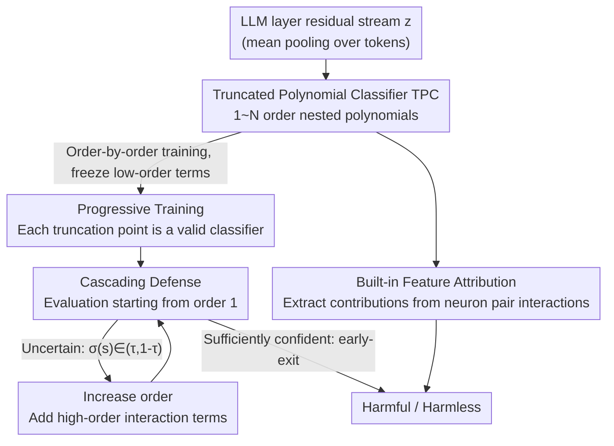

# Beyond Linear Probes: Dynamic Safety Monitoring for Language Models

**Conference**: ICLR 2026  
**arXiv**: [2509.26238](https://arxiv.org/abs/2509.26238)  
**Code**: [https://github.com/james-oldfield/tpc](https://github.com/james-oldfield/tpc)  
**Area**: Model Safety / Activation Space Monitoring / AI Safety  
**Keywords**: Truncated Polynomial Classifier, Safety Monitoring, Dynamic Inference, Linear Probes, Activation Space  

## TL;DR
The authors propose Truncated Polynomial Classifiers (TPC), which achieve dynamic safety monitoring through order-by-order training and truncated evaluation of polynomials in the LLM activation space. This allows for fast decisions on simple inputs using low-order (≈linear probe) terms and stronger protection for difficult inputs by adding high-order terms. TPC matches or surpasses MLP baselines on WildGuardMix and BeaverTails while providing built-in interpretability.

## Background & Motivation

**Background**: LLM safety monitoring primarily utilizes two types of methods: LLM-as-a-Judge natural language review (expensive but powerful) and activation-space linear probes (efficient but static). The former imposes a fixed high cost for every query, while the latter only provides a basic static line of defense.

**Limitations of Prior Work**:
   - Linear probes are static and cannot adjust protection strength based on input difficulty or available computational budget.
   - LLM-as-a-Judge is too costly to serve as a persistent, always-on monitor.
   - Recent work cascading the two (e.g., McKenzie et al., 2025) still requires additional LLM fine-tuning/prompting and extra inference calls.
   - The "Linear Representation Hypothesis" assumes high-level concepts are encoded in 1D subspaces, but evidence increasingly suggests that not all features possess simple linear structures.

**Key Challenge**: There is an inherent cost-accuracy trade-off in safety monitoring—most requests are benign and require minimal protection, but a few ambiguous or malicious requests need stronger discernment. Existing methods typically treat all inputs with either the highest cost or the lowest precision.

**Goal**:
   - How can a single safety monitor operate across different computational budgets?
   - How can the monitor fast-track simple inputs while scrutinizing difficult ones?
   - How can classification capability be improved while maintaining interpretability (unlike black-box MLPs)?

**Key Insight**: Exploiting the idea of test-time compute scaling—computational resources should be allocated dynamically during inference rather than fixed. Polynomials naturally possess an additive structure when truncated by order, which is perfectly suited for progressive computation.

**Core Idea**: Generalize linear probes into truncatable polynomial classifiers. By training a sequence of nested sub-models order-by-order, the system performs truncated evaluation as needed during inference—recovering the linear probe at low orders and providing stronger protection at higher orders.

## Method

### Overall Architecture
TPC addresses the "one monitor, multiple budgets" problem: simple inputs are cleared quickly with low-cost terms (near linear probes), while difficult inputs receive more compute for deep checking. Generally, the residual stream representation $\bm{z} \in \mathbb{R}^D$ (mean-pooled across tokens) of a specific LLM layer is fed into an $N$-order polynomial classifier. This polynomial is trained **order-by-order** into a series of nested sub-models. During inference, it uses **cascading evaluation with early-exit based on confidence levels**, proceeding from low to high orders. It finally outputs binary classification probabilities (harmful/harmless) and can **attribute the decision to specific neuron interactions**. The polynomial can be truncated to any $n \leq N$ order during inference, taking the form $P_{:n}^{[N]}(\bm{z}) = w^{[0]} + \bm{z}^\top \bm{w}^{[1]} + \sum_{k=2}^{n} \sum_{r=1}^{R} \lambda_r^{[k]} (\bm{z}^\top \bm{u}_r^{[k]})^k$.

### Key Designs

**1. Truncated Polynomial Classifier (TPC): Replacing static linear probes with truncatable polynomials**

Linear probes only capture first-order (linear) information in activation space. TPC generalizes this into an $N$-order polynomial, using high-order multiplicative interaction terms to model relationships between neurons. When truncated to $n=1$, it reduces to a standard linear probe $w^{[0]} + \bm{z}^\top \bm{w}^{[1]}$. Each additional order $k$ introduces multiplicative interactions between $k$ neurons. To prevent parameter explosion with high-order weight tensors, each order is parameterized using symmetric CP decomposition:

$$\mathcal{W}^{[k]} = \sum_{r=1}^{R} \lambda_r^{[k]} (\bm{u}_r^{[k]} \circ \cdots \circ \bm{u}_r^{[k]})$$

Thus, each order requires only $O(DR)$ parameters. This additive structure allows for truncated evaluation—subsequent high-order terms act as fine-grained corrections to the accumulated logits, while symmetric decomposition removes redundant parameters for the same monomial.

**2. Progressive Training: Ensuring each truncation point is a valid classifier**

Training a complete $N$-order polynomial all at once and then truncating leads to unpredictable sub-model performance. TPC instead uses order-by-order training: parameters $\bm{\theta}^{[k]}$ for order $k$ are learned by minimizing the BCE loss of the model truncated at $k$ orders, while freezing the previously learned parameters for orders $1$ to $k-1$. The first order inherits pre-trained linear probe weights. This explicitly optimizes each truncation point to be an effective classifier, ensuring high-order additions do not disrupt the performance of low-order truncations.

**3. Cascading Defense: Dynamically deciding order based on input difficulty**

With every truncation point optimized, early-exit becomes feasible during inference. Starting from $n=1$, the model evaluates each order and checks if $\sigma(s) \in (\tau, 1-\tau)$ holds (where $\tau$ is a confidence threshold). If the current prediction is sufficiently confident (outside the threshold), the result is output immediately; otherwise, it proceeds to the next order. The underlying observation is that most requests are benign and can be handled by linear probes, while only a few ambiguous or adversarial inputs require high-order checks.

**4. Built-in Feature Attribution: Tracing decisions back to specific neuron interactions**

Unlike black-box MLPs, TPC's polynomial form is naturally attributable. Taking a 2nd-order term as an example, its contribution to the logits can be decomposed as $c_{ij} = (w_{ij}^{[2]} + w_{ji}^{[2]}) z_i z_j$, directly quantifying the impact of the interaction between any neuron pair $(i,j)$. This allows the model to state conclusions such as "the interaction between neuron 4830 and 4916 increased the harmful logit by 0.005."

### Loss & Training
- Each order is trained using standard BCE loss while freezing parameters of preceding orders.
- 1st-order weights are initialized from sklearn linear probes.
- Experiments utilize $N=5$, CP rank $R=64$, and 5 random seeds.
- Activation vectors are extracted from intermediate layers (L32/L40 for gemma-3, L16/L20 for gpt-oss/llama).

## Key Experimental Results

### Main Results (WildGuardMix Static Evaluation, Test F1%)

| Method | gemma-3-27B | Qwen3-30B | gpt-oss-20b | Llama-3.2-3B |
|------|------------|-----------|-------------|-------------|
| Linear probe | 88.03 | 85.53 | 86.70 | 83.24 |
| Bilinear probe | 88.79 | 84.87 | 87.13 | 84.78 |
| MLP | 88.49 | 85.48 | 87.86 | 83.77 |
| EE-MLP (5th exit) | 88.39 | 85.24 | 87.31 | 83.84 |
| **Ours (TPC 5th order)** | **88.86** | **85.57** | **88.05** | **84.48** |

### Cascading Defense Performance (gemma-3-27B, L40)

| Configuration | Net Parameters | F1 | Description |
|------|---------|-----|------|
| Linear probe only (n=1) | Baseline | ~88.0 | All inputs use linear probe |
| Full TPC (n=5, no cascade) | 5× | ~88.9 | All inputs use full polynomial |
| Cascade (τ=mid-high) | ~1.1× | ~88.8 | Most inputs exit at low orders |
| Cascade (τ=high) | ~1.3× | ~88.9 | Near full polynomial performance |

### Key Findings
- **TPC outperforms all baselines on WildGuardMix** (including parameter-matched MLPs) and matches EE-MLP on BeaverTails.
- On specific harmful categories, fixed-order TPC improves accuracy by up to 10% compared to linear probes and 6% compared to MLPs.
- **Cascading evaluation is the primary highlight**: under medium-to-high $\tau$, performance approaches that of the full polynomial while the net parameter count remains near the linear probe level.
- Progressive vs. Direct Training: Direct training of a full polynomial yields unstable sub-models; progressive training ensures every truncation point is a valid classifier.
- Neuron pair attribution in 2nd-order TPC explains decisions (e.g., interaction between neurons 4830 and 2483 increases harmful logits for "nuclear bomb" prompts).

## Highlights & Insights
- **The concept of "one model, multiple safety budgets"** is the core insight—introducing test-time compute scaling to safety monitoring via the natural truncation property of polynomials. This can be adapted to any classification task requiring flexible precision.
- **The progressive training scheme** elegantly addresses the training-evaluation inconsistency. It mirrors greedy layer-wise training but applies it to the polynomial order dimension—ensuring low orders remain useful while high orders provide incremental refinement.
- **Symmetric CP decomposition** solves parameter explosion for high-order tensors and provides interpretable neuron interaction attribution. The ability to trace contributions back to specific pairs is a natural advantage over black-box MLPs.

## Limitations & Future Work
- Small-data scenarios are unexplored—high-order polynomials risk overfitting and may require stronger regularization.
- Neuron pair attribution is mechanically faithful but lacks human-readable semantic explanations—the "why" behind an interaction remains unclear.
- Performance is not strictly monotonic with order; identifying the optimal layer remains a search problem for all activation monitors.
- Experiments are restricted to prompt-level binary classification; fine-grained safety detection or response monitoring has not been validated.
- **Future Work**: Applying polynomial expansion in SAE feature spaces could potentially yield both sparsity and interpretability; multi-layer probe ensembles could automate layer selection.

## Related Work & Insights
- **vs Linear Probes (Alain & Bengio, 2017)**: Linear probes are a special case of TPC at $n=1$. TPC retains their lightweight and interpretable nature while providing additional capacity when required.
- **vs McKenzie et al. (2025)**: They utilize a linear probe + external LLM cascade. TPC achieves multi-level cascading within a single polynomial, removing the need for external models.
- **vs MLP Probes**: While MLPs are expressive, they are black boxes. TPC offers comparable or better performance for the same parameter count with built-in attribution.

## Rating
- Novelty: ⭐⭐⭐⭐ The combination of truncated evaluation, progressive training, and cascading defense is an elegant novelty in safety monitoring.
- Experimental Thoroughness: ⭐⭐⭐⭐⭐ Comprehensive evaluation across 4 models (up to 30B), 2 large datasets, layer scanning, and attribution visualization.
- Writing Quality: ⭐⭐⭐⭐ Clear structure and rigorous formulas, though some notation is slightly redundant.
- Value: ⭐⭐⭐⭐ Provides a practical dynamic solution for LLM safety monitoring; the cascading defense offers significant value by achieving non-linear performance at near-linear costs.

<!-- RELATED:START -->

## Related Papers

- [\[ICLR 2026\] GAVEL: Towards Rule-Based Safety through Activation Monitoring](gavel_towards_rule-based_safety_through_activation_monitoring.md)
- [\[ICLR 2026\] Linear Mechanisms for Spatiotemporal Reasoning in Vision Language Models](linear_mechanisms_for_spatiotemporal_reasoning_in_vision_language_models.md)
- [\[ICLR 2026\] Rethinking Layer Relevance in Large Language Models Beyond Cosine Similarity](rethinking_layer_relevance_in_large_language_models_beyond_cosine_similarity.md)
- [\[ACL 2026\] Linear Probes Detect Task Format, Not Reasoning Mode in Language Model Hidden States](../../ACL2026/interpretability/linear_probes_detect_task_format_not_reasoning_mode_in_language_model_hidden_sta.md)
- [\[ICML 2026\] What Linear Probes Miss: Multi-View Probing for Weight-Space Learning](../../ICML2026/interpretability/what_linear_probes_miss_multi-view_probing_for_weight-space_learning.md)

<!-- RELATED:END -->
