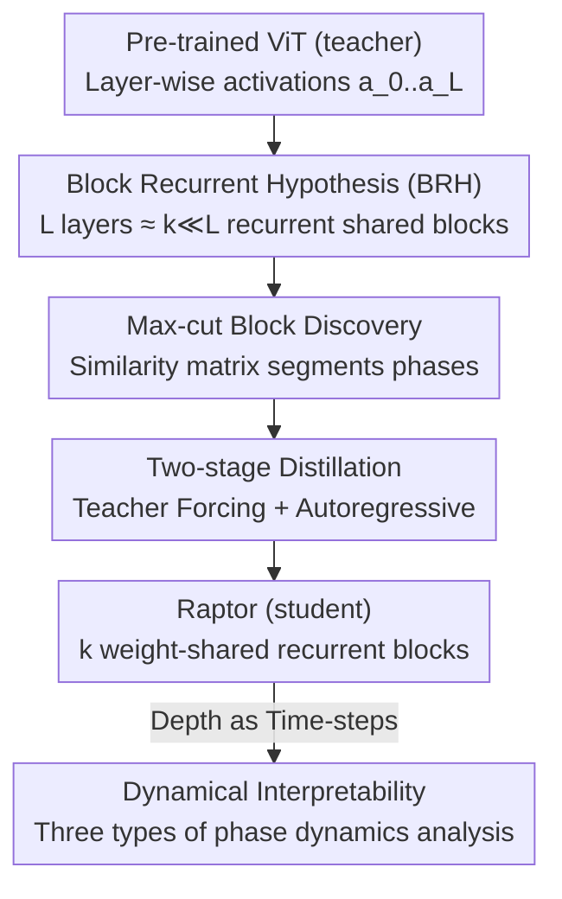

# Block Recurrent Dynamics in Vision Transformers

**Conference**: ICLR2026  
**OpenReview**: [https://openreview.net/forum?id=gH3HhnfWLC](https://openreview.net/forum?id=gH3HhnfWLC)  
**Code**: https://kempnerinstitute.github.io/raptor  
**Area**: interpretability and explainable AI  
**Keywords**: ViT Mechanistic Interpretability, Block Recurrence, Dynamical Systems, Knowledge Distillation, DINOv2

## TL;DR
This paper proposes the "Block Recurrent Hypothesis" (BRH), suggesting that the depth of an $L$-layer pre-trained ViT can be approximated by the recurrent unrolling of $k \ll L$ weight-shared blocks. Using a distillation framework called Raptor, the authors compress DINOv2 into 2–3 recurrent blocks while retaining 96%–98% of ImageNet linear probe accuracy. Based on this, they interpret ViT's layer-wise computation through the lens of discrete-time dynamical systems.

## Background & Motivation
**Background**: ViTs have become the default backbone for vision foundation models (DINOv2, CLIP, SAM, Diffusion Models). Their architecture, consisting of stacked layers with residual connections, has led to long-standing conjectures that ResNet "depth" relates to dynamical systems and implicit recurrence. However, the vision community lacks a unified framework to characterize Transformer depth as a "flow."

**Limitations of Prior Work**: It has been observed that representational similarity matrices across ViT layers often exhibit a **block-diagonal** structure (sequences of layers being highly similar). However, "representational similarity" does not imply "functional equivalence": two layers might produce similar representations through different computational paths, or vice-versa. Therefore, similarity matrices alone cannot confirm whether these "phases" represent the repeated application of the same computation.

**Key Challenge**: There is a gap between representational similarity and functional equivalence. To prove "reuse," one must **constructively** produce a model that reconstructs the entire internal trajectory of a deep model using only a few recurrent blocks.

**Goal**: (1) Formalize the "Block Recurrent Hypothesis" and provide verifiable criteria; (2) Demonstrate its validity in foundation models (DINOv2); (3) Leverage dynamical system tools to explain layer-wise computations once ViTs are viewed as recurrent systems.

**Key Insight**: The authors bet on the idea that "simplicity is the entry point to understanding"—if depth is essentially the iterative reuse of a few computational primitives, ViT can be analyzed as a discrete-time dynamical system (where each layer represents one time-step of evolution).

**Core Idea**: Rewrite an $L$-layer ViT using $k \ll L$ parameter-shared blocks through **recurrent reuse**, requiring the reconstruction of not just the final output but the **entire trajectory of intermediate representations**. This turns the "reuse" conjecture into a falsifiable experiment.

## Method

### Overall Architecture
The method revolves around one goal: taking a pre-trained ViT (teacher) and creating a proxy model (student) using $k$ weight-shared blocks that approximate the teacher's activations layer-by-layer after recurrent unrolling. This proxy is named **Raptor** (Recurrent Approximations to Phase-structured TransfORmers). The pipeline involves: identifying boundaries for $k$ continuous phases using max-cut on similarity matrices; distilling the blocks via a two-stage "Teacher Forcing + Autoregressive" strategy; and finally analyzing the trained recurrent system using dynamical systems tools.

### Key Designs

**1. Block Recurrent Hypothesis (BRH): A Falsifiable Criterion for Functional Equivalence**

To address whether block-diagonal similarity implies computation reuse, the authors provide a formal definition: For a ViT with depth $L$ and layer-wise maps $f_\ell$, it satisfies $\varepsilon$-BRH if there exist $k \ll \ell$ blocks $B_1,\dots,B_k$ and repetition counts $n_1,\dots,n_k$ ($\sum_j n_j=\ell$) such that:

$$\mathbb{E}_{x\sim P}\big[\,\|f_\ell(x)-(B_k^{(n_k)}\circ\cdots\circ B_1^{(n_1)})(x)\|_F\,\big]\le \varepsilon,$$

where $B_j^{(n_j)}$ denotes the $n_j$-th application of the same shared block $B_j$. Crucially, it requires approximating **any intermediate layer** $f_\ell$ rather than just the final output—preventing the trivial solution of packing all computation into one block. $k \ll L$ paired with parameter binding ensures real "functional reuse" rather than "parameter mirroring."

**2. Max-cut Block Discovery: Segmenting "Recurrent Phases" Automatically**

Given a budget $k$, the boundaries of blocks must be decided. The authors model this as a **weighted max-cut** problem solved via dynamic programming: the depth is partitioned into continuous segments to maximize intra-segment similarity and minimize inter-segment similarity. Boundaries represent transitions in representational dynamics. Experiments show max-cut partitioning significantly outperforms random partitioning (often by >1 σ on CIFAR-100), confirming that representational structures correlate with functional phases. Layer-swapping experiments further prove that layers within a block are interchangeable, while inter-block swaps cause model collapse.

**3. Two-stage Distillation (Teacher Forcing + Autoregressive): Stabilizing Recurrent Loops**

Recurrent architectures are notoriously difficult to train due to error accumulation (drift) during rollout and gradient instability. The authors use teacher activations as targets in two stages. **Stage 1** trains blocks in parallel using a hybrid objective: Teacher Forcing (TF) for stability and Autoregressive (AR) for self-consistency. The total loss is:

$$L_{\text{total}}(x)=\lambda L_{\text{TF}}(x)+(1-\lambda)L_{\text{AR},H}(x)+\Omega(\theta),$$

where the AR loss enforces trajectory fidelity across intermediate layers. The TF weight $\lambda$ is annealed to 0. **Stage 2** connects all blocks into a full recurrent system for end-to-end AR fine-tuning ($\lambda=0$), forcing blocks to coordinate and handle their own predictions. Ablations show this step is vital: TF only results in collapse (~3% on ImageNet), while AR annealing boosts accuracy to 68%+.

**4. Dynamical Interpretability: Analyzing Depth as Time-steps**

Viewing ViT as a **discrete-time dynamical system** (layer $\ell$ = time-step $\ell$), the authors analyze dynamics on the unit sphere for **direction** (as Euclidean norms grow indefinitely). They report three findings: (i) **Directional convergence to angular attractors**: The cosine similarity $\gamma_\ell=\langle \hat x_\ell,\hat x_L\rangle$ approaches 1 in an S-curve, with trajectories falling into class-correlated "angular basins" that are robust to perturbations. (ii) **Token-specific dynamics**: Angular speeds $s_\ell=\arccos\langle\hat x_{\ell+1},\hat x_\ell\rangle$ reveal that register tokens are slow and stable, patch tokens are moderate, and the cls token undergoes sharp reorientation at the end (reflecting its role as a global aggregator). Speed jumps at max-cut boundaries confirm the block-recurrent pattern. (iii) **Late-stage low-rank collective motion**: The stable rank of updates drops to ~6 in late layers, and patch coherence rises, indicating convergence to a low-dimensional attractor.

### Loss & Training
The core is the two-stage hybrid loss described above. Two additional tricks improve accuracy: **Depth Scaling**, which adds a learnable embedding vector corresponding to the layer index to each block (making Raptor a **non-autonomous** dynamical system); and **cls weighting**, which increases the loss weight for the cls token in the final block. All distillation is performed with the ViT backbone frozen, only updating the linear probe head while reusing DINOv2’s patch embeddings and final LayerNorm.

## Key Experimental Results

### Main Results
Comparing Raptor with DINOv2 using linear probes across three tasks with frozen backbones:

| Method | Architecture | IN-1k Acc ↑ | ADE20k mIoU ↑ | NYUv2 RMSE ↓ |
|------|------|------|------|------|
| Raptor | k=2 | 81.2 ± 0.2 | 39.6 ± 0.6 | 0.648 ± 0.003 |
| Raptor | k=3 | 83.0 ± 0.1 | 43.0 ± 0.3 | 0.618 ± 0.006 |
| Raptor | k=4 | 83.2 ± 0.1 | 43.6 ± 0.1 | 0.607 ± 0.006 |
| DINOv2 | ViT-S | 80.9 | 44.6 | 0.600 |
| DINOv2 | ViT-B | 84.5 | 47.5 | 0.578 |

With only 2 recurrent blocks, Raptor retains ~96% of DINOv2 ViT-B’s IN-1k performance; with 3 blocks, it reaches 98% (83.0%, surpassing ViT-S). Performance gains saturate at $k=4$.

### Ablation Study
Step-wise components for Raptor (k=3) on ImageNet-1k:

| Configuration | Accuracy | Description |
|------|------|------|
| Teacher Forcing (TF) only | 3.9 | Single-step supervision; loop collapse |
| + Autoregressive (Annealed TF) | 72.7 (Gain: 68.8) | Closed-loop training is essential |
| + Depth Scaling | 75.2 (Gain: 2.5) | Non-autonomous system via embeddings |
| + cls Weighting | 76.7 (Gain: 1.5) | Increased weight for final cls token |
| + Stage 2 | 82.4 (Gain: 5.7) | End-to-end multi-block AR fine-tuning |
| + Fine-tuned Probe | 83.0 (Gain: 0.6) | Final linear probe adjustment |

### Key Findings
- **Autoregressive closure is the lynchpin**: Removing it (TF only) causes accuracy to drop from 70%+ to ~3%, proving recurrent proxies must see their own generated trajectories to remain stable.
- **Stage 2 is the second largest contributor** (+5.7): Modules must learn to coordinate end-to-end; individual block training is insufficient.
- **Block recurrence emerges from training**: When ViTs are trained with high Stochastic Depth rates ($p$), layer similarity increases, and Raptor reconstruction fidelity improves—suggesting SD explicitly encourages recurrent compressibility. Untrained ViTs are paradoxically easier to reconstruct than overfitted ones.

## Highlights & Insights
- **Constructive Interpretability**: Moving beyond "similarity matrices look block-diagonal" to actually training a recurrent model that replicates the entire trajectory. This is a leap from correlation-based evidence to functional proof.
- **Complexity Perspective**: The authors note Raptor is not standard Kolmogorov compression (short program, unbounded runtime) but compression that **preserves runtime** (same block used $n_j$ times = $n_j$ layers of runtime). This aligns with Levin Complexity ($K_{\text{Levin}}$)—representing ViTs as more compact programs under fixed compute budgets.
- **Transferable Principles**: The toolkit for analyzing deep networks as discrete dynamics (on-sphere direction, angular speed, low-rank collapse) is applicable to any deep residual network for finding "phases" and "attractors."
- **Reinterpreting Stochastic Depth**: Usually seen as a regularization trick, this work provides a mechanistic view—it explicitly encourages layer-wise functional reuse, "recurrent-izing" the network.

## Limitations & Future Work
- **Performance Gap in Dense Tasks**: Raptor goals were not perfect compression; a visible gap remains in segmentation/depth tasks compared to the full DINOv2 (e.g., ADE20k mIoU 43.6 vs 47.5).
- **Scope**: Foundation model experiments were limited to DINOv2 (ViT-Base). Scaling of $k$ across CLIP, SigLIP, or different training objectives remains unverified.
- **Qualitative Dynamics**: Conclusions like angular attractors rely on visualizations and statistics. Future work could transform these into operational interventions (e.g., editing or error correction).
- **Practical Utility**: Connecting this framework to safety or diagnostics tasks to make it an actionable tool rather than just a descriptive model.

## Related Work & Insights
- **vs. Knowledge Distillation (e.g., DistilBERT)**: Traditional distillation targets logits or sparse hints; this requires **full-depth, layer-by-layer alignment** of all representations.
- **vs. Universal Transformer**: While recurrence has been explored in NLP, this work brings the concept to Vision Foundation Models with a dynamical systems analysis and evidence for BRH.
- **vs. Neural ODE**: Instead of training a continuous flow, this work **extracts** recurrent structures from existing pre-trained ViTs and analyzes directional dynamics on the unit sphere for post-hoc explanation.

## Rating
- Novelty: ⭐⭐⭐⭐⭐ Formalizing BRH + Constructive Verification + Dynamical Interpretability is a highly complete and rare argument chain for Vision.
- Experimental Thoroughness: ⭐⭐⭐⭐ Covers DINOv2, multiple tasks, and stochastic depth, though could benefit from more foundation model variants.
- Writing Quality: ⭐⭐⭐⭐ Rigorous logic and clear propositions; the dynamics section has high information density.
- Value: ⭐⭐⭐⭐⭐ Provides a falsifiable perspective on "why ViTs work" through the lenses of simplicity and dynamics.

<!-- RELATED:START -->

## Related Papers

- [\[ICLR 2026\] InputDSA: Demixing, then comparing recurrent and externally driven dynamics](inputdsa_demixing_then_comparing_recurrent_and_externally_driven_dynamics.md)
- [\[ICLR 2026\] Decoupling Positional and Symbolic Attention in Transformers](decoupling_positional_and_symbolic_attention_in_transformers.md)
- [\[ICLR 2026\] Discovering Alternative Solutions Beyond the Simplicity Bias in Recurrent Neural Networks](discovering_alternative_solutions_beyond_the_simplicity_bias_in_recurrent_neural.md)
- [\[ICML 2026\] Dissecting Multimodal In-Context Learning: Modality Asymmetries and Circuit Dynamics in modern Transformers](../../ICML2026/interpretability/dissecting_multimodal_in-context_learning_modality_asymmetries_and_circuit_dynam.md)
- [\[CVPR 2026\] Inside-Out: Measuring Generalization in Vision Transformers Through Inner Workings](../../CVPR2026/interpretability/inside-out_measuring_generalization_in_vision_transformers_through_inner_working.md)

<!-- RELATED:END -->
