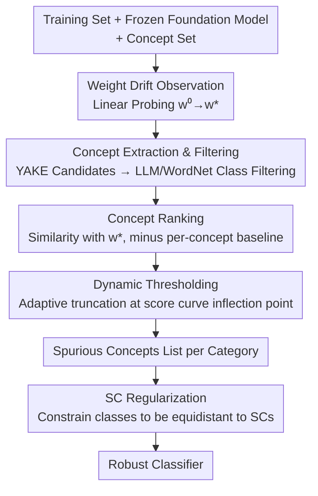

# Bridging Explainability and Embeddings: BEE Aware of Spuriousness

**Conference**: ICLR 2026  
**arXiv**: [2410.18970](https://arxiv.org/abs/2410.18970)  
**Code**: [Publicly Available](https://arxiv.org/abs/2410.18970)  
**Area**: Interpretability  
**Keywords**: Spurious correlation detection, weight space analysis, embedding geometry, linear probing, foundation models

## TL;DR
Proposes the BEE framework, which identifies and names spurious correlations (SC) by analyzing how fine-tuning perturbs the weight space geometry of pre-trained representations. It discovers hidden data biases directly from classifier weights without needing counter-examples, identifying spurious associations in ImageNet-1k that cause accuracy drops of up to 95%.

## Background & Motivation
**Background**: Deep neural networks, especially fine-tuned foundation models, are widely deployed in critical domains like healthcare and finance. Spurious correlations (SC) lead models to make decisions based on task-irrelevant features, resulting in severe consequences. Detecting SC is critical for ensuring model reliability.

**Limitations of Prior Work**: Existing methods fall into two categories: **data-driven methods** (e.g., SpLiCE, Lg), which analyze dataset statistics to label concepts associated with categories but cannot determine if the model actually learned these associations; and **error-driven methods** (e.g., B2T), which infer SC from validation set errors but rely on the presence of counter-examples to expose model shortcuts. Both fail when counter-examples are missing, which is common in real-world scenarios.

**Key Challenge**: Data methods ignore the model, while error methods require counter-examples. In practice, many harmful SCs exist precisely because there are no counter-examples in the dataset. Existing interpretable methods (e.g., CBM) require pre-defined concept sets and sacrifice expressivity. The fundamental problem is: **How to discover spurious associations actually learned by the model without relying on counter-examples?**

**Goal**: (1) Identify SCs learned by the model without requiring counter-examples; (2) Not only detect but **name** the specific concepts causing SC; (3) Ensure the method is applicable across multiple modalities (vision and text) and various foundation models.

**Key Insight**: A key observation is that during fine-tuning, linear classifier weights drift from their initial category name embeddings (zero-shot weights). This drift direction encodes the features learned by the model, including spurious associations. Since weights and concept embeddings share the same embedding space, geometric relationships can be used to directly analyze which task-irrelevant concepts are highly similar to the weights.

**Core Idea**: Utilize the drift direction of classification weights relative to zero-shot initialization within the embedding space to identify concepts that are task-irrelevant but highly similar to the learned weights as spurious correlations.

## Method

### Overall Architecture
BEE addresses the problem of identifying "exactly which spurious correlations the model has learned and what they are called" without relying on counter-examples in a validation set. Its starting point is a geometric observation: when training a linear classifier on frozen foundation model embeddings, the weight for each category drifts from the "zero-shot embedding of the category name" toward the features the model actually relies on—and this drift direction hides the spurious correlations.

The framework takes a training set, a foundation model, and a concept set as input, and outputs a list of learned spurious concepts for each category. It first exposes weight drift by training a linear probe layer atop foundation model embeddings; then, within the same embedding space, it collects task-irrelevant candidate concepts, ranks them by similarity to the drifted weights, and uses an adaptive dynamic threshold for truncation to automatically filter for SCs; finally, the discovered SCs can be used as regularization constraints to improve the model. Since weights and concept embeddings exist in the same space, similarity comparisons are directly computable.

### Key Designs

**1. Weight Drift Observation: Using zero-shot weights as a benchmark to expose learned features**

The weights of the linear classifier are not initialized randomly but start with the text embedding of the category names: $w_k^0 = M(\text{class\_name}_k)$. This zero-shot weight $w_k^0$ encodes the "pure semantics" of the category; the final $w_k^*$ after training incorporates the features the model actually depends on, including both true and spurious features. The difference between the two is the drift direction, reflecting what the model captured beyond the original semantics. Linear probing is used instead of full-parameter fine-tuning because (1) linear weights and concept embeddings occupy the same space for direct similarity comparison, and (2) it is transparent and interpretable. Experiments further show that SCs found in linear probing persist in full-parameter fine-tuned models.

**2. Concept Extraction and Filtering: Collecting candidates and removing class-related ones**

Only concepts irrelevant to the category definition qualify as SC candidates. BEE first collects candidates from the data: image data is processed using GIT-Large to generate descriptions (text data uses the original text), and the YAKE keyword extractor is used to obtain the top-256 n-grams as the candidate concept set $C_{all}$. Two-level filtering follows: Llama-3.1-8B-Instruct is used to filter out category instances, and WordNet hypernym/hyponym relations provide secondary filtering. This combination ensures category-related concepts are cleared, leaving "category-neutral" candidates.

**3. Concept Ranking: Sorting by similarity while subtracting a universal baseline**

For each category, BEE scores candidates based on the similarity between the concept embedding and the drifted weight $w_k^*$. The score for a positively correlated SC is:

$$s_{k,i}^+ = w_k^{*\top} M(c_i) - \min_{k'} w_{k'}^{*\top} M(c_i)$$

The intuition is to find concepts similar *only* to one specific class but not others. Subtracting $\min_{k'} w_{k'}^{*\top} M(c_i)$ is crucial: without it, general concepts common to all classes would appear as false positives. Subtracting the minimum similarity across all classes removes this baseline effect, isolating concepts with specific discriminative power for that category. Negatively correlated SCs are ranked similarly using $-w_k^{*\top} M(c_i)$.

**4. Dynamic Thresholding: Automatically determining the number of SCs per class**

Different categories naturally learn different numbers of SCs. BEE identifies an inflection point on the sorted score curve: it uses mean filtering with window size $r$ to obtain a smoothed curve $\bar{s}$, then finds the point deviating furthest from the line connecting the start and end of the curve:

$$m_k = \lfloor r/2 \rfloor + \arg\max_i \left(\bar{s}_{k,1} - i \frac{\bar{s}_{k,1} - \bar{s}_{k,p}}{p-1} - \bar{s}_{k,i}\right)$$

This point represents where the score transitions from a sharp drop to a plateau. Concepts before this point are retained as SCs. This allows each category to adaptively receive an appropriate number of SCs without manual hyperparameter tuning, enabling automation at the scale of ImageNet-1k.

**5. SC Regularization: Constraining the model using discovered SCs**

BEE uses discovered SCs to improve robustness by constraining classification weights to maintain equidistance from SC concepts—preventing any single class from showing a preference for an SC concept. The regularization loss is:

$$\mathcal{L}_{reg}(b) = \frac{\tau^2}{N} \sum_{k=1}^N \left[w_k^\top M(b) - sg\Big(\frac{1}{N}\sum_j w_j^\top M(b)\Big)\right]^2$$

where $sg(\cdot)$ is the stop-gradient operator. This pulls the similarity of all classes toward the mean. The total loss is $\mathcal{L} = \mathcal{L}_{ERM} + \alpha \frac{1}{|\mathcal{B}|} \sum_{b \in \mathcal{B}} \mathcal{L}_{reg}(b)$. This is particularly valuable when the training set completely lacks counter-examples, where GroupDRO fails but SC regularization succeeds by explicitly penalizing SC reliance.

### Training Strategy
- Uses AdamW optimizer ($lr=1e-4, wd=1e-5$) with batch size 1024.
- Cross-entropy loss with class-balancing weights, using CLIP temperature $\tau=100$ to scale logits.
- Weight normalization after each update and early stopping based on validation set class-balanced accuracy.

## Key Experimental Results

### Main Results: SC-Augmented Zero-Shot Prompting

| Method | Waterbirds Worst | Waterbirds Avg | CelebA Worst | CelebA Avg | CivilComments Worst |
|------|------------------|----------------|--------------|------------|---------------------|
| Basic zero-shot | 35.2 | 84.2 | 72.8 | 87.7 | 33.1 |
| w/ B2T | 48.1 | 86.1 | 72.8 | 88.0 | - |
| w/ SpLiCE | 48.1 | 82.5 | 67.2 | 90.2 | - |
| w/ Lg | 46.1 | 85.9 | 50.6 | 87.2 | - |
| **w/ BEE** | **50.3** | **86.3** | **73.1** | 85.7 | **53.2** |

BEE significantly outperforms all competing methods in worst-group accuracy on Waterbirds and CivilComments.

### ImageNet-1k SC Quantitative Impact

| True Class | Spurious Concept | Induced Class | Target Recall Change | Induced Prediction Rate |
|----------|----------|----------|------------------|-------------|
| Peafowl | firemen | Fire truck | 100% → 5.3% (**-94.7%**) | 0% → 93.4% |
| Mexican Hairless Dog | reading newspaper | Crossword | 47.5% → 0.9% (-46.6%) | 0% → 36.6% |
| Bernese Mountain Dog | shrimp | American lobster | 99.8% → 10.6% (-89.2%) | 0% → 37.2% |

### Regularization in "Perfect Spuriousness" Settings

| Method | Waterbirds Worst | CelebA Worst | CivilComments Worst |
|------|------------------|--------------|---------------------|
| ERM | 43.2±5.7 | 9.6±1.0 | 18.6±0.3 |
| GroupDRO | 38.9±5.4 | 8.1±0.3 | 18.7±0.4 |
| Reg w/ random SCs | 46.6±2.7 | 9.4±0.0 | 19.1±1.6 |
| Reg w/ Lg's SCs | 50.4±0.1 | 8.3±0.0 | - |
| **Reg w/ BEE's SCs** | **57.9±0.3** | **10.4±0.5** | **31.3±0.7** |

In extreme settings with zero counter-examples, where GroupDRO performs worse than ERM, BEE's SC regularization consistently improves worst-group performance.

### Key Findings
- **Cross-model SC Transfer**: SCs found by BEE on CLIP cause significant performance drops on architectures like AlexNet, ResNet50, and ViT-L/16, suggesting SCs are properties of the dataset rather than the model.
- **Dangerous Shortcuts in MIMIC-CXR**: BEE found "chest examination" and "chest radiograph" as SCs for the "No Finding" class. Adding these terms biases the model toward "No Finding," which could lead to missed diagnoses in clinical settings.
- **Counter-example Free Discovery**: In extreme settings where all minority group samples are removed, BEE effectively identifies SCs while error-analysis-based methods fail completely.

## Highlights & Insights
- **Weight Space Analysis as a New Paradigm**: BEE infers learned features from geometric drift in weights rather than data distributions or prediction errors. This leverages embedding alignment elegantly to find SCs hidden from traditional methods.
- **Linear Probing as a Diagnostic Lens**: Choosing the simplest classifier avoids complexity while maintaining representativeness. Discovered SCs are shown to transfer to full-parameter models, proving the validity of the lens.
- **Dynamic Thresholding via Inflection Points**: Automatically determining SC counts per class removes manual tuning and enables scalability to 1,000 classes like ImageNet.
- **Real-world Safety Implications**: The findings in MIMIC-CXR highlight model flaws that could lead to clinical hazards, demonstrating the value of the method in high-stakes domains.

## Limitations & Future Work
- Reliance on the linear probing assumption—if SCs are encoded non-linearly, they might be missed.
- Concept extraction depends on YAKE and GIT-Large; coverage is limited by the captioning model's capacity.
- Currently limited to classification tasks; future work could extend to detection, segmentation, or generation.
- SC regularization requires a known SC set; detection and mitigation could be integrated into a closed-loop iteration.
- Failed to detect SC on CelebA-blonde hair, suggesting blind spots for certain shortcut features.

## Related Work & Insights
- **vs B2T**: B2T infers SC from validation errors, requiring counter-examples. BEE uses weight drift and does not require counter-examples, finding a broader range of concepts.
- **vs SpLiCE/Lg**: These are data-driven and analyze distribution but cannot confirm if the model learned the association. BEE analyzes weights directly.
- **vs CBM**: CBM requires pre-defined concepts and architecture changes, sacrificing expressivity. BEE requires no modifications and analyzes original SOTA models.

## Rating
- Novelty: ⭐⭐⭐⭐⭐ A fresh perspective analyzing SC through weight space geometry.
- Experimental Thoroughness: ⭐⭐⭐⭐⭐ Covers vision/text, 5 embedding models, 5 datasets, and includes qualitative/quantitative/generative validation.
- Writing Quality: ⭐⭐⭐⭐ Clear structure and visuals, though some mathematical notation is dense.
- Value: ⭐⭐⭐⭐⭐ Highly significant for AI safety and trustworthy AI, especially regarding medical safety.

<!-- RELATED:START -->

## Related Papers

- [\[ICLR 2026\] Learning for Highly Faithful Explainability](learning_for_highly_faithful_explainability.md)
- [\[ICLR 2026\] Probing Rotary Position Embeddings through Frequency Entropy](probing_rotary_position_embeddings_through_frequency_entropy.md)
- [\[ICLR 2026\] Cross-Modal Redundancy and the Geometry of Vision-Language Embeddings](cross-modal_redundancy_and_the_geometry_of_vision-language_embeddings.md)
- [\[ACL 2026\] Interpreto: An Explainability Library for Transformers](../../ACL2026/interpretability/interpreto_an_explainability_library_for_transformers.md)
- [\[ICLR 2026\] Temporal Geometry of Deep Networks: Hyperbolic Representations of Training Dynamics for Intrinsic Explainability](temporal_geometry_of_deep_networks_hyperbolic_representations_of_training_dynami.md)

<!-- RELATED:END -->
