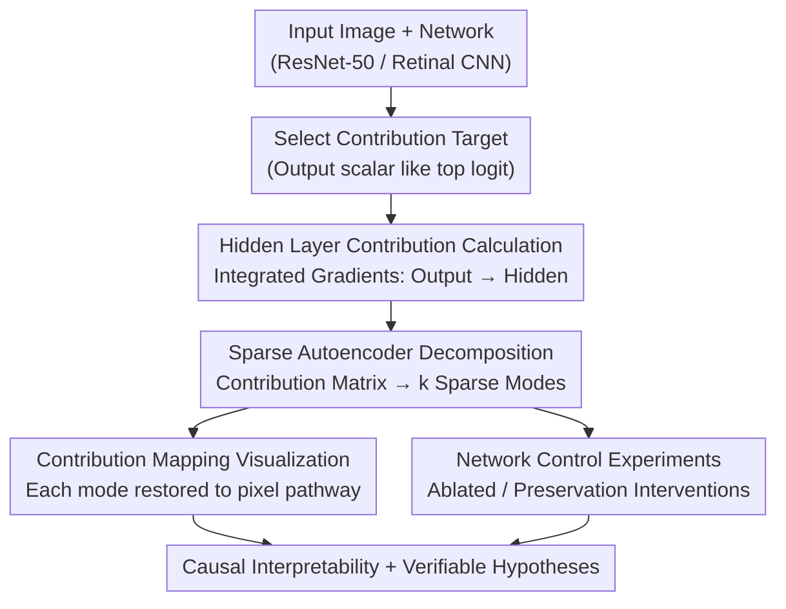

# Causal Interpretation of Neural Network Computations with Contribution Decomposition

**Conference**: ICLR2026  
**arXiv**: [2603.06557](https://arxiv.org/abs/2603.06557)  
**Code**: [https://github.com/baccuslab/CODEC_ICLR_2026](https://github.com/baccuslab/CODEC_ICLR_2026)  
**Area**: Interpretability  
**Keywords**: neural network interpretability, contribution decomposition, sparse autoencoder, causal analysis, retinal modeling

## TL;DR
The authors propose CODEC (Contribution Decomposition), which utilizes Integrated Gradients to calculate the contributions of hidden layer neurons toward the output (rather than merely analyzing activations). These contributions are then decomposed into sparse modes using a Sparse Autoencoder (SAE). This approach achieves stronger causal interpretability and network control capabilities compared to activation analysis and is successfully applied to ResNet-50 and biological retinal neural network models.

## Background & Motivation

**Background**: Understanding how neural networks transform inputs into outputs is a core problem in explainable AI. Existing methods primarily analyze activation patterns in hidden layers to find representations related to human-interpretable concepts.

**Limitations of Prior Work**: Activation analysis only reflects the receptive field of a neuron—what input it is sensitive to—but **does not answer how that neuron affects the output**. A highly activated neuron might have a positive, negative, or zero impact on the output. Existing saliency map methods (Grad-CAM, SmoothGrad) only analyze the input-to-output mapping and lack insight into the causal mechanisms of intermediate layers.

**Key Challenge**: Activation $\neq$ contribution. Activation provides only half of the information (the receptive field); the projective field—the impact on downstream layers—is also required to understand a neuron's causal role. However, existing tools rarely analyze the synergistic contributions of hidden neuron populations.

**Goal**: Establish a universal framework to analyze the synergistic contributions of hidden layer neuron populations, revealing how they collectively construct the network output.

**Key Insight**: Inspired by neuroscience—where different types of neurons in the retina produce functional outputs through synergy. This work extends attribution methods (Integrated Gradients) from input $\to$ output to intermediate layers $\to$ output, calculating each hidden neuron's contribution and decomposing them into synergistic modes using an SAE.

**Core Idea**: Analyze the "contribution" of hidden layer neurons instead of their "activation," and use an SAE to decompose contributions into sparse synergistic modes to obtain causal insights that activation analysis cannot provide.

## Method

### Overall Architecture
CODEC aims to answer "which neuron populations in the hidden layer, and through what means, collectively support a specific network output," rather than just "which neurons are sensitive to what input." The pipeline starts from the network output: first, a scalar target to be explained is selected (e.g., top logit). Integrated Gradients are used to rewrite attribution from "output $\to$ input" to "output $\to$ hidden layer," calculating a contribution value (positive or negative) for each hidden neuron. Then, a Sparse Autoencoder (SAE) is applied to the contribution matrix to extract several sparse "modes" that represent neurons working together. Finally, the results are processed in two ways: visualizing each mode as a pathway in pixel space and performing ablation/preservation interventions to verify that these modes represent causal structures rather than mere correlations.

### Key Designs

**1. Hidden Layer Contribution Calculation: Changing the neuron's role from "what it is sensitive to" to "what it did to the output"**

Activation analysis only reveals what input ignites a neuron but fails to show whether that ignition promotes or inhibits the output. The first step of CODEC rewrites Integrated Gradients from the "output $\to$ input" path to "output $\to$ hidden layer." For each channel in a convolutional layer, values are summed over spatial dimensions to obtain a single contribution value for that channel toward the target scalar. Crucially, this value can be positive or negative—positive indicates pushing the output higher, while negative indicates suppressing it—whereas activations after ReLU are strictly non-negative, losing the "inhibition" information. Integrated Gradients are chosen over approximate methods like Grad-CAM because they satisfy completeness: the sum of all neuron contributions exactly equals the output value, ensuring that when contributions are split into modes, each share has strict additive meaning.

**2. Sparse Autoencoder Decomposition: Extracting populations that "always work together" from $d$-dimensional contributions**

The core of CODEC is applying a Sparse Autoencoder to the contribution matrix ($d$ channels $\times$ $n$ images) to decompose it into $k$ sparse modes. An encoder $f_{\text{enc}}: \mathbb{R}^d \to \mathbb{R}^k$ calculates the loadings of each image across modes, followed by hard-thresholding $\tau$ for sparsification. A non-negative dictionary $\mathbf{D} \in \mathbb{R}^d \times k_+$ reconstructs the modes back into the contribution space. The training objective is reconstruction loss plus L1 regularization:

$$\mathcal{L} = \|\mathbf{c} - \mathbf{D}\mathbf{z}\|_2^2 + \lambda \|\mathbf{z}\|_1$$

The default configuration uses an overcomplete representation with $k = 3d$ and a threshold of 0.9. Performing SAE on contributions rather than activations is preferred because activations often contain features that are represented but have no causal impact on the output; decomposing contributions naturally highlights patterns relevant to the output class.

**3. Contribution Mapping: Restoring each mode to its pixel-level pathway**

Traditional saliency maps provide a generic input importance map. CODEC calculates the input sensitivity for key channels $c$ in a mode $m$ along the Jacobian chain $A_i^{(c,p)} = J_{y,h_{c,p}} J_{h_{c,p},x_i}$, then performs element-wise multiplication with the input to obtain the contribution map $C_i^{(m)} = A_i^{(m)} \odot x_i$. This allows a single image to be decomposed into multiple heatmaps representing distinct pathways—such as wood grain, hands, or strings—driving the same output.

**4. Network Control Experiments: Verifying causal structures through intervention**

To verify if the modes captured by CODEC represent causal structures, interventions should change the output more accurately than interventions on activation patterns. The method identifies modes most relevant to a target class, selects their high-weight channels, and performs two types of interventions: ablation (removing these channels to measure "necessity") and preservation (keeping only these channels to measure "sufficiency"). These are compared against activation-based modes to see which identifies more "useful" channels.

### Loss & Training
The SAE is trained on 50,000 images from the ImageNet validation set with a learning rate of 5e-5, batch size of 128, for 300 epochs, and an L1 regularization coefficient of 5e-5. Different blocks of ResNet-50 are analyzed layer by layer. The average reconstruction $R^2$ is 0.85.

## Key Experimental Results

### Main Results (Comparison of Contribution vs. Activation)

| Dimension | Contribution | Activation |
| :--- | :--- | :--- |
| Cross-layer Sparsity | Increases, consistently higher than activation | Increases but remains lower |
| Dimensions for 95% Variance | Higher (~200 at layer 14) | Lower (~150) |
| Max Mode-Category Correlation | **0.45+** (Middle layers) | ~0.30 |
| Number of Highly Correlated Modes (>0.2) | **80+** (Layer 13) | ~40 |

### Ablation Study (Network Control - Contribution Mode vs. Activation Mode)

| Control Method | Contribution Mode | Activation Mode | Description |
| :--- | :--- | :--- | :--- |
| Ablation (Remove 2% channels) | Target accuracy $\to$ ~0% | Target accuracy $\to$ ~20% | Contribution modes identify more necessary channels |
| Preservation (Keep 2% channels) | Target accuracy ~80% | Target accuracy ~50% | Contribution modes identify more sufficient channels |
| Cross-layer Consistency | Significant gain from Block 7+ | Weak improvement from Block 7+ | Semantic information has a turning point at block 6-7 |

### Key Findings
- **Decoupling of positive and negative effects**: In early layers, positive and negative contributions of the same channel are highly correlated (similar to center-surround receptive fields); in deeper layers, they gradually decouple as channels become single-functional.
- **Category Specificity**: Contribution modes are more class-specific than activation modes, especially in middle layers. This suggests activations contain "noise" features that are represented but not causally relevant to the output.
- **Dynamic Receptive Fields in Retina**: CODEC reveals how combinations of different modes generate dynamic Instantaneous Receptive Fields (IRF) in retinal models.
- **Hyperparameter Robustness**: Results are insensitive to L1 regularization, random seeds, or non-negative constraints on the dictionary, only degrading when the threshold is too high or the dictionary is too small.

## Highlights & Insights
- **Core Insight of Activation $\neq$ Contribution**: This is the most critical message. A highly activated neuron might be inhibiting the output; looking only at activation completely misinterprets its role.
- **Synergistic Patterns over Single Neurons**: The method shifts from asking "which single neuron is important" to "which neuron combinations are important," aligning with population coding theories in neuroscience.
- **Bidirectional Bridge**: The application to retinal CNN models demonstrates that CODEC can generate hypotheses that are experimentally verifiable in biological systems.
- **Turning point at Block 6-7**: The sharp rise in ablation efficacy suggests a qualitative change in semantic information at this stage, which could guide model pruning and feature extraction.

## Limitations & Future Work
- **Limited Model Scope**: Systematically tested on ResNet-50 and ViT-B, but lacks detailed results on larger models like ViT-L or LLMs.
- **Weaker Performance on ViT**: Ablation results on ViTs are less effective than on CNNs, possibly because ViTs lack explicit spatial equivariant biases.
- **Positive Contribution Focus**: Current SAE decomposition primarily uses positive contributions; negative contributions (inhibition) likely contain equally important computational structures.
- **Computational Overhead**: Integrated Gradients require multiple steps, making the pipeline heavier than simple activation analysis.

## Related Work & Insights
- **vs. Grad-CAM**: Grad-CAM performs input $\to$ output attribution to produce a single saliency map. CODEC analyzes intermediate layers $\to$ output and decomposes attribution into synergistic modes, providing far more information.
- **vs. SAE on activations (e.g., Anthropic)**: While others apply SAE to activations to find interpretable features, CODEC applies it to contributions, ensuring the discovered modes are causally significant rather than just correlated.
- **vs. Circuit-level Mechanistic Interpretability**: Circuit analysis tracks information flow through individual components, whereas CODEC uses mode decomposition for population-level analysis, making it more suitable for large-scale networks.

## Rating
- Novelty: ⭐⭐⭐⭐⭐ (The distinction between contribution and activation is a profound insight.)
- Experimental Thoroughness: ⭐⭐⭐⭐ (Excellent control experiments across CNN, ViT, and biological models, though lacks large-scale LLM validation.)
- Writing Quality: ⭐⭐⭐⭐⭐ (Elegant narrative starting from neuroscience.)
- Value: ⭐⭐⭐⭐⭐ (Provides a new analytical tool and conceptual framework for mechanistic interpretability.)

<!-- RELATED:START -->

## Related Papers

- [\[ICLR 2026\] Addressing Divergent Representations from Causal Interventions on Neural Networks](addressing_divergent_representations_causal.md)
- [\[AAAI 2026\] ElementaryNet: A Non-Strategic Neural Network for Predicting Human Behavior in Normal-Form Games](../../AAAI2026/interpretability/elementarynet_a_non-strategic_neural_network_for_predicting_human_behavior_in_no.md)
- [\[NeurIPS 2025\] FaCT: Faithful Concept Traces for Explaining Neural Network Decisions](../../NeurIPS2025/interpretability/fact_faithful_concept_traces_for_explaining_neural_network_decisions.md)
- [\[CVPR 2026\] Hidden Monotonicity: Explaining Deep Neural Networks via their DC Decomposition](../../CVPR2026/interpretability/hidden_monotonicity_explaining_deep_neural_networks_via_their_dc_decomposition.md)
- [\[ICLR 2026\] Decomposition of Concept-Level Rules in Visual Scenes](decomposition_of_concept-level_rules_in_visual_scenes.md)

<!-- RELATED:END -->
