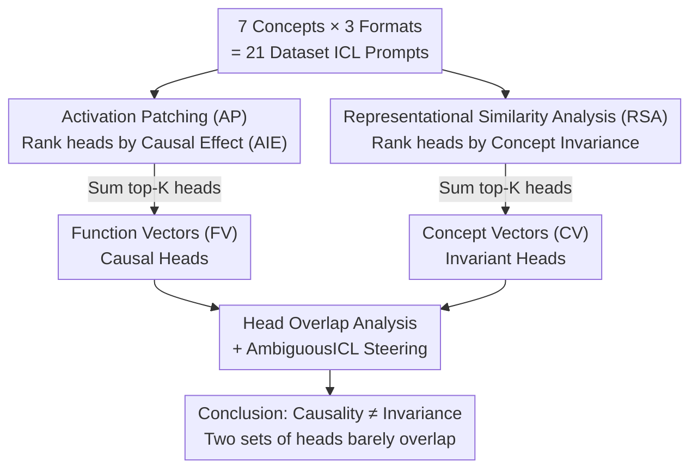

# Causality ≠ Invariance: Function and Concept Vectors in LLMs

**Conference**: ICLR2026  
**OpenReview**: [https://openreview.net/forum?id=LmLmhb6GEL](https://openreview.net/forum?id=LmLmhb6GEL)  
**Code**: To be confirmed  
**Area**: Mechanistic Interpretability  
**Keywords**: Function Vectors, Concept Vectors, Representational Similarity Analysis, In-Context Learning, Activation Patching

## TL;DR
This paper distinguishes between two distinct types of attention heads in LLMs: "causal heads" identified via activation patching (forming Function Vectors, which truly drive in-context learning behavior) and "invariant heads" identified via Representational Similarity Analysis (forming Concept Vectors, which stably encode abstract relational concepts across input formats and languages). The study proves that these two sets of heads barely overlap, revealing that "what drives task performance" and "what encodes abstract concepts" are handled by different mechanisms in LLMs.

## Background & Motivation
**Background**: A core question is whether LLMs represent concepts "abstractly"—that is, representing relational structures like "antonyms" or "causality" independently of specific input forms. The field of mechanistic interpretability has recently proposed **Function Vectors (FV)**: Todd et al. (2024) discovered that a compact vector obtained by summing the outputs of a small set of attention heads can causally drive the model to provide correct answers in In-Context Learning (ICL) tasks, and this vector can be transferred across different contexts (different prompt formats, natural text). Because of this transferability, many subsequent works have assumed that FVs encode the "underlying concept itself."

**Limitations of Prior Work**: The authors directly challenge this default assumption: are FVs truly input-invariant? If FVs are confounded with input format information, the widely held conclusion that "FV = concept representation" becomes untenable, necessitating a revision of the research paradigm that treats FVs as concept probes or steering tools.

**Key Challenge**: The central issue lies in conflating two distinct properties: ① **Causality**—which components actually drive the model's behavior during ICL; and ② **Invariance**—which components stably encode abstract concepts without changing across surface forms. The academic community has assumed these tasks are performed by the same set of circuits ("single-circuit hypothesis"), but the authors suspect they are actually decoupled.

**Goal**: (1) Test whether FVs are truly format-invariant; (2) If not, identify which heads carry truly format-invariant concept representations; (3) Compare these two sets of heads and verify their differing behaviors in steering experiments.

**Key Insight**: Causality should be localized using **Activation Patching (AP)** (which measures "how much the output probability changes if this head is modified"), whereas invariance should be localized using **Representational Similarity Analysis (RSA)** from cognitive neuroscience (which measures "whether the head's representation is organized by concept rather than format"). Since these two tools ask different questions, they are likely to select different heads.

**Core Idea**: The authors construct **Concept Vectors (CV)** by summing the activations of heads selected via RSA and compare them with FVs constructed via AP. The results show that CV heads and FV heads almost never overlap, proving that the "causal mechanism driving ICL behavior" and the "invariant mechanism encoding abstract concepts" are separate in LLMs.

## Method

### Overall Architecture
The work centers on a shared set of prompt data: 7 relational concepts (antonym, category, cause, synonym, translation, present→past tense, singular→plural) × 3 input formats (English open-ended OE-EN, another language open-ended OE-FR/ES, English multiple choice MC) = 21 datasets. Each dataset contains 50 few-shot ICL prompts (1050 total). Two parallel "head selection" pipelines are used to localize the two classes of attention heads. The top-K heads from each are summed to construct FV and CV, which are then compared through overlap analysis and steering experiments.

At the model level, all experiments are conducted on Llama 3.1 (8B/70B) and Qwen 2.5 (7B/72B). The last token representation $h_\ell$ at each layer is decomposed as $h_\ell = h_{\ell-1} + \text{MLP}_\ell + \sum_{j\in J} a_{\ell j}$, where $a_{\ell j}$ is the output of the $j$-th attention head in layer $\ell$. FVs and CVs are constructed by selecting and summing these individual head outputs $a_{\ell j}$.

### Key Designs

**1. Localizing Causal Heads (FV) via Activation Patching: Measuring "Output Changes per Head"**

To find the heads that truly drive ICL behavior, the authors use activation patching. They construct pairs of prompts: a "clean" prompt (few-shot examples matching one concept, e.g., `Hot→Cold, Big→Small, Clean→?`) and a "corrupted" prompt (shuffling inputs to break the relationship, e.g., `House→Cold, Eagle→Small, Clean→?`). For each head $a_{\ell j}$, they patch its **mean activation** $\bar a_{\ell j}$ cached from clean runs into corrupted runs and observe the recovery in the probability of the correct answer token $y$. This is the Causal Indirect Effect (CIE):

$$\text{CIE}(a_{\ell j}) = f(\tilde p \mid a_{\ell j} := \bar a_{\ell j})[y] - f(\tilde p)[y]$$

The Average Indirect Effect (AIE) is calculated by averaging over all datasets $D$: $\text{AIE}(a_{\ell j}) = \frac{1}{|D|}\sum_{d}\frac{1}{|\tilde P_d|}\sum_{\tilde p_i} \text{CIE}$. Unlike Todd et al. (2024), who calculated AIE only on English open-ended (OE-EN) data, this paper calculates it across all formats to ensure the selected causal heads are not biased toward a specific format. Heads are ranked by AIE, and the top-K are summed to form the FV. The authors note the AIE distribution is extremely sparse, indicating only a few heads have measurable causal effects.

**2. Localizing Invariant Heads (CV) via Representational Similarity Analysis: Measuring "Concept-based Organization"**

Since causal heads might not encode abstract concepts, a different metric is needed for "invariant heads." For each head $a_{\ell j}$, the authors compute a **Representational Similarity Matrix (RSM)** across all 1050 prompts, where entry $(i,k)$ is the cosine similarity $\theta(v_i, v_k)$ of the head's outputs. They also construct a binary **Design Matrix (DM)**: 1 if two prompts share the same concept (regardless of format), 0 otherwise. The **Concept-RSA score** for a head is the Spearman rank correlation between the lower triangles of the RSM and the DM:

$$\text{Concept-RSA}(a_{\ell j}) = \rho(\text{RSM}_{\ell j}, \text{Concept-DM})$$

A higher $\rho$ indicates that the head's representation is "clustered by concept and stable across formats." By using a DM based on "same format," the authors also calculate question-type RSA to detect how much format information a head contains. Summing the top-K heads ranked by Concept-RSA yields the CV.

**3. Head Overlap Analysis: Proving FV and CV Heads are Nearly Disjoint**

With both rankings, the core validation compares whether their top-K heads overlap. Results (Table 1) show that for $K\le 20$, the intersection is nearly zero. Even at $K=50/100$, the overlap remains small, with only a few instances significantly exceeding random chance. Layer-wise average scores (Figure 5) further indicate that while FV and CV heads **appear in similar layers**, their **identities are almost entirely different**. Cross-format activation patching (extracting from open-ended, patching into multiple choice) confirms that only FV heads—not CV heads—are the primary causal drivers regardless of input format. This contrast is the most critical evidence: similar layers but different heads imply that "invariance" and "causality" are carried by separable mechanisms.

**4. AmbiguousICL Steering: Verifying Behavioral Differences**

To test the vectors in practice, the authors designed the AmbiguousICL task. Each prompt interleaves two concepts (e.g., 3 antonym examples followed by 2 English→French translation examples) followed by a query. Without intervention, the model tends to follow the second concept (French translation); the goal is to steer it toward the first concept (antonym). Steering is performed by adding the vector to the residual stream: $h_\ell \leftarrow h_\ell + \alpha v$, measured by the change in target token probability $\Delta P = P_{\text{after}}(y) - P_{\text{before}}(y)$. Crucially, they use vectors extracted from **In-Distribution (ID, OE-EN)** and **Out-of-Distribution (OOD, OE-FR/MC)** formats to test consistency. This setup specifically diagnoses whether the vector encodes an abstract relational structure independent of the extraction format.

### Loss & Training
This is a mechanistic analysis and interpretability study; no models are trained. All analysis is based on forward activations of pre-trained LLMs via patching, similarity analysis, and residual stream intervention. Thus, there are no loss functions or training procedures.

## Key Experimental Results

### Main Results: Overlap between FV and CV Heads
Table 1 shows the number of overlapping heads between RSA and AIE rankings within top-K (bold indicates significance above random):

| Model | K=3 | K=5 | K=10 | K=20 | K=50 | K=100 |
|------|-----|-----|------|------|------|-------|
| Llama-3.1 8B | 0 | 0 | 1 | 1 | 12 | 28 |
| Llama-3.1 70B | 0 | 0 | 0 | 0 | 1 | 6 |
| Qwen2.5 7B | 0 | 0 | 0 | 4 | 15 | 39 |
| Qwen2.5 72B | 0 | 0 | 0 | 1 | 3 | 13 |

Overlap is nearly zero for small K, and even at K=100, the overlap is far less than half—FV and CV consist of different heads.

### Key Findings
- **Similarity Matrix Clustering** (Llama 3.1 70B, Fig 3): FV similarity matrices cluster by **format** (average cosine similarity within same-format FV clusters is **0.90**). CV clusters by **concept** across formats (average similarity within same-format CV clusters is only **0.55**, indicating it retains less low-level format information).
- **RSA Scores** (Fig 4): Across models and K values, CV shows higher concept-RSA and lower question-type RSA; FV shows the opposite, encoding significantly more format information.

### Steering Results (AmbiguousICL)

| Setting | FV Performance | CV Performance |
|------|---------|---------|
| ID (Extracted from OE-EN) | Largest $\Delta P$ gain, strongest steering | Effective but smaller gain; nearly ineffective in zero-shot |
| OOD (Extracted from OE-FR / MC) | Often degrades; specifically for MC, it mixes concept with format (predicts French tokens or "(" markers) | More stable positive effect across formats; top-Δ tokens remain conceptually aligned |
| Cross-format consistency (KL Div) | Larger KL (ID and OOD effects are inconsistent) | Smaller KL; CV-FV gap is larger on MC than OE-FR |

- **Token-level evidence** (Table 2, query `salty→`, target antonym): When FV is extracted from OE-FR, top tokens become French (`_su/_dou`); when extracted from MC, they become format tokens (`_(_A`). Regardless of extraction format, CV top tokens are consistently English antonyms (`_sweet/_fresh/_bland`). This demonstrates that FV conflates the concept with surface format, while CV is format-invariant.

### Key Conclusions
- LLMs **do** contain abstract relational concept representations (CV), but these are **largely distinct** from the components driving ICL behavior (FV), challenging the hypothesis that format-invariant representations are the primary drivers of ICL.
- Practical Trade-off: Use FV for strongest in-distribution control; use CV for robust out-of-distribution control or probing abstract knowledge.
- CV requires the concept to be "already present" in the prompt—it is ineffective in zero-shot steering or activation patching (which requires inducing a task from scratch) but can successfully steer in AmbiguousICL by amplifying existing abstract signals. FV "instantiates the task," while CV "modulates it once present."

## Highlights & Insights
- **Measuring the same heads with two different rulers**: Using AP to ask "who is causal" and RSA to ask "who is organized by concept" is a methodological highlight. It decouples "behavioral control" from "abstract representation" at the tool level. This approach can be applied to any interpretability problem concerning whether a component encodes information versus whether it drives behavior.
- **The "Aha" moment**: FV, widely used as a "concept probe," is actually nearly orthogonal to concept representations; FVs for the same concept extracted from English vs. Multiple Choice formats are almost perpendicular. This directly corrects several works that equate FV with concept representation.
- **Equivariance vs. Invariance framework**: The authors describe FV as "equivariant" to format (extracting from French prompts yields French antonyms) and CV as "invariant" (extracting from anywhere yields similar outputs). This distinction is refined and applicable to analyzing other steering vectors.
- **Refinement of ICL Theory**: Addressing theories that model ICL as "retrieving a single function vector $a_f$," the authors point out that since FVs are orthogonal across formats, they should be modeled as format-conditioned $a(f,\phi)$, converging to multiple format-specific basins rather than a single global optimum.

## Limitations & Future Work
- **Global Selection Criteria for CV**: The authors select heads that "encode all concepts simultaneously," which might miss concept-specific heads. Per-concept RSA might reveal more.
- **Lack of Emergence and Interaction Study**: The study does not explore how FV/CV emerge during training or how they interact at inference time. Two hypotheses are proposed: (1) CV/FV represent a "detection/execution" split (CV detects, FV executes); (2) They do not interact, and CV is a redundant "backup circuit."
- **Practical Limitations of CV**: CV cannot induce a task from zero; it only modulates existing conceptual signals, which limits its utility as a general-purpose steering tool.
- **Data Generation**: Part of the (x,y) pairs were generated by GPT-4o, meaning conceptual coverage and quality are limited by its performance (Appendix D).

## Related Work & Insights
- **vs. Function Vectors (Todd et al., 2024)**: They proposed FVs and showed cross-context transferability. This paper does not deny the causal role of FV but refines it: transferability is high but not format-invariant. It further identifies truly format-invariant CV heads.
- **vs. Attention Head Classification**: Adds "CV heads" to the taxonomy—a class of heads that represent concepts format-invariantly at high abstraction layers.
- **vs. Linear Representation Hypothesis**: Provides further support for the linear representation of relational concepts and localizes the specific attention heads that carry these format-invariant representations.
- **vs. Symbolic Reasoning (Yang et al., 2025)**: Yang et al. define symbolic processing via "content invariance" and "indirectness via pointers." CV satisfies both (format invariance + acting as a pointer), whereas FV stores content directly, providing another point of contrast.

## Rating
- Novelty: ⭐⭐⭐⭐⭐ Decoupling "causality" and "invariance" via AP/RSA directly corrects the "FV = concept" misconception.
- Experimental Thoroughness: ⭐⭐⭐⭐ 4 models, 7 concepts, 3 formats, multiple K values; overlap + steering + token-level evidence are self-consistent.
- Writing Quality: ⭐⭐⭐⭐⭐ Very clear arguments and structured comparisons; similarity matrices and token tables are highly persuasive.
- Value: ⭐⭐⭐⭐⭐ Significant for understanding ICL mechanisms and steering practices; serves as a warning against using FV as a proxy for abstract concepts.

<!-- RELATED:START -->

## Related Papers

- [\[ICLR 2026\] CoT Vectors: Transferring and Probing the Reasoning Mechanisms of LLMs](cot_vectors_transferring_and_probing_the_reasoning_mechanisms_of_llms.md)
- [\[ICML 2026\] How Few-Shot Examples Add Up: A Causal Decomposition of Function Vectors in In-Context Learning](../../ICML2026/interpretability/how_few-shot_examples_add_up_a_causal_decomposition_of_function_vectors_in_in-co.md)
- [\[ICLR 2026\] Dissecting Representation Misalignment in Contrastive Learning via Influence Function](dissecting_representation_misalignment_in_contrastive_learning_via_influence_fun.md)
- [\[ICML 2026\] Where Computation Lives Inside TabPFN: Causal Localisation of Attention Head Function](../../ICML2026/interpretability/where_computation_lives_inside_tabpfn_causal_localisation_of_attention_head_func.md)
- [\[ICLR 2026\] Concept-TRAK: Understanding how diffusion models learn concepts through concept attribution](concept-trak_understanding_how_diffusion_models_learn_concepts_through_concept_a.md)

<!-- RELATED:END -->
