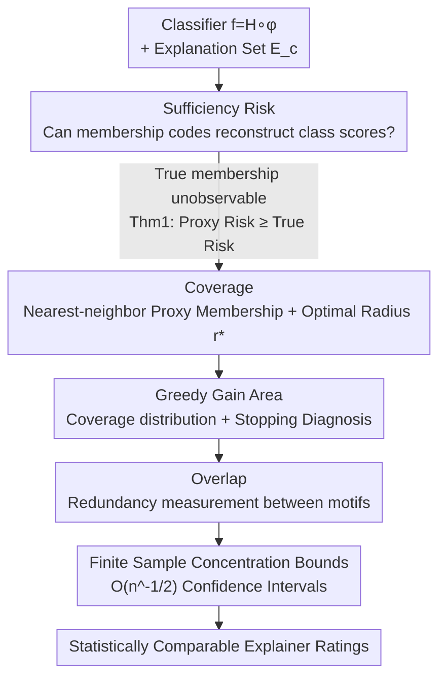

# Certified Evaluation of Model-Level Explanations for Graph Neural Networks

**Conference**: ICLR2026  
**OpenReview**: [https://openreview.net/forum?id=h6VtqCN9m3](https://openreview.net/forum?id=h6VtqCN9m3)  
**Code**: To be confirmed  
**Area**: Explainability / Graph Neural Networks  
**Keywords**: Model-level explanation, GNN explainability, Sufficiency risk, Certified evaluation, Coverage

## TL;DR
This paper formalizes the long-standing problem of evaluating "whether model-level explanations for GNNs are good enough"—previously reliant on class scores and visual inspection—into a regression loss called **sufficiency risk**. By deriving distribution-free certified upper bounds, the authors introduce three computable metrics: Coverage, GGA, and Overlap (with finite-sample confidence intervals), enabling the first statistically guaranteed comparison between different explainers.

## Background & Motivation

**Background**: Post-hoc GNN explainability follows two paths: instance-level (explaining why a specific graph is classified a certain way) and model-level (identifying discriminative motifs the classifier generally relies on for a given class). Model-level explanation aims for a "global understanding of model behavior," represented by generative methods like XGNN, GNNInterpreter, D4Explainer, and discovery methods like PAGE and GLGExplainer. Regardless of the approach, their common optimization objective is to generate motifs that elicit a **high target class score** from the classifier.

**Limitations of Prior Work**: Since the "ground-truth motifs" the classifier truly relies on are unobservable, it is commonly assumed that a high class score equals a good explanation. Consequently, class scores have become nearly the sole metric for horizontal comparison. However, class scores alone are insufficient: explainers explicitly optimize for high scores, often resulting in **pathological** motifs—those with high scores that are far from the data distribution and do not resemble real graph structures. Qualitative visual comparisons are highly susceptible to cherry-picking, while auxiliary metrics like sparsity or generation time fail to address the relationship between motifs and classifier decision-making.

**Key Challenge**: Mature instance-level metrics (fidelity, accuracy) are **not applicable** in model-level scenarios. Fidelity requires removing/perturbing an explanatory subgraph from an original graph, but generative motifs are not necessarily exact subgraphs of any intra-class graphs. Accuracy requires ground-truth explanatory subgraphs, which are unknown at the model level. This creates a **fundamental gap** in model-level evaluation: a lack of principled, computable metrics.

**Goal**: ① Formalize whether a set of explanations sufficiently captures the classifier's reasoning; ② Provide computable, distribution-free certified metrics; ③ Ensure metrics are reliable under finite samples to support statistical comparisons between explainers.

**Key Insight**: Instead of guessing true motifs, the authors ask: if an explanation set $E_c$ truly captures the classifier's reasoning for class $c$, then the "membership code" describing which motifs each intra-class graph utilizes should contain enough information to **reconstruct the classifier's output scores**. Quantifying this "reconstructability" as a regression loss yields a measurable sufficiency metric.

**Core Idea**: Sufficiency is defined via a **sufficiency risk** based on whether membership codes can reconstruct class scores. Using radius-based nearest-neighbor **proxy membership** in the embedding space provides a **distribution-free computable upper bound** for this risk. This translates the abstract "explanation sufficiency" into three metrics: Coverage, GGA, and Overlap, all with certified confidence intervals.

## Method

### Overall Architecture
The paper follows a logic chain from "unobservable quantities to computable numbers": it first defines sufficiency as a sufficiency risk $\mathrm{SR}_c(M,E_c)$, which depends on the unobservable true membership $M^\star$. It then constructs a proxy membership $M_r$ using only embedding information and proves via Theorem 1 that "proxy risk $\ge$ true risk"—thus **bounding the proxy risk serves as a bound for the true risk**. Subsequently, "Coverage" provides this bound and finds the optimal radius $r^\star$ for the tightest bound. "GGA" characterizes whether the coverage distribution across motifs is efficient and provides a stopping diagnosis. "Overlap" quantifies redundancy between motifs. Finally, concentration inequalities transform these three values from population-level to finite-sample quantities with $O(n^{-1/2})$ confidence intervals.

Formal Setup: Classifier $f=H\circ\phi$, where $\phi:\mathcal G\to\mathbb R^d$ is the embedding function and $H$ is the classification head. Given class $c$, the explainer outputs a motif set $E_c=\{M_1,\dots,M_K\}$ with embeddings $m_k:=\phi(M_k)$. The framework is general for any "motif" (subgraphs, prototypes, generated graphs, etc.) that can be embedded by $\phi$.

### Key Designs

**1. Sufficiency Risk: Turning Sufficiency into a Measurable Regression Loss**

Model-level explanations have lacked an objective definition of sufficiency. The authors propose: let $\hat G_c$ be the set of graphs classified as class $c$, and assume a true membership function $M^\star(G,E_c)$ describes how the classifier internally associates $G$ with motifs. If $E_c$ captures the classifier's reasoning, the membership codes $\{M^\star(G):G\in\hat G_c\}$ should suffice to reconstruct the scores $\{f_c(G)\}$. Sufficiency risk is defined as:

$$\mathrm{SR}_c(M,E_c) := \mathbb E\!\left[\big(f_c(G)-\mathbb E[f_c(G)\mid M(G)]\big)^2 \;\middle|\; G\in\hat G_c\right],$$

which is the mean squared error of predicted scores when replaced by membership representations. $\mathrm{SR}_c(M^\star,E_c)=0$ implies motifs perfectly capture reasoning. The beauty of this is that it asks "whether explanations can explain the scores" without needing to know what the true motifs look like.

Since $M^\star$ is unobservable, **Theorem 1** proves that for any proxy membership $M$ satisfying $M(G)=h(M^\star,\varepsilon)$ where $\varepsilon\perp Y\mid M^\star$, then $\mathrm{SR}_c(M^\star,E_c)\le \mathrm{SR}_c(M,E_c)$. This legitimizes using a computable proxy to bound the unobservable true risk.

**2. Coverage: Certified Upper Bounds with Optimal Radius $r^\star$**

The authors define proxy membership $M_r(G)$ using embedding space proximity: if the distance to the nearest motif $D(G):=\min_k\|\phi(G)-m_k\|_2$ is $\le r$, assign $G$ to that motif; otherwise, mark as "uncovered $\bot$". **Coverage** is the probability $\mathrm{Cov}_c(r):=\Pr(D(G)\le r\mid G\in\hat G_c)$. **Theorem 2** provides a certified upper bound: if $H$ is $L$-Lipschitz, then:

$$\mathrm{SR}_c(M_r,E_c)\le L^2\,\mathbb E\!\big[D(G)^2\mathbf 1\{D(G)\le r\}\big]+\tfrac14\big(1-\mathrm{Cov}_c(r)\big),$$

Intuition: higher coverage and smaller radii yield a lower sufficiency risk bound. **Theorem 3** shows this bound is tightest at $r^\star=1/(2L)$, and this optimal radius is **independent of the distribution** of $D(G)$, providing the tightest certified guarantee.

**3. GGA: Coverage Distribution and Stopping Diagnosis**

Coverage only indicates "how much" is covered, not whether coverage is driven by a single motif or distributed evenly. **Greedy Gain Area (GGA)** is introduced: motifs are selected greedily based on marginal coverage gain. Letting $\alpha_j$ be the cumulative coverage after $j$ steps:

$$\mathrm{GGA}(E_c,r^\star):=\frac1K\sum_{j=1}^K\alpha_j,$$

This measures the efficiency of motifs in contributing to coverage. Low coverage + High GGA indicates **mode collapse** (dominated by one motif), while High coverage + High GGA suggests a parsimonious explanation. **Theorem 4** provides a stopping criterion: if the marginal gain $\Delta_j \le \epsilon$, additional motifs yield negligible benefits in reducing the certified risk.

**4. Overlap and Finite Sample Bounds**

**Overlap** quantifies redundancy when multiple motifs cover the same set of graphs:

$$\mathrm{Overlap}=\frac{\sum_{k=1}^K|S_k(r^\star)|-|U(r^\star)|}{\max\{1,|U(r^\star)|\}}$$

To make these metrics statistically comparable, **finite-sample concentration bounds** provide confidence intervals. For Coverage (**Proposition 1**) and GGA (**Proposition 2**), the intervals shrink at $O(n^{-1/2})$. Non-overlapping intervals between two explainers imply statistically significant performance differences at the population level.

### Loss & Training
This work is an **evaluation framework** and does not involve training new models. It computes Coverage, GGA, and Overlap for a pre-trained classifier and any explainer-produced motif set. $L$ is estimated via the spectral norm of the classification head, and $r^\star=1/(2L)$.

## Key Experimental Results

Experiments verify that the metrics reveal differences invisible to class scores. All classifiers use an "embedding function + linear head" to precisely calculate $L$ and $r^\star$.

### Main Results (Real Datasets, Three Standard Explainers)
On MUTAG, IMDB-Multi, REDDIT-Binary, and OGB-MOLHIV, generating 10 motifs each for XGNN, GNNInterpreter, and PAGE:

| Explainer | Dataset / Class | Coverage | GGA | Overlap | Class Score |
| :--- | :--- | :--- | :--- | :--- | :--- |
| XGNN | MUTAG / Mutagenic | 0.773±0.117 | 0.710±0.150 | 7.314 | 0.966±0.005 |
| XGNN | MUTAG / Non-mutagenic | 0.885±0.185 | 0.829±0.235 | 8.400 | 1.000±0.000 |
| XGNN | REDDIT / IMDB | 0 (Trivial structures) | 0 | 0 | Low |

Key observations: On MUTAG, XGNN (with valence constraints) and PAGE (discovery-based) have higher Coverage than GNNInterpreter. GNNInterpreter lacks domain constraints and generates disconnected, chemically invalid graphs; although its class scores are high, its Coverage is low, accurately **exposing pathological explanations masked by class scores**.

### Ablation Study (Metrics vs. Class Score)

| Dataset | Observation | Mechanism |
| :--- | :--- | :--- |
| 4Shapes / Good vs. Bad | Good set has higher class score and Coverage. | Validates Coverage consistency with class score. |
| 4Shapes / Class 2 | Random BA graphs have high class score but very low Coverage. | Reveals "negative evidence" decision rules: the classifier identifies Class 2 by the *absence* of other motifs. |
| MixedShapes / Uni- vs. Bi-modal | Similar mean class score; bimodal has much higher Coverage; unimodal has high Overlap. | Coverage captures sufficiency; Overlap captures redundancy; GGA shows early saturation for unimodal. |

### Key Findings
- **Class scores are deceived by "negative evidence"**: In 4Shapes Class 2, high class scores suggest the model relies on BA graphs, but low Coverage reveals these graphs are off-manifold; the true rule is the absence of other motifs.
- **Pathological explanations are exposed**: GNNInterpreter's high class score but low Coverage on MUTAG corresponds to high-scoring motifs that have drifted away from the data distribution.
- **Redundancy and mode collapse are diagnosable**: High Overlap and early GGA saturation signify mode collapse in unimodal explanation sets.

## Highlights & Insights
- **Legitimately bounding unobservables**: Theorem 1 proves proxy risk bounds true risk, providing a mathematical foundation for using computable proxies to bound unobservable quantities.
- **Distribution-free optimal radius**: $r^\star=1/(2L)$ depends only on the classification head, ensuring no hand-tuned hyperparameters that could be cherry-picked.
- **Diagnosing multiple "ailments" via GGA**: The Coverage-GGA quadrant distinguishes parsimonious, diverse, mode-collapsed, and poor explanations.
- **Statistical comparison**: Concentration bounds turn metrics into quantities with $O(n^{-1/2})$ intervals, allowing for clear performance differentiation even with finite samples.

## Limitations & Future Work
- **Dependency on $H\circ\phi$ decomposition**: Evaluation assumes the head $H$ is Lipschitz; estimation for highly non-linear heads might be loose.
- **Proxy membership dependency**: Equating "explained" with "residing within an embedding radius" depends on embedding quality. If $\phi$ collapses different classes, metric reliability may decrease.
- **Diagnostic nature**: The framework is a tool for assessment, not optimization. Incorporating these metrics into explainer training (e.g., optimizing Coverage) is the next step.
- **Scalability of explainers**: Metrics are universal, but discovery-based explainers like PAGE perform poorly on large graphs (e.g., REDDIT), which reflects in the evaluation results.

## Related Work & Insights
- **Vs. Class Score only**: This paper proves class scores can be misled by pathological motifs and "negative evidence." The proposed metrics complement rather than replace class scores.
- **Vs. Instance-level Metrics**: Unlike fidelity (requiring subgraphs) or accuracy (requiring ground-truth), this framework bypasses the need for true motifs by focusing on score reconstruction.
- **Vs. Theoretical Analysis**: While many works analyze instance-level fidelity/robustness, this is the **first** certified evaluation framework for model-level GNN explanations.

## Rating
- Novelty: ⭐⭐⭐⭐⭐ First certified evaluation framework for model-level GNN explainability.
- Experimental Thoroughness: ⭐⭐⭐⭐ Strong validation on synthetic/real data, though limited to linear-head classifiers.
- Writing Quality: ⭐⭐⭐⭐⭐ Logical progression from motivation to theorems to validation.
- Value: ⭐⭐⭐⭐⭐ Provides a practical, statistically grounded tool for a previously unstandardized field.

<!-- RELATED:START -->

## Related Papers

- [\[ICLR 2026\] Bayesian Neural Networks for Functional ANOVA Model](bayesian_neural_networks_for_functional_anova_model.md)
- [\[ICLR 2026\] Tracking Equivalent Mechanistic Interpretations Across Neural Networks](tracking_equivalent_mechanistic_interpretations_across_neural_networks.md)
- [\[ICLR 2026\] Addressing Divergent Representations from Causal Interventions on Neural Networks](addressing_divergent_representations_causal.md)
- [\[ICLR 2026\] Explainable K-means Neural Networks for Multi-view Clustering](explainable_k_-means_neural_networks_for_multi-view_clustering.md)
- [\[ICLR 2026\] FAME: Formal Abstract Minimal Explanation for Neural Networks](fame_formal_abstract_minimal_explanation_for_neural_networks.md)

<!-- RELATED:END -->
