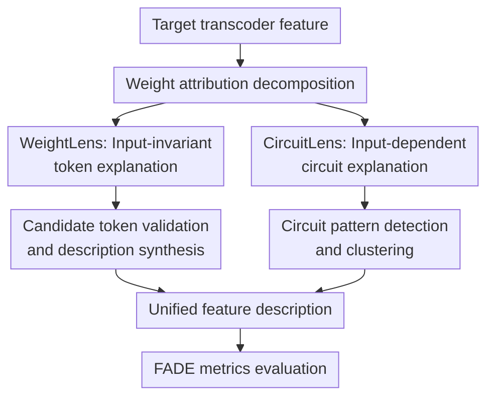

# Circuit Insights: Towards Interpretability Beyond Activations

**Conference**: ICLR2026  
**OpenReview**: [https://openreview.net/forum?id=2Jyb1yu3nN](https://openreview.net/forum?id=2Jyb1yu3nN)  
**Code**: https://github.com/egolimblevskaia/WeightLens; https://github.com/egolimblevskaia/CircuitLens  
**Area**: Interpretability / Mechanistic Interpretability / Circuit Interpretability  
**Keywords**: Circuit Interpretability, Transcoder, Automated Interpretability, Feature Attribution, Sparse Features

## TL;DR
This paper introduces WeightLens and CircuitLens to evolve automated interpretability from merely observing activation-triggering samples to analyzing weight connections and circuit attributions. This approach more robustly explains token-level, context-dependent, and polysemantic features in transcoder activations.

## Background & Motivation
**Background**: A critical path in mechanistic interpretability is decomposing neural network computations into readable circuits: identifying which features, attention heads, and upstream tokens collectively lead to a downstream behavior. Early circuit discovery provided fine-grained explanations but relied heavily on manual analysis and toy tasks like Indirect Object Identification (IOI). Automated interpretability attempts to scale this by collecting highly activating samples for a neuron or sparse feature and hiring a larger LLM to generate natural language descriptions.

**Limitations of Prior Work**: Automated explanations based solely on activations face two fundamental issues. First, activation samples indicate *when* a feature is active but do not necessarily reveal *which* input tokens, attention heads, or upstream features caused the activation. Second, explanation quality depends heavily on the dataset and the explainer LLM; insufficient samples, improper prompting, or feature polysemanticity often lead to vague descriptions like "various words on miscellaneous topics."

**Key Challenge**: While sparse features (SAEs or transcoders) were designed to alleviate MLP neuron polysemanticity, even monosemantic features might only activate in narrow contextual patterns. A cleaner feature space does not automatically guarantee more reliable explanations. If the explanation pipeline still relies only on activations, it misses structural relationships between features, heads, and output tokens.

**Goal**: The authors aim to solve two complementary sub-problems. For context-independent, near-token-level features, can we derive their meaning directly from model and transcoder weights without large datasets or explainer LLMs? For context-dependent features, can we explicitly extract the underlying circuit patterns to prevent the explainer LLM from blindly guessing the triggers from full text?

**Key Insight**: This work uses transcoders as the entry point. Unlike SAEs that only reconstruct activations, transcoders approximate an entire MLP layer using sparse features, naturally decomposing a downstream feature's attribution into input-dependent and input-invariant components. This decomposition allows for separate studies of "stable connections in weights" and "actual circuits occurring on specific inputs."

**Core Idea**: Use WeightLens to find stable token semantics from transcoder weights and CircuitLens to extract contextual circuits from the attribution of attention heads, upstream features, and output logits. Combining both reduces dependence on activation samples and the explainer model's intuition.

## Method
### Overall Architecture
The workflow centers on transcoder features. It starts by computing cross-layer feature attributions using transcoder encoder/decoder weights, then routes through two explanation paths based on feature type. WeightLens handles input-invariant token-based features by identifying candidates from embeddings, unembeddings, and upstream connections, followed by a forward pass for validation. CircuitLens handles context-dependent features by calculating circuit attributions for attention-heads/tokens and output logits on real samples, compressing the full context into "trigger patterns + output influence + circuit clusters" for the explainer LLM.

The underlying mathematical object is the cross-layer attribution for transcoders. For an upstream feature $i'$ in layer $l'$ contributing to a downstream feature $i$ in layer $l$, a simple attribution is defined as "upstream activation $\times$ fixed connection strength": $a_{l',i'}[t](f^{l',i'}_{dec} \cdot f^{l,i}_{enc})$. The paper also utilizes a Jacobian-based version that treats attention, normalization, and non-linearities as constants for a given input to reliably estimate feature-to-feature, attention-to-feature, and feature-to-logit contributions.

### Key Designs
**1. WeightLens: Identifying context-independent token semantics via weight outliers**

WeightLens targets features that respond stably to specific tokens or morphologies regardless of complex context. The assumption is that if an input-invariant connection's magnitude significantly outweighs others, it likely represents a meaningful structural relationship. If a token truly represents the feature's intrinsic behavior, the feature should activate even when the token is fed in isolation.

The process involves three steps: First, projecting the encoder vector into the embedding space ($W_{emb} \cdot f_{enc}$) to find z-score outliers in the vocabulary. Decoder vectors are similarly projected into the logit space ($f_{dec} \cdot W_U$) to identify output tokens strongly promoted/inhibited. Second, calculating $W^{l'}_{dec} \cdot f^l_{enc}$ for all earlier layers to find the strongest upstream feature connections and inheriting their candidate tokens. Third, using a forward pass to filter: only tokens that truly activate the target feature are included in the description.

**2. CircuitLens: Replacing raw context guessing with circuit attribution**

CircuitLens focuses on cases where WeightLens fails: features triggered by combinations of tokens, attention heads, and upstream features. Instead of providing the full text and highlighting high-activation tokens to the LLM (MaxAct approach), CircuitLens selects relevant patterns via internal attribution.

Input analysis uses attention-head attribution: calculating how much a preceding token $s$ contributed via head $h$ to the feature's activation at token $t$. The scoring follows $score^{l',h}(t,s)((W^{l',h}_{OV})^\top f^{l,i}_{enc} \cdot r^{l'}_{pre}[s])$, considering both attention intensity and alignment between the head’s output and the feature’s encoder. Output analysis identifies logits influenced by the feature, expressed as $a_{l,i}[t](f^{l,i}_{dec} \cdot J \cdot W_U[:,y[t]])$. This provides "what pushed the activation" and "what the activation pushes" rather than just "where it lit up."

**3. Circuit-based clustering: Splitting polysemantic features by mechanism**

Even sparse features can be polysemantic, reused in different local mechanisms. Traditional MaxAct methods often result in descriptions dominated by the most frequent pattern. CircuitLens clusters samples based on "circuit contribution sets"—sets of significant transcoder feature and attention-head contributions, including relative positions $\Delta$. Using Jaccard similarity $J(A,B)=|S_A \cap S_B|/|S_A \cup S_B|$, density clustering extracts distinct clusters. Each cluster receives an independent description, synthesized into a final unified explanation.

**4. Quantile Sampling and FADE Evaluation: Covering the tail of the distribution**

Most methods sample only top activations, which overlooks weak but stable sub-concepts. This work caches activations across the dataset and employs inverse-frequency quantile sampling. Activations are split into $B=20$ bins, with sample weights $w_i=1/n_b^\alpha$ ($\alpha=0.9$), to ensure strong tail activations are oversampled.

Evaluation uses the FADE framework's four metrics: **Clarity** (ability to generate synthetic inputs based on description), **Responsiveness** (feature response to related samples), **Purity** (exclusivity of feature activation to related inputs), and **Faithfulness** (causal impact on output tokens via intervention).

### Loss & Training
The paper does not train new models or propose new supervised losses; it focuses on post-processing and evaluation of existing transcoder features. Key hyperparameters include z-score thresholds for projection outliers (4.5 for Gemma-2-2B/Llama-3.2, 4 for GPT-2) and the upstream connection threshold (3). CircuitLens uses $N=100$ activation samples per feature with a frequency threshold $\rho$ to filter accidental contributions before Jaccard-based density clustering.

## Key Experimental Results

### Main Results
The authors evaluated transcoder features on GPT-2 Small, Gemma-2-2B, and Llama-3.2-1B. On Gemma-2-2B, WeightLens (evaluated on ~250 features per layer) outperformed Neuronpedia and MaxAct* baselines in Clarity and Responsiveness, though it showed lower Purity, indicating it excels at finding triggers but may struggle with context-dependent nuances.

| Method | Typical Advantage Metric | Representative Layer Result | Comparison vs. Activation Baseline |
| :--- | :--- | :--- | :--- |
| WeightLens | Clarity / Responsiveness | L18: Clarity 0.80, Resp 0.85 | Clarity higher than Neuronpedia (0.58) and MaxAct* (0.62) |
| WeightLens+Out | Responsiveness | L21: Responsiveness 0.87 | Output tokens improve responsiveness but add noise |
| Ours (WL+Out+LLM) | Balance | L21: Clarity 0.68, Purity 0.63 | LLM improves polish but is not strictly necessary |
| Neuronpedia | Purity | L21: Purity 0.73 | Highly coupled to sampled input distribution |

In small-data (24M tokens) settings, CircuitLens reduced low-clarity descriptions compared to baselines. Integrating WeightLens information helped bridge the gap between small and large data (2.3B tokens) results.

| Method | Data Setting | Layer 23 Clarity | Layer 15 Responsiveness | Conclusion |
| :--- | :--- | :--- | :--- | :--- |
| CL-Input | 24M tokens | 0.41 | 0.77 | Competitive with input-only circuits |
| Ours (WL+CL-Full) | 24M tokens | 0.65 | 0.81 | Weights stabilize circuit descriptions |
| CL-Full (top) | 2.3B tokens | 0.68 | 0.92 | Full input+output info is usually best |
| MaxAct* | 2.3B tokens | 0.54 | 0.78 | Frequent low-clarity descriptions |

### Ablation Study
Ablations demonstrated the impact of different information sources. WeightLens variants showed that output tokens reveal feature downstream roles but, being unvalidated, can lower Clarity. CircuitLens variants proved that output-side attribution characterizes functional roles (especially in later layers) but at a higher computational cost. Quantile sampling proved essential for preventing descriptions from being dominated by a single high-frequency pattern.

### Key Findings
- WeightLens is most effective for early layers and specific token/collocation features. Middle layers (e.g., L12 in Gemma-2) exhibit the highest context dependency.
- Faithfulness metrics are generally low for all methods. This is likely due to the nature of transcoders in the residual stream; single-feature steering rarely produces large output shifts.
- CircuitLens output analysis shows that later layer features primarily affect the immediately succeeding token, though multi-token phrase influences also appear.
- Circuit-based clustering is highly effective for polysemanticity. Features in Layer 7 average 4.5 clusters, vs. 2.8 in Layer 12, indicating varying circuit complexity across depth.

## Highlights & Insights
- The transition from activation-based evidence to weight- and circuit-based evidence is the paper's core contribution. Activations remain relevant but are now filtered through structural attribution.
- The "propose weight outliers, validate with single tokens" approach in WeightLens is highly pragmatic, explicitly segregating token-based features from those requiring CircuitLens.
- Integrating input-side and output-side analysis is vital; a feature's role is often defined as much by what it promotes as by what triggers it.
- Clustering by circuit (contribution sets) rather than semantic embedding is a transferable insight applicable to SAEs, crosscoders, or standard neurons.

## Limitations & Future Work
- WeightLens is specific to transcoder architectures; applying it to SAEs or crosscoders would require alternative connectivity estimation (e.g., gradient-based attribution).
- Weight connections can be noisy; WeightLens struggles in middle layers where semantics are heavily derived from upstream circuits rather than static weights.
- CircuitLens still depends on dataset scales and explainer LLMs to synthesize final descriptions.
- Output-centric analysis is computationally expensive, scaling with the number of generated tokens analyzed.
- Single-feature faithfulness is inherently low; future work should explore circuit-level or feature-group interventions.

## Related Work & Insights
- **Vs. Bills et al. / Neuronpedia**: Instead of letting LLMs guess patterns from full contexts, this work uses attribution to narrow the search space to structural components.
- **Vs. MaxAct***: MaxAct* focuses on finding the best samples; CircuitLens focuses on the underlying mechanisms of those samples and clusters them by those mechanisms.
- **Inspiration**: To explain complex models, researchers should not just ask "where does it activate," but "what structural components make it activate and what does it drive in the output?"

## Rating
- Novelty: ⭐⭐⭐⭐⭐ 
- Experimental Thoroughness: ⭐⭐⭐⭐ 
- Writing Quality: ⭐⭐⭐⭐ 
- Value: ⭐⭐⭐⭐⭐

<!-- RELATED:START -->

## Related Papers

- [\[CVPR 2026\] Beyond Top Activations: Efficient and Reliable Crowdsourced Evaluation of Automated Interpretability](../../CVPR2026/interpretability/beyond_top_activations_efficient_and_reliable_crowdsourced_evaluation_of_automat.md)
- [\[ICLR 2026\] Formal Mechanistic Interpretability: Automated Circuit Discovery with Provable Guarantees](formal_mechanistic_interpretability_automated_circuit_discovery_with_provable_gu.md)
- [\[ICML 2026\] Beyond Additive Decompositions: Interpretability Through Separability](../../ICML2026/interpretability/beyond_additive_decompositions_interpretability_through_separability.md)
- [\[ICLR 2026\] When Thinking Backfires: Mechanistic Insights into Reasoning-Induced Misalignment](when_thinking_backfires_mechanistic_insights_into_reason-induced_misalignment.md)
- [\[ICLR 2026\] Task Vectors, Learned Not Extracted: Performance Gains and Mechanistic Insights](task_vectors_learned_not_extracted_performance_gains_and_mechanistic_insights.md)

<!-- RELATED:END -->
