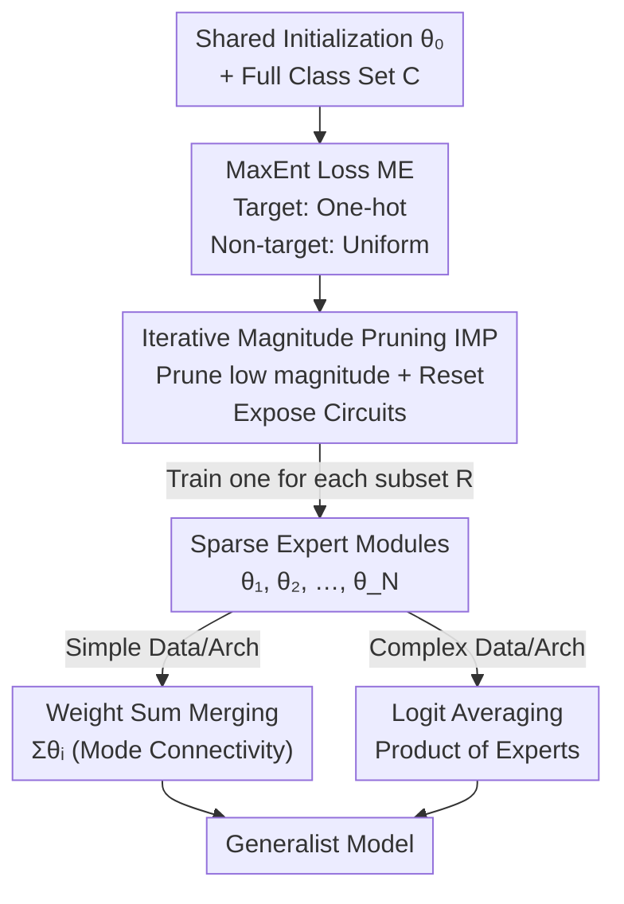

# Composable Sparse Subnetworks via Maximum-Entropy Principle

**Conference**: ICLR2026  
**OpenReview**: [https://openreview.net/forum?id=IHwx5ioIP2](https://openreview.net/forum?id=IHwx5ioIP2)  
**Code**: https://github.com/FrancescoCaso/Composable-Sparse-Subnetworks-MaxEnt  
**Area**: Mechanistic Interpretability / Modular Networks / Model Merging  
**Keywords**: Maximum Entropy Principle, Functional Modules, Sparse Subnetworks, Iterative Magnitude Pruning, Model Merging  

## TL;DR
The authors utilize a "Maximum-Entropy Loss" based on KL divergence to train neural networks into sparse subnetworks (functional modules) that recognize only specified classes while remaining deliberately uncertain about others via uniform distributions. These expert modules are then combined into a generalist model through weight summation or logit averaging, reversing the paradigm from "post-hoc probing of entangled representations" to "modular and interpretable by design."

## Background & Motivation
**Background**: Modern neural networks spontaneously develop "circuits" during training—small clusters of neurons and connections dedicated to specific classes. Mechanistic interpretability aims to identify, understand, and reuse these functional subgraphs.

**Limitations of Prior Work**: These circuits emerge implicitly and are difficult to isolate, reuse, or combine cleanly. Representations of different classes are often **entangled**, where multiple classes share neurons or features, a phenomenon known as superposition. Consequently, module boundaries are blurred, making it nearly impossible to extract a part of the network that "only handles digit 3."

**Key Challenge**: The lack of class-level modularity limits the ability to understand, edit, and compose networks. Post-hoc interpretability methods (e.g., LIME, SHAP) can only interpret entangled models after training without obtaining clear functional units. True composable modules must not only work in isolation but also merge smoothly **without fine-tuning or alignment**—a property naturally destroyed by superposition.

**Goal**: To train sparse, class-specialized subnetworks that remain "ignorant" outside their domain while being composable into accurate generalist models. This involves three sub-problems: inducing functional isolation via loss, exposing circuits via sparsification, and merging modules without mutual interference.

**Key Insight**: The authors introduce the **Maximum Entropy Principle** (Jaynes 1957): under given constraints, one should choose the distribution that is "least biased" (minimum information). The insight is that maximum entropy can guide functional isolation—allowing a module to make confident predictions for its assigned classes while outputting a **uniform distribution** for all others. A module that is perfectly uniform for non-target classes does not inject "not my class" side-information into other neurons during merging, thus becoming naturally composable.

**Core Idea**: Training class-specialized modules with a KL-divergence-based Maximum Entropy loss + exposing circuits with Iterative Magnitude Pruning (IMP) + combining modules using weight summation or logit averaging. This represents the first training paradigm to "build networks by isolation and subsequent merging."

## Method

### Overall Architecture
The approach addresses how to build networks that are modular, interpretable, and composable by design. The pipeline starts from a **shared initialization** $\theta_0$. For each class (or subset) $R$, a sparse **subnetwork module** is trained using MaxEnt loss (ME) and IMP to recognize $R$ while outputting a uniform distribution for others. Once all modules are trained, they are combined into a generalist model via **Weight Summation** or **Logit Averaging**. The former ensures "specialization with ignorance," while the latter ensures non-interference during assembly.

### Key Designs

**1. MaxEnt Loss (ME): Forcing "Specialization and Uniformity" via KL Divergence**

Addressing the pain point of representation entanglement, for a module responsible for class set $R \subseteq C$ and samples $(x, y)$, a target distribution $\tilde{y} \in \mathbb{R}^{|C|}$ is constructed: if $y \in R$, $\tilde{y}$ is a standard one-hot $\tilde{y}_i = \delta_{i=y}$; if $y \notin R$, $\tilde{y}$ is **completely uniform** $\tilde{y}_i = 1/|C|$. The loss is the KL divergence between the target and the prediction $\hat{y}=\mathrm{softmax}(f_\theta(x))$:

$$L_{\text{ME}}(x,y) = \mathrm{KL}(\tilde{y} \,\|\, \hat{y}) = \sum_{i=1}^{|C|} \tilde{y}_i \log\frac{\tilde{y}_i}{\hat{y}_i}$$

This encourages **low entropy** (sharp) predictions for target classes and **high entropy** (uniform) predictions for non-target classes. Crucially, this uniformity provides **neuron permutation invariance**: in a one-vs-all scheme, a module for class 0 won't encode "not class 0" in other neurons, avoiding semantic conflicts when merged with a module for class 1.

**2. Iterative Magnitude Pruning (IMP): Exposing Circuits**

To prevent interference in weight space, the authors employ IMP from the Lottery Ticket Hypothesis: train for $E$ epochs with ME loss, prune a fraction of weights with the smallest magnitudes, and **reset remaining weights to** $\theta_0$. This cycles $N$ times until sparsity $P$ is reached. This exposes the "circuits" responsible for the class and reduces weight overlap, facilitating weight-space merging.

**3. Weight Sum Merging & Mode Connectivity**

The simplest merging is $\theta_{\text{merged}} = \sum_i \theta_i$. This is possible because modules are specialized on disjoint subsets and "act the same" elsewhere. The authors explain this through **mode connectivity**. They define a piecewise linear path $\gamma(t)$ such that the sum $\theta_1+\theta_2$ lies at the midpoint $t=0.5$:

$$\gamma_{\theta_1\to\theta_2}(t) = \begin{cases} \theta_1 + 2t\cdot\theta_2 & t \le 0.5 \\ 2(1-t)\cdot\theta_1 + \theta_2 & t > 0.5 \end{cases}$$

If the loss barrier along this path is near zero, the modules are composable by construction.

**4. Logit Averaging Merging: Product of Experts**

For complex data/architectures where weight interference is unavoidable, logits are merged via convex combination $\bar{z}=\sum_i w_i z^{(i)}$. This is equivalent to a **Product of Experts (PoE)**:

$$\bar{y}_k \propto \exp\Big(\sum_i w_i z^{(i)}_k\Big) = \prod_i \big(\mathrm{softmax}(z^{(i)})_k\big)^{w_i}$$

Since "irresponsible" experts output uniform distributions, they contribute only a constant factor that is cancelled by normalization, effectively ignoring irrelevant modules.

### Loss & Training
The core uses the ME loss (Eq 2) within Algorithm 1 (IMP + ME). Training simulates a scenario where only $R$ classes are labeled but all samples are visible. Evaluation uses rewarded accuracy, non-rewarded entropy (theoretical max $\log(N_{\text{classes}})$), and confusion matrices.

## Key Experimental Results

### Main Results
Validated across 4 model types (MLP, CNN, ResNet18, VGG11) and multiple datasets (MNIST, CIFAR-10, etc.).

Single module behavior (ME without pruning): Target accuracy is near 100%, and non-target entropy approaches theoretical limits:

| Dataset | Model | Target Acc | Non-target Entropy (Max) |
| :--- | :--- | :--- | :--- |
| MNIST | Shallow MLP | 0.998 | 2.296 (≈log10=2.30) |
| HAR | Shallow MLP | 0.997 | 1.762 (6 classes) |

Pairwise merging accuracy (with IMP):

| Model | $|R|$ | Loss | MNIST(logit) | MNIST(weight) |
| :--- | :--- | :--- | :--- | :--- |
| Shallow MLP | 1 | **ME** | **0.992** | **0.991** |
| CNN | 1 | **ME** | **0.997** | 0.984 |

### Ablation Study

| Config | Observation |
| :--- | :--- |
| ME vs QME | ME is superior; QME causes leaks in non-target streams. |
| ME vs XE | ME is better; standard XE suffers when class counts are reduced. |
| Logit vs Weight | Logit merging is generally superior and less sensitive to IMP. |
| BatchNorm | Essential for large models; requires recalculating running stats. |

### Key Findings
- **Logit merging is a universal tool**: It restores generalist performance even when weight merging fails (e.g., CIFAR-10).
- **Width helps weight-space composability**: Deeper/narrower networks increase interference.
- **Scalability**: Tested up to 100 modules on CIFAR-100; logit merging degrades gracefully.

## Highlights & Insights
- **Statistical Physics to Deep Learning**: Translates the 1957 Principle into a loss function where "ignorance of the unknown" ensures non-interference.
- **Uniformity as a Proxy for Composability**: This insight is transferable to federated learning, unlearning, and model editing.
- **Paradigm Shift**: Reverses the workflow from "probe entangled models" to "assemble by-design modular circuits."

## Limitations & Future Work
- **Weight-Space Merging**: Still sub-optimal for complex architectures; requires investigation into alignment techniques like Git-Rebasin.
- **Subnetwork Overlap**: The impact of weight sharing on pruning strategies remains unclear.
- **Downstream Applications**: Claims regarding unlearning and verification are currently conceptual promises without empirical validation.
- **Computational Overhead**: Training one module per class subset scales linearly, which may be costly for large-scale datasets.

## Related Work & Insights
- **vs. Modular Networks (Kirsch et al. 2018)**: Instead of end-to-end controllers, this builds class-expert modules through merging.
- **vs. Post-hoc Interpretability**: Shifts from interpreting existing models to "interpretability-by-design."
- **vs. Quasi-MaxEnt**: Proves that global uniformity over all non-target neurons is necessary to prevent information leakage.

## Rating
- Novelty: ⭐⭐⭐⭐⭐ 
- Experimental Thoroughness: ⭐⭐⭐⭐ 
- Writing Quality: ⭐⭐⭐⭐⭐ 
- Value: ⭐⭐⭐⭐ 

<!-- RELATED:START -->

## Related Papers

- [\[ICLR 2026\] Probing Rotary Position Embeddings through Frequency Entropy](probing_rotary_position_embeddings_through_frequency_entropy.md)
- [\[ICML 2026\] GEM: Geometric Entropy Mixing for Optimal LLM Data Curation](../../ICML2026/interpretability/gem_geometric_entropy_mixing_for_optimal_llm_data_curation.md)
- [\[ICLR 2026\] The Price of Amortized inference in Sparse Autoencoders](the_price_of_amortized_inference_in_sparse_autoencoders.md)
- [\[NeurIPS 2025\] Latent Principle Discovery for Language Model Self-Improvement](../../NeurIPS2025/interpretability/latent_principle_discovery_for_language_model_self-improvement.md)
- [\[NeurIPS 2025\] Bigram Subnetworks: Mapping to Next Tokens in Transformer Language Models](../../NeurIPS2025/interpretability/bigram_subnetworks_mapping_to_next_tokens_in_transformer_language_models.md)

<!-- RELATED:END -->
