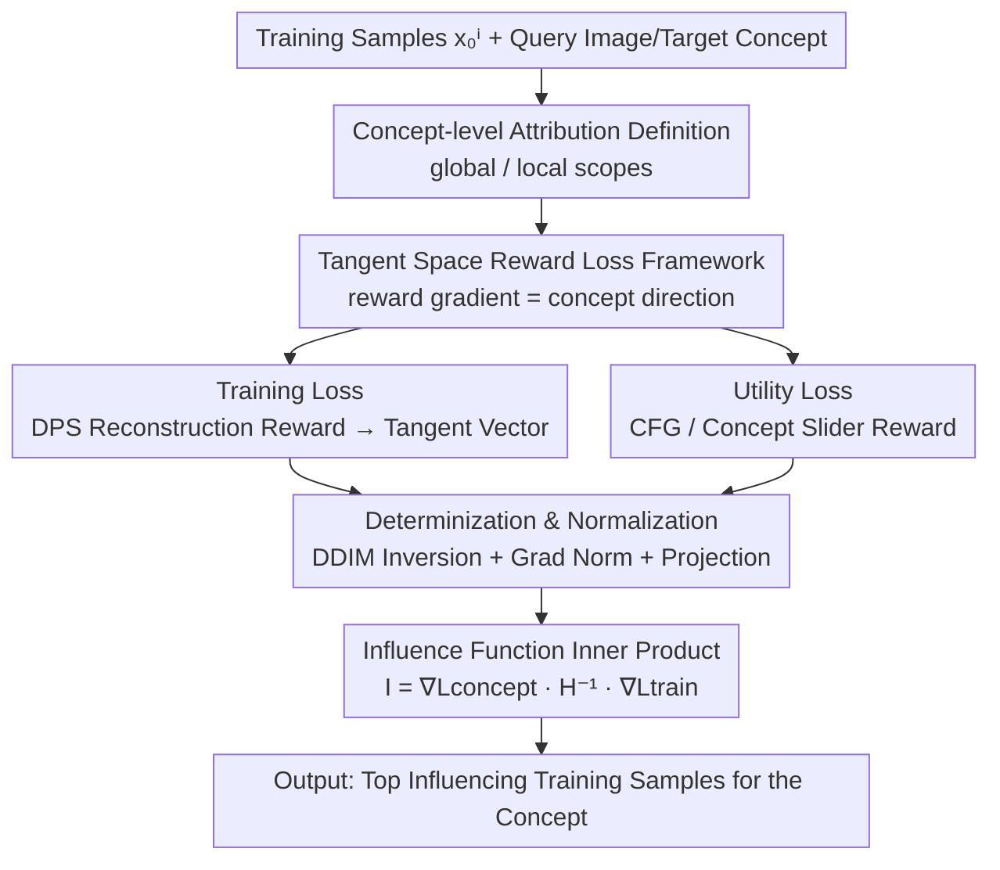

# Concept-TRAK: Understanding how diffusion models learn concepts through concept attribution

**Conference**: ICLR2026  
**OpenReview**: [https://openreview.net/forum?id=TRmIcgMe8I](https://openreview.net/forum?id=TRmIcgMe8I)  
**Code**: TBD  
**Area**: Diffusion Model Interpretability / Data Attribution  
**Keywords**: Data attribution, Concept attribution, Diffusion models, Influence functions, Tangent space

## TL;DR
Concept-TRAK refines traditional "whole-image" level training data attribution to the "individual concept" level. By designing **concept-oriented reward training and utility losses** for influence functions, it enables precise identification of which training samples influenced a specific concept (e.g., the character "Pikachu" rather than a pencil drawing style) in an AI-generated image. It significantly outperforms TRAK, D-TRAK, and DAS across three benchmarks: Synthetic, CelebA-HQ, and AbC.

## Background & Motivation
**Background**: Diffusion models not only generate high-fidelity images but, more importantly, learn to extract and flexibly combine "concepts" from training data. To address accountability needs such as copyright, safety auditing, and model debugging, data attribution methods (influence functions, TRAK, Data Shapley, etc.) are used to estimate the contribution of each training sample to the generation result. Recently, specialized attribution methods for diffusion models, such as D-TRAK and DAS, have also emerged.

**Limitations of Prior Work**: Existing methods all perform **whole-image level** attribution—they answer "which training samples influenced this entire generated image." However, stakeholders in real-world scenarios are often concerned with a **specific concept** within the image. The paper illustrates this with a straightforward example: for an image of "Pikachu in a pencil drawing style," the Pokémon Company cares about the "Pikachu" IP character rather than the pencil style. Yet, methods like TRAK tend to retrieve pencil drawings with similar styles, missing the character samples that actually involve copyright.

**Key Challenge**: Whole-image attribution mixes all visual factors (style, object, composition) when calculating contributions, making it impossible to **isolate** the influence of a single semantic concept. This is particularly problematic when the generated image contains an "out-of-distribution (OOD) concept combination" (e.g., a red triangle when red triangles do not exist in the training set), where visual similarity fails to locate the source of individual concepts.

**Goal**: Define and solve "concept-level attribution"—estimating the contribution of each training sample to a **specific semantic concept** (style, object, idea) rather than to the entire image.

**Key Insight**: The authors leverage a critical finding from prior work: the success of diffusion model attribution depends heavily on the loss function design (e.g., DSM loss is unsuitable due to noise randomness; D-TRAK and DAS use $\|\epsilon_\theta\|_2^2$ or $\|\epsilon_\theta\|_1^1$ for stability). The authors further hypothesize that meaningful concept directions correspond to **tangent vectors** of the diffusion model's latent manifold, and classifier-free guidance vectors happen to operate within this tangent space while being rich in conceptual information.

**Core Idea**: Construct the two losses required for influence functions using **reward optimization**. The training loss captures "how a training sample influences generation," and the utility loss captures "whether the target concept appears." By aligning the gradients of both with concept-related directions in the tangent space, concept-level influence is decoupled from overall reconstruction quality.

## Method

### Overall Architecture
Concept-TRAK is built upon the influence function framework. Influence functions measure how removing a training sample $x_0^i$ changes the model's performance on a utility metric $V$. The core formula is:

$$I(x_0^i, c_{target}) = \nabla_\theta L_{concept}(c_{target};\theta)^\top H^{-1} \nabla_\theta L_{train}(x_0^i;\theta)$$

where $H$ is the Hessian of the training loss (approximated by the Fisher information matrix with random projection, following TRAK), $L_{train}$ encodes the contribution of training samples, and $L_{concept}$ (utility loss $V$) measures the model's ability to generate the target concept $c_{target}$. This inner product essentially measures the alignment between the "guidance direction induced by the training sample $x_0^i$" and the "guidance direction induced by the target concept."

The pipeline is as follows: Map training samples deterministically to noise latents via **DDIM inversion** → Compute and cache parameter gradients for each training sample using a **reward-based training loss** → Given a query image and a target concept, compute the concept gradient using a **reward-based utility loss** → Compute the inner product with Hessian weighting to get influence scores → Sort to find Top influences. The core innovations lie in the design of the two reward losses, while DDIM inversion, gradient normalization, and projection act as supporting techniques for stability and efficiency.

### Key Designs

**1. Definition of Concept-level Attribution: Moving from "Image Influence" to "Concept Influence"**

Ours first rigorously defines the task. Concept-level attribution measures how training sample $x_0^i$ affects the model's capability to generate concept $c_{target}$, quantified as the expected "concept presence" $p_\theta(c_{target}) = \mathbb{E}_{x_0\sim p_{sample}(\cdot|c)}[p(c_{target}|x_0)]$, where $p(c_{target}|x_0)$ is the probability the concept exists in image $x_0$. The key is that the sampling distribution $p_{sample}$ determines the **scope**: using the model's generative distribution yields **global attribution**, while using a Dirac delta $\delta(x_0 - x_0^{test})$ yields **local attribution**. This definition provides the foundation for formal single-concept tracing. This work focuses on concepts that can be treated as conditional inputs (e.g., text prompts "Pikachu", class indices).

**2. Tangent Space Reward Loss Framework: Guiding Directions via Reward Gradients**

This is the methodological core. The geometric motivation is that diffusion latents $x_t$ reside on a low-dimensional manifold, where concept-related directions correspond to tangent vectors. The reward gradient $\nabla_{x_t}R(x_t)$ naturally points toward "concept-enhanced regions." Starting from the reward optimization objective $\max_{p_\theta}\mathbb{E}[R(x_0)]-\beta D_{KL}(p_\theta\|p_{sample})$, the optimal score function $\nabla_{x_t}\log p^*$ is decomposed into $\nabla_{x_t}\log p_0 + \frac{1}{\beta}\nabla_{x_t}R$. Converting this toward the reward-shaped distribution via explicit score matching (ESM) yields a unified **reward-based loss**:

$$L_{reward}(x_0;\theta) = \mathbb{E}_{x_t}\Big[\big\|\,sg[\epsilon_\theta(x_t;c) - \tfrac{1}{\beta}\nabla_{x_t}R(x_t)] - \epsilon_\theta(x_t;c)\,\big\|_2^2\Big]$$

where $sg[\cdot]$ denotes stop-gradient. This characterizes a loss that pushes model outputs toward $\nabla_{x_t}R(x_t)$. The value of this framework is that by varying $R$, one obtains losses for different purposes that all operate within the tangent space—making it more stable than direct DSM.

**3. Training and Utility Losses: Instantiating Two Rewards**

Ours instantiates two specific rewards. For the **training loss**, a DPS (Diffusion Posterior Sampling) style reconstruction reward $R_{train}(x_t)\triangleq\log p(x_0^i|\hat x_0)$ is used. Assuming Gaussian training data, we get $R_{train}\propto-\frac{1}{\sigma_{data}}\|x_0^i-\hat x_0\|$. Substituting this into the framework gives:

$$L_{train}(x_0;\theta) = \mathbb{E}_{x_t}\Big[\big\|\,sg[\epsilon_\theta(x_t;c) + \lambda_t\nabla_{x_t}\|\hat x_0 - x_0^i\|] - \epsilon_\theta(x_t;c)\,\big\|_2^2\Big]$$

The gradient $\nabla_{x_t}\|\hat x_0 - x_0^i\|$ is precisely a tangent vector on the data manifold. For the **utility loss**, a concept presence reward $R_{concept}(x_t)\triangleq\log p(c_{target}|x_t)$ is used. When $c_{target}$ is a conditional input, its gradient simplifies to the CFG vector; if the concept is embedded in condition $c$, a **concept slider** guide $\epsilon_\theta(x_t;c)-\epsilon_\theta(x_t;c^-)$ is used to isolate the target concept contribution (e.g., $c$="Pikachu in pencil style", $c^-$="pencil style", where the difference points specifically to "Pikachu"). The utility loss becomes:

$$L_{concept}(c_{target};\theta) = \mathbb{E}_{x_0,x_t}\Big[\big\|\,sg[\epsilon_\theta(x_t;c) + \lambda_c(\epsilon_\theta(x_t;c)-\epsilon_\theta(x_t;c^-))] - \epsilon_\theta(x_t;c)\,\big\|_2^2\Big]$$

This "subtraction" allows the utility loss to **extract** the target concept from other visual factors.

**4. Determinization & Normalization: Eliminating Randomness and Balancing Timesteps**

To prevent scores from being corrupted by randomness or scale, three techniques are applied. First, **DDIM Inversion**: $x_0^i$ is deterministically mapped to noise $x_t^i$ to remove stochasticity from the forward diffusion. Second, **Gradient Normalization**: To prevent gradients from specific timesteps from dominating due to scale differences, each timestep gradient is normalized to unit norm $\bar g_t=g_t/\|g_t\|_2$, making the method insensitive to hyper-parameters like $\beta$ and $\sigma_{data}$. Third, **Gradient Projection & Hessian Approximation**: Following TRAK, gradients are projected to a lower dimension $k\ll d$ and the Hessian is approximated via the Fisher Information Matrix, ensuring scalability.

## Key Experimental Results

### Main Results
The authors constructed two controlled benchmarks with ground-truth concept labels (Synthetic + CelebA-HQ) and intentionally created OOD combinations (excluding certain concept pairs during training). Precision@10 was used to evaluate if the "Top training samples contain the same target concept."

| Dataset | Scenario | Concept-TRAK | DAS | D-TRAK | TRAK |
|--------|------|------|------|------|------|
| Synthetic (Avg) | In-distribution | **1.00** | 1.00 | 1.00 | 0.80 |
| Synthetic (Avg) | Out-of-distribution | **0.85** | 0.50 | 0.50 | 0.45 |
| CelebA-HQ (Avg) | In-distribution | 0.92 | **0.96** | 0.50 | 0.84 |
| CelebA-HQ (Avg) | Out-of-distribution | **0.97** | 0.67 | 0.30 | 0.60 |

The performance gap is most evident in OOD scenarios: on synthetic data, baselines drop to $\le 0.50$, while Concept-TRAK maintains 0.85. On CelebA-HQ, DAS drops from 0.96 (ID) to 0.67 (OOD), whereas Concept-TRAK reaches 0.97 in OOD. This is because baselines rely on whole-image visual similarity in ID scenarios, which fails in OOD where the exact combination is absent from the training set.

### Ablation Study
Ablations on the AbC benchmark (48 samples) show the gain from each component:

| Configuration | Recall@10 | Description |
|------|-----------|------|
| TRAK (Base: $L_{DSM}$) | 0.04 | Starting point: Standard DSM loss |
| + Config A: Concept-aware utility grad | 0.261 | Added reward-based utility loss |
| + Config B: DPS training grad | 0.335 | Replaced training loss with DPS tangent vectors |
| + Config C: DDIM Inversion | 0.564 | Deterministic sampling to remove randomness |
| + Config D: Grad Normalization | **0.955** | Full Concept-TRAK |

### Key Findings
- **Every component provides a substantial gain**, rising from 0.04 to 0.955. Gradient normalization (Config C→D) shows the largest jump, indicating that scale alignment across timesteps is vital.
- Ours is insensitive to hyper-parameters like $\beta$ and $\sigma_{data}$ because normalization cancels out these constants in the final score.
- OOD (novel concept combinations) is the primary arena where Concept-TRAK excels; as combinations become more complex or styles and objects more intertwined, whole-image attribution fails.

## Highlights & Insights
- **Extreme Loss Design**: While prior work simply replaced DSM with $\ell_2$/$\ell_1$ norms, this work systematically "designs" concept-related losses using reward optimization and tangent space geometry.
- **Concept Slider Subtraction**: Using the difference $\epsilon_\theta(c)-\epsilon_\theta(c^-)$ to isolate target concepts is a clever trick applicable to any task requiring semantic factor separation.
- **Leverages Existing Mechanisms**: By repurposing CFG and DPS posterior means as tangent vectors, it requires no additional training and integrates into the TRAK pipeline with near-zero cost.
- **Unified Scopes**: The distinction between global and local attribution is elegantly unified via the sampling distribution $p_{sample}$.

## Limitations & Future Work
- The authors characterize this as a **preliminary exploration** and a "foundational framework," calling for more robust benchmarks.
- Concepts are primarily limited to those that can be **driven by conditional inputs** (text, labels); purely visual concepts are only discussed briefly in the appendix.
- The AbC benchmark depends on textual inversion, which might lack generality for massive training scenarios. Evaluation currently relies on Precision/Recall@10 due to the unsuitability of LDS for concept-level tasks, highlighting a lack of standardized quantitative protocols.

## Related Work & Insights
- **vs TRAK**: Concept-TRAK inherits the random projection and Fisher approximation framework but modifies the loss from whole-image DSM to reward-based concept loss.
- **vs D-TRAK / DAS**: Both identified that DSM is unsuitable and used $\|\epsilon_\theta\|_2^2$ or $\|\epsilon_\theta\|_1^1$ for stability. Concept-TRAK goes further by designing **different, concept-oriented reward losses** for both training and utility.
- **vs Unlearning-based Attribution**: Unlearning methods are easily distracted by style elements; Concept-TRAK isolates the target concept using concept sliders.
- **Key Insight**: Repurposing tools meant for **controllable generation and editing** (Reward optimization, DPS, Sliders) for **data attribution** reveals a geometric link: "Guidance direction $\approx$ concept direction $\approx$ tangent vector."

## Rating
- Novelty: ⭐⭐⭐⭐⭐ 
- Experimental Thoroughness: ⭐⭐⭐⭐ 
- Writing Quality: ⭐⭐⭐⭐⭐ 
- Value: ⭐⭐⭐⭐⭐ 

<!-- RELATED:START -->

## Related Papers

- [\[ICLR 2026\] Debugging Concept Bottleneck Models through Removal and Retraining](debugging_concept_bottleneck_models_through_removal_and_retraining.md)
- [\[ICLR 2026\] From Concepts to Components: Concept-Agnostic Attention Module Discovery in Transformers](from_concepts_to_components_concept-agnostic_attention_module_discovery_in_trans.md)
- [\[ICLR 2026\] Patronus: Interpretable Diffusion Models with Prototypes](patronus_interpretable_diffusion_models_with_prototypes.md)
- [\[ICLR 2026\] How Do Transformers Learn to Associate Tokens: Gradient Leading Terms Bring Mechanistic Understanding](how_do_transformers_learn_to_associate_tokens_gradient_leading_terms_bring_mecha.md)
- [\[AAAI 2026\] Concepts from Representations: Post-hoc Concept Bottleneck Models via Sparse Decomposition of Visual Representations](../../AAAI2026/interpretability/concepts_from_representations_post-hoc_concept_bottleneck_models_via_sparse_deco.md)

<!-- RELATED:END -->
