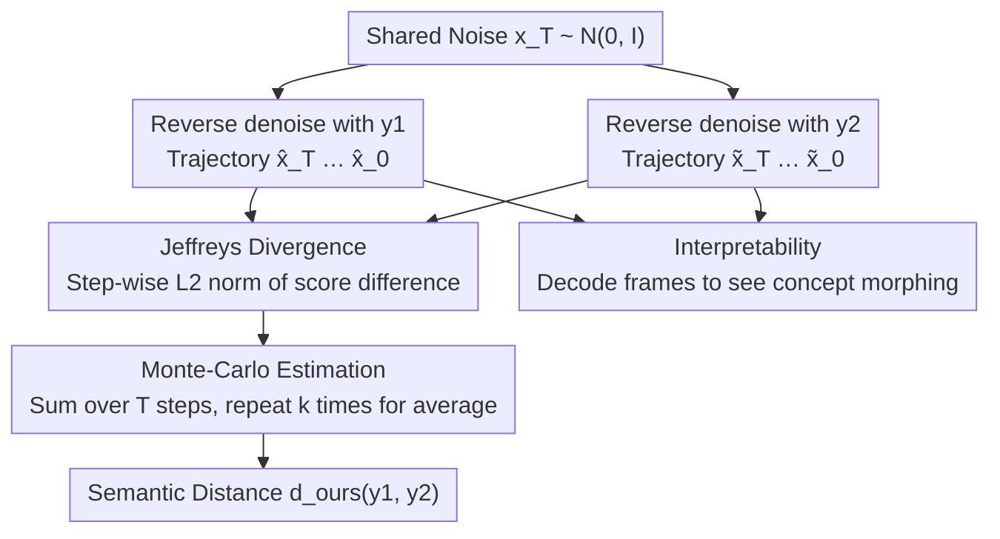

# Conjuring Semantic Similarity

**Conference**: ICLR2026  
**arXiv**: [2410.16431](https://arxiv.org/abs/2410.16431)  
**Code**: To be confirmed  
**Area**: Image Generation  
**Keywords**: semantic similarity, diffusion model, Jeffreys divergence, SDE, text-to-image

## TL;DR
The paper proposes a visual imagination-based metric for text semantic similarity. It measures semantic distance by calculating the Jeffreys divergence between the path measures of reverse SDEs induced by a text-conditioned diffusion model under two prompts. This metric can be directly computed via Monte-Carlo sampling and quantifies for the first time the alignment between the semantic space learned by diffusion models and human annotations.

## Background & Motivation

**Background**: Semantic similarity has traditionally been measured in text space (e.g., Word2Vec, BERT embeddings, CLIP). Liu et al. (2023) defined the meaning space of autoregressive LLMs as the distribution of continuations.

**Limitations of Prior Work**: (a) Text embedding methods generate uninterpretable vector distances; (b) There is no method to quantify the quality of the semantic space learned by text-conditioned diffusion models; (c) Bender & Koller (2020) argue that training on language alone is insufficient to capture semantics—external grounding is required.

**Key Challenge**: Semantic similarity should be interpretable, yet existing methods offer numerical scores without explanation. Humans understand semantics by "imagining" and comparing scenes, but humans cannot systematically compare mental images.

**Key Insight**: Treat the diffusion model as "imagination"—the semantic distance between two texts is defined as the distance between the image distributions they induce.

**Core Idea**: Text semantic similarity is defined as the Jeffreys divergence between the path measures of reverse diffusion SDEs under two text conditions, estimated via Monte-Carlo.

## Method

### Overall Architecture
This paper addresses the question: Exactly how "close" are two segments of text? The answer is not to compare text embedding vectors, but to let a text-conditioned diffusion model $s_\theta$ "imagine" for us. Given two texts $y_1, y_2$, starting from the same Gaussian noise and denoising conditioned on $y_1$ and $y_2$ respectively, the two trajectories gradually diverge into different images. By accumulating the divergence at each denoising step and performing Monte-Carlo averaging, a scalar semantic distance is obtained. The method consists of three parts: a mathematical derivation simplifying "comparing image distributions" to "comparing score functions," a Monte-Carlo estimation that implements the expectation as a sampling loop, and a trajectory visualization for interpretability.

### Key Designs

**1. Jeffreys Divergence: Simplifying "Distribution Comparison" to "Score Function Comparison"**

Directly comparing the image distributions induced by two texts (e.g., calculating FID) requires sampling a large number of images and performing statistical comparison, which is costly and only provides a final result. This paper defines semantic distance as the divergence between the path measures $\mathbb{P}_1, \mathbb{P}_2$ of the two reverse denoising SDEs. Using the Girsanov theorem, the stochastic integral term in $D_{KL}(\mathbb{P}_2\|\mathbb{P}_1)$ is a martingale under the Novikov condition and vanishes under expectation, leaving only the drift integral of the **score function difference** along the trajectory. Symmetrizing the KL divergence results in the Jeffreys divergence. To avoid tuning weights for specific schedulers, the paper sets the diffusion coefficient $g(t)=1$, resulting in a clean expectation formula:

$$d_{\text{ours}}(y_1, y_2) = \mathbb{E}_{t \sim \text{unif}([0,T]),\; x \sim \frac{1}{2}p_t(\cdot|y_1) + \frac{1}{2}p_t(\cdot|y_2)} \big\| s_\theta(x, t|y_1) - s_\theta(x, t|y_2) \big\|_2^2$$

where $p_t(\cdot|y)$ is the distribution of noisy images at time $t$. This approach retains theoretical rigor while allowing the distance to be calculated during the denoising process without generating full images.

**2. Monte-Carlo Estimation: Implementing Expectation as a Sampling Loop**

The above expectation cannot be solved analytically. The paper (Algorithm 1) uses Monte-Carlo estimation: draw initial noise $x_T \sim \mathcal{N}(0, I)$, denoise under conditions $y_1$ and $y_2$ to obtain two sample sequences, calculate the L2 norm of the score difference $\|s_\theta(x_t, t|y_1) - s_\theta(x_t, t|y_2)\|_2^2$ at each step, and sum them over $T$ steps. This process is repeated $k$ times with different initial noises to reduce variance. Experiments show that divergence accumulation saturates at $T=10$ steps, making the estimation computationally feasible.

**3. Interpretability: Concept Morphing Visualization**

Unlike text embedding methods that return uninterpretable vector distances, this distance is derived from actual denoising trajectories. Decoding the denoising process frame-by-frame reveals how the model smoothly "morphs" one concept into another—for example, from a "Snow Leopard" to a "Bengal Tiger," where spots gradually transition into stripes. This provides visual evidence for "why" two concepts are similar, a feature unique to this method.

## Key Experimental Results

### Main Results (STS Benchmark, Spearman Correlation)

| Method | STS-B | STS12 | STS13 | STS14 | Avg |
|------|-------|-------|-------|-------|-----|
| BERT-CLS | 16.5 | 20.2 | 30.0 | 20.1 | 29.2 |
| BERT-mean | 45.4 | 38.8 | 58.0 | 58.0 | ~50 |
| SimCSE-BERT | 68.4 | 82.4 | 74.4 | 80.9 | **76.3** |
| CLIP-ViTL14 | 65.5 | 67.7 | 68.5 | 58.0 | 67.0 |
| **Ours (SD v1.4)** | ~55 | ~50 | ~55 | ~50 | ~53 |

### Ablation Study

| Configuration | Effect | Description |
|------|------|------|
| Initial steps only | Poor | High noise has weak discriminative power |
| Final steps only | Moderate | Low noise contains info but is incomplete |
| Full trajectory (Ours) | Optimal | Accumulates semantic info across scales |
| KL vs Jeffreys | Jeffreys more stable | Symmetrization improves stability |
| $T$ step ablation | Saturated at $T=10$ | Computationally friendly |

### Key Findings
- **Zero-shot performance exceeds BERT encoders**: Stable Diffusion alone can achieve semantic similarity comparable to language models, indicating that diffusion models learn meaningful semantic structures.
- **Interpretability is a unique advantage**: The method provides both numerical scores and visual "morphing" processes between concepts.
- **First quantification of diffusion semantic alignment**: This opens a new dimension for evaluating T2I models beyond image quality, focusing on semantic understanding.

## Highlights & Insights
- **"Meaning = Evoked Image Distribution"**: Extends Wittgenstein's "meaning is use" from the textual to the visual domain via conceptual transfer.
- **Elegant application of Girsanov Theorem**: Simplifies abstract path measure distances into a practical score function difference.
- **Extensible to any conditional generative model**: The method is not limited to text-to-image and can theoretically be used for audio-text, video-text, etc.

## Limitations & Future Work
- **Behind specialized embedding models**: SimCSE-BERT (76.3) still holds a significant lead over Ours (~53).
- **Computational Cost**: Each pair requires multiple denoising steps (~2s/step × 10 steps × k times), which is much slower than calculating embedding distances.
- **Dependency on Model Quality**: The semantic space of SD v1.4 is limited; stronger models like DALL-E 3 may yield better results.

## Related Work & Insights
- **vs Liu et al. (2023)**: They use LLM continuation distributions. Ours uses diffusion image distributions—shifting from text space to visual space.
- **vs CLIP score**: CLIP uses aligned text-image embeddings. Ours calculates distance directly within the diffusion process—more native and interpretable.

## Rating
- Novelty: ⭐⭐⭐⭐⭐ The definition of "meaning as evoked images" is highly creative; the SDE divergence derivation is elegant.
- Experimental Thoroughness: ⭐⭐⭐ Well-verified on STS benchmarks, but did not surpass specialized models; limited application scenarios.
- Writing Quality: ⭐⭐⭐⭐⭐ Clear concepts, rigorous derivations, and impressive visualizations.
- Value: ⭐⭐⭐⭐ Opens a new direction for evaluating the semantic space of diffusion models; primarily a conceptual contribution.

<!-- RELATED:START -->

## Related Papers

- [\[ACL 2026\] Similarity-Distance-Magnitude Activations](../../ACL2026/interpretability/similarity-distance-magnitude_activations.md)
- [\[ICLR 2026\] Rethinking Layer Relevance in Large Language Models Beyond Cosine Similarity](rethinking_layer_relevance_in_large_language_models_beyond_cosine_similarity.md)
- [\[ICLR 2026\] LORE: Jointly Learning the Intrinsic Dimensionality and Relative Similarity Structure from Ordinal Data](lore_jointly_learning_the_intrinsic_dimensionality_and_relative_similarity_struc.md)
- [\[ICLR 2026\] Semantic Regexes: Auto-Interpreting LLM Features with a Structured Language](semantic_regexes_auto-interpreting_llm_features_with_a_structured_language_of_re.md)
- [\[CVPR 2026\] Make it SING: Analyzing Semantic Invariants in Classifiers](../../CVPR2026/interpretability/make_it_sing_analyzing_semantic_invariants_in_classifiers.md)

<!-- RELATED:END -->
