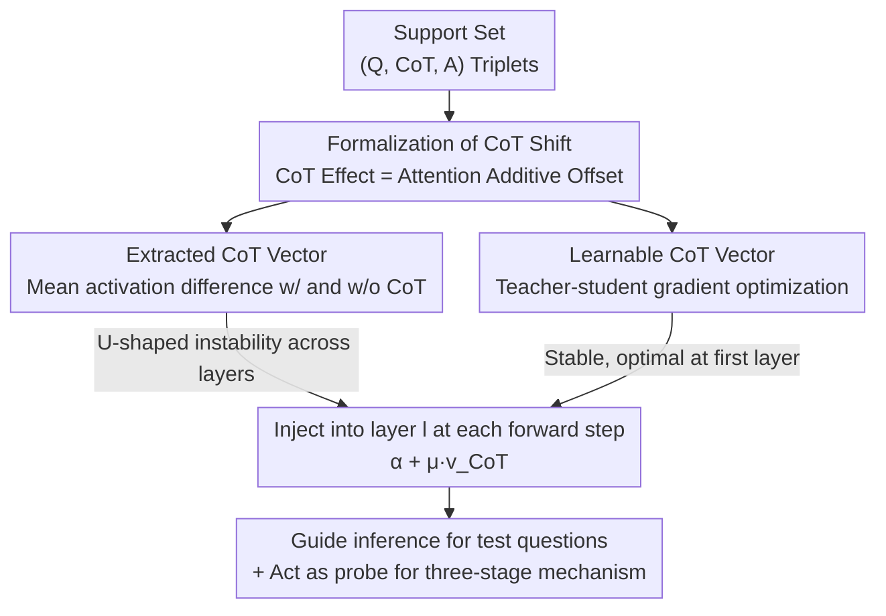

# CoT Vectors: Transferring and Probing the Reasoning Mechanisms of LLMs

**Conference**: ICLR2026  
**OpenReview**: [https://openreview.net/forum?id=L1FUfBCL0c](https://openreview.net/forum?id=L1FUfBCL0c)  
**Code**: To be confirmed (Original text states source code will be open-sourced)  
**Area**: Interpretability / LLM Reasoning Mechanisms  
**Keywords**: Chain-of-Thought, Task Vector, Activation Intervention, Reasoning Mechanism Probing, Parameter-Efficient

## TL;DR
This work compresses a Chain-of-Thought (CoT) reasoning process into a "CoT Vector" that can be directly added to hidden states. This approach enhances LLM multi-step reasoning with near-zero overhead (comparable to LoRA but with 3 orders of magnitude fewer trainable parameters) and serves as a probe revealing an internal "Perception—Reasoning—Expression" three-stage organization of LLM reasoning.

## Background & Motivation
**Background**: Currently, two main approaches exist to enable multi-step reasoning in LLMs: In-Context Learning (ICL), which inserts few-shot CoT examples into the prompt, and fine-tuning (SFT / RLHF / LoRA) using CoT-annotated data. Both methods attempt to provide reasoning capabilities "externally."

**Limitations of Prior Work**: ICL lengthens prompts and slows down inference; fine-tuning requires substantial high-quality reasoning trajectories and computational power, often yielding limited gains for models that already possess inherent CoT capabilities. In other words, the cost of "teaching a model a problem-solving pattern" is disproportionately high relative to its benefits.

**Key Challenge**: The essence of CoT is a **task-level, reusable "problem-solving mindset."** However, existing methods either tie it to lengthy prompts (repeatedly fed) or spread it across millions of parameter updates (cumbersome and opaque). Is there a carrier for reasoning knowledge that is compact, reusable, and inexpensive?

**Key Insight**: The authors draw inspiration from the Task Vector paradigm—knowledge for simple tasks like classification can be distilled into a compact vector (the difference in activations or parameters before and after fine-tuning). Adding this to the forward pass changes model behavior without modifying weights. While Task Vectors were previously validated only in simple adaptation scenarios, their ability to support complex multi-step reasoning remained unknown. The authors first perform a mathematical derivation, finding that the influence of CoT on attention outputs can be formalized as a **consistent additive offset**, providing a theoretical basis for "vectorizing" CoT.

**Core Idea**: Propose **CoT Vector**—compressing the reasoning knowledge within a triplet of (Question, CoT, Answer) into a vector. During inference, this vector is directly injected into the hidden states of a specific layer to guide the model's "problem-solving pattern." It was further discovered that directly extracted vectors are highly unstable across layers (forming a U-shaped curve). Thus, a more stable learnable version is developed via a teacher-student framework. Finally, this vector is used as a probe to analyze the internal organization of LLM reasoning.

## Method

### Overall Architecture
This work addresses two questions: **how to pack CoT into a vector** and **what this vector reveals about LLM internals**. The methodology follows three steps: first, theoretically proving that "CoT effect = an additive offset on attention output" (validity proof); second, providing two methods to obtain this offset vector—non-parametric "Extracted" and parametric "Learnable"; and finally, defining how to inject the vector into each forward pass during inference. The extracted version is simple but reveals inter-layer instability, serving as an entry point for probing reasoning mechanisms; the learnable version uses student-teacher distillation to smooth this instability.

### Key Designs

**1. Formalization of CoT Shift: Proving "Inserting Reasoning" as an Additive Activation Shift**

This step serves as the foundation. It addresses the skepticism of "why a continuous vector can replace discrete text reasoning." Using the perspective of He et al. regarding the impact of prefixes on attention, the authors view the CoT sequence as a special prefix inserted between the question $Q$ and the answer $A$. For each answer token $a$, the single-head self-attention with and without CoT can be decomposed:

$$\text{SA}(a,[K_Q,K_C,K_A],[V_Q,V_C,V_A]) = \underbrace{\text{SA}(a,[K_Q,K_A],[V_Q,V_A])}_{\text{Standard Attention}} + \underbrace{\mu\cdot(\text{SA}(a,[K_C],[V_C]) - \text{SA}(a,[K_Q,K_A],[V_Q,V_A]))}_{\text{CoT Shift}}$$

That is, the attention output with CoT equals the "original output without CoT" plus an additional term modulated by a scalar coefficient $\mu$. This term is named the **CoT Shift**, and the corresponding vector is denoted as $\vec{v}_{\text{CoT}}$, leading to the concise form $\text{SA}(\cdot)=\text{SA}_{\text{noCoT}}(\cdot)+\mu\cdot\vec{v}_{\text{CoT}}$. This equation implies two things: CoT effects can be captured by a vector, and the guidance can be replicated by adding this vector back during inference. The authors further hypothesize that CoT vectors for samples within the same task category reside in a continuous semantic space, and their centroid is the **task-general CoT vector**, encoding shared strategies.

**2. Extracted CoT Vector: Non-parametrically taking activation differences**

The most direct way to obtain the vector follows the Task Vector approach in NLP: for paired $(Q,A)$ and triplets $(Q,\text{CoT},A)$ in the support set, record the difference in hidden states for answer tokens under "with CoT" and "without CoT" inputs at layer $l$. Averaging across all answer tokens yields a single-sample vector $\vec{v}^{(l)}_{\text{CoT}}=\frac{1}{|A|}\sum_{a}(\alpha^{(l)}_{\text{CoT}}(a)-\alpha^{(l)}_{\text{Non-CoT}}(a))$, and averaging across $N$ support samples yields the task-level vector $\vec{v}_E=\frac{1}{N}\sum_i\vec{v}_{\text{CoT},i}$. While effective (improving average scores by 2.4 and 1.1 across two models), its performance fluctuates wildly across layers, showing a **jagged U-shaped curve**: gains occur at shallow and deep layers, but it is nearly useless or detrimental in middle layers. This contradicts previous findings that "middle-layer intervention is most effective" for simple tasks like classification and becomes the key to revealing the internal reasoning structure.

**3. Learnable CoT Vector: Distilling a robust, first-layer-optimal reasoning signal**

The extracted method is essentially a "descriptive statistic" that passively records average activation differences, failing in middle layers where dominant directions are absent and sample-specific noise persists. To obtain a steadier vector, the authors use **parametric learning**: $\vec{v}_L$ is initialized as a learnable parameter added to hidden states and optimized via gradient descent on the support set. Training uses a teacher-student framework: the teacher path receives the full triplet $(Q,\text{CoT},A)$ with frozen model parameters, providing a supervisory signal; the student path receives only $(Q,A)$, relying on the injected $\vec{v}_L$ to compensate for the missing CoT. The loss consists of two terms: a cross-entropy prediction loss $L_{\text{CE}}$ on answer tokens, and a KL alignment loss $L_{\text{Align}}$ between teacher/student hidden states, resulting in $L=L_{\text{Align}}+\lambda\cdot L_{\text{CE}}$ ($\lambda=0.5$ in experiments). Only $\vec{v}_L$ is updated. Because this is "active learning of reasoning knowledge" rather than "passive averaging," the learnable vector creates more directional and aggressive shifts in the hidden space, bypassing layer-specific limitations and noise. Consequently, the layer-wise performance curve changes from a U-shape to a "peak at first layer, plateau thereafter," making first-layer injection nearly optimal and deployment-friendly.

**4. Function: Injecting a vector at each forward step with zero overhead**

After obtaining the task-level vector, during testing of new questions at layer $l$, every step of autoregressive forward pass executes $\tilde{\alpha}^{(l)}=\alpha^{(l)}+\mu^{(l)}\cdot\vec{v}^{(l)}_{\text{CoT}}$. For extracted vectors, $\mu$ is an explicitly set constant (fixed at 1.0); for learnable vectors, $\mu$ is absorbed into the vector during training. This injection does not increase context length and the runtime cost is a single vector addition, resulting in virtually no additional overhead—a core advantage over ICL and fine-tuning.

## Key Experimental Results

### Main Results
Two models (Qwen2.5-Math-7B, LLaMA-3.1-8B-Instruct) × Six benchmarks (GSM8K, MATH-Easy/Hard, MMLU-Pro, CommonsenseQA, StrategyQA). CoT vector results are taken from the best-performing layer.

| Model | Method | Trainable Params | GSM8K | MATH-H | CSQA | SQA | Average |
|------|------|-----------|-------|--------|------|-----|------|
| Qwen2.5-Math-7B | Baseline (zero-shot CoT) | — | 74.6 | 47.9 | 53.8 | 23.7 | 50.5 |
| Qwen2.5-Math-7B | Extracted | — | 78.2 | 49.7 | 57.5 | 29.1 | 53.6 |
| Qwen2.5-Math-7B | **Learnable** | 3.6K (×1.0) | **83.5** | **50.9** | **58.2** | 31.2 | **55.1** |
| Qwen2.5-Math-7B | LoRA | 10.0M (×2777.8) | 79.0 | 48.2 | 58.0 | 31.2 | 53.4 |
| LLaMA-3.1-8B-Instruct | Baseline | — | 77.4 | 34.6 | 72.7 | 60.8 | 58.7 |
| LLaMA-3.1-8B-Instruct | **Learnable** | 4.2K (×1.0) | 78.2 | 36.4 | 73.7 | **65.0** | **60.6** |
| LLaMA-3.1-8B-Instruct | LoRA | 13.6M (×3238.0) | 78.6 | 36.3 | 73.6 | 64.8 | 60.4 |

Learnable CoT Vectors on Qwen achieved an average of 55.1 (4.6 above baseline), surpassing LoRA (which uses 10M parameters) with only 3.6K parameters. For LLaMA, it also slightly outperformed LoRA with ~4K parameters. The authors explain that instruction-tuned models already have strong CoT priors; while LoRA finds little room for weights improvement, CoT Vectors act as "external guidance signals" that work more efficiently without disturbing existing functional structures.

### Cross-layer Transfer and Training Scale Ablation

| Experiment | Configuration | Result | Description |
|------|------|------|------|
| Cross-layer (Qwen-GSM8K) | Shallow Vector → Mid-layer | 75.3 (↑9.0) | Shallow vector injected into mid-layer still gains |
| Cross-layer (Qwen-GSM8K) | Mid Vector → Shallow | 63.8 (↓14.4) | Mid-layer vector injected into shallow layer drops sharply |
| Cross-data Transfer | MMLU-Pro → MATH | 47.9 → 48.5 | Cross-domain still gains, suggested meta-reasoning |
| Cross-model Transfer | Qwen-Math-Instruct → Qwen-Math | 74.6 → 77.5 | Vectors reusable within the same model series |
| Support Set Size (Qwen-GSM8K) | Only 100 samples | 78.2 (LoRA only 76.0) | Significantly better data efficiency than LoRA |

### Key Findings
- **Three-Stage Reasoning Mechanism**: The U-shaped instability of extracted vectors is structured. Through PCA information density analysis and t-SNE visualization, the authors found that middle layers require significantly more principal components to explain variance and lack a dominant direction, indicating they carry high-dimensional, sample-specific core reasoning. Shallow layers perform perception/semantic encoding, and deep layers perform expression, both of which are more linearly unified. This suggests LLM reasoning is organized into "**Perception—Reasoning—Expression**" stages. This explains why extracted vectors fail in middle layers: the activations lack a consistent task-level direction.
- **Representation, not Position, Causes Failure**: Injecting a mid-layer vector into shallow layers caused a 14.4 point drop, whereas injecting a shallow vector into mid-layers yield a 9.0 point gain. This proves mid-layer failure stems from the sample-specific, non-generalizable nature of mid-layer representations, rather than the layer position being unsuitable for intervention.
- **Model Differences in Latent Space**: Qwen showed larger gains than LLaMA (4 pts vs 1.5 pts) because Qwen's focused fine-tuning resulted in clearer three-stage differentiation, lower information density, and more explicit primary directions, facilitating higher-quality signal extraction.
- **Risk of Overfitting in Learnable Vectors**: Injections into middle/deep layers tend to overfit, excessively manipulating the latent space and collapsing diverse reasoning paths (dropping accuracy to 23.7). Vectors that are "slightly underfit" via early stopping or lower learning rates are more robust. Thus, shallow layers are the optimal injection points.

## Highlights & Insights
- **"Method as Probe"**: CoT Vectors are both a tool for enhancement and a microscope for analysis. The U-shaped instability was transformed from a flaw into a discovery tool for the "Perception—Reasoning—Expression" mechanism—an excellent example of treating a "bug" as a "feature" for scientific inquiry.
- **Theoretical Anchor of Additive Offset**: Deriving "CoT = Additive Offset" from attention decomposition ensures the method is formally grounded rather than just a heuristic. The perspective of $\text{SA}=\text{SA}_{\text{noCoT}}+\mu\vec{v}_{\text{CoT}}$ is transferable to other intervention studies involving prefixes or instructions.
- **Extreme Parameter Efficiency**: Achieving parity or superiority to LoRA with 3000x fewer parameters while maintaining zero added context length makes this a highly cost-effective path for enhancing instruction-tuned models where fine-tuning gains are diminishing.
- **Engineering Friendliness of First-layer Optimality**: The stability of learnable vectors at the first layer eliminates the need for expensive layer-wise searches during deployment.

## Limitations & Future Work
- **Overfitting**: Learnable vectors require "tuning" (early stopping/low learning rates) to remain stable in deep layers. The optimal layer for extracted vectors shifts across tasks/models, making it difficult to use in real deployments without ground truth (hence the learnable version).
- **Task Homogeneity**: The method assumes task-level CoT vectors reside in a continuous space with a meaningful centroid. This may not hold for highly heterogeneous task sets with diverse solving patterns.
- **Cross-domain Gains**: Cross-domain transfer is significantly weaker than in-domain gains. The "meta-reasoning" claim remains more qualitative and requires stronger evidence.
- **Scale**: Evaluation was limited to 7B/8B models. Whether the three-stage structure and vector effectiveness hold for larger or reasoning-optimized models (e.g., o1-like models with long chains) remains to be verified.

## Related Work & Insights
- **vs Task Vector (Ilharco et al. / Todd / Hendel)**: Previous work used activation/weight differences for simple classification or ICL, finding middle layers most effective. This paper extends the paradigm to complex reasoning, discovering a contradictory "mid-layer failure," and provides a learnable optimization mechanism.
- **vs Implicit/Latent CoT (Coconut, Geiping et al.)**: These works compress reasoning steps into the latent space but often require architectural changes or intensive post-training. This work keeps the architecture frozen and uses an external, plug-and-play vector.
- **vs PEFT (LoRA, etc.)**: LoRA modifies attention projection matrices with millions of parameters; this work learns a single 3–4K dimension vector, offering 3 orders of magnitude higher parameter efficiency and better data efficiency on small support sets.
- **vs CoT Steering (Azizi / Tang / Zhang & Viteri)**: Those works focused on controlling generation length or style. This work proactively optimizes vectors to capture task-level logic and provides a systematic analysis of latent space structures.

## Rating
- Novelty: ⭐⭐⭐⭐⭐ Extending Task Vectors to multi-step reasoning and discovering the three-stage mechanism as a probe is highly novel.
- Experimental Thoroughness: ⭐⭐⭐⭐ Comprehensive across two models, six benchmarks, and various transfer/ablation tests, though limited to 7-8B scales.
- Writing Quality: ⭐⭐⭐⭐ Clear progression from theory to method to mechanism, supported well by math and visuals.
- Value: ⭐⭐⭐⭐⭐ Provides an extremely efficient reasoning enhancement tool and a new probe for LLM interpretability.

<!-- RELATED:START -->

## Related Papers

- [\[ICLR 2026\] The Potential of CoT for Reasoning: A Closer Look at Trace Dynamics](the_potential_of_cot_for_reasoning_a_closer_look_at_trace_dynamics.md)
- [\[ICLR 2026\] Causality ≠ Invariance: Function and Concept Vectors in LLMs](causality_invariance_function_and_concept_vectors_in_llms.md)
- [\[ICLR 2026\] Linear Mechanisms for Spatiotemporal Reasoning in Vision Language Models](linear_mechanisms_for_spatiotemporal_reasoning_in_vision_language_models.md)
- [\[ICLR 2026\] RADAR: Reasoning-Ability and Difficulty-Aware Routing for Reasoning LLMs](radar_reasoning-ability_and_difficulty-aware_routing_for_reasoning_llms.md)
- [\[ICLR 2026\] Reforming the Mechanism: Editing Reasoning Patterns in LLMs with Circuit Reshaping](reforming_the_mechanism_editing_reasoning_patterns_in_llms_with_circuit_reshapin.md)

<!-- RELATED:END -->
