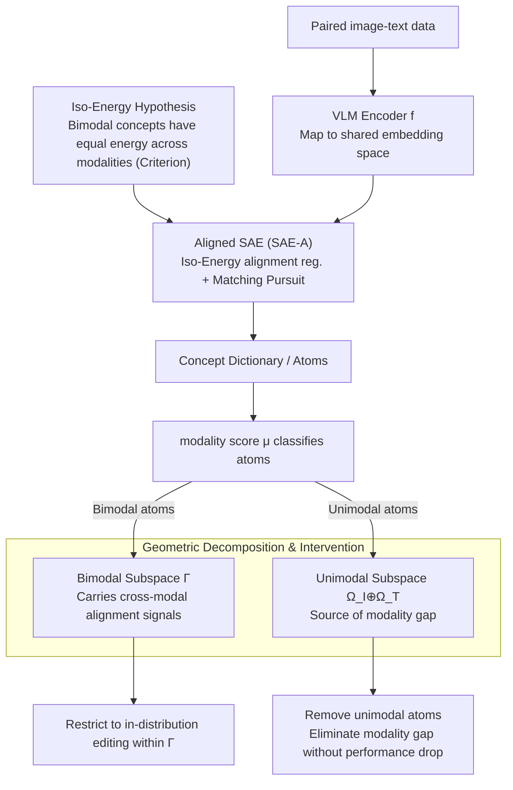

# Cross-Modal Redundancy and the Geometry of Vision-Language Embeddings

**Conference**: ICLR 2026  
**arXiv**: [2602.06218](https://arxiv.org/abs/2602.06218)  
**Code**: [https://github.com/Parabrele/IsoEnergy](https://github.com/Parabrele/IsoEnergy)  
**Area**: Interpretability  
**Keywords**: Modality Gap, Sparse Autoencoders, Cross-modal Redundancy, Iso-Energy Hypothesis, VLM Interpretability

## TL;DR
The authors propose the Iso-Energy hypothesis (stating that truly cross-modal shared concepts should have the same average activation energy across different modalities) and design Aligned SAE as an analytical tool. Their work reveals a geometric structure in VLM embedding space where bimodal atoms carry cross-modal alignment signals, while unimodal atoms fully account for the modality gap.

## Background & Motivation

**Background**: Vision-Language Models (VLMs) like CLIP/SigLIP map images and text into a shared embedding space through contrastive learning, achieving cross-modal alignment. However, the internal geometric structure of their embedding spaces remains unclear.

**Limitations of Prior Work**: A known phenomenon is the "modality gap"—image and text embeddings reside in disjoint cones within the latent space. Previous work attempted to eliminate this gap by removing mean differences or projecting out certain coordinate directions, but such interventions often degrade cross-modal performance. When extracting concept dictionaries using Sparse Autoencoders (SAEs), concepts were found to be mostly separated by modality, making it difficult to identify truly bimodal concepts.

**Key Challenge**: Although VLMs are trained for cross-modal alignment, the extracted concept dictionaries are largely modality-separated. This occurs because concept recovery is an underdetermined problem (non-identifiability in nonlinear ICA); without additional inductive biases, standard SAEs cannot correctly distinguish between bimodal and unimodal atoms.

**Goal**: (a) How can bimodal vs. unimodal concepts be accurately recovered from VLM embeddings? (b) What is the fundamental nature of the modality gap? (c) Can the modality gap be eliminated without compromising performance?

**Key Insight**: Starting from the data generation process—if multimodal data is generated from shared latent concept vectors through modality-specific generators, truly shared concepts should leave "redundant statistical traces" in both modalities, specifically having the same average activation energy.

**Core Idea**: Use cross-modal redundancy as an inductive bias. Guided by the Iso-Energy constraint, the SAE learns the correct decomposition of bimodal/unimodal concepts, thereby revealing and enabling the manipulation of the VLM embedding geometry.

## Method

### Overall Architecture

The core problem this paper addresses is: Given that VLMs are trained for cross-modal alignment, why do concept dictionaries extracted by Sparse Autoencoders (SAEs) remain largely modality-separated, failing to find true bimodal concepts? The authors frame this as an identifiability problem and use the "cross-modal redundancy" statistical signal to solve it.

The entire logic is built on a hypothetical multimodal concept generation process: latent concept vectors $\mathbf{c}$ are sparsely sampled and then projected into modality-specific observations via generators $\mathbf{g}^{(d)}$. VLM encoders $\mathbf{f}$ then pull these paired image-text samples back into a shared embedding space. On top of these embeddings, the authors use an **Aligned SAE** (SAE-A) (with criteria provided by the **Iso-Energy hypothesis**) to learn the concept dictionary. A modality score $\mu$ is then used to classify atoms into bimodal and unimodal categories, partitioning the embedding space into a bimodal subspace $\Gamma$ (carrying cross-modal signals) and a unimodal subspace $\Omega$ (constituting the modality gap). Finally, precise interventions are performed (removing unimodal atoms to smooth the gap or restricting editing to $\Gamma$).

### Key Designs

**1. Iso-Energy Hypothesis: Using "Equal Energy" as a Testable Criterion for Bimodal Concepts**

The root of the identifiability problem is that a standard SAE has no reason to believe an atom is shared across modalities—nonlinear ICA is inherently non-identifiable, and without extra constraints, it might incorrectly split a bimodal concept into two unimodal atoms. Starting from the generation process, the authors propose a criterion: if a concept $k$ is truly generated by the same latent code in both modalities, its statistical traces should match, most directly in terms of average activation energy (average squared activation). This is formalized as the Iso-Energy constraint:

$$\mathbb{E}_{X \in \mathcal{X}^{(d)}}[\psi(X)_k^2] = \mathbb{E}_{X \in \mathcal{X}^{(d')}}[\psi(X)_k^2]$$

This means the average squared activation of concept $k$ is equal for modality $d$ and $d'$. This quantity is a simple second-order statistic, yet it provides a directional inductive bias for non-identifiable nonlinear ICA, turning the question of "which atoms should be bimodal" from guesswork into a testable proposition—cross-modal features should have comparable energy, while modality-specific factors need not.

**2. Aligned SAE (SAE-A): Implementing the Iso-Energy Hypothesis as a Lightweight Alignment Regularizer**

Once the criterion is established, the SAE must be trained to satisfy it. SAE-A is built upon a Matching Pursuit SAE (using sequential residual updates to achieve $\ell_0$ sparsity, which is theoretically closer to sparse coding than ReLU/TopK). It adds an alignment regularizer to the standard reconstruction objective:

$$\mathcal{L}_{\text{SAE-A}} = \mathcal{L}_{\text{SAE}} + \beta \cdot \mathcal{L}_{\text{align}}, \qquad \mathcal{L}_{\text{align}} = -\frac{1}{b}\text{Tr}\!\left(\mathbf{Z}^{(d)} \mathbf{Z}^{(d')^\top}\right)$$

where $\mathbf{Z}$ are $\ell_2$ normalized encodings and $b$ is the batch size. This term maximizes the cosine similarity between encodings of paired image-text samples—and its minimum aligns perfectly with Iso-Energy: making encodings of aligned samples point in the same direction is equivalent to making shared atoms have equal energy across modalities. Crucially, the weight $\beta \approx 10^{-4}$ is extremely small: it is sufficient to "nudge" the dictionary toward the correct bimodal/unimodal decomposition without significantly affecting reconstruction quality—this distinguishes it from aggressive interventions like "mean removal" or "projecting out coordinate directions," which degrade cross-modal performance while reducing the gap.

**3. Geometric Decomposition and Intervention: Translating Concept Dictionaries into Subspace Structures**

The final step is applying the recovered dictionary to the geometry of VLM embeddings. The authors calculate a modality score $\mu$ for each atom (comparing its energy across modalities) to classify the dictionary into bimodal and unimodal atoms. This partitions the embedding space into a bimodal subspace $\Gamma$ and a unimodal subspace $\Omega_I \oplus \Omega_T$. Bimodal atoms span $\Gamma$, a modality-invariant, compact subspace orthogonal to unimodal directions that carries the true cross-modal alignment signals. A few high-energy unimodal atoms span $\Omega_{I/T}$, acting as "modality biases" containing modality-specific information and reproducing the cone-like geometry of the modality gap. The value of this decomposition lies in its precision—removing unimodal atoms eliminates the modality gap without touching cross-modal performance, and restricting vector operations to $\Gamma$ allows for more in-distribution editing, a level of control unachievable through purely geometric perspectives.

### Loss & Training

The base SAE uses Matching Pursuit for $\ell_0$ sparsity, selecting activated atoms one by one via sequential residual updates (expansion ratio of 8 and target $\ell_0 = 20$ in experiments). The alignment term $\mathcal{L}_{\text{align}}$ maximizes the cosine similarity of paired sample encodings with a very small weight $\beta \approx 10^{-4}$, which has minimal impact on reconstruction (with $R^2$ remaining almost identical).

## Key Experimental Results

### Main Results

SAE and SAE-A were trained on 6 VLMs (CLIP, CLIP-L, OpenCLIP, OpenCLIP-L, SigLIP, SigLIP2):

| Model | MSE (SAE/SAE-A) | R² (SAE/SAE-A) | Classification accuracy $p_{\text{acc}}$ (SAE/SAE-A) |
|------|------|----------|------|
| CLIP | 0.141/0.163 | 0.859/0.837 | 0.847/**0.915** |
| SigLIP2 | 0.115/0.115 | 0.884/0.885 | **0.897/0.899** |

- SAE-A significantly improves the classification accuracy of bimodal atom activation patterns while maintaining nearly identical reconstruction quality.

### Ablation Study

| Experiment | Key Metric | Description |
|------|---------|------|
| Synthetic data (Iso-Energy holds) | SAE: W=0.396, mma=0.29; SAE-A: W=0.184, mma=0.52 | SAE-A recovers bimodal atoms significantly better. |
| Synthetic data (Iso-Energy fails) | Both: W≈0.19, mma≈0.82 | The regularizer does not force the creation of bimodal atoms. |
| Removing unimodal atoms | Modality gap disappears + Cross-modal performance preserved | Validates the interpretation: Unimodal atoms = Modality gap. |
| Operations restricted to bimodal subspace | Retrieval performance Gain + More in-distribution editing | The bimodal subspace is the correct space for cross-modal operations. |

### Key Findings
- Sparse bimodal atoms carry all cross-modal alignment signals—fewer in number but highly concentrated in information.
- A few high-energy unimodal atoms act as "modality biases," fully accounting for the modality gap.
- Removing unimodal atoms can eliminate the modality gap without harming downstream performance (unlike all previous methods).
- Restricting vector operations to the bimodal subspace produces in-distribution edits and improves retrieval results.
- Contrary to findings by Papadimitriou et al. (2025): Cross-modal information is carried by shared atoms, not idiosyncratic ones.

## Highlights & Insights
- **Elegance and depth of the Iso-Energy hypothesis**: A simple statistic (equal average squared activation across modalities) serves as an effective criterion for bimodal concepts, supported by a solid generative model. This idea could be transferred to any multi-view or multimodal concept extraction task.
- **"Neutrality as Validation" Strategy**: Proving on synthetic data that the regularizer is "neutral" when the hypothesis does not hold (i.e., it doesn't fabricate bimodal concepts) is a clever validation method that avoids concerns about introduced bias.
- **Concept-level explanation of the modality gap**: Elevates previous purely geometric descriptions (cones, ellipsoidal shells) to the conceptual level (unimodal atoms = modality bias), making the gap seeed like a "feature" that preserves modality-specific information rather than a "bug" to be eliminated.
- **Matching Pursuit SAE**: Using $\ell_0$ sparsity instead of ReLU/TopK aligns better with sparse coding theory and is transferable to other SAE applications.

## Limitations & Future Work
- The Iso-Energy hypothesis assumes concepts have identical energy in both modalities, but real-world concepts might naturally be richer in vision (e.g., color, texture); this asymmetry is not discussed.
- Experiments were only validated on dual-encoder VLMs, not extended to single-encoder or encoder-decoder architectures (e.g., LLaVA, Flamingo).
- SAE-A requires paired image-text data for training, limiting its application to unpaired data.
- Although small, the alignment regularization weight $\beta$ still needs tuning and is not entirely hyperparameter-free.
- The binary classification of atoms into bimodal/unimodal might be too coarse; "partially bimodal" concepts may exist in practice.

## Related Work & Insights
- **vs. Liang et al. (2022) Modality Gap**: They described the geometric phenomenon (cone structure) but found that eliminating it hurt performance. Ours explains why—the gap comes from unimodal atoms carrying necessary modality-specific info, which can now be precisely removed at the concept level.
- **vs. Schrodi et al. (2025)**: They tried to eliminate the gap by projecting out canonical directions but "collaterally damaged" bimodal information. SAE-A correctly separates them.
- **vs. Papadimitriou et al. (2025)**: They argued cross-modal info is carried by idiosyncratic concepts; Ours finds the opposite. The discrepancy stems from the identifiability issues of standard SAEs.
- **vs. Plato Representation Hypothesis (Huh et al. 2024)**: The Iso-Energy hypothesis can be seen as an operationalized version of this—if different models/modalities converge to the same features, the statistics of these features should be consistent across modalities.

## Rating
- Novelty: ⭐⭐⭐⭐⭐ The Iso-Energy hypothesis is elegant, providing the first complete concept-level explanation of the modality gap.
- Experimental Thoroughness: ⭐⭐⭐⭐ Extensive validation on synthetic and real data, though lacking non-dual-encoder structures.
- Writing Quality: ⭐⭐⭐⭐⭐ Clear theoretical motivation, rigorous logic, and well-designed visualizations.
- Value: ⭐⭐⭐⭐⭐ Significantly advances VLM interpretability; Aligned SAE has broad potential applications.

<!-- RELATED:START -->

## Related Papers

- [\[ICLR 2026\] Inducing Dyslexia in Vision Language Models](inducing_dyslexia_in_vision_language_models.md)
- [\[ICLR 2026\] Bridging Explainability and Embeddings: BEE Aware of Spuriousness](bridging_explainability_and_embeddings_bee_aware_of_spuriousness.md)
- [\[ICLR 2026\] Probing Rotary Position Embeddings through Frequency Entropy](probing_rotary_position_embeddings_through_frequency_entropy.md)
- [\[CVPR 2026\] Missing No More: Dictionary-Guided Cross-Modal Image Fusion under Missing Infrared](../../CVPR2026/interpretability/missing_no_more_dictionary-guided_cross-modal_image_fusion_under_missing_infrare.md)
- [\[ICLR 2026\] Linear Mechanisms for Spatiotemporal Reasoning in Vision Language Models](linear_mechanisms_for_spatiotemporal_reasoning_in_vision_language_models.md)

<!-- RELATED:END -->
