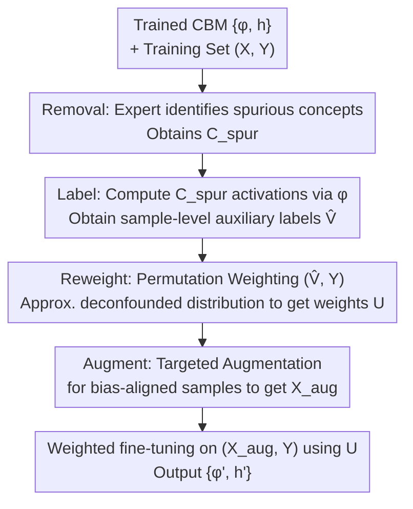

# Debugging Concept Bottleneck Models through Removal and Retraining

**Conference**: ICLR2026  
**OpenReview**: [https://openreview.net/forum?id=zZNYUkBS77](https://openreview.net/forum?id=zZNYUkBS77)  
**Code**: https://github.com/ericenouen/cbdebug  
**Area**: interpretability and explainable AI  
**Keywords**: Concept Bottleneck Models, Interpretability Debugging, Spurious Correlation, Bias Mitigation, Human-in-the-loop  

## TL;DR
To address the issue of Concept Bottleneck Models (CBMs) learning spurious concepts and systematic misalignment with expert reasoning, this paper proposes a "Removal + Retraining" two-step debugging framework. It introduces CBDebug, which converts expert concept-level feedback into sample-level auxiliary labels and uses permutation weighting and targeted augmentation to eliminate model dependence on spurious concepts. On benchmarks with known spurious correlations such as Waterbirds and MetaShift, it improves worst-group accuracy by up to 26%.

## Background & Motivation

**Background**: Concept Bottleneck Models (CBMs) are a mainstream architecture for interpretable visual classification. They decouple prediction into two stages: a concept extractor $\phi$ maps the input to a set of human-understandable concept activation scores, and a reasoning layer $h$ (usually a sparse linear layer) maps these activations to the final label. This intermediate representation allows domain experts to inspect the reasoning process and even directly correct mispredicted concepts at test-time (test-time intervention), transforming experts from passive auditors into active decision-makers.

**Limitations of Prior Work**: Test-time intervention only corrects superficial errors in individual samples and cannot resolve the **systematic misalignment** between CBMs and expert reasoning. When a model learns shortcuts from biased data (e.g., using "beach background" as a basis for waterbird identification), the same reasoning flaws recur on new samples. While unsupervised CBMs eliminate the need for expensive per-sample concept annotations and allow for automatic concept discovery, this flexibility makes it easier for the learned concept sets to deviate from expert understanding, resulting in entire sets of spurious concepts.

**Key Challenge**: Experts desire to "globally" edit the model's dependence on certain concepts (being right for the right reasons). However, existing methods either provide only local corrections (test-time intervention), require expensive per-sample supervision (supervised CBMs), or rely on unsupervised methods to automatically guess spurious groupings, taking control away from the expert. The lines between interpretable debugging and bias mitigation have not been successfully bridged.

**Goal**: Enable experts to globally and reliably align model reasoning with expert knowledge using minimal feedback (identifying which concepts to remove), while maintaining task performance.

**Key Insight**: The authors treat "experts labeling a concept as spurious" as a **causal intervention**. By regarding the labeled concepts as observed confounding variables, they approximate a counterfactual distribution where these confounders have no impact on the labels. The interpretability of CBMs provides a bridge: concept activation scores themselves can serve as sample-level auxiliary labels, allowing the integration of mature supervised bias mitigation methods.

**Core Idea**: A two-step "Removal + Retraining" approach. CBDebug translates concept-level feedback into sample-level auxiliary labels, followed by permutation weighting and targeted augmentation to approximate the deconfounded counterfactual distribution.

## Method

### Overall Architecture

The framework addresses the following: given a pre-trained unsupervised CBM $\{\phi, h\}$ and a training set with known spurious correlations, how can experts use minimal feedback to remove the model's dependence on spurious concepts without degrading performance? It consists of two steps: **Removal** and **Retraining**. In the Removal step, experts inspect descriptions of each concept (e.g., representative image patches in ProtoPNet, text descriptions in VLM-CBM), select a subset of spurious concepts $C_{spur}$, and remove them. However, removal alone is insufficient; remaining concepts may still encode information from the removed ones, and task-relevant concepts might have been previously ignored. Thus, the Retraining step, executed by CBDebug, fully utilizes the $C_{spur}$ feedback.

CBDebug operates as a three-stage pipeline: **Label → Reweight → Augment**, followed by fine-tuning $\{\phi, h\}$ on the augmented and weighted data to produce the debiased $\{\phi', h'\}$.

### Key Designs

**1. Removal Step: Identifying Spurious Concepts via Minimal Binary Feedback**

This step targets the pain point of "limited expert time and domain labeling effort." The framework assumes no specific structure for concepts, requiring only an associated explanation, making it compatible with various concept discovery methods. The feedback mechanism is intentionally minimalist—a binary decision at the **task level** for each concept: keep or mark for removal. Experts inspect the learned set $C = \{c_1, \dots, c_m\}$, identify the spurious subset $C_{spur} \subset C$ (e.g., background concepts in bird classification), and remove them from the set, passing the edited CBM and $C_{spur}$ to the retraining step. This design trades direct handling of class-specific spurious concepts for broad applicability and ease of integration.

**2. Labeling: Translating Concept Feedback into Sample-Level Auxiliary Labels**

This serves as the bridge of the method and the key to integrating bias mitigation into CBMs. Supervised bias mitigation requires sample-level auxiliary labels, which CBM interpretability can generate "out of thin air"—by directly using the trained concept extractor $\phi$ to compute activation scores for the marked concepts across the training set. Formally, the labeling step takes $\phi$, training samples $X$, and $C_{spur}$ as input, and outputs an $N \times |C_{spur}|$ matrix:

$$\hat{V} = \big[\, \phi_{C_{spur}}(x_i)\,\big]_{i=1}^{N}$$

where $\phi_{C_{spur}}(x_i)$ represents the subset of activation scores for sample $x_i$ on concepts in $C_{spur}$. These activations $\hat{V}$ approximate the true auxiliary labels $V$. The ingenuity lies in treating concept activations as continuous, high-dimensional real-valued vectors, which are naturally suited for weighting methods that do not rely on discrete groupings.

**3. Reweighting: Approximating Deconfounded Distributions via Permutation Weighting**

After labeling, the correlation between $\hat{V}$ and labels $Y$ must be reduced. The authors employ permutation weighting. Intuitively, if a background is spuriously correlated with a class, reweighting assigns low weights to "waterbirds on beach backgrounds" and high weights to "waterbirds on grass backgrounds," forcing the model to learn features that generalize across backgrounds. Specifically, $\hat{V}$ and $Y$ are concatenated to form dataset $D$, representing the **confounded distribution**. $Y$ is then randomly permuted to create $D'$, which naturally severs the correlation between $Y$ and $\hat{V}$, representing the **deconfounded distribution**. A binary discriminator $\eta$ is trained to distinguish whether a sample comes from $D'$ or $D$, and the weight for each sample is:

$$u_i = \frac{\eta(y_i, v_i)}{1 - \eta(y_i, v_i)}$$

which is the "odds ratio of belonging to the deconfounded distribution." The authors use K-fold cross-validation and average over multiple permutations to stabilize the weights. Compared to methods like GroupDRO, which require discrete groups and are prone to collapse in underrepresented groups, permutation weighting naturally handles multidimensional continuous auxiliary labels and is more stable.

**4. Augmentation: Targeted Augmentation for Bias-Aligned Samples**

While reweighting is effective, highly imbalanced spurious groups can place excessive weight on a few samples, causing training instability. Augmentation stabilizes debiasing by creating new samples for underrepresented groups. The key is to **only augment samples aligned with the bias to be removed**. Sample weights $u_i$ are converted into augmentation probabilities $p_{aug}(x_i)$—by inverting $u_i$ relative to the maximum weight (low-weight samples have higher values after inversion), normalizing to $[0,1]$, and raising to the power of $\gamma$ to increase contrast and reduce the risk of augmenting useful samples. Augmentation methods vary by concept representation: ProtoPNet randomly selects $k$ spurious concepts and applies CutMix (using patches randomly sampled from the top-10 high-activation prototype patches for that concept); VLM-CBM utilizes text-to-image concept libraries to perform Mixup. Notably, since these concepts are explicitly labeled spurious by experts, the **labels $Y$ are not changed** during augmentation—reflecting the treatment of this process as a causal intervention approximating a counterfactual distribution.

### Loss & Training
Finally, $\{\phi, h\}$ are fine-tuned on the augmented dataset $(X_{aug}, Y)$ weighted by $U$ to produce the refined $\{\phi', h'\}$. In practice: PIP-Net fine-tunes the entire model for half the original training epochs; Post-hoc CBM freezes the backbone and only retrains the linear layer.

## Key Experimental Results

### Main Results (Real User Feedback)
Six real users performed the Removal step for four "dataset × model" combinations, running the debugging end-to-end. "Original" reports mean and variance over three seeds; Removal and retraining methods report over six debugging sessions.

| Dataset / Model | Metric | Original | Remove | Retrain | **CBDebug** |
|---|---|---|---|---|---|
| Waterbirds / PIP-Net | Worst-group | 71.9 | 74.4 | 72.5 | **79.4** |
| MetaShift / PIP-Net | Worst-group | 52.4 | 55.0 | 53.3 | **57.3** |
| Waterbirds / Post-hoc CBM | Worst-group | 25.8 | 13.9 | 33.2 | **73.6** |
| MetaShift / Post-hoc CBM | Worst-group | 84.5 | 73.9 | 84.4 | **89.3** |

CBDebug improves worst-group accuracy by 7.5% (Waterbirds) / 4.9% (MetaShift) on PIP-Net, and by 26.1% (Waterbirds) / 4.8% (MetaShift) on Post-hoc CBM, surpassing the previous SOTA debugger, ProtoPDebug.

### Automated Feedback (LLM as Expert, Post-hoc CBM)

| Dataset | Metric | Original | Remove | Retrain | **CBDebug** |
|---|---|---|---|---|---|
| Waterbirds | Worst-group | 25.8 | 2.5 | 38.0 | **58.3** |
| MetaShift | Worst-group | 84.5 | 79.6 | 83.0 | **87.5** |
| CelebA | Worst-group | 8.7 | 6.5 | 22.2 | **51.3** |
| ISIC | AUROC | 39.3 | 41.7 | 37.7 | **58.0** |

Using an LLM with temperature 0 to make binary spuriousness judgments for each text concept can replace manual labor. CBDebug consistently outperforms the original model across all benchmarks, with a maximum improvement of 42.6% on CelebA.

### Ablation Study & Key Findings
- **Components are mutually indispensable**: Reweight Only achieved higher worst-group accuracy on Waterbirds/CelebA but was inconsistent across datasets (lagging on MetaShift); Augment Only provided limited gains alone. CBDebug combines both for stable gains across settings.
- **Remove has a negative effect on Post-hoc CBM**: Post-hoc CBMs have small concept sets (approx. 10–30). Deleting bias-aligned concepts without other task-relevant concepts to compensate leads to performance collapse (Waterbirds 25.8 → 13.9). PIP-Net, with more concepts (approx. 100–200), is more robust to removal.
- **Naive retraining allows spurious correlations to "leak back"**: Retrain performed worse than Remove alone on PIP-Net. Table 3 shows that standard retraining learns new background concepts (beach → sea/harbor/lake) to replace the deleted ones, while CBDebug successfully shifts dependence to bird features like "duck-like body" or "orange wings."

## Highlights & Insights
- **Interpretability as a "Label Generator"**: The cleverest part is using CBM's own concept activation scores as sample-level auxiliary labels, bridging the gap between "concept-level human feedback" and "supervised bias mitigation requiring sample labels." Interpretability is no longer just for viewing but directly drives debiasing.
- **Expert Feedback as Causal Intervention**: Formalizing the labeling of spurious concepts as an intervention on observed confounders to approximate a counterfactual distribution provides a clean theoretical framework for human-in-the-loop debugging and justifies "not changing labels" during targeted augmentation.
- **Permutation Weighting for Continuous Activations**: Choosing permutation weighting over GroupDRO is crucial because concept activations are high-dimensional and continuous; this avoids extra clustering and escapes the collapse of low-support groups.
- **Transferability**: This "Activation → Auxiliary Label → Bias Mitigation" bridge can theoretically be applied to any interpretable-by-design concept model (authors mention potential extension to CAM and other post-hoc XAI), providing a general debugging paradigm.

## Limitations & Future Work
- The authors acknowledge **high variance** when using Post-hoc CBM as a backbone; results are highly sensitive to initialization and training randomness, requiring cautious interpretation (some standard deviations are very large, e.g., Remove on Waterbirds ±20.7).
- Effectiveness **depends on feedback quality**: Inaccurate or adversarial concept feedback will erode gains.
- The framework assumes **task-level** spuriousness and does not directly address class-specific spurious correlations, limiting applicability in scenarios where spuriousness varies by class.
- Personal Note: Reweight Only was strong in several settings, suggesting the marginal contribution and stability gain of augmentation require more systematic characterization; sensitivity to hyperparameters like $\gamma$ and permutation counts is relegated to the appendix, making it difficult to judge robustness boundaries from the main text.

## Related Work & Insights
- **vs ProtoPDebug (Bontempelli et al., 2023)**: ProtoPDebug puts spurious concept patches into a forget set with a forgetting loss and is biased toward ProtoPNet. This paper provides a more general CBM debugging framework, bridging "Removal + Retraining" with bias mitigation, showing more stable gains across architectures (PIP-Net + Post-hoc CBM) and outperforming ProtoPDebug.
- **vs Unsupervised Group Robustness (e.g., GroupDRO, JTT, DISC)**: Those methods automatically estimate groupings based on assumptions of how spurious correlations are learned, leaving experts without control. This paper only removes concepts explicitly marked by experts, providing fine-grained control (even allowing certain "spurious" concepts to be kept or "core" concepts to be removed for diagnosis).
- **vs Supervised CBMs**: Supervised CBMs rely on shared concept vocabularies for alignment but require expensive per-sample labeling and are prone to concept leakage masking global misalignment. This paper focuses on unsupervised CBMs, exposing shortcuts for experts to delete rather than hiding them within other concepts.

## Rating
- Novelty: ⭐⭐⭐⭐⭐ Bridging interpretable debugging and bias mitigation via concept activations as auxiliary labels is a truly new connection.
- Experimental Thoroughness: ⭐⭐⭐⭐ Covers two types of CBMs, four datasets, real and automated feedback, including ablation and qualitative analysis, though variance is high.
- Writing Quality: ⭐⭐⭐⭐⭐ Clear framework; the three-stage pipeline and causal perspective are well-explained.
- Value: ⭐⭐⭐⭐ Provides an actionable global debugging paradigm for interpretable-by-design models in high-risk domains.

## Related Papers

- [\[ICLR 2026\] There Was Never a Bottleneck in Concept Bottleneck Models](there_was_never_a_bottleneck_in_concept_bottleneck_models.md)
- [\[AAAI 2026\] Partially Shared Concept Bottleneck Models](../../AAAI2026/interpretability/partially_shared_concept_bottleneck_models.md)
- [\[CVPR 2026\] Rethinking Concept Bottleneck Models: From Pitfalls to Solutions](../../CVPR2026/interpretability/rethinking_concept_bottleneck_models_from_pitfalls_to_solutions.md)
- [\[ICLR 2026\] Concept-TRAK: Understanding how diffusion models learn concepts through concept attribution](concept-trak_understanding_how_diffusion_models_learn_concepts_through_concept_a.md)
- [\[AAAI 2026\] Flexible Concept Bottleneck Model](../../AAAI2026/interpretability/flexible_concept_bottleneck_model.md)

<!-- RELATED:END -->

<!-- RELATED:START -->

## Related Papers

- [\[ICLR 2026\] There Was Never a Bottleneck in Concept Bottleneck Models](there_was_never_a_bottleneck_in_concept_bottleneck_models.md)
- [\[ICLR 2026\] Concepts' Information Bottleneck Models](concepts_information_bottleneck_models.md)
- [\[ICLR 2026\] Explainable Mixture Models through Differentiable Rule Learning](explainable_mixture_models_through_differentiable_rule_learning.md)
- [\[ICLR 2026\] GAVEL: Towards Rule-Based Safety through Activation Monitoring](gavel_towards_rule-based_safety_through_activation_monitoring.md)
- [\[ICLR 2026\] Decomposition of Concept-Level Rules in Visual Scenes](decomposition_of_concept-level_rules_in_visual_scenes.md)

<!-- RELATED:END -->
