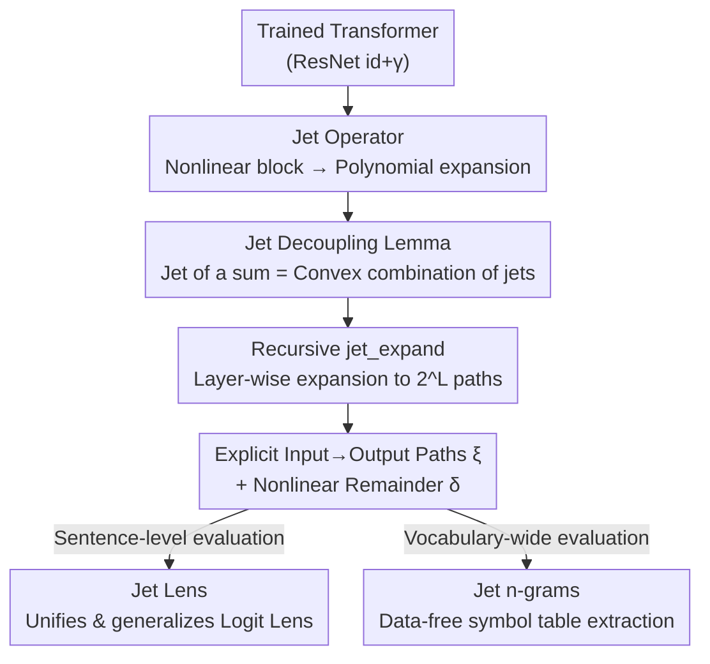

# Decomposing LLM Computation with Jets

**Conference**: ICLR 2026  
**OpenReview**: [https://openreview.net/forum?id=u6JLh0BO5h](https://openreview.net/forum?id=u6JLh0BO5h)  
**Code**: Yes (The paper states "Code is available" without a repository link; ⚠️ subject to the original text)  
**Area**: Interpretability / Mechanistic Interpretability  
**Keywords**: Jet Expansions, Residual Networks, Function Decomposition, Logit Lens, Mechanistic Interpretability

## TL;DR
This paper proposes **JET EXPANSIONS**—using "jet operators" (functional versions of truncated Taylor expansions) to rewrite the recursive residual computation of Transformers into a set of explicit "input $\to$ output paths" plus a nonlinear remainder. This training-free and data-free approach "slices" entangled LLM computations for modular inspection, proves to unify and generalize the Logit Lens, and extracts n-gram tables directly from weights to diagnose fine-tuning and toxicity.

## Background & Motivation

**Background**: Current mainstream LLM interpretability follows a "data-then-explanation" approach: carefully selecting a set of inputs, assuming certain sub-computations are important, and iteratively refining hypotheses by observing activations. Representative methods include circuit discovery in mechanistic interpretability (MI), neuron/feature attribution, and activation patching.

**Limitations of Prior Work**: This path has two structural flaws. First, it **depends on data distribution**—many conclusions fail when probe data changes, leading to poor replicability. Second, it **stays at the atomic component level** (individual neurons, layers, or weights), whereas information processing often occurs through components working in concert, making it difficult to see the full picture from atoms alone. Fundamentally, LLMs "smear" knowledge across billions of highly entangled parameters, leading to a mismatch between knowledge layout and computational layout. This makes post-training auditing or updating nearly impossible—what are simple "knowledge operations" in symbolic systems become intractable in LLMs.

**Key Challenge**: The authors argue the challenge is **structural**—LLM computation is entangled, preventing the isolation of embedded knowledge into meaningful units. Data-driven methods provide valuable insights but do so "empirically" rather than "systematically" restructuring computation into smaller, less entangled, end-to-end components.

**Goal**: To find a universal operator that does not rely on probe data, requires no retraining, and can "algebraically" decompose the entire network's computation at any depth into analyzable units.

**Key Insight**: The authors capture the fact that **LLMs are essentially residual networks** (each block takes the form $\mathrm{id}+\gamma_\ell$), where the residual chain accumulates and entangles contributions from all previous layers. Since entanglement stems from the "sums" within residuals and nonlinear "nesting," a mathematical tool is needed that can handle nonlinearity and split the "computation of a sum" into a "sum of component computations." This tool is the **jet**—a functional generalization of Taylor expansions.

**Core Idea**: Redefine interpretability as **"function decomposition"** rather than "input attribution" or "circuit identification" based on specific datasets. Specifically, recursively expand residual computations using jet operators to rewrite the model as a set of "explicit input $\to$ output polynomial paths" plus a "nonlinear remainder."

## Method

### Overall Architecture

The input is a **trained** Transformer language model, formally structured as $L$ residual blocks sandwiched between an encoder $\mathrm{Enc}$ and a decoder $\mathrm{Dec}$:

$$f = \mathrm{Dec}\circ\Big(\bigcirc_{\ell=1}^{L}(\mathrm{id}+\gamma_\ell)\Big)\circ\mathrm{Enc}$$

where $\gamma_\ell$ is the nonlinear transformation in the $\ell$-th block. Expanding the recursion, the $\ell$-th layer's hidden state is $h_\ell = h_0 + \sum_{j=1}^{\ell}\gamma_j\circ h_{j-1}$—showing how the residual stream accumulates and entangles layer contributions through nesting.

JET EXPANSIONS **equivalently rewrites** this entangled computation as:

$$f(x) = \sum_{e\in\xi}e(x,w) + \delta(x,w)$$

This consists of a set of **explicit, additive input $\to$ output paths** $\{e\}$ (called jet paths) and a **nonlinear remainder** $\delta$. The entire process is purely algebraic, requires no extra data, and involves no training. Once these paths are obtained, analysts can "pick paths of interest to inspect individually while treating the rest as a remainder," achieving true modular inspection. Specific applications like Jet Lens and Jet n-grams are instantiated on top of this.

The following diagram illustrates the pipeline from "entangled residual network" to "explicit paths + remainder" and downstream readout:

### Key Designs

**1. Jet Operator: Rewriting Nonlinear Residual Blocks as Additive Polynomial Paths**

The pain point is that linear residual networks are "naturally decomposable"—if every block was linear $\gamma_\ell(x)=A_\ell x$, the entire network could be exactly written as the sum of $2^L$ linear paths $\sum_{S\subseteq[L]} U(\prod_{\ell\in S}A_\ell)E$. In real models, LayerNorm and activation functions break this. The authors introduce the **jet operator** to "fix" nonlinearity. For $f\in C^{k+1}$, the $k$-th order jet at base point $x_0$ is defined as:

$$J_kf(x_0)(x) = f(x_0) + \sum_{j=1}^{k}\tfrac{1}{j!}D^jf(x_0)(x-x_0)^{\otimes j}$$

This is the **functional abstraction** of a truncated Taylor expansion ($k=0$ reduces to the constant $f(x_0)$, $k=1$ is linearization). Its value lies not in "approximation" but in **locally rewriting a nonlinear block as a polynomial**, allowing subsequent "sum-splitting" operations to occur at the polynomial level. The authors emphasize: jets are **operators for restructuring computation**, not mere approximation tools—the remainder $\delta$ typically does not vanish as $k$ increases (since base points are user-specified). Thus, jet expansion should be viewed as an "algebraic rewrite of the computation graph" intended for explanation rather than minimizing error.

**2. Jet Decoupling Lemma: Splitting "Computation of a Sum" into a "Convex Combination of Component Computations"**

The root of entanglement in the residual stream is that $h_\ell$ is a "sum" ($x_0+x_1+\dots$), and nonlinearities cannot be directly distributed over sums. Lemma 1 (Decoupling Lemma) provides the key: for $\bar x=\sum_{i=1}^N x_i$ and a set of weights $w\in\triangle^{N-1}$ (i.e., $w_i\ge0,\sum_i w_i=1$), we have:

$$J_kf\Big(\sum_{i=1}^N x_i\Big) = \sum_{i=1}^N w_i\,J_kf(x_i) + O(r^{k+1})$$

This means "taking the jet of a sum" can be written as "taking the jets of components separately and forming a convex combination," with error as a higher-order term $r=\max_i w_i\|x_i-\bar x\|$. This step **slices entangled residual terms into several independent, analyzable sub-streams**. An elegant example is ReLU: the authors prove that for almost all $x=x_1+x_2$, there always exist convex weights $w$ such that the first-order jet combination **exactly** restores $\gamma(x_1+x_2)$ by treating weights $w_i(x_1,x_2)$ as optimizable functions. This leads to Lemma 2: **Residual networks containing only ReLU nonlinearities possess an exact first-order jet expansion.**

**3. Recursive jet_expand Algorithm: Expanding the Network into Explicit Paths + Remainder**

With the jet operator (Design 1) and the decoupling lemma (Design 2), an algorithm is needed to run automatically at **arbitrary depth**. `jet_expand(f, ℓ, C, k)` (Algorithm 1) is the core operation: at the $\ell$-th block, the decoupling lemma is applied to a set of jet base points $C=\{x_i\}$, outputting (i) a set of polynomial terms $\xi=\{w_iJ_k\gamma_\ell(x_i)\}\cup\{w_iJ_k\mathrm{id}(x_i)\}$ (expanding both the residual block and the identity), and (ii) a nonlinear remainder $\delta=h_\ell-\sum_{e\in\xi}e$. The **key** is that terms from one round serve as base points for the next, allowing `jet_expand` to **recursively** travel through the network, "straightening" the computation graph into end-to-end paths. Applying this at the final decoding layer ($\ell=L+1$) yields the full functional rewrite $f=\sum_e e+\delta$. Algorithm 2 (`exp_jet_expand`) pushes this to $2^L$ uniformly weighted paths, echoing Veit et al.'s view that "residual networks are an ensemble of exponential paths," but doing so **explicitly and with theoretical grounding** rather than just conceptually. The remainder can be solved efficiently: when the decoder is linear, optimizing $w$ to minimize the remainder in logit space is equivalent to minimizing the distance between the expansion and the residual stream under the $U^\top U$ metric. Higher-order jets are computed recursively via AD primitives like JVP (Jacobian-vector product) at a cost of $O(|C|(F+kB))$.

**4. Downstream Instantiation: Jet Lens Unifies Logit Lens, Jet n-grams Extracts Symbol Tables Data-free**

The framework's strength lies in **unifying and generalizing existing tools**. First, **Logit Lens** (applying the decoder directly to intermediate hidden states $\mathrm{Dec}(h_\ell)$) is proven to be exactly the "zero-th order jet of the decoder at base point $h_\ell$," i.e., `jet_expand(f, L+1, {hℓ}, 0)`. The jet operator acts like a knife, cutting the network at layer $\ell$ and replacing the severed portion with a truncated jet. This yields two generalizations: **Iterative jet lens** increases the order $k\ge1$ to track indirect influences of early layers on final logits (experiments show $k>0$ is more faithful than $k=0$ for GPT-Neo); **Joint jet lens** uses an expanded base point set $\{\gamma_\ell\circ h_{\ell-1}\}$ to highlight the individual contribution of each block rather than the cumulative residual stream. Second, **Jet n-grams**: since the model is rewritten as a sum of polynomial paths, one can isolate short paths (e.g., those corresponding to bi/tri-grams) and **exhaustively evaluate** them across the entire vocabulary $V^{n-1}$. By recording the n-gram score $s(x)[i]=\sum_{e\in\xi}e(x)[i]/|\xi|$, a complete n-gram probability table can be extracted **directly from weights without any corpus**. This recovers the "knowledge layout = computational layout" addressable modularity of symbolic models within entangled LLMs, enabling global, data-free behavioral characterization (e.g., top-K bi-grams, bi-gram quality aggregated by semantic categories).

### A Complete Example: Slicing a Two-Block Residual Network

To illustrate the recursive expansion, the authors walk through the simplest non-trivial case: a two-block residual network. The full computation is $f=\mathrm{Dec}\circ(\underbrace{\mathrm{Enc}}_{x_0}+\underbrace{\gamma_1\circ\mathrm{Enc}}_{x_1}+\underbrace{\gamma_2\circ(\mathrm{Enc}+\gamma_1\circ\mathrm{Enc})}_{x_2})$. The nested parentheses represent entanglement: the outer layer mixes everything, while the inner layer binds $\gamma_2$ to both $x_0$ and $x_1$.

- **Step 1 (Inner Expansion)**: Take $\{x_0, x_1\}$ as base points at $\gamma_2$. Use the decoupling lemma to split the residual stream $x_2=\gamma_2(x_0+x_1)$ into two sub-streams $x_{20}=w_0J_k\gamma_2(x_0)$ and $x_{21}=w_1J_k\gamma_2(x_1)$.
- **Step 2 (Outer Expansion)**: At $\mathrm{Dec}$, update the base points to $\{x_0, x_1, x_{20}, x_{21}\}$. Applying the decoupling lemma and jet algebra yields 4 independent paths $f_\varnothing, f_{\{1\}}, f_{\{2\}}, f_{\{1,2\}}$.

Each path corresponds exactly to a "path through the network" one might manually identify, but here it emerges **systematically** from jet expansion. This demonstrates the two principles: **recursive expansion of nested terms** + **isolation of entangled contributions via decoupling**. Manual expansion is infeasible for deep networks, which is why Algorithms 1/2 are used.

## Key Experimental Results

This is a "framework + case study" paper. Rather than traditional "SOTA-chasing" tables, it uses multiple LLMs (GPT-2/large, GPT-Neo-2.7B, Llama-2-7B, CodeLlama, OLMo-7B) to verify: faithfulness of expansion, mechanism revelation, and diagnosis of fine-tuning/toxicity.

### Fidelity: Similarity between Expanded and Real Logits

| Setting | Model | Key Finding |
|------|------|----------|
| Joint/Iterative Jet Lens (Avg. 100 sentences) | GPT-2 / GPT-2-large / GPT-Neo-2.7B | Cosine similarity between expanded and original logits is high (near 1.0) across orders $k$; top-1 token consistency reached 0.993. |
| Iterative Jet Lens, $k{=}1$ vs $k{=}0$ | GPT-Neo-2.7B | $k{=}1$ (dashed) shows higher correlation with model output than $k{=}0$ (Logit Lens), providing more faithful explanations. |

These results indicate that jet expansion is highly correlated with actual model output and that **higher-order jets fix known failures of naive Logit Lens on the GPT-Neo series**.

### Jet n-grams Applications: Component Function & Toxicity Diagnosis

| Application | Result | Meaning |
|------|------|------|
| Linguistic Function (Table 2) | OLMo-7B 3rd MLP path specializes in adding "-ing" suffix; removal $\Delta\text{Logit}=-0.58\sim-9.73$. | Jet bi-grams can assign "functions" to individual MLPs/heads and confirm "cooperative functions" (e.g., Llama-2-7B MLPs 6+18 working together). |
| Code Fine-tuning (Table 3) | Diff of Llama-2-7B and CodeLlama jet bi-grams highlights code-specific patterns like `**kwargs`, `Assertion`. | Jet bi-grams serve as a tool to verify if fine-tuning truly injected target domain knowledge. |
| RLHF Detoxification (Table 4) | ToxiGen: Llama-2-7B **21.25 $\to$ chat version 0.0** (looks fully detoxified); but jet bi-gram toxic quality **0.102 $\to$ 0.093 barely changes**. | **RLHF merely "masks" rather than "erases" toxic knowledge**—Hard prompts in RealToxicityPrompts still trigger it (88% $\to$ 84%, negligible drop). |

### Key Findings
- **The most impactful conclusion is regarding toxicity**: While benchmarks (ToxiGen) suggest the chat version is fully detoxified, the data-free jet bi-gram metric reveals that toxic associations remain latent in weights and can be reactivated by adversarial prompts—implying alignment "covers up" rather than "deletes" knowledge, a point invisible to traditional data-driven benchmarks.
- **Theoretical Self-Consistency**: For linear residual networks, the remainder $\delta=0$ (for any $k\ge1$), and the algorithm exactly recovers the $2^L$ path decomposition. ReLU networks have an exact first-order expansion (Lemma 2).
- **Remainder Behavior**: $\delta$ does not decrease monotonically with $k$ (as base points are fixed), but in experiments, it is generally small, with cosine similarity to the original logit approaching 1, indicating practical utility.

## Highlights & Insights
- **Redefining Interpretability as "Function Decomposition"**: Moving beyond the "select data $\to$ observe activation" attribution paradigm to a purely algebraic restructuring in function space. This is a level-shift in perspective—it unifies scattered empirical tools (Logit Lens, path expansion, n-gram probes) under the single mathematical object of the jet operator.
- **"Jet as a Knife" Metaphor**: The jet operator slices the network at layer $\ell$ and replaces the remainder with a truncated expansion. Analysts can "inspect only the paths of interest while setting others aside," providing the selectable modularity long missing in entangled LLMs.
- **Data-free, Retraining-free, Weight-only**: Jet n-grams extract symbol tables directly from weights, bypassing the chronic problem of probe data distribution dependency. The "diffing bi-gram tables of two models" trick is highly portable for any scenario questioning what fine-tuning/alignment actually changed.
- **Transferable Logic**: Using "convex combinations + high-order derivative remainders" to split "nonlinearities of sums" is a decoupling lemma transferable to the analysis of any network with residual/additive structures, not limited to language models.

## Limitations & Future Work
- **Not Strict Function Approximation**: Jet expansion is a "rewrite into polynomial terms + remainder," not an approximation in the Taylor sense. Remainder size depends on order $k$ and weight selection (hyperparameters), and the expansion is **not unique** (higher orders contain lower ones). It should be viewed as an algebraic rewrite tool, not an exact reconstruction.
- **Exponential Path Explosion**: A full expansion yields $2^L$ paths. Systematically evaluating a large number of paths (especially high-order ones) is costly; large input spaces require heuristics or sub-sampling.
- **n-grams Limited to bi/tri**: Restricted by the $V^{n-1}$ exhaustive evaluation feasibility, only 2-3 grams were verified. Longer contexts are left for future work, limiting the range of linguistic phenomena covered by "symbolic characterization."
- **Case-Study Based Evaluation**: Experiments consist of several case studies rather than massive quantitative benchmarks. Conclusions (e.g., component role localization) have qualitative aspects, and performance varies across model families (GPT-Neo specifically requires $k>0$).
- **Future Work**: The authors envision going beyond polynomial bases toward "Fourier-transform-style" decomposition to enable controllable LLMs (e.g., filtering out toxic "frequencies").

## Related Work & Insights
- **vs. Mechanistic Interpretability / Circuit Discovery (Conmy 2023, Ferrando & Voita 2024)**: These identify/cluster/annotate neurons/layers/circuits, but analysis stays at atomic components, and conclusions are often data-dependent. This paper operates on **functions** rather than activations, requiring no probe data and allowing isolation of arbitrary computational blocks.
- **vs. Path Rewriting (Veit 2016, Elhage 2021)**: Veit expanded ResNets into exponential paths for gradients; Elhage split 1-2 layer Transformers into uni/bi-gram paths. These works often **ignore or simplify nonlinearities** (e.g., omitting LayerNorm). This paper **explicitly handles nonlinearity** using jet operators, generalizing these path characterizations into precise rewrites with remainders.
- **vs. Logit Lens (nostalgebraist 2021)**: Proven to be a special case of "zero-th order jets," naturally leading to iterative/joint jet lenses and fixing failures on models like GPT-Neo.
- **vs. n-gram $\times$ LLM (Svete & Cotterell 2024, Nguyen 2024)**: Previous works used probe datasets to measure LLM-n-gram consistency; this paper provides a "direct bridge without corpora," extracting n-gram tables directly from weights to recover symbolic modularity.

## Rating
- Novelty: ⭐⭐⭐⭐⭐ Redefining interpretability as function decomposition and unifying tools under the jet operator are major original contributions.
- Experimental Thoroughness: ⭐⭐⭐ Verified faithfulness and insights across multiple models/cases, but lacking massive benchmarks; generalization boundaries are unclear.
- Writing Quality: ⭐⭐⭐⭐ Theoretically rigorous (lemmas/proofs/algorithms included) with apt metaphors, though the mathematical density is high for non-theoretical readers.
- Value: ⭐⭐⭐⭐⭐ Provides a universal data-free diagnostic operator; the findings on toxicity masking have direct cautionary implications for alignment research.

<!-- RELATED:START -->

## Related Papers

- [\[ICLR 2026\] Decomposing Representation Space into Interpretable Subspaces with Unsupervised Learning](decomposing_representation_space_into_interpretable_subspaces_with_unsupervised_.md)
- [\[ICLR 2026\] Multiple Token Divergence: Measuring and Steering In-Context Computation Density](multiple_token_divergence_measuring_and_steering_in-context_computation_density.md)
- [\[ICLR 2026\] Token Alignment Heads: Unveiling Attention's Role in LLM Multilingual Translation](token_alignment_heads_unveiling_attentions_role_in_llm_multilingual_translation.md)
- [\[ICLR 2026\] Learning is Forgetting: LLM Training As Lossy Compression](learning_is_forgetting_llm_training_as_lossy_compression.md)
- [\[ICLR 2026\] Thought Branches: Interpreting LLM Reasoning Requires Resampling](thought_branches_interpreting_llm_reasoning_requires_resampling.md)

<!-- RELATED:END -->
