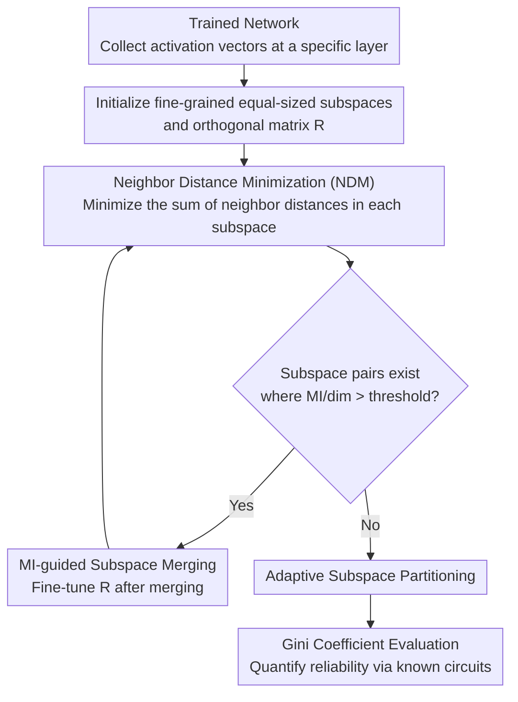

# Decomposing Representation Space into Interpretable Subspaces with Unsupervised Learning

**Conference**: ICLR 2026  
**arXiv**: [2508.01916](https://arxiv.org/abs/2508.01916)  
**Code**: [GitHub](https://github.com/huangxt39/SubspacePartition)  
**Area**: Explainable AI / Mechanistic Interpretability / Representation Learning  
**Keywords**: Subspace Decomposition, Representation Interpretation, Neighbor Distance Minimization, Unsupervised Decomposition, Knowledge Localization, Mechanistic Interpretability

## TL;DR
The authors propose NDM (Neighbor Distance Minimization), an unsupervised method to discover interpretable non-basis-aligned subspaces in neural network representation spaces by minimizing within-subspace neighbor distances. It achieves an average Gini index of 0.71 (high information concentration) on GPT-2 and identifies segregated subspaces for parametric knowledge and in-context knowledge routing on Qwen2.5-1.5B.

## Background & Motivation
**Background**: Mechanistic interpretability research seeks to understand the internal mechanisms of neural networks. Basic analysis units include components (Attention Heads/MLP), sparse features (SAE), and subspaces (DAS). Each has limitations: information across components is difficult to interpret, SAE provides input-dependent circuits, and DAS requires manually specified causal models.

**Limitations of Prior Work**:
   - **One-dimensional view of SAE**: Assuming concepts align with single basis vectors (1D features), whereas concepts like "knowledge types" or "grammatical roles" may be distributed across multi-dimensional subspaces (Multi-Dimensional Superposition Hypothesis).
   - **DAS requires supervision**: It requires human-designed abstract causal models to search for subspaces, essentially performing hypothesis verification rather than discovery.
   - There is no unsupervised method to automatically discover the "natural" partitions of the representation space.

**Key Challenge**: If mutually exclusive feature groups are compressed into orthogonal subspaces (intra-group superposition/inter-group orthogonality), how can these subspaces be identified without knowing the ground-truth features?

**Core Idea**: The projection of mutually exclusive feature groups onto their subspace is "sparse" (data points cluster on specific lines), leading to small neighbor distances. Incorrect partitioning mixes features from different groups, causing data points to cover the entire subspace and resulting in large neighbor distances. Thus, minimizing neighbor distances within a subspace is equivalent to finding the correct partition.

## Method

### Overall Architecture
The goal of NDM is as follows: given a pre-trained network, it automatically partitions the representation space of a specific layer into several interpretable subspaces, each managing a specific class of concepts, without relying on labels or manually specified causal models. The process involves collecting a large number of activation vectors $\{\mathbf{h}_n\}_{n=1}^N$, learning an orthogonal matrix $\mathbf{R}$ to rotate the entire space, and slicing the rotated axes into $S$ subspaces according to a dimension configuration $c = [d_1, \ldots, d_S]$. The optimization objective is to minimize the sum of neighbor distances within each subspace. After learning the rotation, subspaces with strong mutual dependencies are merged using mutual information (MI) to obtain a final partition with adaptively determined subspace counts and dimensions. The reliability of the method is quantified via Gini evaluation based on known circuits.

### Key Designs

**1. Neighbor Distance Minimization (NDM): Unsupervised Partitioning via "Projection Sparsity"**

The core challenge addressed here is determining the correctness of a partition without ground-truth feature labels. The key observation of NDM is that if a group of mutually exclusive features is correctly compressed into the same subspace, the projection of any data point in that subspace will fall onto only a few lines (since mutual exclusivity implies only one feature is active at a time). Points will cluster, resulting in small neighbor distances. Conversely, if the partition is wrong and mixes unrelated features, projections scatter across the subspace, increasing neighbor distances. Thus, determining partition quality becomes an optimizable scalar. Formally, the method learns an orthogonal transformation $\mathbf{R}$ (where $\hat{\mathbf{h}}_n = \mathbf{R}\mathbf{h}_n$ and $\hat{\mathbf{h}}_n^{(s)}$ is its projection onto the $s$-th subspace) to minimize the average neighbor distance across all subspaces:

$$\min_{\mathbf{R}} \frac{1}{N} \sum_{s=1}^S \sum_{n=1}^N \text{dist}(\hat{\mathbf{h}}_n^{(s)}, \hat{\mathbf{h}}_{n^*}^{(s)}), \quad \text{s.t. } \mathbf{R}^\top \mathbf{R} = \mathbf{I}$$

where $n^* = \arg\min_{m \neq n} \text{dist}(\hat{\mathbf{h}}_n^{(s)}, \hat{\mathbf{h}}_m^{(s)})$ is the nearest neighbor of $n$ in the current subspace. This is justified by information theory: neighbor distance reflects local entropy. Since orthogonal transformations preserve total entropy, "depressing internal entropy in each subspace" is equivalent to "minimizing total correlation between subspaces," effectively slicing the space into independent blocks—the desired "natural partition."

**2. MI-guided Subspace Merging: Adaptive Subspace Count and Dimension Discovery**

NDM requires an initial subspace configuration (count and dimensions), which is typically unknown. Initializing partitions too coarsely merges unrelated concepts, while partitioning too finely splits concepts across subspaces. The mechanism starts with fine-grained initialization and proceeds bottom-up: it initializes small equal-sized subspaces and trains $\mathbf{R}$. Periodically, it calculates the mutual information (MI) between all pairs of subspaces. If the MI/dim of a pair exceeds a threshold—indicating they encode interdependent information—they are merged, followed by fine-tuning of $\mathbf{R}$. This process repeats until no further merges are required. The final configuration $c$ is determined adaptively from data, avoiding human bias.

**3. Gini Coefficient Evaluation: Quantifiable Verification via Known Variables**

The primary risk of unsupervised methods is the lack of falsifiability. To address this, well-studied circuits in mechanistic interpretability (e.g., IOI, Greater-than) are used for quantitative validation. If NDM successfully identifies a "variable subspace" corresponding to a specific variable, interventions on that variable should produce effects highly concentrated in one subspace rather than spreading across all of them. Concentration is quantified using the Gini coefficient:

$$G = \frac{\sum |{\Delta_s}_1 - {\Delta_s}_2|}{2S \sum \Delta_s}$$

where $\Delta_s$ is the effect caused by intervention in the $s$-th subspace. $G > 0.6$ indicates high information concentration in a single subspace. By comparing NDM against Identity (no rotation), Random (random rotation), and PCA baselines on known circuits using Gini scores, its proximity to the true structure can be objectively judged.

### Loss & Training
- Orthogonal constraints are guaranteed via PyTorch's parametrization mechanism, ensuring $\mathbf{R}$ strictly satisfies $\mathbf{R}^\top\mathbf{R}=\mathbf{I}$ throughout optimization.
- Euclidean distance is used for neighbor distance measurement, which performs better than cosine distance in experiments.
- The method scales to models with 2B parameters.

## Key Experimental Results

### GPT-2 Small Quantitative Evaluation (5 Known Circuit Tests)

| Method | Test 1 | Test 2 | Test 3 | Test 4 | Test 5 | **Avg. Gini** |
|------|--------|--------|--------|--------|--------|-------------|
| Identity | 0.33 | 0.32 | 0.40 | 0.31 | 0.32 | 0.21 |
| Random | 0.36 | 0.36 | 0.32 | 0.33 | 0.39 | 0.21 |
| PCA | 0.43 | 0.46 | 0.50 | 0.38 | 0.35 | — |
| **NDM** | **0.71** | **0.72** | **0.75** | **0.68** | **0.69** | **0.71** |

NDM's average Gini significantly exceeds all baselines (thresholding >0.6 for high concentration), whereas Identity/Random/PCA all remain <0.5.

### Qwen2.5-1.5B Qualitative Analysis

| Finding | Description |
|------|------|
| **Parametric Knowledge Subspace** | Encodes knowledge memorized by the model from training data |
| **In-context Knowledge Subspace** | Encodes knowledge inferred from the current context |
| Separation of the two | Segregation in different subspaces supports "knowledge conflict" research |

### Ablation Study

| Configuration | Effect | Description |
|------|------|------|
| Toy Model (Known Feature Groups) | Perfect recovery of subspaces | Validates NDM principles |
| Different Feature Group Counts | All successfully decomposed | Method is robust |
| Without MI Merging | Fragmented, uninterpretable | Merging strategy is necessary |

### Key Findings
- NDM's information concentration (Gini 0.71) far exceeds all baselines, indicating that representation space indeed possesses a "natural" subspace structure.
- Known variables in GPT-2 circuits (e.g., subject position in IOI) are concentrated in single subspaces, validating the effectiveness of the method.
- The discovery of segregated subspaces for parametric vs. in-context knowledge is a significant interpretability finding, directly supporting research on "knowledge conflict" and "hallucination."
- The method scales to 2B models, offering sufficient utility.

## Highlights & Insights
- **Paradigm Shift from Single Features to Subspaces**: While SAE assumes concepts equal single-dimensional features, NDM allows concepts to be multi-dimensional subspaces. This aligns better with the Multi-Dimensional Superposition Hypothesis and represents a natural elevation in analysis granularity.
- **Unsupervised Discovery vs. Supervised Verification**: DAS requires assuming a causal model before searching for subspaces (verification); NDM discovers subspaces directly from activation data (discovery), which can then be causally verified. The discovery-to-verification workflow has greater potential for scientific discovery than verification-to-discovery.
- **Vision for "Subspace Circuits"**: If subspaces serve as reliable "variables," it becomes possible to build input-independent circuits by analyzing weight weights to determine which subspace an attention head reads from or writes to. This would be more general than SAE's input-dependent circuits.

## Limitations & Future Work
- The orthogonal constraint assumes subspaces are strictly orthogonal; in practice, subspaces may have small angular deviations.
- The MI threshold for subspace merging requires manual setting.
- Scalability to larger models (>10B) has not been verified.
- Testing was restricted to the Transformer architecture; CNN/MLP architectures were not explored.
- NDM assumes a mutually exclusive feature group structure; if features have more complex dependencies (e.g., hierarchical structures), the current method may be insufficient.

## Related Work & Insights
- **vs. SAE**: SAE finds single-dimensional sparse features (directions); NDM finds multi-dimensional subspaces representing sets of mutually exclusive features. The advancement lies in capturing multi-dimensional concepts.
- **vs. DAS (Geiger 2024)**: Both learn orthogonal transformations, but DAS is supervised (requiring causal models + counterfactual data), whereas NDM is unsupervised and discovers structures directly from activation data.
- **vs. Engels 2024 (Multi-Dim Superposition)**: NDM's "feature group" concept aligns closely with their "multi-dimensional irreducible features," effectively serving as a computational implementation of that hypothesis.

## Rating
- Novelty: ⭐⭐⭐⭐⭐ The unsupervised subspace decomposition approach is novel, and the theoretical link between neighbor distance ↔ mutually exclusive feature groups is elegant.
- Experimental Thoroughness: ⭐⭐⭐⭐ Covers toy models, GPT-2 quantification, and Qwen2.5 qualitative analysis, spanning validation, discovery, and scalability.
- Writing Quality: ⭐⭐⭐⭐⭐ Logic is extremely clear from intuition to formalization and experimentation.
- Value: ⭐⭐⭐⭐⭐ Provides a new granularity of analysis and unsupervised tools for mechanistic interpretability; the vision of "subspace circuits" has transformative potential.

<!-- RELATED:START -->

## Related Papers

- [\[ICLR 2026\] Paradigm Shift of GNN Explainer from Label Space to Prototypical Representation Space](paradigm_shift_of_gnn_explainer_from_label_space_to_prototypical_representation_.md)
- [\[ICLR 2026\] The Geometry of Reasoning: Flowing Logics in Representation Space](the_geometry_of_reasoning_flowing_logics_in_representation_space.md)
- [\[ICLR 2026\] Decomposing LLM Computation with Jets](decomposing_llm_computation_with_jets.md)
- [\[ICLR 2026\] MICLIP: Learning to Interpret Representation in Vision Models](miclip_learning_to_interpret_representation_in_vision_models.md)
- [\[ICLR 2026\] Decoupling Dynamical Richness from Representation Learning: Towards Practical Measurement](decoupling_dynamical_richness_from_representation_learning_towards_practical_mea.md)

<!-- RELATED:END -->
