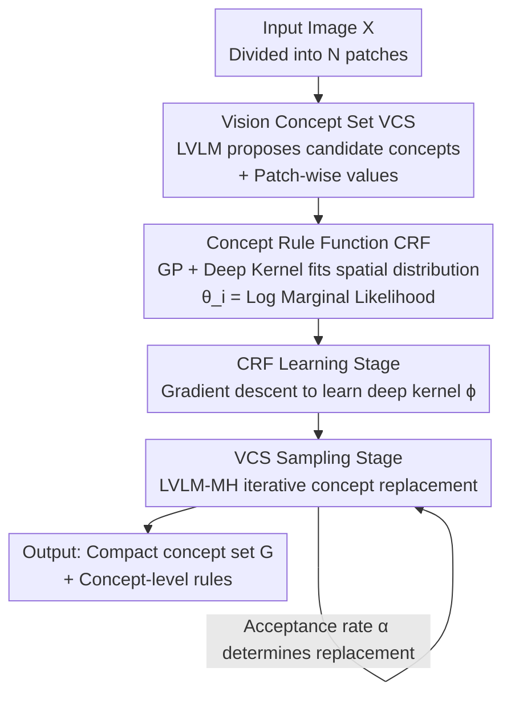

# Decomposition of Concept-Level Rules in Visual Scenes

**Conference**: ICLR2026  
**OpenReview**: [https://openreview.net/forum?id=huEYU44Ax4](https://openreview.net/forum?id=huEYU44Ax4)  
**Code**: TBD  
**Area**: Interpretability / Multimodal VLM / Abstract Visual Reasoning  
**Keywords**: Concept-Rule Decomposition, Large Vision-Language Models, Gaussian Process, Metropolis-Hastings Sampling, Explainable Reasoning

## TL;DR
This paper proposes the Concept-Rule Decomposition (CRD) framework, which utilizes pre-trained Large Vision-Language Models (LVLMs) as data-driven priors to automatically extract a set of "concepts" (e.g., color, object category) and the "rules" characterizing their spatial variations. Through a Metropolis-Hastings sampling process with an LVLM-guided proposal distribution, the framework iteratively selects a parsimonious set of concepts that best explain the input. CRD achieves improved accuracy and provides interpretable concept-rule decompositions across meta-attribute extraction, abstract visual reasoning (RAVEN/I-RAVEN), and spatial reasoning (SpatialEval).

## Background & Motivation
**Background**: Human cognition is compositional—when observing a scene, humans decompose it into independent concepts (visual concepts, meta-attributes, such as Color or Shape) and rules describing how these concepts vary across space (e.g., "the colors of a rainbow transition from red to violet"). Many visual scenes naturally possess this structure: Raven’s Progressive Matrices involve human-defined attributes and logical rules, while entities in physical videos move according to physical laws.

**Limitations of Prior Work**: Early works on concept-rule decomposition (hierarchical Bayesian inference, stroke-based character modeling, disenatngled modules for abstract reasoning, latent Gaussian processes, algebraic reasoning backends, etc.) almost exclusively rely on **manually designed inductive biases or human priors**. For instance, specific rule forms or attribute taxonomies must be injected manually. While these biases yield interpretable results, they severely limit adaptability; a change in the scene type necessitates a complete redesign.

**Key Challenge**: The tension between "interpretability" and "generality." Manual biases provide interpretability at the cost of generalization. Conversely, while LVLMs are general and encode vast world knowledge and fine-grained vision-language mappings, they are primarily trained for pattern recognition and captioning, with minimal ability to infer compositional rules. Empirically, LVLMs repeatedly fail in abstract rule induction and exhibit weak understanding of concept-relation binding.

**Goal**: Construct a framework that **automatically discovers compositional structures without manual biases**, treating the LVLM as a rich data-driven prior for concept discovery and rule induction while maintaining explicit, interpretable concept-rule decompositions.

**Key Insight**: The authors observe that LVLMs can perceive scene content, propose semantically meaningful candidate concepts, and estimate concept values for each image patch. The missing layer is the "rule"—modeling the spatial distribution of concept values and filtering out chaotic concepts that lack clear spatial patterns.

**Core Idea**: Use the LVLM to propose concepts, employ Gaussian Processes (GP) to characterize the spatial rules of each concept's values, and utilize a Metropolis-Hastings sampler guided by the LVLM to iteratively replace concepts, eventually converging to a concise set of concepts that are both "rule-consistent and LVLM-validated."

## Method

### Overall Architecture
CRD addresses the following problem: given an image $X$, automatically identify a small subset of visual concepts $G$ that truly explain the image, along with the rules describing their spatial variation. The method decomposes this into a probabilistic definition of concept sets, a probabilistic definition of rule functions, and a two-stage learning process.

Formally, there are two core objects. First is the **Vision Concept Set (VCS)**: denoting the set of all possible candidate concepts as $[M]=\{1,\dots,M\}$ (covering most of the vocabulary), a VCS of size $K$ is a subset $G\subseteq[M]$ where $|G|=K$. Each concept $i$ has a logit score $\theta_i=\log\frac{p_i}{1-p_i}$, and the VCS distribution is defined as $p_K(G\mid\theta)=\frac{1}{Z}\prod_{i\in G}e^{\theta_i}$, where $Z$ is a normalization constant. Higher $\theta_i$ increases the probability of concept $i$ being in $G$. Crucially, this score is **determined by rules**: if a concept's values follow a clear spatial pattern, it is more likely to be a latent factor explaining the input, resulting in a higher score. Second is the **Concept Rule Function (CRF)**: it bridges $\theta_i$ and the rules, where $\theta_i$ is defined as the log marginal likelihood of concept $i$ under a GP rule prior.

The pipeline consists of two sequential stages: the **CRF Learning Stage** uses the LVLM to extract concepts and learns a GP function space to fit rules; the **VCS Sampling Stage** uses an MH-like sampler to iteratively replace concepts from $p_K(G\mid\theta)$ until convergence to the optimal concept set.

### Key Designs

**1. Vision Concept Set (VCS): Formulating "concept selection" as a rule-biased probability distribution**

The challenge lies in the massive candidate concept space (nearly the entire vocabulary), making exhaustive search impossible, and the fact that only a few concepts are relevant to the image. Instead of hard selection, CRD assigns a probability $p_i\in(0,1)$ and logit $\theta_i=\log\frac{p_i}{1-p_i}$ to each concept $i$, defining a distribution over subsets of size $K$:

$$p_K(G\mid\theta)=\frac{1}{Z}\prod_{i\in G}e^{\theta_i},\quad Z=\sum_{\substack{S\subseteq[M]\\ |S|=K}}\prod_{j\in S}e^{\theta_j}.$$

The elegance of this design is that $\theta_i$ is not assigned arbitrarily: it reflects whether the variation in concept values is supported by a rule. Consequently, the distribution is naturally **biased towards concepts exhibiting clear rules**, achieving "structured" decomposition rather than filling the set with disorganized concepts.

**2. Concept Rule Function (CRF): Modeling spatial rules with Deep Kernel Gaussian Processes to calculate $\theta_i$**

This is the core implementation of "rules." In CRD, a rule is defined as the **spatial distribution pattern of concept values**—the concept identifies "what attribute" (e.g., color), while the rule describes "how these values are arranged and interact across space." Specifically, image $X$ is partitioned into $N$ non-overlapping patches $\{x_1,\dots,x_N\}$ via raster scan. For each concept $i$, the LVLM extracts a value $v_{i,n}$ for each patch, yielding position vectors $p$ and value vectors $v_i$. The CRF is a mapping $f:p\mapsto v_i$, assumed to follow a GP with a **deep kernel**:

$$f\sim \mathrm{GP}(0,k_\phi(\cdot,\cdot)),\quad k_\phi(p_i,p_j)=\exp\!\Big(-\tfrac{1}{2}\big\|g_\phi(p_i)-g_\phi(p_j)\big\|_2^2\Big),$$

where $g_\phi$ is a neural network mapping positions to high-dimensional representations. Under the GP prior, the marginal likelihood of concept values $v_i$ is Gaussian $p(v_i\mid p,\phi)=\mathcal{N}(v_i;0,K_\phi)$, and the log marginal likelihood is:

$$\mathcal{L}_{\mathrm{LML}}(p,v_i)=-\tfrac{1}{2}v_i^\top K_\phi^{-1}v_i-\tfrac{1}{2}\log\det(K_\phi)-\tfrac{N}{2}\log(2\pi).$$

The crucial link: CRD sets $\theta_i=\mathcal{L}_{\mathrm{LML}}(p,v_i)$. Thus, "concept values follow a pattern fittable by GP" ⟺ "higher marginal likelihood" ⟺ "higher $\theta_i$" ⟺ "higher probability in VCS." The deep kernel allows rules to go beyond simple spatial patterns to data-driven discovery.

**3. CRF Learning Stage: Training the deep kernel via NLL minimization**

The function space $\mathcal{F}$ (deep kernel parameters $\phi$) must be trained. Given a batch of images, CRD generates patches and uses the LVLM to extract positions and concept values to form a training set $\mathcal{D}=\{(p_i,v_i)\}_{i=1}^N$. It then **minimizes the Negative Log Marginal Likelihood** (the negative of $\mathcal{L}_{\mathrm{LML}}$ above) using Adam. Intuitively, this stage trains the GP prior to "recognize" latent spatial laws of visual concepts. After repeated processing across images, the deep kernel parameters are tuned to assign high marginal likelihood to truly rule-based concept Variations.

**4. LVLM-MH Sampling Stage: Metropolis-Hastings using LVLM as a proposal distribution**

Direct sampling from $p_K(G\mid\theta)$ is intractable. The authors design an **LVLM-MH** sampler. Starting from the current VCS $G$, a new set $G'=G\setminus\{i\}\cup\{j\}$ is proposed by replacing concept $i\in G$ with candidate $j\in[M]\setminus G$. The transition probability is $Q(G,G')=r(i\mid G)\,q(j\mid i,G)$:

- **Selection for replacement** $r(i\mid G)$: CRD **uniformly and randomly** selects $i$ ($r(i\mid G)=1/|G|$). This saves computation by avoiding the evaluation of $\theta$ for the entire set and ensures equal exploration opportunity.
- **Selection of candidate** $q(j\mid i,G)$: Instantiated by the **LVLM**, utilizing its semantic prior to assign higher probability to concepts semantically or visually consistent with the image. To prevent degradation (LVLM assigning near-zero probabilities), logits are clipped.

The acceptance probability simplifies to:

$$\alpha(G,G')=\min\!\Big(1,\ e^{\theta_j-\theta_i}\cdot\frac{q(i\mid j,G')}{q(j\mid i,G)}\Big).$$

This formula reflects two forces: $e^{\theta_j-\theta_i}$ is the **rule term** (favoring concepts with higher rule likelihood), and the latter is the **LVLM proposal ratio** (semantic exploration/correction). After multiple iterations, the VCS converges to the target distribution $p_K(G\mid\theta)$.

### Loss & Training
The only parameters requiring gradient learning are the deep kernel parameters $\phi$ of the CRF, optimized using the negative log marginal likelihood $-\mathcal{L}_{\mathrm{LML}}(p,v_i)$ via Adam. The LVLM is **frozen throughout and used via official inference pipelines**. The sampling stage requires no gradients. By default, a $2\times2$ spatial grid ($N=4$ patches) is used per image, making the $O(N^3)$ GP inference cost negligible.

## Key Experimental Results

### Main Results

Meta-attribute extraction (VSB-MA, curated from VStar Bench and manually cleaned). CRD consistently improves performance across models and scales:

| Model | Avg. Sim. | Precision | Recall | F1 | AUPRC | ROC-AUC |
|------|-----------|-----------|--------|------|-------|---------|
| DeepSeek-VL2-Tiny | 16.8 | 39.1 | 21.1 | 27.4 | 36.3 | 50.8 |
| + CRD | 20.4 | 44.8 | 23.2 | 30.6 | 40.1 | 58.3 |
| Qwen2.5-VL-3B | 31.5 | 77.1 | 26.9 | 39.9 | 42.5 | 65.8 |
| + CRD | 36.7 | 77.3 | 32.8 | 46.1 | 47.9 | 68.1 |
| Qwen2.5-VL-7B | 46.9 | 73.7 | 38.0 | 50.2 | 54.1 | 74.6 |
| + CRD | 51.6 | 76.3 | 44.4 | 56.1 | 58.0 | 75.7 |
| InternVL-3.5-4B | 38.5 | 75.1 | 35.3 | 48.0 | 48.8 | 68.7 |
| + CRD | 44.5 | 76.4 | 42.7 | 54.8 | 52.4 | 70.1 |
| InternVL-3.5-8B | 59.9 | 75.7 | 51.2 | 61.1 | 65.2 | 83.9 |
| + CRD | 64.0 | 77.4 | 55.6 | 64.7 | 68.3 | 84.8 |
| Human (Ref) | 77.4 | 84.7 | 74.6 | 79.3 | 79.0 | 87.7 |

Abstract Visual Reasoning (RAVEN / I-RAVEN, Accuracy %, Avg col). Qwen2.5-VL-7B instantiated with CRD (Qwen-VL-CRD) significantly leads, especially on I-RAVEN:

| Method | RAVEN Avg | I-RAVEN Avg |
|------|-----------|-------------|
| SRAN (Spec. DL) | 56.2 | 61.0 |
| LEN (Spec. DL) | 72.4 | 15.0 |
| GPT-4o | 11.6 | 12.1 |
| Qwen2.5-VL-7B | 59.7 | 15.0 |
| InternVL-CRD | 31.6 | 33.6 |
| **Qwen-VL-CRD** | **89.4** | **89.3** |

Notably: Qwen2.5-VL scores 60%+ on RAVEN but drops to random floor (12.5%) on I-RAVEN. Since the two datasets differ only in the candidate set, the authors suspect **data contamination** in the baseline; CRD remains stable, indicating it relies on true decomposition.

### Ablation Study
Components of the acceptance probability $\alpha(G,G')$ on InternVL-3.5-8B + CRD (VSB-MA):

| Config | Avg. Sim. | F1 | AUPRC | Explanation |
|------|-----------|------|-------|------|
| InternVL-3.5-8B + CRD (Full) | 64.0 | 64.7 | 68.3 | Full model |
| w/o LVLM Proposal Ratio | 61.0 | 61.6 | 65.8 | Drops but still above baseline |
| w/o CRF Score Term | 59.2 | 57.4 | 64.8 | Mostly below baseline |
| InternVL-3.5-8B (Baseline) | 59.9 | 61.1 | 65.2 | No CRD |

### Key Findings
- **Rule term is the primary driver**: Removing the CRF rule term ($e^{\theta_j-\theta_i}$) results in a drop to performance below the baseline.
- **LVLM proposal ratio handles exploration**: It allows proposals with slightly lower rule scores to be accepted, preventing local optima.
- **Efficiency is manageable**: With $2\times2$ patches ($N=4$), the $O(N^3)$ GP cost is negligible. Latency and memory show only moderate increases.
- **Diagnosing data contamination**: CRD's balanced performance across RAVEN and I-RAVEN suggests that structured methods can serve as probes for dataset contamination.

## Highlights & Insights
- **Unified scoring**: CRD elegantly converts "interpretable structure discovery" into a sampling problem by setting $\theta$ equal to the marginal likelihood.
- **Model-agnosticism**: By freezing the LVLM and using it only for concept proposal and semantic likelihood, CRD can be plugged into any LVLM.
- **Uniform vs. Importance sampling**: Choosing uniform random replacement over importance-based replacement demonstrates an effective engineering trade-off between computational efficiency and exploration breadth.
- **Addressing the root cause**: The authors argue that the weakness of LVLMs in reasoning stems from a lack of explicit decomposition capability, which CRD provides through an external modular mechanism.

## Limitations & Future Work
- **Static snapshots**: Currently only deals with spatial rules in static images; temporal dynamics are not yet addressed.
- **Perception dependence**: CRD relies on LVLM perception quality for initial concept extraction; errors in LVLM perception propagate to the CRF.
- **Coarse resolution**: The $2\times2$ patch default is spatially coarse. Scalability to higher $N$ would require more complex GP approximations.

## Related Work & Insights
- **vs. Hierarchical Bayes / GP Methods**: Traditional methods rely on manual biases and struggle with generalization. CRD uses LVLMs as data-driven priors and deep kernels to learn rule forms automatically.
- **vs. Task-specific DL models**: Specialized models like SRAN/LEN require per-dataset tuning and lack cross-task generalization, whereas CRD is a general paradigm.
- **vs. Pure LVLMs**: Pure LVLMs rely on pattern matching and lack explicit problem decomposition, leading to near-random performance on abstract rule induction, a gap CRD aims to bridge.

## Rating
- Novelty: ⭐⭐⭐⭐⭐ 
- Experimental Thoroughness: ⭐⭐⭐⭐ 
- Writing Quality: ⭐⭐⭐⭐ 
- Value: ⭐⭐⭐⭐⭐ 

<!-- RELATED:START -->

## Related Papers

- [\[AAAI 2026\] Concepts from Representations: Post-hoc Concept Bottleneck Models via Sparse Decomposition of Visual Representations](../../AAAI2026/interpretability/concepts_from_representations_post-hoc_concept_bottleneck_models_via_sparse_deco.md)
- [\[ICLR 2026\] Causal Interpretation of Neural Network Computations with Contribution Decomposition](causal_interpretation_of_neural_network_computations_with_contribution_decomposi.md)
- [\[ICLR 2026\] Escaping Low-Rank Traps: Interpretable Visual Concept Learning via Implicit Vector Quantization](escaping_low-rank_traps_interpretable_visual_concept_learning_via_implicit_vecto.md)
- [\[ICLR 2026\] Certified Evaluation of Model-Level Explanations for Graph Neural Networks](certified_evaluation_of_model-level_explanations_for_graph_neural_networks.md)
- [\[ICLR 2026\] Concept-TRAK: Understanding how diffusion models learn concepts through concept attribution](concept-trak_understanding_how_diffusion_models_learn_concepts_through_concept_a.md)

<!-- RELATED:END -->
