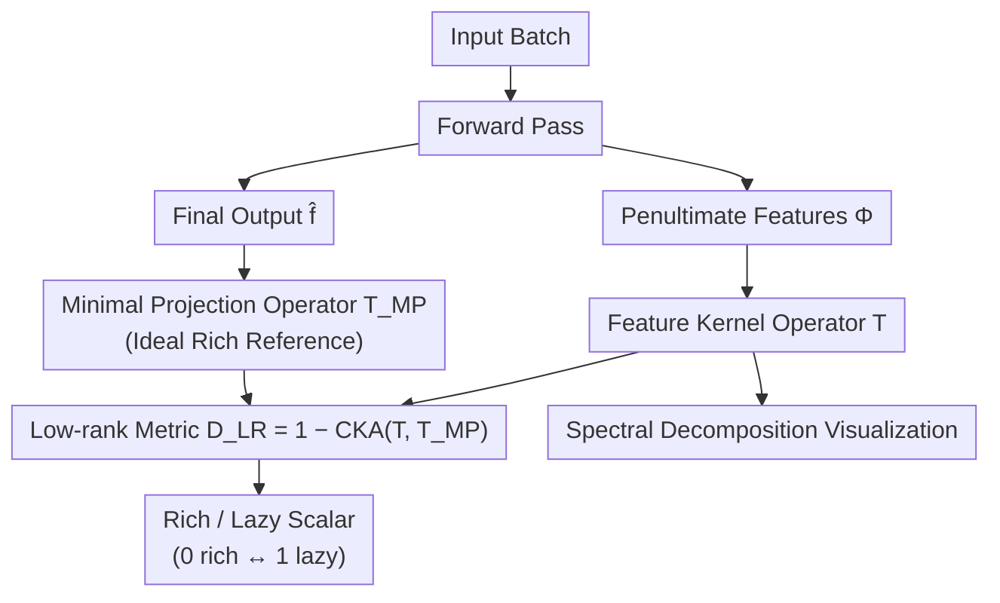

# Decoupling Dynamical Richness from Representation Learning: Towards Practical Measurement

**Conference**: ICLR 2026  
**arXiv**: [2410.04264](https://arxiv.org/abs/2410.04264)  
**Code**: Available (provided in appendix)  
**Area**: Interpretability  
**Keywords**: rich dynamics, lazy training, neural collapse, feature learning, CKA

## TL;DR
The authors propose $\mathcal{D}_{LR}$, a computationally efficient and performance-independent metric for dynamical richness. It measures rich/lazy training dynamics by comparing activations before and after the final layer and demonstrates that neural collapse is a special case of this metric.

## Background & Motivation

**Background**: There are two perspectives on feature learning in deep learning: the representation quality perspective (how effective features are for downstream tasks) and the dynamical perspective (rich vs. lazy training). Rich training involves nonlinear dynamical transformations of features, whereas lazy training resembles linear model behavior.

**Limitations of Prior Work**: Existing richness metrics have several drawbacks: NTK variation metrics are computationally expensive (proportional to the square of parameters); initial kernel similarity $\mathcal{S}_{init}$ depends on the initial kernel and can misidentify richness (e.g., weight decay changing the kernel without true rich training); parameter norm $\|\theta\|_F^2$ is only a correlation rather than a causal measure; and the NC1 metric of neural collapse is unbounded and sensitive to output scaling.

**Key Challenge**: Rich dynamics and better representation are often conflated, with accuracy used as a proxy for richness. However, rich dynamics do not always imply better generalization. The authors demonstrate on MNIST that a rich training model achieves only 10% test accuracy, while a lazy model reaches 74.4%.

**Goal**: (1) Develop a richness metric independent of performance; (2) ensure high computational efficiency; (3) provide a unified explanation for known phenomena such as neural collapse.

**Key Insight**: Starting from the low-rank bias of rich training—under rich dynamics, features before the final layer should only learn the minimum dimensions required to express the learned function (low-rank structure).

**Core Idea**: Define a minimal projection operator $\mathcal{T}_{MP}$ and use CKA to measure the distance between the actual feature kernel and the ideal low-rank projection. A smaller value indicates richer training.

## Method

### Overall Architecture
This paper addresses how to determine the richness of network training using a scalar that is **independent of accuracy and computationally feasible**. The authors leverage the low-rank bias of rich training: the richer the dynamics, the more the penultimate layer features should retain only the dimensions necessary to express the learned function. The pipeline is concise: perform a forward pass on a batch of inputs, extract penultimate features $\Phi(x) \in \mathbb{R}^p$ and final outputs $\hat{f}(x) \in \mathbb{R}^C$. One path organizes features into a feature kernel operator $\mathcal{T}$ in function space, while the other constructs the minimal projection operator $\mathcal{T}_{MP}$ from the outputs to represent the "ideal rich state." The distance between them is measured via CKA to obtain the low-rank metric $\mathcal{D}_{LR} \in [0,1]$ (lower values indicate rich; higher values indicate lazy). The same set of spectra can be decomposed for visualization, providing a diagnostic perspective beyond just a scalar.

### Key Designs

**1. Feature Kernel Operator $\mathcal{T}$: Mapping features to function space to remove sample dependency**

Richness should not depend on the specific batch of samples used for measurement. Thus, instead of looking at activations directly in vector space, the authors map features to a kernel operator in function space $\mathcal{T} = \sum_{k=1}^{p} |\Phi_k\rangle\langle\Phi_k|$, which is the sum of outer products across all feature dimensions. Using Mercer's Theorem, it is decomposed into eigenvalues $\rho_k$ and eigenfunctions $e_k$. This step distills the "learned feature structure" into a spectrum independent of specific training samples, upon which all subsequent metrics are built.

**2. Minimal Projection Operator $\mathcal{T}_{MP}$ (Definition 1): Establishing a reference for the "ideal rich state"**

To measure richness, one must define the "richest" state. The authors define the ideal state as the minimal projection operator:

$$\mathcal{T}_{MP}[u] = a_1\langle \mathbf{1}|u\rangle\mathbf{1} + a_2 P_{\hat{\mathcal{H}}}(u)$$

where $a_1, a_2 > 0$, $\mathbf{1}$ is the constant function, and $P_{\hat{\mathcal{H}}}$ is the orthogonal projection onto the learned function space $\hat{\mathcal{H}} = \text{span}\{\hat{f}_1, \ldots, \hat{f}_C\}$. This implies that under optimal rich dynamics, the model learns and utilizes only the minimum amount of features, requiring no extra processing in the final layer. If the actual $\mathcal{T}$ equals $\mathcal{T}_{MP}$, it signifies the penultimate features span a space of only $C$ dimensions (matching the output dimensions), which is the extreme manifestation of the low-rank bias in rich training.

**3. Low-rank Metric $\mathcal{D}_{LR}$: A practical scalar for distance to the ideal state and explaining neural collapse**

With the reference established, richness is the similarity between $\mathcal{T}$ and $\mathcal{T}_{MP}$. The authors use CKA and take the complement:

$$\mathcal{D}_{LR} = 1 - \text{CKA}(\mathcal{T}, \mathcal{T}_{MP})$$

The value naturally falls in $[0,1]$, where 0 is most rich and 1 is most lazy. The calculation avoids labels, initial kernels, and performance metrics, satisfying the "performance-independent" goal. Its practicality lies in low overhead: it requires only $n$ forward passes to collect penultimate ($n \times p$) and output ($n \times C$) activations, followed by $\mathcal{O}(npC)$ computation. For standard models where $p \approx 10^3$ and $n \approx \mathcal{O}(p)$, the total cost is $\mathcal{O}(p^2 C)$, far lower than NTK-based metrics that scale with the square of the total parameter count. A notable corollary is its relationship with neural collapse: when $\mathcal{T}$ degenerates to $\mathcal{T}_{MP}$, NC1 (within-class variability collapse) and NC2 (features converging to an ETF) hold automatically. This suggests neural collapse is a special case of $\mathcal{D}_{LR}=0$, essentially a dynamical phenomenon rather than a generalization indicator.

**4. Spectral Decomposition Visualization (Eq. 5): A diagnostic view beyond a single scalar**

While a scalar provides ranking, its explanatory power is limited. The authors decompose the same spectrum into three complementary views: cumulative mass $\Pi^*(k)$ (how well the top $k$ features express the target function), cumulative utilization $\hat{\Pi}(k)$ (how much the top $k$ features are actually used by the final layer), and relative eigenvalues $\rho_k/\rho_1$ (relative importance of features). Together, these can distinguish scenarios such as "high-quality features that are unused" versus "used features of poor quality." Eigenfunctions are approximated via the Nyström method (requiring $n > p$ samples), with the total visualization complexity also remaining at $\mathcal{O}(p^2 C)$.

## Key Experimental Results

### Main Results: Comparison with Existing Richness Metrics

| Metric | Dependencies | Weight Decay Misjudgment | Target Downscaling Alignment | Complexity |
|------|------|------|------|------|
| $\mathcal{D}_{LR}$ (Ours) | None (No Labels/Initial Kernel/Perf) | ✓ Correct | ✓ Consistent change with $\alpha$ | $\mathcal{O}(p^2 C)$ |
| $\mathcal{S}_{init}$ (Init Kernel Dist) | Initial Kernel | ✗ Misjudges | ✗ No change with $\alpha$ | $\mathcal{O}(n^2 p)$ |
| $\|\theta\|_F^2$ (Param Norm) | Initial Parameters | ✗ Misjudges | ✗ No change with $\alpha$ | $\mathcal{O}(D)$ |
| NC1 (Neural Collapse) | Class Labels | ✗ Unstable magnitude | ✗ Opposite direction | $\mathcal{O}(np^2)$ |

### Relationship Between Training Factors and Richness

| Task | Architecture | Condition | Test Accuracy↑ | $\mathcal{D}_{LR}$↓ |
|------|------|------|------|------|
| Mod 97 | 2-layer Transformer | Pre-Grokking (step 200) | 5.2% | 0.51 |
| Mod 97 | 2-layer Transformer | Post-Grokking (step 3000) | 99.8% | 0.11 |
| CIFAR-100 | ResNet18 | lr=0.005 | 66.3% | 0.053 |
| CIFAR-100 | ResNet18 | lr=0.05 (Optimal) | 78.3% | 0.025 |
| CIFAR-100 | ResNet18 | lr=0.2 | 74.5% | 0.039 |
| CIFAR-100 | VGG-16 | w/o BN | 21.7% | 0.66 |
| CIFAR-100 | VGG-16 | w/ BN | 72.0% | 0.073 |

### Ablation Study

| Setting | Test Accuracy | $\mathcal{D}_{LR}$ | Explanation |
|------|---------|------|------|
| MNIST rich (Full BP) | 10.0% | 0.0087 | Rich $\neq$ Good Generalization |
| MNIST lazy (Last Layer Only) | 74.4% | 0.63 | Lazy but better generalization |
| CIFAR-10 No shuffle | 95.0% | 0.031 | Rich + Good Generalization |
| CIFAR-10 Full label shuffle | 9.5% | 0.034 | Rich but no generalization |

### Key Findings
- Grokking is a transition from lazy to rich: $\mathcal{D}_{LR}$ drops from 0.51 to 0.11, providing the first performance-independent verification.
- Redefining the role of BN: VGG-16 without BN is lazy (0.66), while adding BN makes it rich (0.073), offering a new perspective for understanding BN mechanisms.
- Optimal learning rate corresponds to the richest training: ResNet18 reaches minimum $\mathcal{D}_{LR}$ at lr=0.05 on CIFAR-100.
- Feature quality correlates with feature strength during training: quality improves faster for features with larger eigenvalues.

## Highlights & Insights
- Unifies neural collapse as a special case of richness—NC1 and NC2 can be derived from $\mathcal{T} = \mathcal{T}_{MP}$, meaning neural collapse is fundamentally a dynamical phenomenon rather than a generalization metric.
- Empirical evidence that "Rich $\neq$ Better" clearly shows rich training can concentrate features on spurious encodings and fail to generalize, breaking the conventional wisdom that richer training is necessarily better.
- The discovery that BN promotes rich dynamics can be extended to study the impact of other normalization techniques on training dynamics.

## Limitations & Future Work
- Focuses only on the final layer features, ignoring middle layer dynamics (discussed in the appendix).
- Requires the target function to be orthogonal and isotropic, which does not cover unbalanced label scenarios.
- The visualization method depends on Nyström approximation, requiring $n > p$ samples.
- Extension to regression tasks and richness analysis in generative models is possible.

## Related Work & Insights
- **vs NTK-based metrics**: NTK methods are theoretically more complete but computationally infeasible; this work drastically improves practicality using the final layer kernel approximation.
- **vs Neural Collapse (Papyan et al., 2020)**: NC is a special case of this method, but NC depends on class labels and features unbounded metrics.
- **vs Feature Learning Theory (Yang & Hu, 2021)**: The $\mu$P framework predicts rich/lazy transitions theoretically; this work provides an empirical measurement tool.

## Rating
- Novelty: ⭐⭐⭐⭐ The theoretical framework unifying richness metrics and neural collapse is novel.
- Experimental Thoroughness: ⭐⭐⭐⭐ Comprehensive experiments across various architectures, datasets, and training factors.
- Writing Quality: ⭐⭐⭐⭐⭐ Clear structure, high-quality figures, and strong intuitive explanations.
- Value: ⭐⭐⭐⭐ Significant practical value as a diagnostic tool, bridging rich dynamics and representation learning theoretically.

<!-- RELATED:START -->

## Related Papers

- [\[ICLR 2026\] MICLIP: Learning to Interpret Representation in Vision Models](miclip_learning_to_interpret_representation_in_vision_models.md)
- [\[ICLR 2026\] Decomposing Representation Space into Interpretable Subspaces with Unsupervised Learning](decomposing_representation_space_into_interpretable_subspaces_with_unsupervised_.md)
- [\[ICLR 2026\] Decoupling Positional and Symbolic Attention in Transformers](decoupling_positional_and_symbolic_attention_in_transformers.md)
- [\[ICLR 2026\] Dissecting Representation Misalignment in Contrastive Learning via Influence Function](dissecting_representation_misalignment_in_contrastive_learning_via_influence_fun.md)
- [\[ICLR 2026\] The Deleuzian Representation Hypothesis](the_deleuzian_representation_hypothesis.md)

<!-- RELATED:END -->
