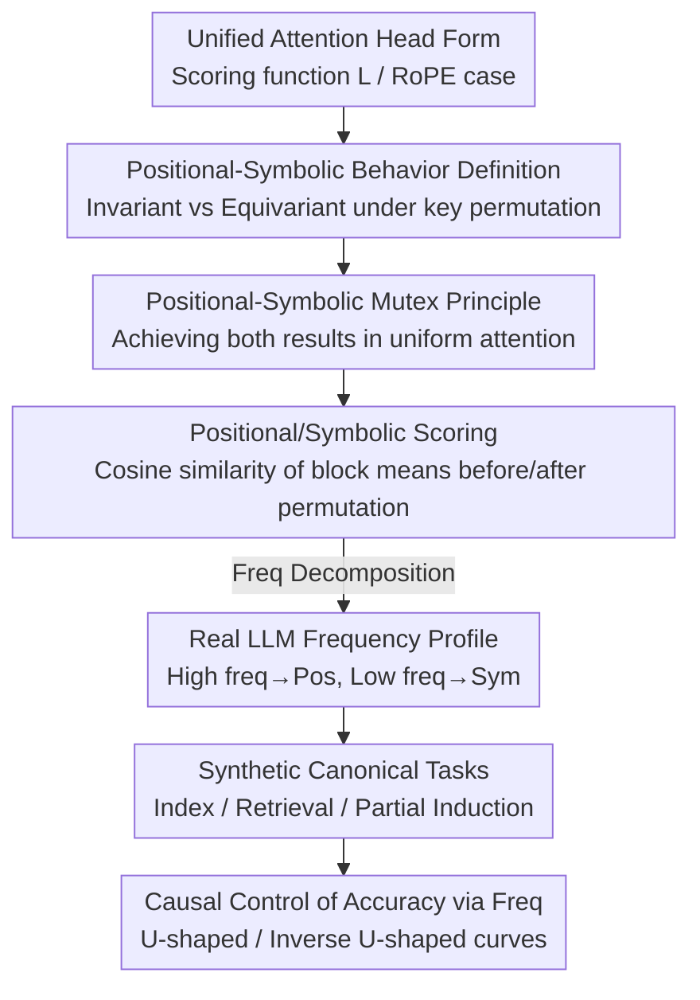

# Decoupling Positional and Symbolic Attention in Transformers

**Conference**: ICLR2026  
**OpenReview**: [https://openreview.net/forum?id=V38yAoqddQ](https://openreview.net/forum?id=V38yAoqddQ)  
**Code**: https://github.com/furrutiav/positional-and-symbolic-iclr2026  
**Area**: Interpretability / Transformer Mechanistic Analysis  
**Keywords**: Attention mechanisms, RoPE, Positional encoding, Frequency analysis, Permutation invariance

## TL;DR
This paper provides a rigorous mathematical definition for whether an attention head operates "positionally" or "symbolically," proves that the two are mutually exclusive (unless attention degrades into a uniform distribution), and designs a scoring metric based on permutation sensitivity. It reveals that high frequencies in RoPE correspond to positional behavior while low frequencies correspond to symbolic behavior. Finally, using controlled synthetic tasks, it demonstrates that "restricting the frequency bands accessible to a head can causally control the model's performance on positional versus symbolic tasks."

## Background & Motivation
**Background**: Modern Transformer LLMs almost exclusively rely on Positional Encoding (PE) to inject spatial information, with Rotary PE (RoPE) becoming the mainstream due to its excellent empirical performance. RoPE splits the embedding dimension into $d/2$ two-dimensional subspaces, each rotating query/key vectors by an angle $\theta_k$ (i.e., frequency), thereby encoding the relative position $i-j$ into the attention scores.

**Limitations of Prior Work**: Understanding of why RoPE is effective remains limited to fragmented intuitions. Traditional views suggest "RoPE causes token dependency to decay with distance"; recently, Barbero et al. (2024) observed that different frequency bands seem to serve different functions—low frequencies act as "information channels," while specific high-frequency heads generate "robust positional attention patterns." Coupled with contradictory conclusions regarding the adjustment of the base (the overall frequency range) during long-context extrapolation (reducing the base favors near-distance attention but hurts long-range retrieval), these phenomena point toward a shared tension that has not been clearly articulated.

**Key Challenge**: Attention heads seem to perform two fundamentally opposing operations—one focusing on "which position" (positional capability) and the other on "which symbol" (symbolic capability). It is difficult for a single head to excel at both simultaneously, yet no mathematical language previously existed to characterize what "positional behavior" and "symbolic behavior" actually are, why they are opposed, or how to measure them.

**Goal**: To formalize this tension by addressing four questions: (1) What are the mathematical properties behind these two capabilities? (2) How can we measure whether a head is biased toward position or symbol? (3) How do these capabilities correspond to different RoPE frequencies? (4) How does frequency selection affect model performance?

**Key Insight**: The authors approach this through "permutation symmetry." If key vectors are rearranged by position, the score of a purely positional head should remain **invariant** (as it only considers position $j$); the score of a purely symbolic head should be **equivariant** with the permutation (as it only considers the symbol $x_j$). This symmetry perspective allows for both rigorous definitions and direct measurement of attention weights in real models.

**Core Idea**: Define positional and symbolic heads based on whether their scores are invariant or equivariant to key permutations, prove their mutual exclusivity, create a frequency-level scoring metric, and validate the causal chain of "frequency → behavior → accuracy" using synthetic tasks.

## Method

### Overall Architecture
The paper starts from a unified formalization of an attention head: a head consists of a scoring function $L$, a value function VAL, and an activation function $F$, where the attention score is written as $\lambda^i_j = L(x_i, i, x_j, j)$. RoPE is a special case where the scoring function is $L_{\text{RoPE}}(x_i,i,x_j,j) = x_j^\top R_{i-j} x_i$, with $R_{i-j}$ being a block-diagonal matrix composed of rotation matrices for each frequency. The work is built upon this scoring function: first, using "symmetry under key permutation" to define both behaviors and prove their mutual exclusivity (theoretical layer); then, relaxing the definitions into computable continuous scores applied to real LLMs (empirical layer); and finally using a toy attention-only Transformer to rigorously demonstrate that "frequency determines behavior, and behavior determines task solubility" (synthetic validation layer).

the logical chain is a three-stage progressive argument pipeline:

### Key Designs

**1. Permutation-based Definition of Positional/Symbolic Behavior: Distinguishing "Looking at Position" vs "Looking at Symbol" using Symmetry**

The pain point was the vague intuition of a head being "position-biased" or "symbol-biased." The authors provide a clean definition using permutation symmetry: when querying all $j<i$ from position $i$, if for any key permutation $\pi$ it holds that $L(x_i,i,x_{\pi(j)},j)=L(x_i,i,x_j,j)$, meaning the score depends only on position $j$ and is independent of the key content $x_j$, the head exhibits **positional behavior**. Conversely, if $L(x_i,i,x_j,\pi(j))=L(x_i,i,x_j,j)$, meaning the score follows the symbol of the key regardless of its position, it exhibits **symbolic behavior**. The advantage of this definition is that it does not assume the method of position injection (covering both NoPE and RoPE): it is immediately apparent that NoPE heads are naturally symbolic (scores do not involve $j$), while any RoPE head degrades to positional behavior when all $Kx_j$ are equal.

**2. Positional-Symbolic Mutual Exclusivity: Sacrificing Focus to Achieve Both**

This is the theoretical pillar of the paper. The authors define two deviation vectors to measure "distance from pure positional/symbolic": $\delta^{\text{pos}}_{L,\bar x}(\pi,j)=L(x_n,n,x_{\pi(j)},j)-L(x_n,n,x_j,j)$ and $\delta^{\text{sym}}_{L,\bar x}(\pi,j)=L(x_n,n,x_j,\pi(j))-L(x_n,n,x_j,j)$, where pure positional/symbolic correspond to $\delta^{\text{pos}}=0$ or $\delta^{\text{sym}}=0$. Theorem 1 proves that the variance of the scoring sequence is bounded by the norms of these deviations:

$$\text{Var}(\lambda)=\frac{1}{n-1}\sum_j(\lambda_j-\mu)^2 \le \frac{\lVert\delta^{\text{pos}}_{L,\bar x}\rVert_2^2 + \lVert\delta^{\text{sym}}_{L,\bar x}\rVert_2^2}{(n-1)!\,(n-1)}.$$

The implication is sharp: if a head is simultaneously "nearly positional" and "nearly symbolic" (both deviations near 0), the variance of the scores must approach 0, meaning the attention weights become uniform and lose all focusing capability. In other words, position and symbol are a dual pair of trade-offs—it is impossible to excel at both without paying the price of "non-focused uniform attention." The paper also provides proofs that certain intrinsic positional operations cannot be implemented by symbolic heads and vice versa, solidifying "exclusivity" at the capability level.

**3. Permutation-Sensitive Positional/Symbolic Scoring: Relaxing Definitions into Continuous Metrics for Real Models**

Heads in real models will not satisfy the above equations exactly, requiring a continuous "proximity" score. The authors' approach: query the last token to obtain an attention distribution $D(x)=\text{softmax}(L(x))$, split the sequence into $m$ continuous blocks, and compute the mean attention for each block to get $d=(d_1,\dots,d_m)$. Then, perform a simple block swap (exchanging block $i$ and block $j$) and form two-dimensional vectors $v_{ij}=(d_i,d_j)$ and $v'_{ij}=(d'_i,d'_j)$ from block means before and after the swap. The **Positional Score** $s_{\text{POS}}$ uses the cosine similarity between $v'_{ij}$ and $v_{ij}$ to measure "stability of block means under permutation"; the **Symbolic Score** $s_{\text{SYM}}$ uses the cosine similarity between $v'_{ij}$ and $v_{ji}$ to measure "equivalence of block means following the permutation." Each head is assigned a $(s_{\text{POS}}, s_{\text{SYM}})$ pair on a "Positional-Symbolic Plane," allowing the visualization of all heads in a model. A key advantage is adjustable granularity—scores can be calculated for a single head/input or for "each frequency" after RoPE decomposition.

**4. Frequency-level Decomposition + Causal Validation via Canonical Tasks: Connecting "Frequency → Behavior → Accuracy"**

Correlation is not enough; the authors seek causality. First, they decompose a head into $m$ 2D projection heads, each corresponding to a single frequency, and calculate positional/symbolic scores for each. This reveals the "behavior vs frequency" curve—a critical operation for mapping the relationship. Second, they design three pure synthetic tasks with provable toy models: the **Index Task** ($f_{\text{POS}}$, outputting the symbol at position $j$, pure positional) proves symbolic heads fail (Theorem 2) while single-angle RoPE positional heads succeed (Theorem 3); the **Retrieval Task** ($f_{\text{SYM}}$, retrieving attributes bound to a symbol, pure symbolic) proves positional heads fail (Theorem 4) while NoPE symbolic heads succeed (Theorem 5); and the **Partial Induction Task** ($f_{\text{MIX}}$, retrieving the last occurred bound value for a symbol) proves neither pure positional nor symbolic is sufficient, requiring a head with two RoPE angles (Corollary 1 + Theorem 6). This establishes a controlled causal experiment of "restricting frequency → restricting behavior → restricting task solubility."

### Example: Whole Model Profile on Binding Tasks
Running `gemma-2-2b-it` on a binding task (e.g., "Alice likes red... What color does Alice like?", with $n=256$ entity-attribute pairs): calculating $(s_{\text{POS}}, s_{\text{SYM}})$ for each head shows that **early-layer heads have high positional scores, while late-layer heads have high symbolic scores** (median positional score of 0.83 in layers 1–13 vs 0.56 in 14–26; the symbolic score is reversed). The positional and symbolic scores in the heatmaps show a strong negative correlation (Pearson $r=-0.91$, $p\le 0.0001$), providing empirical evidence for the mutual exclusivity principle. Decomposing head 12:0 by frequency clearly shows: low-frequency bands (high frequency ID) have high symbolic scores, medium-to-high frequency bands have high positional scores, and the highest frequency bands have high scores for both—corresponding to the uniform attention degradation predicted by Theorem 1.

## Key Experimental Results

### Main Results: Frequency-Behavior Correspondence + Task Solubility
The authors verify the frequency-behavior correspondence across GEMMA-2, QWEN-2, and LLAMA-3 families and validate solubility on toy models.

| Subject | Phenomenon | Theoretical Consistency |
|--------|------|----------|
| Real LLM Freq Profile | High freq → Positional; Low freq → Symbolic; Highest freq → Both high (Uniform) | Consistent with Theorem 1 |
| Pos/Sym Scoring Heatmaps | Negative correlation $r=-0.91$ ($p\le 0.0001$) | Empirical evidence for Mutex Principle |
| Index (Pos) Toy Task | Solvable only with high freq (low ID); low freq fails | Theorem 2/3 |
| Retrieval (Sym) Toy Task | Solvable only with low freq; high freq fails | Theorem 4/5 |
| Partial Induction Task | Unsolvable with 1-RoPE angle; solvable with $\theta_1=0, \theta_2$ dual angles where $\theta_2$ is not too large | Corollary 1 / Theorem 6 |

### Accuracy Shapes under Frequency Mismatch (Ablation Study)
A core analysis experiment is "what happens when a head is forced to use the wrong frequency," observing accuracy shapes based on the position $j$ of the answer in the prompt.

| Task | "Wrong" Freq Forced | Accuracy Shape by Position | Interpretation |
|------|----------|----------|------|
| Index (Pos) | Too low frequency | **U-shaped** (worst in the middle, better at ends) | Echoes "lost in the middle" phenomenon |
| Retrieval (Sym) | Not low enough frequency | **Inverse U-shaped** (better in middle, worse at ends) | Exact opposite of the positional task |

The authors further explain this using the toy model mechanism: after training, the query vector angle encodes the "target position" while the key vector converges to a single direction, which is precisely the mechanism of the theoretical solution $H_{\text{POS}}$. The projection trajectories of gemma's real heads on positional frequencies show striking similarities to the toy model. Theorem 7 mathematically proves that the maximum attention weight $w_{\max}(j)$ of $H_{\text{POS}}$ is U-shaped, while a simplified $H_{\text{SYM}}$ is inverse U-shaped, attributing the accuracy shape to the attention weight shape.

### Key Findings
- **Position and Symbol are Strict Duals**: The negative correlation $r=-0.91$ is no coincidence but a direct consequence of Theorem 1—attempting to be high in both results in uniform attention loss of focus.
- **Frequency as an Intervenable "Knob"**: Restricting the frequency bands accessible to a head can causally determine its success on Index/Retrieval tasks, showing that RoPE frequencies are not just for positional decay but act as switches for positional/symbolic capabilities.
- **Mechanistic Explanation for "Lost in the Middle"**: The U-shaped accuracy in positional tasks under mismatched low frequencies links a well-known long-context engineering phenomenon to single-head frequency usage.
- **Partial Induction Requires Mixed Frequencies**: Neither pure positional nor symbolic heads can solve $f_{\text{MIX}}$; a dual-angle head with $\theta_1=0$ and a moderate $\theta_2$ is required, echoing how induction heads must balance "finding position" and "identifying symbols."

## Highlights & Insights
- **Defining "Positional/Symbolic" via Permutation Symmetry**: Converting a vague mechanistic intuition into precise mathematical language ("invariant vs equivariant scores under key permutation"). The definition is clean and independent of specific PE forms (covering NoPE/RoPE)—it is the foundation for the paper's rigor.
- **Mutex Principle using Variance as a Bridge**: Theorem 1 uses a concise inequality to push the "both positional and symbolic" state toward "uniform attention," turning a qualitative tension into a provable quantitative constraint—very elegant.
- **Portable Frequency-level Metrics**: The approach of decomposing heads into single-frequency scores to plot "Positional-Symbolic Plane" snapshots can be directly applied to characterize the "Positional-Symbolic Portrait" of any model on any task.
- **Theory-Toy-Real Closed Loop**: Proving solubility, training toy models to observe frequency effects, and finally finding isomorphic query/key trajectories in real gemma heads. The argumentation chain is complete and self-validating, serving as a model for mechanistic interpretability research.

## Limitations & Future Work
- **Primarily Built on Binding Tasks**: The authors note that empirical analysis is concentrated on binding tasks. The stability of Positional-Symbolic portraits across wider task sets and larger models needs systematic verification.
- **Theoretic Results based on "Simple Head/Single Layer" Assumptions**: Theorems 4/5 require identity VAL, projection $F$, and one-hot embeddings. The paper admits that more complex $F$ (general MLP) could allow for (contrived) counterexamples, indicating that conclusions depend on these boundaries.
- **Metric Dependency on Block Splitting and Swapping**: The positional/symbolic scores rely on simple block swaps of continuous blocks. The block size $m$ and swap method are design choices that might affect the scores; robustness was not fully discussed.
- **Future Directions**: Extending Positional-Symbolic portraits to multi-layer compositional behaviors (current focus is single-head), using frequency intervention for controllable editing during training or inference, and formally linking U/Inverse U-shaped accuracy to real-world long-context performance for engineering optimization.

## Related Work & Insights
- **vs. Barbero et al. (2024)**: They observed low-frequency "information channels" and high-frequency "robust positional patterns" in specific heads. This paper generalizes these observations to all heads/layers with rigorous definitions, mutual exclusivity theorems, and computable metrics, upgrading "case observations" to "whole-model profiling + causal validation."
- **vs. RoPE Long-context Extrapolation (Liu et al. 2023 / Men et al. 2024)**: They focused on how adjusting the base affects long-context retrieval vs near-distance attention. This paper provides the underlying explanation: the base determines the frequency range, which in turn determines the trade-off between positional and symbolic behavior.
- **vs. NoPE Expressivity Analysis (Pérez et al. 2021 / Kazemnejad et al. 2023)**: They discussed permutation invariance and recoverability without positional encoding. This paper uses "permutation invariance/equivariance" directly as a tool for defining positional/symbolic roles, inherited from this mathematical lineage.
- **vs. Induction Heads (Olsson et al. 2022)**: The partial induction task is a tribute to induction head operations. This paper explains from a frequency perspective why such tasks require a combination of positional and symbolic capabilities.

## Rating
- Novelty: ⭐⭐⭐⭐⭐ Uses permutation symmetry to formalize positional/symbolic roles and proves mutual exclusivity—a rare, complete "Definition-Theorem-Verification" mechanistic work.
- Experimental Thoroughness: ⭐⭐⭐⭐ Cross-validation of three LLM families + three provable toy tasks, though empirical analysis is skewed toward binding tasks.
- Writing Quality: ⭐⭐⭐⭐ Seamlessly weaves theory and empirical results with clear diagrams; some theorems rely on strong simplification assumptions requiring appendix checks.
- Value: ⭐⭐⭐⭐⭐ Provides a unified mechanistic explanation for RoPE frequency usage, "lost in the middle," and other phenomena, producing portable analysis tools.

<!-- RELATED:START -->

## Related Papers

- [\[ICLR 2026\] Emergent Discrete Controller Modules for Symbolic Planning in Transformers](emergent_discrete_controller_modules_for_symbolic_planning_in_transformers.md)
- [\[AAAI 2026\] Attention as Binding: A Vector-Symbolic Perspective on Transformer Reasoning](../../AAAI2026/interpretability/attention_as_binding_a_vector-symbolic_perspective_on_transformer_reasoning.md)
- [\[ICLR 2026\] From Concepts to Components: Concept-Agnostic Attention Module Discovery in Transformers](from_concepts_to_components_concept-agnostic_attention_module_discovery_in_trans.md)
- [\[ICLR 2026\] Decoupling Dynamical Richness from Representation Learning: Towards Practical Measurement](decoupling_dynamical_richness_from_representation_learning_towards_practical_mea.md)
- [\[ICLR 2026\] Block Recurrent Dynamics in Vision Transformers](block_recurrent_dynamics_in_vision_transformers.md)

<!-- RELATED:END -->
