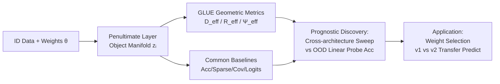

# Diagnosing Generalization Failures from Representational Geometry Markers

**Conference**: ICLR 2026  
**OpenReview**: [https://openreview.net/forum?id=c2fQBcoKhU](https://openreview.net/forum?id=c2fQBcoKhU)  
**Code**: To be confirmed  
**Area**: Interpretability / Representational Geometry / Generalization Analysis  
**Keywords**: Representational geometry, OOD generalization, object manifolds, GLUE, effective dimension, model selection, transfer learning  

## TL;DR
Drawing from the top-down perspective of medical "biomarkers," this paper uses **geometric quantities of object manifolds measured only on In-Distribution (ID) data** (effective dimension $D_\text{eff}$ and utilization $\Psi_\text{eff}$) as prognostic markers. It predicts model failure Out-of-Distribution (OOD) without any OOD information and selects pre-trained weights with superior transferability.

## Background & Motivation
**Background**: As deep networks enter safety-critical scenarios, predicting model failure on unseen distributions in advance has become a core issue. The dominant approach is bottom-up mechanistic interpretability—reverse-engineering interpretable features, functional circuits, or causal structures.

**Limitations of Prior Work**: While mechanistic interpretability provides fine-grained insights, it often lacks identifiability and is difficult to translate into actionable diagnostic signals for real-world deployed models. On the other hand, conventional performance metrics (such as ID test accuracy) are often non-discriminative under distribution shifts—two models with different hyperparameters can have nearly identical ID accuracy but vastly different OOD performance.

**Key Challenge**: There is a need for "high-level, predictive failure signals," but existing tools are either too microscopic (features/circuits) or too coarse (accuracy). Representational geometry was previously linked to generalization in ID settings, but conclusions under distribution shifts are often contradictory (e.g., the debate between neural collapse and high-dimensional representations), lacking systematic, task-linked metrics.

**Goal**: Establish a **diagnostic, system-level** paradigm, analogous to how doctors use blood pressure or cholesterol to predict health risks, to find "network markers" that robustly forecast future model performance.

**Core Idea**: **"ID Geometry as Prognosis"**—using task-relevant geometric quantities of ID object manifolds as prognostic markers. The key discovery is that **feature over-specialization**, characterized by the excessive compression of manifold effective dimension and utilization, is a reliable precursor to OOD generalization failure.

## Method

### Overall Architecture
The method follows a three-step diagnostic cycle: **(i) Marker Design**—constructing scalar metrics from penultimate layer features that depend only on $(\theta, D_\text{ID})$; **(ii) Prognostic Discovery**—identifying which ID signals stably predict OOD failure through medium-scale experiments across architectures and hyperparameters; **(iii) Real-world Application**—using these metrics to select pre-trained weights with higher transferability. The core technical tool is the set of three task-relevant geometric quantities provided by the GLUE framework.

### Key Designs

**1. Definition of Object Manifolds and Markers: Focus on Penultimate Geometry.** Since the final decision in image classification is a linear readout of the penultimate features, the authors define the point cloud of features for each category $\{z^\mu_i\}$ as an **object manifold**. They formalize a "marker" as a function mapping $(\theta, D_\text{ID})$ to a scalar. Besides geometric metrics, they adapt several conventional metrics as ID-only markers for comparison: low-order statistics (sparsity, off-diagonal covariance magnitude, intra-class pairwise distance/angle), logit statistics (mean confidence AUROC, entropy, energy), and numerical rank metrics like participation ratio, neural collapse (NC1), and the Tunnel Effect. This allows for a fair comparison of all candidates under the "ID-only" rule.

**2. GLUE Framework: An "Average-Case" Analogy of SVM for Analytical Geometry.** The core of the markers comes from GLUE (Geometry Linked to Untangling Efficiency), built on the perceptron capacity theory from statistical physics. For two object manifolds, the critical neuron count $N_\text{crit}$ is defined as the minimum dimension where they remain linearly separable with probability $\ge 0.5$ after random projection into an $N_\text{proj}$-dimensional subspace. The manifold capacity is $\alpha = P/N_\text{crit}$. GLUE provides a closed-form expression for $N_\text{crit}$:

$$N_\text{crit} = \mathbb{E}_{t\sim\mathcal{N}(0,I_N)}\Big[\max_{s_1(t)\in M_1, s_2(t)\in M_2} \big\|\text{proj}_{\text{span}(\{s_1(t),s_2(t)\})}\, t\big\|_2^2\Big]$$

Points maximizing the inner optimization are defined as **anchor points**. Their distribution is a non-uniform measure on the manifold, assigning higher weights to points "more important for downstream classification." GLUE can thus be seen as an average-case analogy of SVM: while SVM evaluates optimal separability in the best subspace, GLUE averages across many random projections, capturing more complex, heterogeneous, and noisy structures.

**3. Three Effective Geometric Quantities: Decomposing Separability.** Leveraging symmetries in the equations, GLUE reformulates $N_\text{crit}$ into a concise expression of three intuitive metrics:

$$N_\text{crit} = \frac{P \cdot D_\text{eff}}{\Psi_\text{eff} \cdot (1 + R_\text{eff}^{-2})}$$

where $D_\text{eff}$ is the task-relevant effective dimension, $R_\text{eff}$ is the effective intra-class radius, and $\Psi_\text{eff}\in[0,1]$ is the utilization (quantifying the degree of "over-compression"). Intuitively, smaller $D_\text{eff}$, smaller $R_\text{eff}$, and larger $\Psi_\text{eff}$ make manifolds more separable. From a feature learning perspective, low $D_\text{eff}$ indicates fewer utilized feature modes, and low $\Psi_\text{eff}$ indicates inefficient compression of intra-class variance—together representing "over-specialized/shortcut features." The authors propose a practical rule: **When multiple weights exist for the same architecture, prioritize those with higher ID $D_\text{eff}$ and $\Psi_\text{eff}$**.

**4. Prognostic Discovery Protocol: ID Training and OOD Linear Probe Validation.** To make the experiment falsifiable, authors train multiple architectures (ResNet, VGG, etc.) from scratch on CIFAR-10, sweeping 4 learning rates × 4 weight decays × 3 seeds × {SGD, AdamW}. They ensure ID training accuracy > 99% and test accuracy between 88%–95% (almost indistinguishable ID). They then freeze the feature extractors and train linear probes on **disjoint class** OOD datasets (CIFAR-100, ImageNet). This design deliberately creates counter-examples of "similar ID, divergent OOD" to highlight the discriminative power of the markers.

## Key Experimental Results

### Main Results: Predicting Pre-trained Weight Transfer (20 Architectures × v1/v2)

| Predictor | OOD Transfer Prediction Accuracy |
|---|---|
| **Ours: $D_\text{eff}$ + $\Psi_\text{eff}$** | **73.02% (92/126)** |
| ID Test Accuracy (Standard Practice) | 37.22% |

Across v1/v2 pairs of 20 official PyTorch architectures, geometric markers correctly predicted v1's superiority in 14 cases (despite v2 having higher ID accuracy), v2 in 1 case, and offered no definitive judgment for the rest. Across 15 judged models × 9 OOD datasets, they achieved 73% accuracy, far exceeding the 37% of ID accuracy.

### Ablation Study / Cross-Setting Consistency (CIFAR-10 Training, Pearson r Correlation)

| Marker | Correlation with OOD Performance |
|---|---|
| Effective Dimension $D_\text{eff}$ / Utilization $\Psi_\text{eff}$ / Participation Ratio | Strong and consistent across architectures |
| Numerical Rank (Tunnel Effect) | Good in most cases, fails in specific ones (e.g., VGG-19 + SGD) |
| Neural Collapse (NC1) | Weak / Unstable |
| Logit-based (AUROC, Entropy, Energy) | Weak (lost internal representation info) |
| ID Accuracy, Sparsity, Covariance | Weak and inconsistent |

Conclusions hold across model sizes (ResNet18/34/50), optimizers (SGD/AdamW), and OOD datasets (CIFAR-100/ImageNet). Geometric quantities measured on ID **training** data also show strong correlations.

### Key Findings
- **Manifold Over-compression ⇔ OOD Failure**: Suppressed $D_\text{eff}$ and $\Psi_\text{eff}$ mean the model relies on fewer features and uses them inefficiently for separability, aligning with "shortcut learning/over-specialization." Geometry acts as a "mesoscopic" descriptor connecting microscopic features to macroscopic behavior.
- **Class-level Shift vs. Corruption Shift**: For label-preserving corruptions like CIFAR-10-C, **ID test accuracy remains the strongest predictor**. The geometry-compression law only holds for class-level OOD—indicating the rule is non-trivial and specific to category shifts.
- **Early Fine-tuning Differences**: While v1 and v2 converge to similar levels after full fine-tuning, v1 often learns faster in early stages, suggesting its features are a more efficient starting point for transfer.

## Highlights & Insights
- **Paradigm Shift**: Adapts the top-down methodology of "medical biomarkers/neuroscience population coding" to deep network diagnosis, clearly distinguishing between diagnostic (current state) and prognostic (future prediction) signals, complementing mechanistic interpretability.
- **Actionable Model Selection Rule**: Provides a counter-intuitive but effective heuristic—don't just look at ID accuracy; look at $D_\text{eff}$ and $\Psi_\text{eff}$. This improves transfer prediction accuracy from 37% to 73% on heterogeneous PyTorch weight libraries.
- **Unified Fair Comparison**: Benchmarks neural collapse, Tunnel Effect, and OOD detection scores as ID-only markers, demonstrating that "task-relevant" geometry (GLUE anchor distribution) is more discriminative than task-agnostic descriptors.

## Limitations & Future Work
- **Theoretical Foundation**: The link between manifold over-compression and feature over-specialization is currently an intuitive hypothesis lacking rigorous theory; it also does not characterize whether misclassified OOD samples share commonalities.
- **Scope of Applicability**: The laws are effective for class-level OOD but fail for corruption-type shifts. Experiments focus on vision classification; language/RL/multimodal domains remain unverified.
- **Diagnosis without Intervention**: Currently limited to "forecasting." Geometric markers have not yet been converted into practical interventions like geometry-aware regularization, early stopping criteria, or weight selection protocols.
- **Future Directions**: Causal mechanisms and interventions, cross-domain extensions, combining with parameter transfer (Net2Net style), and comparisons with high-dimensional structure coding in neuroscience.

## Related Work & Insights
- **Representational Geometry and Generalization**: Intrinsic dimension (Ansuini 2019), neural collapse (Papyan 2020), and Tunnel Effect numerical rank (Masarczyk 2023) relate to generalization under ID settings, but yield conflicting results under distribution shift. This paper uses task-relevant GLUE metrics to unify these views and supports the "high-dimensional representations favor OOD" perspective.
- **GLUE / Manifold Capacity Theory** (Chou 2025a/b, Chung 2018) forms the methodological cornerstone, extending perceptron capacity theory to manifolds and introducing anchor point distributions.
- **Shortcut Learning / Spectral Features** (Geirhos 2020, Sagawa, Beery 2018) provide semantic interpretations for why "over-specialization leads to OOD failure."
- **Insight**: This diagnostic loop (marker identification → prognostic validation → deployment) can be transferred to LLMs—for example, using ID attention/representational geometry to predict OOD behavior in language tasks (as noted in Li et al. 2025).

## Rating
- **Novelty**: ⭐⭐⭐⭐ — The diagnostic paradigm of "medical biomarkers + manifold geometry" is novel, clearly separating prognostic from mechanistic concerns.
- **Experimental Thoroughness**: ⭐⭐⭐⭐ — Systematic sweeps across architectures/optimizers/datasets and counter-examples on corruption shifts show high honesty and rigor.
- **Writing Quality**: ⭐⭐⭐⭐ — The three-step diagnostic framework is clearly narrated, with well-balanced intuition and formulas.
- **Value**: ⭐⭐⭐⭐ — Provides a practical ID-only rule for pre-trained model selection, relevant for safety-critical deployment and interpretability research.

<!-- RELATED:START -->

## Related Papers

- [\[AAAI 2026\] CrossCheck-Bench: Diagnosing Compositional Failures in Multimodal Conflict Resolution](../../AAAI2026/interpretability/crosscheck-bench_diagnosing_compositional_failures_in_multim.md)
- [\[ACL 2025\] Probing the Geometry of Truth: Consistency and Generalization of Truth Directions](../../ACL2025/interpretability/probing_the_geometry_of_truth_consistency_and_generalization_of_truth_directions.md)
- [\[ICLR 2026\] On The Geometry and Topology of Representations: the Manifolds of Modular Addition](on_the_geometry_and_topology_of_representations_the_manifolds_of_modular_additio.md)
- [\[ICLR 2026\] The Geometry of Reasoning: Flowing Logics in Representation Space](the_geometry_of_reasoning_flowing_logics_in_representation_space.md)
- [\[ICLR 2026\] Cross-Modal Redundancy and the Geometry of Vision-Language Embeddings](cross-modal_redundancy_and_the_geometry_of_vision-language_embeddings.md)

<!-- RELATED:END -->
