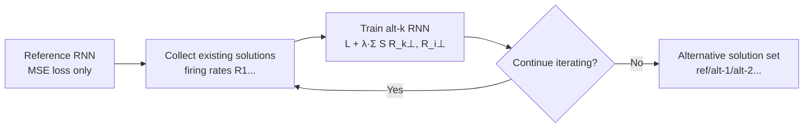

# Discovering Alternative Solutions Beyond the Simplicity Bias in Recurrent Neural Networks

**Conference**: ICLR 2026  
**OpenReview**: [https://openreview.net/forum?id=8fViWZ0yZJ](https://openreview.net/forum?id=8fViWZ0yZJ)  
**Code**: TBD  
**Area**: Interpretability / Computational Modeling in Neuroscience  
**Keywords**: RNN, simplicity bias, dynamic collapse, similarity penalty, fixed-point attractors, neural computation hypotheses  

## TL;DR
To address the issue where task-trained RNNs repeatedly collapse into a single "simplest" dynamical solution, this paper proposes Iterative Neural Similarity Decoupling (INSD). By online penalizing the linear predictability of new RNNs relative to existing solutions, the method uncovers novel classes of solutions that rely on dynamically evolving subspaces rather than fixed-point attractors, occasionally outperforming standard solutions under difficult or out-of-distribution (OOD) conditions.

## Background & Motivation
**Background**: Training RNNs on neuroscience-style tasks has become a mainstream approach for "generating hypotheses" regarding the computational mechanisms of neural circuits. The goal is to train multiple RNNs to obtain a set of diverse, competing solutions for comparison with experimental data.

**Limitations of Prior Work**: Recent studies found that task-trained RNNs exhibit a strong **simplicity bias**, tending to solve tasks using minimal low-dimensional dynamical structures (fixed-point attractors, limit cycles) and reusing dynamical primitives. This bias is so potent that networks trained with different seeds or initialization scales undergo "dynamic collapse," converging to nearly identical minimal solutions. While interpretable, this phenomenon defeats the purpose of generating diverse hypotheses.

**Key Challenge**: Simple solutions may not align with the inductive biases of biological circuits. For instance, while RNNs typically use persistent activity in stable attractors for memory tasks, biological neural recordings often show highly dynamic population representations. Conventional adjustments—such as initialization scales, random seeds, or architectures—fail to escape this collapse. Even networks initialized in chaotic regimes eventually collapse, and "architecturally different" solutions often implement the same underlying dynamics (e.g., identical fixed-point topology).

**Goal**: To develop a training method that systematically breaks the simplicity bias and uncovers functionally distinct alternative solutions.

**Core Idea**: **[Gram-Schmidt in Solution Space]** Finding new solutions is framed as orthogonalization in the RNN solution space. For each new RNN trained, its neural activity is explicitly penalized based on its linear predictability from existing solutions, pushing the new solution out of the span of previous ones.

## Method

### Overall Architecture
First, a reference RNN is trained normally. Subsequently, each new RNN is trained with an additional "neural similarity penalty" alongside the standard MSE task loss. This penalty forces the activity to remain linearly uncorrelated with all previous solutions after removing output-relevant components. Iterating this process yields a series of alternative solutions: alt-1, alt-2, etc. (INSD).

### Key Designs

**1. Readout Null-space Projection: Pressure only on "task-irrelevant" components.** Applying a similarity penalty to all activity would conflict with solving the task. Since the reference RNN already achieves $y(t) \approx y^\star(t)$, any new RNN solving the same task must have activity that linearly predicts the "output-potent" components of the reference solution. To resolve this, firing rates are projected onto the null space of their respective readout weights, yielding $R_1^\perp, R_2^\perp$. The penalty is applied only to these parts: $L' = L + \lambda S(R_2^\perp, R_1^\perp)$. This preserves task performance while forcing the new solution to adopt a different representation in the remaining degrees of freedom.

**2. Using "Inverse" Linear Predictability as Similarity Metric to Avoid Hacking.** A potential degenerate solution is for the new network to copy the reference solution in one subspace while filling the remaining degrees of freedom with high-dimensional noise. This could drive CKA, RSA, and [Ref $\to$ New] linear prediction scores toward zero. This paper observes that linear predictability sensitivity to "irrelevant dynamics" is asymmetric. Thus, predictability in the [New $\to$ Ref] direction is used as the penalty. Linear predictability is defined as $r^2(X,Y) = 1 - \min_M \|XM - Y\|^2 / \|Y\|^2 = \|U_X Y\|^2 / \|Y\|^2$, where $U_X = X(X^\top X)^+ X^\top$ is the projection onto the column space of $X$; ridge regularization is added for stability: $U_{X,\rho} = X(X^\top X + \rho I)^{-1} X^\top$. This asymmetric choice prevents the new solution from "cheating" the metric with noise.

**3. Iterative Decoupling = Solution Space Orthogonalization.** The process is analogous to Gram-Schmidt: the reference solution provides the first "basis vector," alt-1 is pushed to a linearly uncorrelated direction, and alt-2 is simultaneously pushed away from both. This ensures each new solution occupies previously uncovered regions of the solution space.

**4. Dynamical Systems Analysis for "True Difference" Verification.** To ensure alternative solutions are not just disguised standard solutions, the paper numerically solves for fixed/slow points and reports their stability, Jacobian spectra, and dominant eigenmodes. Analysis includes linear predictability matrices and MDS embeddings of Dynamical Similarity Analysis (DSA) to cross-verify distances in both representational geometry and dynamical structure.

## Key Experimental Results

Experiments were conducted on three classic neuroscience tasks: **Context-dependent integration**, **3-bit flipflop** (discrete memory), and **MemoryPro** (analog delayed memory). Ten standard RNNs per initialization scale $g \in \{0.01, 0.5, 1.0, 1.5\}$ were trained as controls.

### Main Results: Alternative solutions are structurally distinct

| Task | Standard Solution (Prototype) | INSD Alternative Solution |
|------|-------------------------------|---------------------------|
| Context-dependent Integration | Two line attractors; integrates relevant stimuli per context | Oscillatory dynamics; no reliance on slow/fixed points; unstable fixed points with oscillatory modes |
| 3-bit Flipflop | 8 stable fixed points in a cube + saddle points for transitions | Cube geometry disappears; oscillatory modes from unstable fixed points; alt-1 has no stable states |
| MemoryPro | Ring attractor encodes angle; activity rotates to output-potent in response phase | Memory phase uses rotational dynamics; angle rotates with activity (dynamic encoding); ring attractor replaced by unstable points |

- Linear predictability among standard solutions is near 1, while predictability between INSD solutions and the standard group drops significantly.
- MDS embeddings show standard solutions cluster by initialization scale, while INSD solutions exhibit dynamical dissimilarity far exceeding intra-cluster variance.

### Key Findings: OOD performance occasionally exceeds standard solutions (Fig. 5)

| Task | In-distribution Conditions | Hard/OOD Conditions |
|------|---------------------------|----------------------|
| Context-dependent Integration | Standard usually better | alt-2 outperforms standard group under high noise and longer trials |
| 3-bit Flipflop | Comparable across models | alt-2 achieves significant gains under high noise |
| MemoryPro | Standard better | alt-1 significantly outperforms standard group in high noise + high load trials (though worse in low load) |

### Key Findings
1. **Simple solutions are just one of many feasible solutions**; they are not unique. INSD successfully uncovers solutions relying on "dynamic subspaces" rather than fixed-point attractors for information maintenance.
2. Residual predictability of alternative solutions relative to standard ones vanishes when projected into the readout null space, indicating they only share necessary task-relevant components.
3. The "win-and-loss" OOD performance demonstrates that alternative solutions are **functionally distinct**, rather than hidden approximations of the standard ones.
4. A common phenomenon across tasks is that alternative solutions replace stable/slow fixed points with **unstable oscillatory internal points**. Memory is maintained in rotating subspaces, aligning better with experimental observations of "highly dynamic" biological representations.

## Highlights & Insights
- **Turning "Generating Hypotheses" into a Controlled Algorithm**: Instead of relying on random seeds or architecture tweaks, INSD uses an explicit decoupling loss to actively drive solutions apart, directly addressing dynamic collapse.
- **Insight into Similarity Metric Hacking**: Identifying the "noise injection" vulnerability in symmetric metrics and resolving it with asymmetric linear predictability is a broadly applicable lesson for representation learning.
- **Readout Null-space Projection**: This design distinguishes "task-essential shared components" from "free-to-vary components," maximizing diversity without sacrificing performance.
- **Methodological Significance for Neuroscience**: The work challenges the implicit assumption that "simple/interpretable solutions = biological solutions," providing candidate models for dynamic memory hypotheses.

## Limitations & Future Work
- **Interpretability Challenges**: Moving away from fixed-point attractors makes oscillatory/rotational dynamics harder to interpret using current dimensionality reduction tools.
- **Convergence to "Good" Solutions**: In some cases (e.g., alt-2 in MemoryPro), solutions perform poorly across all conditions, suggesting INSD does not guarantee every alternative is functionally superior.
- **Scale and Complexity**: Validation was limited to small-scale rate-based RNNs and three classic tasks; testing on larger scales, spiking networks, or real neural data is still required.
- **Hyperparameter Sensitivity**: The trade-offs between penalty strength $\lambda$, ridge parameter $\rho$, and the number of iterations require more systematic characterization.

## Related Work & Insights
- **Dynamic Collapse and Simplicity Bias** (Turner & Barak 2023; Driscoll et al. 2024): This paper converts a "criticized phenomenon" into an "objective to overcome."
- **Methodological Lineage**: The solution-space decoupling is isomorphic to **Barlow Twins** in computer vision (feature redundancy reduction) and **Linear Adversarial Concept Erasure** in algorithmic fairness.
- **Similarity Metrics** (CKA, RSA, CCA, DSA): The analysis of how metrics respond to "irrelevant dynamics" serves as a practical guide for choosing representation comparison indices.

## Rating
- Novelty: ⭐⭐⭐⭐ Combines "solution space orthogonalization" with null-space projection and asymmetric predictability.
- Experimental Thoroughness: ⭐⭐⭐⭐ Cross-validation via fixed-point topology, DSA, and OOD performance across three tasks.
- Writing Quality: ⭐⭐⭐⭐ Clear motivation and rigorous argumentation regarding metric hacking.
- Value: ⭐⭐⭐⭐ Provides a controlled tool for hypothesis generation in neural computation.

## Related Papers

- [\[ICLR 2026\] Bayesian Neural Networks for Functional ANOVA Model](bayesian_neural_networks_for_functional_anova_model.md)
- [\[ICLR 2026\] Explainable K-means Neural Networks for Multi-view Clustering](explainable_k_-means_neural_networks_for_multi-view_clustering.md)
- [\[ICLR 2026\] FAME: Formal Abstract Minimal Explanation for Neural Networks](fame_formal_abstract_minimal_explanation_for_neural_networks.md)
- [\[ICLR 2026\] Addressing Divergent Representations from Causal Interventions on Neural Networks](addressing_divergent_representations_causal.md)
- [\[ICLR 2026\] Certified Evaluation of Model-Level Explanations for Graph Neural Networks](certified_evaluation_of_model-level_explanations_for_graph_neural_networks.md)

<!-- RELATED:END -->

<!-- RELATED:START -->

## Related Papers

- [\[ICLR 2026\] Bayesian Neural Networks for Functional ANOVA Model](bayesian_neural_networks_for_functional_anova_model.md)
- [\[ICLR 2026\] Explainable K-means Neural Networks for Multi-view Clustering](explainable_k_-means_neural_networks_for_multi-view_clustering.md)
- [\[ICLR 2026\] FAME: Formal Abstract Minimal Explanation for Neural Networks](fame_formal_abstract_minimal_explanation_for_neural_networks.md)
- [\[ICLR 2026\] Tracking Equivalent Mechanistic Interpretations Across Neural Networks](tracking_equivalent_mechanistic_interpretations_across_neural_networks.md)
- [\[ICLR 2026\] Addressing Divergent Representations from Causal Interventions on Neural Networks](addressing_divergent_representations_causal.md)

<!-- RELATED:END -->
