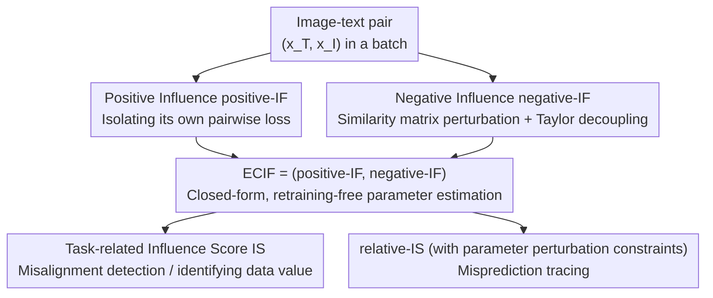

# Dissecting Representation Misalignment in Contrastive Learning via Influence Function

**Conference**: ICLR2026  
**OpenReview**: [https://openreview.net/forum?id=uDCCSXyqBE](https://openreview.net/forum?id=uDCCSXyqBE)  
**Code**: To be confirmed  
**Area**: Explainability / Data Valuation / Contrastive Learning  
**Keywords**: Influence Function, Contrastive Loss, Data Valuation, Misalignment Detection, CLIP

## TL;DR
Addressing the issue that classical influence functions are designed only for pointwise loss and cannot be directly applied to contrastive loss, this paper derives ECIF, an extended influence function specifically for contrastive learning. By analytically expressing the dual influence of a sample as both a "positive sample" and a "negative sample" in closed-form, it enables evaluating the contribution of each image-text pair in CLIP-like models without retraining, facilitating misalignment detection and misprediction tracing.

## Background & Motivation
**Background**: The training of multi-modal contrastive learning models like CLIP relies heavily on large-scale image-text pairs crawled from the internet. These data sources are diverse and of varying quality, often containing image-text pairs with semantic mismatches or incorrect labels. To identify this "dirty data," data valuation is a mainstream approach—assigning a "contribution score" to each training sample, where deleting samples with high scores hurts performance, and deleting samples with low or negative scores improves it.

**Limitations of Prior Work**: Existing data valuation methods are difficult to apply to large-scale models. One category includes methods like Shapley Value, which require repeated retraining on different data subsets, making them computationally infeasible for large models. The other category is the classical influence function, which estimates "how parameters change if a sample is removed" using gradient information, avoiding retraining. However, since its inception, it has been designed for the **pointwise loss** of M-estimators—where each sample has an independent term in the loss that can be weighted by $\epsilon$ for derivation.

**Key Challenge**: Contrastive loss is essentially non-pointwise. For a batch of $N$ image-text pairs, the loss couples the similarities of all samples within a single softmax: an image-text pair $(x^T,x^I)$ acts as a **positive sample** within its own pair (pulling image and text closer) and as a **negative sample** for all other pairs (pushing them apart). Its information is scattered across every term of the loss, making it impossible to "isolate an independent term and weight it" as in pointwise loss. More critically, the influence of negative samples—especially "hard negatives" that are incorrectly mapped very closely—has been severely underestimated in previous analyses, and classical influence functions do not distinguish between positive and negative roles.

**Goal**: To extend the influence function to contrastive loss while separately characterizing a sample's influence as a positive and a negative sample; simultaneously, the method must remain closed-form, avoid retraining, and be scalable to high-dimensional large-scale scenarios.

**Key Insight**: The authors separately analyze the "positive sample contribution" and "negative sample contribution" of a pair $(x^T,x^I)$ in the contrastive loss. The positive part can be explicitly isolated (the pairwise loss of the pair itself), while the difficulty lies entirely in how to "decouple" the negative part from the coupled softmax.

**Core Idea**: For the positive part, the classical weighting approach of the influence function is maintained. For the negative part, a clever "similarity matrix perturbation + Taylor expansion" technique is designed to approximately decouple its coupled influence into a computable term. The combination of both constitutes ECIF (Extended Influence Function for Contrastive Loss).

## Method

### Overall Architecture
The question ECIF answers is: **If a specific image-text pair (or group) is removed from the training set, how will the parameters $\hat\theta$ of the CLIP model change?** The classical influence function answer for pointwise loss is $\hat\theta_{-z_m}-\hat\theta \approx -H_{\hat\theta}^{-1}\nabla_\theta \ell(z_m;\hat\theta)$, i.e., "Hessian inverse $\times$ sample gradient." This entire work focuses on correctly deriving this "sample gradient term" under contrastive loss and splitting it into positive and negative components.

The overall workflow involves: first, dividing the role of the target sample in the contrastive loss into positive contribution $\mathrm{Pos}$ and negative contribution $\mathrm{Neg}$, deriving positive-IF and negative-IF respectively; these are combined into ECIF; finally, two application-oriented influence scores are defined on top of ECIF—the task-related influence score IS (for misalignment detection and identifying harmful/valuable data) and the relative-IS with parameter constraints (for misprediction tracing).

### Key Designs

**1. Positive Influence positive-IF: Explicitly isolating the "self-pair" weight**

When sample $(x^T,x^I)$ acts as a positive sample, it only appears in its own pairwise loss—text-to-image $L_{T2I}(u_n,V_m;\theta)$ and image-to-text $L_{I2T}(v_n,U_m;\theta)$. This part can be "explicitly isolated" like the classical influence function: denote these two terms as $\mathrm{Pos}((x^T,x^I);\theta)=L_{T2I}(u_n,V_m;\theta)+L_{I2T}(v_n,U_m;\theta)$, apply a weight $\epsilon$ in the total loss, find the response function with respect to $\epsilon$, and let $\epsilon\to-1$ to correspond to "deleting this pair." This yields:

$$\text{positive-IF}((x^T,x^I);\hat\theta) = -H_{\hat\theta}^{-1}\cdot\nabla_\theta \mathrm{Pos}((x^T,x^I);\hat\theta).$$

This part is "simple" because the positive information is not coupled with others, allowing the use of classical weighting; the difficulty is entirely in the negative samples. This conclusion can be extended from single samples to a subset $D^\ast$ by summing the influences of all samples in the subset (Proposition 4.1).

**2. Negative Influence negative-IF: Decoupling via $\log\zeta\cdot E_n$ perturbation and Taylor expansion**

This is the core technique of the paper. As a negative sample, its information is hidden within the softmax denominators of other pairs (the $S_{k,n}$ terms). Directly deleting it is a discrete operation and non-differentiable. The authors' approach is: **instead of deleting, push the similarity in the $n$-th row and $n$-th column toward negative infinity**—after exponentiation, these terms approach 0, effectively achieving deletion. Specifically, a $B\times B$ matrix $E_n$ (with 1s in the $n$-th row and column, 0 elsewhere) is constructed, and $\log\zeta\cdot E_n$ is added to the similarity matrix, resulting in a loss $L^m_{T2I,\zeta}$ parameterized by $\zeta$. As $\zeta\to 0$, it converges to the loss with the negative sample deleted; when $\zeta=1$, it is the original loss.

By performing a Taylor expansion at $\zeta=1$ and dropping $O((\zeta-1)^2)$ higher-order terms, the "negative influence" can be linearly separated, resulting in an analytical term:

$$\mathrm{Neg}((x^T,x^I);\theta)=\sum_{k\neq n}\Big(\tfrac{\sum_{j}e^{S_{k,j}}}{e^{S_{k,n}}}+\tfrac{\sum_{j}e^{S_{j,k}}}{e^{S_{n,k}}}\Big),$$

Thus $\text{negative-IF}((x^T,x^I);\hat\theta)=-H_{\hat\theta}^{-1}\cdot\nabla_\theta\mathrm{Neg}((x^T,x^I);\hat\theta)$ (Proposition 4.2). This step solves the hard problem of decoupling negative sample influences in contrastive learning, marking a fundamental difference from classical influence functions: it allows the influence of "hard negatives" to be explicitly quantified rather than averaged out.

**3. ECIF: Dual-perspective closed-form estimation without retraining**

By combining both positive and negative influences, the extended influence function for contrastive loss is obtained:

$$\text{ECIF}(D^\ast,\mathrm{Seg};\hat\theta)\triangleq\big(\text{positive-IF}(D^\ast,\mathrm{Seg};\hat\theta),\ \text{negative-IF}(D^\ast,\mathrm{Seg};\hat\theta)\big),$$

where $\mathrm{Seg}$ records the indices of the target subset in each batch. The value of ECIF lies in providing a **closed-form approximation** of the parameter change $\hat\theta_{-D^\ast}-\hat\theta$ without retraining. The authors further provide an error upper bound between the ECIF estimate and true retraining influence under convexity assumptions (Appendix E), demonstrating that the approximation error is tolerable in certain scenarios. The "dual-perspective" label distinguishes it from all previous methods—which only focus on the "most valuable/influential" data—whereas in contrastive learning, each sample has both positive and negative influences, and ignoring one will inevitably miss a category (e.g., harmful data).

**4. Two Application Metrics: Task-related IS and Constrained relative-IS**

ECIF estimates "how parameters change," but practical tasks care about "how performance on a specific task changes," requiring another projection. For a high-quality validation set $D'$, if $D^\ast$ is misaligned data, deleting it should decrease the loss on $D'$. This difference can be approximated by ECIF, defined as the **Task-related Influence Score**: $\mathrm{IS}(D',D^\ast,\mathrm{Seg};\hat\theta)=-\nabla L_{Batch}(U',V';\hat\theta)^T\cdot(\text{posi-IF}+\text{nega-IF})$. Its sign indicates positive/negative influence, and its magnitude represents the scale. Thus, misalignment detection is formulated as $\arg\max_{D^\ast}\mathrm{IS}$.

However, using IS directly for **misprediction tracing** can be problematic: when the "parameter change" term in IS is very large, a sample may be misidentified as highly influential even if it is irrelevant to the current mispredicted task. To solve this, the authors add a constraint—limiting the norm of parameter change $\|\Delta\hat\theta_{\epsilon,\zeta}(x)\|_2\le\rho^2$—to find training samples that best change the test sample loss under a "small allowed parameter perturbation." This is simplified into a more direct $\arg\max$ via Proposition 5.3, defined as **relative-IS**. With the parameter perturbation constraint, it more accurately locks onto training samples truly relevant to the misprediction, avoiding interference from samples that "happen to have a large impact on parameters but are irrelevant to the task."

### Loss & Training
This paper does not introduce a new training loss but operates around the standard multi-modal contrastive loss. Given a batch of text embeddings $U=(u_1,\dots,u_N)$ and image embeddings $V$, the cosine similarity is $s(u,v)=\frac{u\cdot v^T}{\|u\|\|v\|}/\tau$ (where $\tau$ is a learnable temperature), and the similarity matrix is $S_{i,j}=s(u_i,v_j)$. The self-supervised contrastive loss is:

$$L_{Batch}(U,V;\theta)=\sum_{i=1}^{N}\big(-\log(e_i\cdot\sigma(S_{i,*}))-\log(e_i\cdot\sigma(S^T_{*,i}))\big),$$

which can be split into image-to-text (I2T) and text-to-image (T2I) paths. The total loss includes an L2 regularization term $\frac{\delta}{2}\|\theta\|_2^2$ (to prevent overfitting and ensure the Hessian matrix is invertible for derivation). ECIF is built upon this loss structure to perform closed-form estimation of "sample deletion."

## Key Experimental Results

Experiments involve fine-tuning CLIP on datasets including FGVC-Aircraft, Food101, Flowers102, CIFAR-10/100, DTD, and Imagenette. "Retraining from scratch (Retrain)" serves as the ground truth, compared against three data attribution baselines: IF-EKFAC, TRAK, and TracIN. Metrics include Accuracy and Runtime (RT, in seconds).

### Main Results: ECIF approximates retraining and is much faster
The model edited by ECIF achieves nearly identical accuracy to true retraining across various datasets, but with significantly reduced time:

| Dataset | Retrain Acc(%) | ECIF Acc(%) | Retrain RT(s) | ECIF RT(s) |
|--------|------|------|------|------|
| FGVCAircraft (Random) | 23.07±0.29 | 22.77±0.09 | 1174.2 | 456.0 |
| Food101 (Random) | 84.93±0.17 | 84.87±0.24 | 875.4 | 436.8 |
| Flowers102 (Random) | 68.16±0.22 | 68.53±0.12 | 995.4 | 437.4 |
| CIFAR100 (Random) | 73.50±0.35 | 73.00±0.20 | 753.6 | 444.0 |

The accuracy gap is only 0.30% for FGVCAircraft and 0.06% for Food101. Runtime is generally over 2x faster, saving approximately 80%–90% of the retraining compute.

### Baseline Comparison: Only ECIF identifies "harmful samples"
Accuracy after retraining with 10% of the most "harmful" samples (as identified by each method) removed:

| Method | FGVCAircraft | Food101 | Flowers102 | CIFAR100 |
|------|------|------|------|------|
| Fine-tune (No deletion) | 22.18 | 83.85 | 67.64 | 72.31 |
| Retrain (Delete harmful) | 23.50 | 84.83 | 68.00 | 72.83 |
| IF-EKFAC | 19.84 | 78.26 | 60.74 | 61.67 |
| TRAK | 18.27 | 77.27 | 59.21 | 58.67 |
| TracIN | 19.48 | 78.35 | 60.60 | 59.00 |
| **ECIF** | **23.02** | **84.90** | **68.30** | **73.00** |

Accuracy after ECIF removes harmful samples almost aligns with retraining and is higher than the no-deletion baseline; conversely, the three baselines actually reduced accuracy. Reason: they are designed for pointwise loss and fail on contrastive loss, focusing only on "most valuable data" and failing to identify harmful samples—because every sample in contrastive learning carries both positive and negative influence.

### Key Findings
- **Removing harmful data truly improves performance, and not just due to deletion**: On Food101, removing 10% harmful data increases accuracy by ~1%, while random deletion of the same amount leads to a continuous decline (Fig 1a), proving ECIF identifies truly harmful data.
- **Removing valuable data truly hurts performance**: Removing the top-k valuable samples identified by ECIF causes accuracy to drop monotonically from 84.7 to 84.1; random deletion up to 0.3 ratio actually increases accuracy initially, highlighting that Food101 is noisy and ECIF can pick out samples that truly improve accuracy (brittleness test in Fig 1b).
- **High Hit-Rate in Misalignment Detection**: On datasets with 10%–30% manually shuffled labels, 8 out of the top 10 samples selected by highest negative IS fall exactly into the shuffled portion (Fig 2), demonstrating effective localization of injected noise.
- **Misprediction Tracing Visualization**: Training samples traced via relative-IS show clear similarities in shape or texture to the mispredicted test samples (Table 3), confirming the traceability of "which training samples caused this misprediction."

## Highlights & Insights
- **Decoupling via similarity matrix perturbation is ingenious**: Deleting a row/column from a similarity matrix is discrete and non-differentiable. Changing this to adding $\log\zeta\cdot E_n$ (pushing similarity to $-\infty$) and performing a Taylor expansion at $\zeta=1$ converts a combinatorial deletion problem into a differentiable analytical one—a key step.
- **First closed-form quantification of negative sample influence in contrastive learning**: Previous influence functions ignored positive/negative roles, causing the impact of hard negatives to be averaged out. ECIF's dual-perspective allows calculating how much a sample as a negative "dragged down" others. This is transferable to any InfoNCE/NCE training with in-batch negatives (e.g., dual-towers in retrieval or recommendation).
- **Two-layer projection from "parameter change" to "task influence" with constraints**: Starting with IS (task-related) to solve "is deletion good for a task," then discovering that misprediction tracing is hindered by "high-impact but task-irrelevant" samples, and finally adding parameter perturbation norm constraints to derive relative-IS—this logic of "identifying a metric's failure mode and adding specific constraints" is worth emulating.

## Limitations & Future Work
- **Error bounds require convexity assumptions**: ECIF's approximation error bound is derived under the assumption of convex loss, while real CLIP training is highly non-convex. How tight the "tolerable error" conclusion is on actual deep networks remains unclear.
- **Dependence on Hessian inverse remains a scaling bottleneck**: The core is $H_{\hat\theta}^{-1}$. Although the paper uses LOGRA and low-rank gradient projections for efficiency, the storage and inversion of the Hessian for larger base models remain potential bottlenecks. Experiments were mainly validated on "CLIP fine-tuning" scales rather than from-scratch pre-training scales.
- **Experiments limited to small datasets and classification metrics**: Evaluation focused on Food101/CIFAR/FGVC style classification datasets and accuracy. Validation on large-scale noisy web data (like raw LAION) for end-to-end cleaning is lacking. The "8 out of 10" hit rate is based on manually injected label noise, which may differ from natural misalignment distributions.
- **Taylor first-order truncation boundaries**: Negative sample influence relies on dropping $O((\zeta-1)^2)$. Whether the first-order approximation remains accurate for samples with extreme influence (e.g., extreme hard negatives) is not fully discussed.

## Related Work & Insights
- **Vs. Classical Influence Function (Koh & Liang 2017 / IF-EKFAC)**: Classical IF is designed for pointwise loss, treating each sample as an independent term. This paper points out that contrastive loss couples information in a batch softmax and requires distinguishing positive/negative roles. Directly applying classical methods fails (as seen when IF-EKFAC "harmful" deletion reduced accuracy); ECIF fills this gap using dual-perspective + matrix perturbation.
- **Vs. TRAK / TracIN**: These are also retraining-free data attribution methods but are oriented toward pointwise/classification loss, excelling only at finding "most valuable" data. Experiments show they fail to identify harmful samples in contrastive learning because they ignore the negative sample perspective.
- **Vs. Shapley Value Data Valuation**: Shapley involves repeated retraining on various subsets, which is precise but computationally unaffordable. ECIF sacrifices some precision for a closed-form approximation, making it more practical for large models.
- **Vs. Hard Negative Research (Robinson et al. 2021, etc.)**: Previous work emphasizes the importance of hard negatives for representation learning but focuses on "how to sample/construct" them. This paper provides a "post-hoc measurement" tool—calculating exactly how much influence (positive or negative) a negative sample exerted, moving hard negative research from "how to use" to "how to measure and diagnose."

## Rating
- Novelty: ⭐⭐⭐⭐⭐ The first to strictly extend the influence function to contrastive loss and analytically separate dual-perspective influences. The matrix perturbation + Taylor decoupling technique is original.
- Experimental Thoroughness: ⭐⭐⭐⭐ Covers deletion approximation, harmful/valuable sample identification, misprediction tracing, and misalignment detection across multiple tasks. However, datasets are relatively small, and validation on real large-scale noise is absent.
- Writing Quality: ⭐⭐⭐⭐ Motivation and derivation chain are clear, progressing from positive to negative samples. However, the density of equations in the negative sample section is high, creating a steep entry barrier for readers without a background in influence functions.
- Value: ⭐⭐⭐⭐⭐ Provides a practical, retraining-free tool for data cleaning, misprediction tracing, and noise diagnosis in CLIP-like models, offering direct value to multi-modal data governance and explainability.

<!-- RELATED:START -->

## Related Papers

- [\[ICLR 2026\] Sparse CLIP: Co-optimizing Interpretability and Performance in Contrastive Learning](sparse_clip_co-optimizing_interpretability_and_performance_in_contrastive_learni.md)
- [\[ICLR 2026\] MICLIP: Learning to Interpret Representation in Vision Models](miclip_learning_to_interpret_representation_in_vision_models.md)
- [\[ICLR 2026\] Decoupling Dynamical Richness from Representation Learning: Towards Practical Measurement](decoupling_dynamical_richness_from_representation_learning_towards_practical_mea.md)
- [\[ICLR 2026\] Decomposing Representation Space into Interpretable Subspaces with Unsupervised Learning](decomposing_representation_space_into_interpretable_subspaces_with_unsupervised_.md)
- [\[ICLR 2026\] Causality ≠ Invariance: Function and Concept Vectors in LLMs](causality_invariance_function_and_concept_vectors_in_llms.md)

<!-- RELATED:END -->
